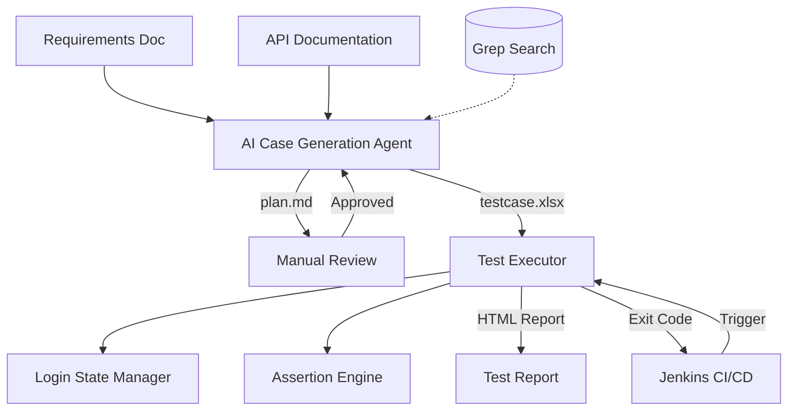

# Flow Forge — API Automation Testing Framework

**English** | [中文](README.md)


An AI agent-based API automation testing framework. Provide requirement documents and API documentation, and the agent automatically generates test case Excel files. Feed the Excel file to the CLI executor, and you get a test report. The executor integrates seamlessly with Jenkins for CI/CD pipelines.

The AI agent enables rapid test case generation, but due to potential AI hallucinations, manual review of the generated output is recommended. To make review easier, test cases and parameters are placed in the same Excel file. For detailed rules, see [agent/README.md](./agent/README.md).

## System Architecture



The framework consists of two core components:

- **[agent/](./agent/)** — AI Case Generation Agent: reads requirement documents + API documentation, passes through a two-phase pipeline of "Plan Generation → Manual Review → Case Orchestration", and outputs Excel test case files in executor-compatible format.
- **[python/](./python/)** — API Test Executor: reads Excel test case files, automatically manages login state, executes HTTP requests with multi-threading, runs assertions, and generates self-contained HTML test reports.

The two components are decoupled via **Excel files** as the contract — the agent generates a specific format, and the executor parses that format. Users are free to choose: use the agent to auto-generate cases, or manually write Excel files and run them directly with the executor.

## Project Structure

```text
flow-forge/
├── README.md                     # Project overview (this file)
├── agent/                        # AI Case Generation Agent
│   ├── README.md                 # Agent usage documentation
│   ├── main.py                   # Agent CLI entry point
│   ├── requirements.txt          # Agent dependencies
│   ├── agents/                   # Agent implementations (ReAct subgraphs)
│   ├── graph/                    # LangGraph orchestration (StateGraph + nodes + conditional edges)
│   ├── config/                   # Configuration management + prompts.yaml
│   ├── llm/                      # LLM provider factory
│   ├── tools/                    # Tool registration mechanism + built-in tools
│   │   ├── builtin/              # Built-in tools
│   │   └── custom/               # User-defined tools
│   ├── skills/                   # Pluggable skill packages
│   │   ├── builtin/              # Built-in skills (boundary testing, SQL data fetch)
│   │   └── custom/               # User-defined skills
│   ├── prompts/                  # Prompt renderer + registry
│   ├── models/                   # Data models + ReAct state
│   ├── doc_parser/               # Document parsers (OpenAPI/Markdown/PDF)
│   ├── knowledge/                # Knowledge base
│   └── docs/                     # Example documents
└── python/                       # API Test Executor
    ├── README.md                 # Executor usage documentation
    ├── main.py                   # Executor CLI entry point
    ├── requirements.txt          # Executor dependencies
    ├── env.yml                   # Base configuration
    ├── env-local.yml             # Environment configuration example
    ├── config/                   # Configuration manager
    ├── core/                     # Core utilities (path resolution, deep merge)
    ├── excel_reader/             # Excel parser
    ├── executor/                 # Executors (single API + business flow)
    ├── auth/                     # Login state manager
    ├── assertion/                # Assertion engine
    └── reporter/                 # HTML report generator
```

## Workflow

### Option 1: AI Agent Generation + Executor (Full Pipeline)

```text
Requirements Doc + API Documentation
       │
       ▼
  AI Agent generates test plan (plan.md)
       │
       ▼
  Manual review & revision of test plan
       │
       ▼
  AI Agent generates Excel cases (testcase.xlsx)
       │
       ▼
  Manual review of Excel (optional parameter tweaks)
       │
       ▼
  Executor runs testcase.xlsx
       │
       ▼
  View HTML test report
```

### Option 2: Manually Written Excel + Executor

```text
Manually write Excel cases (executor format)
       │
       ▼
  Executor runs testcase.xlsx
       │
       ▼
  View HTML test report
```

## Quick Start

### Using the AI Agent to Generate Cases

See [agent/README.md](./agent/README.md) for details.

```bash
cd agent
pip install -r requirements.txt
cp .env.example .env  # Edit .env to add your LLM API Key

# Generate test plan
python main.py --requirement docs/req.md --api docs/api.yaml --plan-only

# After reviewing the plan, generate Excel
python main.py --from-plan plan_xxx.md --api docs/api.yaml --output testcase.xlsx
```

### Using the Executor to Run Tests

See [python/README.md](./python/README.md) for details.

```bash
cd python
pip install -r requirements.txt

# Edit env.yml and env-local.yml to configure the environment
# Place testcase.xlsx in the python/ directory

python main.py --envName local --apiMode all
```

## CI/CD Integration (Jenkins)

The executor is a pure CLI tool that communicates results via exit codes, allowing direct integration into Jenkins pipelines.

## Technology Stack

| Component | Technology |
|-----------|------------|
| Case Generation Agent | Python 3, OpenAI API, prance (OpenAPI parsing), pymupdf (PDF parsing) |
| Test Executor | Python 3, requests, openpyxl, pyyaml |
| Configuration | YAML multi-environment config files |
| Report Output | Self-contained HTML (no external CSS/JS) |
| CI/CD | Jenkins Pipeline, CLI exit codes |

## Design Philosophy

- **Excel as Contract**: The agent and executor are decoupled through Excel files. Users can freely choose how to produce test cases.
- **Human-in-the-Loop**: AI-generated test plans require manual approval before final case generation, ensuring quality control.
- **CLI-Driven**: The executor is a pure CLI tool with no GUI dependencies, suitable for CI/CD environments.
- **Self-Contained Reports**: HTML reports embed all styles and scripts inline — open them directly in a browser without a web server.
