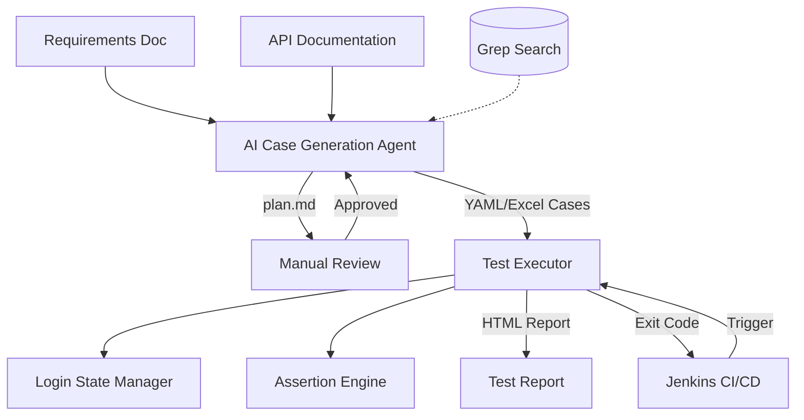

# Flow Forge — API Automation Testing Framework

**English** | [中文](README.md)


An AI agent-based API automation testing framework. Provide requirement documents and API documentation, and the agent automatically generates test case YAML files (with optional Excel export). Feed the cases to the CLI executor, and you get a test report. The executor integrates seamlessly with Jenkins for CI/CD pipelines.

The AI agent enables rapid test case generation, but due to potential AI hallucinations, manual review of the generated output is recommended. Test cases are stored as individual YAML files — one file per case — making them easy to review, version-control with Git, and update incrementally. Supports resumable and incremental generation — resume interrupted runs and update cases after requirement changes without regenerating everything from scratch. For detailed rules, see [agent/README.md](./agent/README.md).

## Current Status

The minimum viable pipeline has been validated end-to-end. Given a set of requirement documents, API documentation, and optional user guidance, the agent produces a test plan for manual review. Once the plan is approved, it generates single-API and business-flow test cases. If the reviewer rejects the plan and provides feedback, the agent revises the plan accordingly; the review loop can iterate until the plan is accepted, at which point test cases are produced. The underlying LLM is deepseek-v4-flash.

**Agent example** — see [agent/README.md](./agent/README.md) for details:

```bash
# Full pipeline (output defaults to ./output_<timestamp>)
python agent/main.py --requirement docs/req.md --api docs/api.yaml

# Specify output directory
python agent/main.py --requirement docs/req.md --api docs/api.yaml --output my_output

# Output YAML only (no Excel)
python agent/main.py --requirement docs/req.md --api docs/api.yaml --output-format yaml
```

The executor supports both single-threaded and multi-threaded modes (concurrent case execution, not load testing). In business-flow mode, responses from earlier steps can feed data into later steps, enabling cross-API parameter chaining. The assertion engine supports both simple equality checks and advanced multi-operator assertion rules (numeric comparisons, regex matching, list aggregation, etc.).

**Executor example** — see [python/README.md](./python/README.md) for details:

```bash
# Option 1: Use YAML cases
python main.py --config /path/to/env.yml --envName local --yamlDir ./output --apiMode all

# Option 2: Use Excel cases
python main.py --config /path/to/env.yml --scriptType APITest --envName local \
               --caseFilePath ./test_cases.xlsx --maxThread 5 --reportName MyReport \
               --apiMode all
```

A Tauri desktop test case editor has been implemented. It supports visual editing of both Excel (.xlsx) and YAML (.yaml) test case formats, featuring form-based YAML editing, right-click file operations, an advanced assertion rule editor, a JSON tree editor, font zoom (Ctrl+wheel), interactive annotation popovers, and more. See [case-editor/README.en.md](./case-editor/README.en.md) for details.

## Roadmap

1. Broader validation across additional scenarios and document formats.
2. Improve interoperability, such as a converter that exports test cases to Postman collections.

## System Architecture



The manual review step supports two modes: (1) typing `y`/`n` with text feedback directly in the CLI; (2) typing `r` to use the [case-editor's Markdown Plan Annotator](./case-editor/README.en.md) to add structured annotations on the rendered test plan — click on annotation highlights to view, edit, or delete annotations inline via a popover — the agent then revises the plan based on the annotation file.

The framework consists of two core components:

- **[agent/](./agent/)** — AI Case Generation Agent: reads requirement documents + API documentation, passes through a two-phase pipeline of "Plan Generation → Manual Review → Case Orchestration", and outputs test case YAML files (with optional Excel export).
- **[python/](./python/)** — API Test Executor: reads YAML case directories/files or Excel case files, automatically manages login state, executes HTTP requests with multi-threading, runs assertions, and generates self-contained HTML test reports.

The two components are decoupled via **YAML files** as the primary contract (Excel remains compatible) — the agent generates a specific format, and the executor parses that format. Users are free to choose: use the agent to auto-generate cases, manually write YAML/Excel cases and run them directly with the executor, or use the Excel editor for editing.

## Project Structure

```text
flow-forge/
├── README.en.md                  # Project overview (this file)
├── agent/                        # AI Case Generation Agent
│   ├── plugins/                  # Custom case-attribute generator plugins (optional)
│   └── utils/                    # Utility modules (token_counter.py, etc.)
├── python/                       # API Test Executor
│   └── processors/               # Pre/Post processor plugins (optional)
└── case-editor/                  # Tauri Desktop Test Case Editor (Excel + YAML), includes a Markdown Plan Annotator
```

## Workflow

### Option 1: AI Agent Generation + Executor (Full Pipeline)

```text
Requirements Doc + API Documentation
       │
       ▼
  AI Agent generates test plan (plan.md)
       │
       ▼
  Manual review & revision of test plan
       │
       ▼
  AI Agent generates YAML cases (output/ directory)
       │
       ▼
  Manual review of YAML cases (optional parameter tweaks)
       │
       ▼
  Executor runs YAML directory
       │
       ▼
  View HTML test report
```

### Option 2: Manually Written YAML/Excel + Executor

```text
Manually write YAML or Excel cases (executor format)
       │
       ▼
  Executor runs cases (--yamlDir or --caseFilePath)
       │
       ▼
  View HTML test report
```

## CI/CD Integration (Jenkins)

The executor is a pure CLI tool that communicates results via exit codes, allowing direct integration into Jenkins pipelines.

## Technology Stack

| Component | Technology |
|-----------|------------|
| Case Generation Agent | Python 3, OpenAI API, prance (OpenAPI parsing), pymupdf (PDF parsing) |
| Test Executor | Python 3, requests, openpyxl, pyyaml |
| Configuration | YAML multi-environment config files |
| Report Output | Self-contained HTML (no external CSS/JS) |
| CI/CD | Jenkins Pipeline, CLI exit codes |

## Design Philosophy

- **YAML/Excel as Contract**: The agent and executor are decoupled through YAML/Excel files. Users can freely choose how to produce test cases.
- **Human-in-the-Loop**: AI-generated test plans require manual approval before final case generation, ensuring quality control.
- **CLI-Driven**: The executor is a pure CLI tool with no GUI dependencies, suitable for CI/CD environments.
- **Self-Contained Reports**: HTML reports embed all styles and scripts inline — open them directly in a browser without a web server.
- **Extensible Processors**: Pre/post processor extension points allow custom logic such as HMAC signing, SQL cleanup, etc.

## Plugin & Processor System

The project provides a three-layer extension mechanism for custom requirements:

| Module | Extension Point | Description |
|--------|----------------|-------------|
| `python/processors/` | PreProcessor / PostProcessor | Request/response processing — modify requests, inspect responses, manage external resources |
| `agent/plugins/` | CaseAttributeGenerator | AI agent plugins — automatically fill custom attributes after case generation |
| `case-editor` | PreProcessors / PostProcessors fields | Edit and validate processor configs in the UI |

**Typical scenarios**:
- Add HMAC signature before requests (PreProcessor)
- Clean up test data in a database after requests (PostProcessor)
- AI agent automatically recommends processor configs for generated cases (agent plugin)

See each subdirectory's README for details: `python/README.md`, `agent/README.md`, `case-editor/README.md`.
