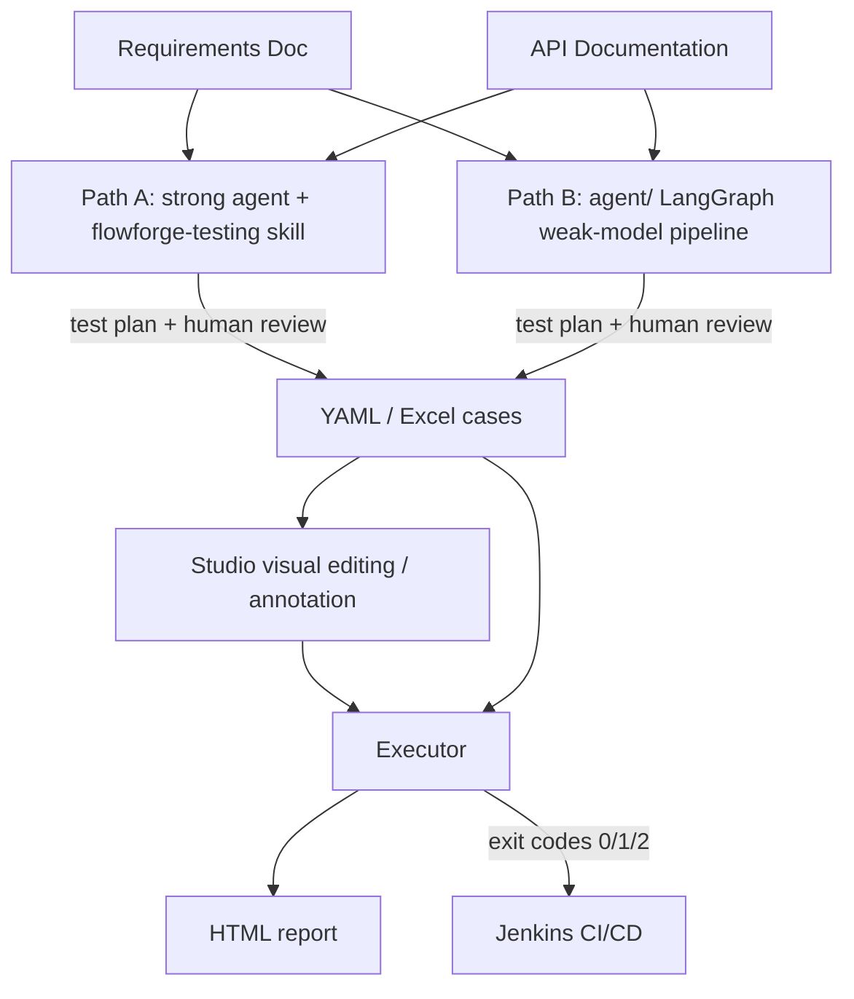

# Flow Forge — API Test Automation Framework

[中文](README.md) | **English**


**Feed in requirement docs and API docs, let AI generate test cases, and run them with a command-line executor that produces an HTML report.** A full-chain API test automation workflow from requirements to reports — cases are stored as YAML/Excel for easy Git management and human review, and the executor integrates with Jenkins CI/CD.

## Features

- **Two AI case-generation paths**: the `flowforge-testing` skill drives strong agents (Codex / opencode / Claude Code) to generate, validate, execute, and triage cases directly; the `agent/` LangGraph pipeline targets local small-parameter models such as llama.cpp / Ollama. Both paths produce the same YAML/Excel case format.
- **An automated loop from requirements to reports**: requirement docs (Markdown/PDF/text) + API docs (OpenAPI/Markdown) → test plan (human review) → YAML/Excel cases → execution → self-contained HTML report → exit codes for CI/CD.
- **Quality mechanisms**: cases are only generated after the test plan is confirmed by a human; API URLs are corrected against the source docs and LLM output counts are validated to suppress hallucinations; `ff_tool validate` performs static checks against the shared schema.
- **Studio desktop workbench (Windows)**: six features in one place — AI case generation, plan annotation, Excel/YAML visual editing, case execution, and format conversion — no CLI flags to memorize.
- **Executor & converter**: multi-threaded execution, automatic login/session management, cross-step parameter passing (`inherit`), and a two-tier assertion engine; bidirectional Excel↔YAML conversion and zero-dependency pytest export; extensible processors/plugins.
- **Bundled examples**: [examples/foli-mall/](./examples/foli-mall/README.en.md) provides runnable cases against an e-commerce playground and shows real output from both generation paths.



## Path A — Generate cases with a strong agent + skill (recommended)

For users working with strong agents such as Codex / opencode / Claude Code. [flowforge-testing](./flowforge-testing/README.en.md) distills the full workflow — multi-document analysis → test plan → YAML generation → schema validation → execution → triage → revision — into a skill. The agent follows the instructions in `SKILL.md` and only calls the `python/` executor and converter when determinism is needed, avoiding the chunking and compression overhead designed for weak models.

### Quick start

1. Install the skill into your agent (Codex example):

   ```bash
   # copy or symlink into the user-level skills directory (recommended, auto-discovered)
   ln -s <repo-root>/flowforge-testing ~/.codex/skills/flowforge-testing
   ```

   Alternatively, point to it directly in a session: ask the agent to read `<repo-root>/flowforge-testing/SKILL.md` and start working.

2. Create the config file and fill it in (`language` / `mode` / Python environment):

   ```bash
   cp flowforge-testing/flowforge.config.yaml.example flowforge-testing/flowforge.config.yaml
   ```

3. Describe the task in the session, e.g. "Use the flowforge-testing skill to generate test cases from `docs/req.md` and `docs/api.yaml`, then execute them." The agent will: produce a test plan (plan mode by default, human review first) → generate YAML cases → run static validation → execute → report results with triage.

4. You can also validate and execute manually (the agent calls the same commands):

   ```bash
   python flowforge-testing/scripts/ff_tool.py validate --yamlDir <cases-dir>
   python flowforge-testing/scripts/ff_tool.py execute --yamlDir <cases-dir> --envName local
   ```

### Capabilities

- **Generate**: requirement/API docs (multiple files supported) + table structures/business rules → plan (default) → YAML cases.
- **Modify**: requirement/API changes + existing cases → diff analysis → add/update/delete → validate and execute.
- **Validate**: static checks against `shared/schemas` (required fields, assertions, inherit, processor configs).
- **Execute & triage**: runs the `python/` executor and distinguishes "case bug / business bug / environment issue".
- **Convert**: YAML ↔ Excel (on demand).
- **Two modes**: plan (default, plan confirmation first) / auto (unattended run).

The generated YAML cases can be opened and edited directly in [Studio](./studio/README.en.md).

## Path B — Weak-model LangGraph pipeline

For users who only have local small-parameter models (llama.cpp / Ollama) or care about data privacy and calling costs. [agent/](./agent/README.en.md) is a LangGraph-based multi-agent pipeline designed for weak models: English prompts, document chunking, context compression, batched generation, and human review, with resume support for interrupted runs.

### Quick start

```bash
cd agent
pip install -r requirements.txt
pip install -e ../shared/py          # required on first use
cp env.example.yaml env.yaml         # fill in api_key / model / base_url (any OpenAI-compatible API)

python main.py --requirement docs/req.md --api docs/api.yaml
# Review the test plan: y approve / n text feedback / r revise via annotation file
# After approval, cases are generated to ./output_<timestamp>/
```

Once everything is debugged, use `--auto` to skip human review — suitable for overnight batch generation:

```bash
python main.py --requirement docs/req.md --api docs/api.yaml --auto
```

The two paths can be chained: draft cases with a weak model first, then have a strong agent revise them with flowforge-testing's modify mode.

## Which path to choose

| Path | Best for | How it works | Output | Docs |
|------|----------|--------------|--------|------|
| **Path A: strong agent + skill** | Users of Codex / opencode / Claude Code who want efficiency and quality | The skill turns the workflow into instructions that drive the executor and converter directly | Test plan + YAML cases + validate/execute/triage | [flowforge-testing/README.en.md](./flowforge-testing/README.en.md) |
| **Path B: weak-model pipeline** | Local small models, offline / privacy / cost-sensitive scenarios | LangGraph multi-agent + chunking/compression/human review | YAML cases (Excel optional) | [agent/README.en.md](./agent/README.en.md) |

Both paths produce the same case format, so they are interchangeable and chainable; everything after generation (editing, execution, reports, CI) is identical.

## Flow Forge Studio (GUI workbench)

Studio is a Windows desktop app (Vue 3 + Tauri 2) that puts "generate → edit → execute & convert" into a single interface with no CLI flags to memorize. Cases from either path can be opened and edited here.


| Entry | Description |
|-------|-------------|
| **AI Case Generator** | Configure requirement/API docs and launch the agent, with real-time logs and plan review |
| **Plan Annotator** | Add annotations on the rendered test plan for the agent to revise |
| **Excel Editor** | Batch-edit API definitions / single-API cases / business flows in a spreadsheet UI |
| **YAML Editor** | Form-based editing with a raw-YAML split view — one file per case, ideal for git diff |
| **Case Executor** | Run cases and generate HTML reports, with multi-environment switching and multi-threaded execution |
| **Case Converter** | Convert Excel ↔ YAML and export pytest, with batch conversion |

### Recommended workflow: edit in Excel → diff in YAML

1. Launch AI generation in Studio (or open cases produced by either path);
2. Batch-adjust tags, parameters, and assertions in the Excel editor;
3. Convert to YAML (one file per case) and commit file-by-file to Git so every change is obvious in review;
4. Run the cases in the executor and generate an HTML report.

> Excel is ideal for batch editing and YAML for diffing — use each where it shines. For standalone tests, use `yaml2pytest` / `excel2pytest` to generate zero-dependency pytest code. The editors also provide `▶ Run` / `⟳ Convert` quick buttons for single-file debugging.

### Installation and platform compatibility

<!-- RELEASE_MSI -->
> **Download the installer**: the Windows installer (MSI) is published as a [GitHub Release](https://github.com/Remon-16/flow-forge/releases) (currently v0.3.2-beta). You can also build from source.
<!-- /RELEASE_MSI -->

```bash
cd studio
npm install
npm run dev          # development mode
npm run build        # production build → src-tauri/target/release/
```

**Windows only**: Studio's process management relies on the Windows Job Object mechanism (`KILL_ON_JOB_CLOSE`) to guarantee automatic child-process termination — a Windows kernel feature with no equivalent elsewhere. Linux/macOS users should use the cross-platform [CLI](./python/README.en.md) to run agent / executor / converter tasks.

## Executor & converter (python/)

`python/` provides cross-platform command-line executor and converter tools — the common "downstream" of both paths:

- **Execute**: YAML directory or Excel file → multi-threaded run → self-contained HTML report; automatic login/session management, cross-step parameter passing (`inherit`), and a two-tier assertion engine (`assert_dict` / `assert_rules`).
- **CI/CD**: results are reported via exit codes (`0` = all passed, `1` = failures present, `2` = config/parse error) and integrate directly with Jenkins.
- **Convert**: `excel2yaml` / `yaml2excel` / `yaml2pytest` / `excel2pytest`.
- **Extend**: pre/post processors (HMAC signing, SQL cleanup, DB fixtures, etc.) with plugin base classes for database / Redis / MQ / Kafka / Pulsar / RocketMQ.

```bash
cd python
python main.py --yamlDir <cases-dir> --envName local
# Report is written to python/report/, open it directly in a browser
```

## Example cases

[examples/foli-mall/](./examples/foli-mall/README.en.md) uses the foli-mall e-commerce playground and shows real output from both paths, in the order agent-out → curated → raw:

- **agent-out/**: cases generated by the flowforge-testing skill with a strong agent (test plan + YAML cases + execution report).
- **curated/**: runnable cases reworked from a weak-model first draft (YAML + environment config), ready to run as-is.
- **raw/**: unmodified raw output from a weak model (Qwen3-8B-Q4_K_M) as Excel files, for comparing the full "AI-generated → corrected" journey.

Companion docs include the weak-model case modification record, the database fixture plugin guide, and the record of bugs found during testing.

## Project layout

| Sub-project | Purpose |
|-------------|---------|
| [studio/](./studio/README.en.md) | Windows desktop workbench: visual editing, plan annotation, GUI launcher for agent/executor/converter |
| [agent/](./agent/README.en.md) | Weak-model LangGraph pipeline: requirements + API docs → test plan (human review) → YAML/Excel cases |
| [python/](./python/README.en.md) | Executor + converter: run cases → HTML report; Excel↔YAML, pytest export |
| [flowforge-testing/](./flowforge-testing/README.en.md) | Strong-agent skill: generate/modify/validate/execute/triage workflow loadable by Codex, opencode, and Claude Code |
| [shared/](./shared/schemas/README.en.md) | Cross-language shared schemas (column definitions, field mappings, operators) that keep all ends consistent |

The agent, python, and studio ends communicate through **YAML files** as the primary contract (Excel remains compatible) — whatever format the agent generates, the executor parses. Users are free to choose AI generation, manual authoring, or visual editing in Studio.

## Plugin & extension mechanism

| Module | Extension point | Description |
|--------|-----------------|-------------|
| [`python/processors/`](./python/docs/processors-and-report.en.md#pre-processors--post-processors) | PreProcessor / PostProcessor | Logic before and after requests (HMAC signing, SQL cleanup, path parameters, etc.) |
| [`agent/plugins/`](./agent/docs/plugins-and-skills.en.md) | CaseAttributeGenerator | Automatically enrich cases after generation (data filling, assertion generation, etc.) |
| `studio/` | Agent Runner / Editor Toolbar / processor fields | Launch the agent from the GUI, run/convert from the editor, edit processor configs visually |

## Tests

```bash
# agent/ tests (all LLM calls are mocked, no API costs)
cd agent && python -m pytest tests/ -v

# python/ tests
cd python && python -m pytest tests/ -v

# skill tool tests
python -m pytest flowforge-testing/scripts/tests -v
```

The release process (building the MSI, tagging, and creating a GitHub Release) is documented in [docs/release.md](./docs/release.md).

## Known issues

### Studio reports "Process May Have Crashed" when launching Python directly (the task is actually complete)

**Symptom**: In Studio, when the Python environment is set to "System Python" (or a venv) with an explicit executable path, on Windows systems whose locale uses a non-UTF-8 ANSI code page (e.g. Simplified Chinese), the executor/converter log ends with `OSError: [Errno 22] Invalid argument` and Studio shows "Process exited unexpectedly — may have crashed". The task and the report are actually **already complete**; only the final completion status fails to reach Studio.

**Root cause**: Studio reads Python's stdout through a pipe and expects valid UTF-8. When Python is launched directly, its stdout uses the system ANSI code page (GBK on Chinese systems). Once Python writes non-ASCII text to stdout (e.g. the executor's Chinese summary lines), Studio's reader encounters invalid UTF-8, exits, and closes the read end of the pipe. The subsequent write of the final JSON completion line then fails — Windows surfaces a broken pipe as `OSError: [Errno 22] Invalid argument`.

**Workaround (no code changes required)**:

1. Set a user environment variable and restart Studio (verified on a Chinese-locale Windows system):

   ```powershell
   setx PYTHONIOENCODING utf-8
   ```

2. **Fully quit and reopen Studio** so the new variable takes effect.

**Restoring the previous setting**:

- Before making the change, note the current value. If the variable did not exist, restoring simply means removing it; if it had a different value, restore it with `setx PYTHONIOENCODING <original-value>`.
- Check the current value (works in both cmd and PowerShell):

  ```powershell
  reg query HKCU\Environment /v PYTHONIOENCODING
  ```

- Remove the variable (preferably via "System Properties → Environment Variables", or with the following command):

  ```powershell
  reg delete HKCU\Environment /v PYTHONIOENCODING /f
  ```

  After removal, sign out and back in (or restart if necessary), then restart Studio.

**Additional notes**:

- Conda mode (select Conda, enter the environment name, and leave the executable path empty) is not affected, because conda sets UTF-8 environment variables for its child processes.
- `PYTHONUTF8=1` also resolves the issue, but it additionally changes the default encoding for file I/O, which has a wider impact; `PYTHONIOENCODING` is therefore preferred.
- Windows systems using a UTF-8 locale (e.g., English) are not affected.
- This issue is unrelated to the test logic; task results and HTML reports are unaffected. Whether it will be addressed at the code level in a future release depends on adoption feedback.

## Technology stack

| Component | Technology |
|-----------|------------|
| Studio desktop app | Vue 3, Ant Design Vue, Vite, Tauri 2, TypeScript |
| agent weak-model pipeline | Python 3.12, LangGraph, OpenAI-compatible API, prance (OpenAPI), pymupdf (PDF), context compression |
| skill tool scripts | Python 3.12 (ff_tool / resolve_python, reusing the python/ executor and converter) |
| Executor and converter | Python 3.12, requests, openpyxl, pyyaml |
| Configuration | YAML multi-environment config files |
| Report output | Self-contained HTML (no external CSS/JS) |
| CI/CD | Jenkins Pipeline, CLI exit codes |
