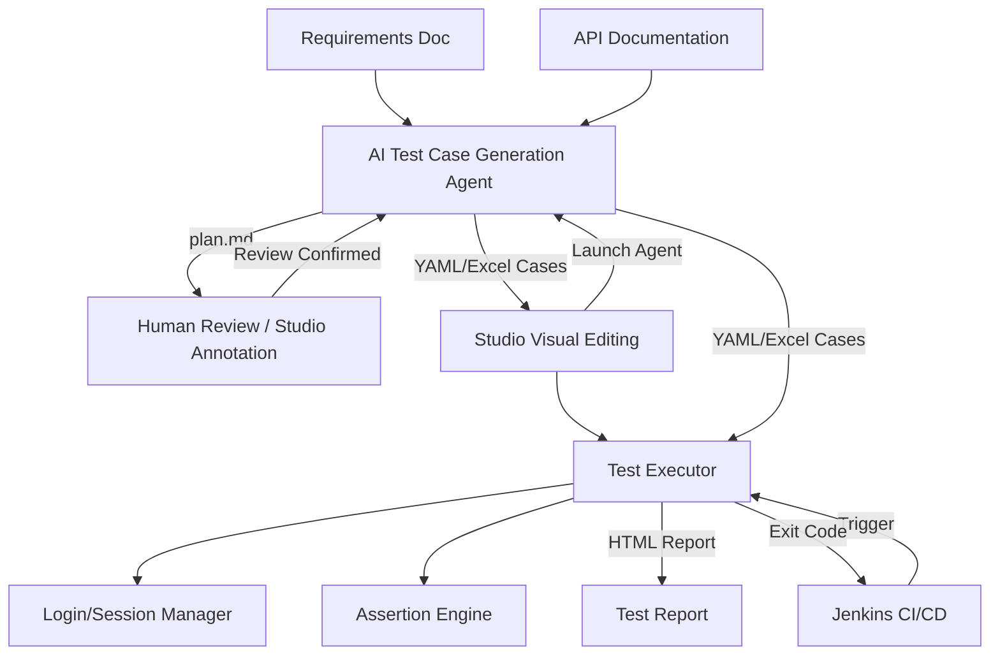

# Flow Forge — API Test Automation Framework

[中文](README.md) | **English**


**Feed in requirement docs and API docs, and an AI agent automatically generates test cases; a command-line executor runs them in one shot and produces a test report.** A full API test automation chain from requirements to report — test cases are stored as YAML/Excel for easy Git management and human review, and the executor integrates seamlessly with Jenkins CI/CD.

## What It Does

- **AI-generated test cases**: Reads requirement docs (Markdown/PDF/text) plus API docs (OpenAPI/Markdown) and automatically generates single-API and business-flow test cases.
- **Controllable human review**: The AI-produced test plan is confirmed by a human first (visual annotation supported in Studio) before cases are generated, suppressing AI hallucinations.
- **Visual editing**: The Studio desktop app batch-edits Excel/YAML cases and graphically edits JSON fields and assertion rules.
- **Multi-threaded execution**: The executor runs cases concurrently, automatically manages login/session state, supports cross-request parameter passing (tokens, etc.), and provides a two-tier assertion engine.
- **Self-contained reports**: Produces HTML reports with inline styles and scripts that open directly in a browser; integrates with Jenkins via exit codes.
- **Flexible formats**: Bidirectional YAML/Excel conversion, plus generation of zero-dependency standalone pytest code.



## Recommended: Flow Forge Studio (GUI)

**The Studio desktop app covers all 6 features in one place — complete the entire workflow without memorizing CLI commands.**

### Workflow: Generate → Edit → Execute & Convert

```text
① Generate                ② Edit                    ③ Execute & Convert
┌──────────────┐      ┌──────────────┐      ┌──────────────┐
│  AI Agent     │ ───▶ │  Excel Editor │ ───▶ │  Executor     │
│  Annotator    │      │  YAML Editor  │      │  Converter    │
└──────────────┘      └──────────────┘      └──────────────┘
```

### 🏆 The Most Recommended Approach

**Edit in Excel, then convert to YAML for version control.** This is the best practice balancing efficiency and traceability:

1. **AI generates Excel**: Configure requirement docs and API docs in Studio's "AI Case Generator", launch the agent to auto-generate test cases. Review and annotate the test plan before generating.
2. **Batch-edit in Excel**: Use the Excel Editor to quickly browse, sort, and batch-modify tags, parameters, and assertions. The spreadsheet UI is ideal for mass editing.
3. **Convert to YAML for git diff**: Use the Converter to transform Excel into YAML (one file per case), commit file-by-file to Git. Code review diffs are crystal clear, making every change traceable.
4. **Run with Executor**: Execute YAML (or Excel directly) in the Case Executor to generate HTML reports.

> **💡 Why Excel → YAML?** Excel excels at batch editing, YAML excels at diffing. Use each where it shines: Excel for editing, YAML for commits. When you need standalone tests, use `yaml2pytest` / `excel2pytest` to produce zero-dependency pytest code.

### 🤖 Auto Mode After Debugging

Once your Skills (business rules) and plugins are debugged, use `--auto` to skip human review — ideal for overnight batch generation or CI/CD:

```bash
cd agent
python main.py --requirement docs/req.md --api docs/api.yaml --auto
```

### 💻 Pure CLI (SSH / CI/CD)

If you prefer the command line or operate over SSH on a server, full CLI workflow is also supported:

```bash
cd agent
python main.py --requirement docs/req.md --api docs/api.yaml  # AI generation + human review
cd ../python
python main.py --yamlDir ../agent/output --envName local       # Executor run
```

> **Quick editor actions**: In the Excel / YAML Editor, use the `▶ Run` and `⟳ Convert` split buttons in the top-right toolbar to execute or convert the current file directly — no need to switch views, ideal for single-file debugging.

### Studio Installation

<!-- RELEASE_MSI -->
> 🚧 **MSI installer coming soon**: The installer will be published as a [GitHub Release](https://github.com/your-org/flow-forge/releases) asset. Stay tuned.
<!-- /RELEASE_MSI -->

To build from source:

```bash
cd studio
npm install
npm run dev          # development mode
# or
npm run build        # production → src-tauri/target/release/
```

### Platform Compatibility

Flow Forge Studio is primarily developed and tested on **Windows**.

- **Windows**: ✅ Fully supported — automatic child process termination (Job Object), process tree cleanup.
- **Linux / macOS**: ⚠️ Not thoroughly tested.

> **⚠️ Important Risk Notice**: On non-Windows systems, if the Studio process terminates abnormally (e.g., crash, `kill -9`, system-forced termination), running Python subprocesses (agent / executor / converter) may become orphaned and continue executing. If an agent is actively calling paid LLM APIs, this could result in unexpected API charges. Windows avoids this automatically via the Job Object mechanism. **Non-Windows users are strongly advised to use the [CLI](python/README.en.md) to execute tasks.**

### Six Feature Entries

| Entry | Description |
| ------ | ------ |
| **AI Case Generator** | Configure and run the AI agent to generate test cases from requirement and API docs, with real-time logs and plan review |
| **Plan Annotator** | Add annotations directly on the rendered test plan; annotations can be used by the AI for plan revision |
| **Excel Editor** | Batch-edit .xlsx case files in a spreadsheet UI, covering API definitions, single-API cases, and business-flow cases |
| **YAML Editor** | Form-based structured editing with a tree-directory browser — one case per file, ideal for git diff |
| **Case Executor** | Run test cases and generate HTML reports, with multi-environment switching and multi-threaded execution |
| **Case Converter** | Convert Excel ↔ YAML bidirectionally + export to pytest, with batch conversion support |

## The Three Sub-projects

| Sub-project | Purpose | Quick Access |
| -------- | ------ | ---------- |
| **[studio/](./studio/README.en.md)** | Flow Forge Studio desktop app: visual case editing, plan annotation, GUI agent/executor/converter launcher | [Docs →](./studio/README.en.md) |
| **[agent/](./agent/README.en.md)** | AI test-case generation agent: requirements + API docs → test plan (human review) → YAML/Excel cases | [Docs →](./agent/README.en.md) |
| **[python/](./python/README.en.md)** | API test executor + format converter: run YAML/Excel cases → HTML report; Excel↔YAML bidirectional, export to pytest | [Docs →](./python/README.en.md) |

The three communicate through **YAML files** as the primary contract (Excel remains compatible) — whatever format the agent generates, the executor parses. Users are free to choose: AI auto-generation, manual authoring, or visual editing in Studio.

The `shared/` directory holds cross-language shared schemas (column definitions, field mappings, operators, etc.), keeping field definitions consistent across the agent, python, and studio ends.

## CI/CD Integration (Jenkins)

The executor is a pure command-line tool that reports results through exit codes (`0` = all passed, `1` = failures present, `2` = config/parse error), so it can be integrated directly into a Jenkins pipeline.

## Anti-Hallucination & Quality Control

AI hallucinations are inevitable; Flow Forge controls quality through multiple mechanisms:

- **Human review node**: cases are only generated after the test plan is confirmed by a human.
- **URL correction and count validation**: API URLs are corrected by comparing against the source document, and the number of LLM output items is automatically validated and retried (see the [agent anti-hallucination doc](./agent/docs/anti-hallucination.en.md)).
- **Text-only limitation**: only extractable text is processed; binary/scanned files raise an explicit error rather than silently producing empty results.

## Design Philosophy

- **YAML/Excel as contract**: the agent and executor are decoupled, and users freely choose how to generate cases.
- **Human review**: cases are only generated after the AI plan is confirmed by a human, keeping quality controllable.
- **CLI & GUI dual mode**: Studio desktop app provides visual operations; CLI is preserved for CI/CD.
- **Self-contained reports**: HTML reports embed styles and scripts inline, requiring no web server.
- **Extensible processors/plugins**: users can customize case generation. When executing cases, they can apply custom signatures, insert timestamps, and more.

## Plugin & Extension Mechanism

| Module | Extension Point | Description |
| ------ | -------- | ------ |
| [`python/processors/`](./python/docs/processors-and-report.en.md#pre-processors--post-processors) | PreProcessor / PostProcessor | Processing logic before and after requests (HMAC signing, SQL cleanup, path parameters, etc.) |
| [`agent/plugins/`](./agent/docs/plugins-and-skills.en.md) | CaseAttributeGenerator | Automatically enrich attributes after case generation (data filling, assertion generation, etc.) |
| `studio/` | Agent Runner | Configure and launch the AI agent from Studio, view real-time logs, and interact with prompts and plan reviews |
| `studio/` | Editor Toolbar | Execute or convert cases directly from the editor, ideal for single-file debugging |
| `studio/` | PreProcessors / PostProcessors fields | Visually edit and validate processor configs in the editor |

## Running Tests

```bash
# agent/ tests (all LLM calls are mocked, no API costs)
cd agent && python -m pytest tests/ -v

# python/ tests
cd python && python -m pytest tests/ -v
```

## Technology Stack

| Component | Technology |
| ------ | ------ |
| Studio Desktop App | Vue 3, Ant Design Vue, Vite, Tauri 2, TypeScript |
| Test Case Generation Agent | Python 3.12, LangGraph, OpenAI-compatible API, prance (OpenAPI), pymupdf (PDF), context compression |
| Test Executor and Converter | Python 3.12, requests, openpyxl, pyyaml |
| Configuration Management | YAML multi-environment config files |
| Report Output | Self-contained HTML (no external CSS/JS) |
| CI/CD | Jenkins Pipeline, CLI exit codes |
