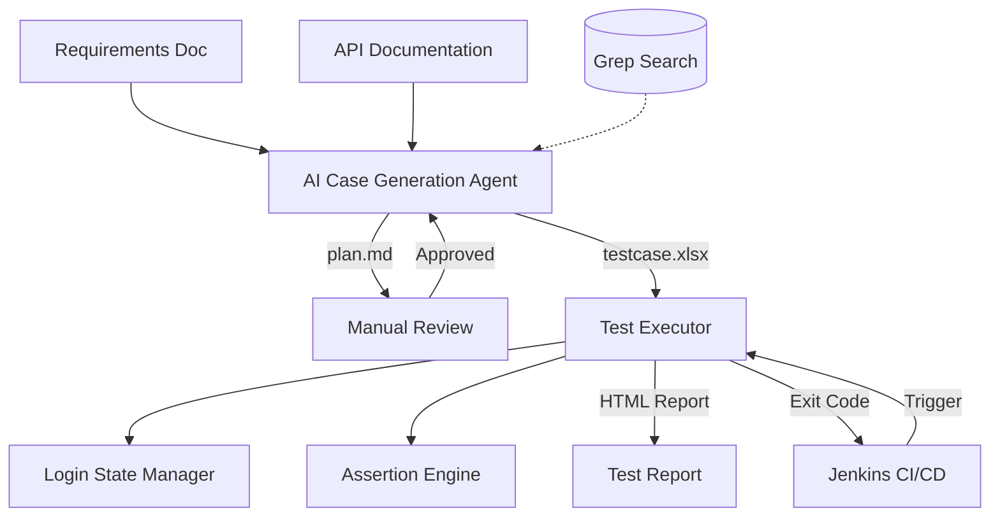

# Flow Forge — API Automation Testing Framework

**English** | [中文](README.md)


An AI agent-based API automation testing framework. Provide requirement documents and API documentation, and the agent automatically generates test case Excel files. Feed the Excel file to the CLI executor, and you get a test report. The executor integrates seamlessly with Jenkins for CI/CD pipelines.

The AI agent enables rapid test case generation, but due to potential AI hallucinations, manual review of the generated output is recommended. To make review easier, test cases and parameters are placed in the same Excel file. For detailed rules, see [agent/README.md](./agent/README.md).

## Current Status

The minimum viable pipeline has been validated end-to-end. Given a set of requirement documents, API documentation, and optional user guidance, the agent produces a test plan for manual review. Once the plan is approved, it generates single-API and business-flow test cases. If the reviewer rejects the plan and provides feedback, the agent revises the plan accordingly; the review loop can iterate until the plan is accepted, at which point test cases are produced. The underlying LLM is deepseek-v4-flash.

**Agent example** — see [agent/README.md](./agent/README.md) for details:

```bash
python agent/main.py --requirement docs/req.md --api docs/api.yaml --output testcase.xlsx
```

The executor supports both single-threaded and multi-threaded modes (concurrent case execution, not load testing). In business-flow mode, responses from earlier steps can feed data into later steps, enabling cross-API parameter chaining. The assertion engine supports basic equality checks.

**Executor example** — see [python/README.md](./python/README.md) for details:

```bash
python main.py --config /path/to/env.yml --scriptType APITest --envName local \
               --caseFilePath ./test_cases.xlsx --maxThread 5 --reportName MyReport \
               --apiMode all
```

A web-based Excel editor has been implemented. Users can import Excel test cases for editing, with built-in format validation and a user-friendly JSON editor. See [case-editor/README.en.md](./case-editor/README.en.md) for details.

## Roadmap

1. Broader validation across additional scenarios and document formats.
2. Improve interoperability, such as a converter that exports Excel test cases to Postman collections.
3. Strengthen the assertion engine to support a broader range of assertion scenarios.

## System Architecture



The framework consists of two core components:

- **[agent/](./agent/)** — AI Case Generation Agent: reads requirement documents + API documentation, passes through a two-phase pipeline of "Plan Generation → Manual Review → Case Orchestration", and outputs Excel test case files in executor-compatible format.
- **[python/](./python/)** — API Test Executor: reads Excel test case files, automatically manages login state, executes HTTP requests with multi-threading, runs assertions, and generates self-contained HTML test reports.

The two components are decoupled via **Excel files** as the contract — the agent generates a specific format, and the executor parses that format. Users are free to choose: use the agent to auto-generate cases, or manually write Excel files and run them directly with the executor.

## Project Structure

```text
flow-forge/
├── README.en.md                     # Project overview (this file)
├── agent/                        # AI Case Generation Agent
└── python/                       # API Test Executor
```

## Workflow

### Option 1: AI Agent Generation + Executor (Full Pipeline)

```text
Requirements Doc + API Documentation
       │
       ▼
  AI Agent generates test plan (plan.md)
       │
       ▼
  Manual review & revision of test plan
       │
       ▼
  AI Agent generates Excel cases (testcase.xlsx)
       │
       ▼
  Manual review of Excel (optional parameter tweaks)
       │
       ▼
  Executor runs testcase.xlsx
       │
       ▼
  View HTML test report
```

### Option 2: Manually Written Excel + Executor

```text
Manually write Excel cases (executor format)
       │
       ▼
  Executor runs testcase.xlsx
       │
       ▼
  View HTML test report
```

## CI/CD Integration (Jenkins)

The executor is a pure CLI tool that communicates results via exit codes, allowing direct integration into Jenkins pipelines.

## Technology Stack

| Component | Technology |
|-----------|------------|
| Case Generation Agent | Python 3, OpenAI API, prance (OpenAPI parsing), pymupdf (PDF parsing) |
| Test Executor | Python 3, requests, openpyxl, pyyaml |
| Configuration | YAML multi-environment config files |
| Report Output | Self-contained HTML (no external CSS/JS) |
| CI/CD | Jenkins Pipeline, CLI exit codes |

## Design Philosophy

- **Excel as Contract**: The agent and executor are decoupled through Excel files. Users can freely choose how to produce test cases.
- **Human-in-the-Loop**: AI-generated test plans require manual approval before final case generation, ensuring quality control.
- **CLI-Driven**: The executor is a pure CLI tool with no GUI dependencies, suitable for CI/CD environments.
- **Self-Contained Reports**: HTML reports embed all styles and scripts inline — open them directly in a browser without a web server.
