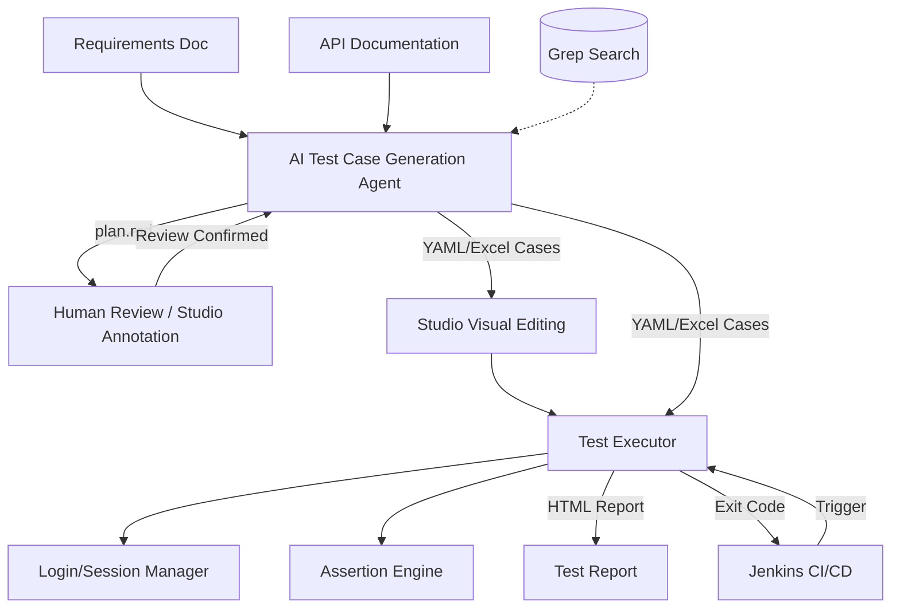

# Flow Forge — API Test Automation Framework

[中文](README.md) | **English**


**Feed in requirement docs and API docs, and an AI agent automatically generates test cases; a command-line executor runs them in one shot and produces a test report.** A full API test automation chain from requirements to report — test cases are stored as YAML/Excel for easy Git management and human review, and the executor integrates seamlessly with Jenkins CI/CD.

## What It Does

- **AI-generated test cases**: Reads requirement docs (Markdown/PDF/text) plus API docs (OpenAPI/Markdown) and automatically generates single-API and business-flow test cases.
- **Controllable human review**: The AI-produced test plan is confirmed by a human first (visual annotation supported in Studio) before cases are generated, suppressing AI hallucinations.
- **Visual editing**: The Studio desktop app batch-edits Excel/YAML cases and graphically edits JSON fields and assertion rules.
- **Multi-threaded execution**: The executor runs cases concurrently, automatically manages login/session state, supports cross-request parameter passing (tokens, etc.), and provides a two-tier assertion engine.
- **Self-contained reports**: Produces HTML reports with inline styles and scripts that open directly in a browser; integrates with Jenkins via exit codes.
- **Flexible formats**: Bidirectional YAML/Excel conversion, plus generation of zero-dependency standalone pytest code.



## Quick Start (Shortest End-to-End Path)

The three components are independent and can be used separately; below is the full chain from requirements to report:

```bash
# ── 1. AI generates cases (agent/) ────────────────────────────
cd agent
pip install -r requirements.txt
cp env.example.yaml env.yaml          # Fill in the LLM api_key / model / base_url
python main.py --requirement docs/req.md --api docs/api.yaml
# Review the test plan: enter y to approve / n for text feedback / r to revise from the annotation file
# Generated cases are written to agent/output_<timestamp>/

# ── 2. (Optional) Visually edit cases in Studio (studio/) ──────────
cd ../studio
npm install
npm run dev                            # Open the Excel/YAML editor for batch adjustments

# ── 3. Executor runs cases and produces a report (python/) ────────────────
cd ../python
pip install -r requirements.txt        # Edit env-local.yml with the target app and login info
python main.py --yamlDir ../agent/output_<timestamp>/cases --envName local --apiMode all
# The report is generated at python/report/{filename}_{timestamp}.html
```

See each component's README below for detailed usage.

## The Three Sub-projects

| Sub-project | Purpose | Quick Access |
|--------|------|----------|
| **[agent/](./agent/README.en.md)** | AI test-case generation agent: requirements + API docs → test plan (human review) → YAML/Excel cases | [Docs →](./agent/README.en.md) |
| **[python/](./python/README.en.md)** | API test executor + format converter: run YAML/Excel cases → HTML report; Excel↔YAML↔pytest conversion | [Docs →](./python/README.en.md) |
| **[studio/](./studio/README.en.md)** | Flow Forge Studio desktop app: visually edit cases, annotate Markdown plans | [Docs →](./studio/README.en.md) |

The three communicate through **YAML files** as the primary contract (Excel remains compatible) — whatever format the agent generates, the executor parses. Users are free to choose: AI auto-generation, manual authoring, or visual editing in Studio.

The `shared/` directory holds cross-language shared schemas (column definitions, field mappings, operators, etc.), keeping field definitions consistent across the agent, python, and studio ends.

## Workflow

Flow Forge supports three workflows; choose as needed:

- **Option 1: Fully automated end-to-end** — the AI agent generates cases → human review → executor runs them. Best for producing cases quickly from scratch.
- **Option 2: Hand-written cases** — manually author YAML/Excel cases → run them with the executor (`--yamlDir` or `--caseFilePath`). Best when you already have cases.
- **Option 3: Initial Excel generation + YAML version control (recommended)** — AI generates Excel (`--output-format excel`) → batch-edit in Studio → convert to YAML with the `converter` → review file-by-file with git diff → run with the executor.

> **Why is Option 3 recommended?** Excel is ideal for batch editing (quick browsing, sorting, bulk changes), while YAML is ideal for diffing (one file per case, so git diff shows changes clearly). Edit in Excel first, then convert to YAML for commit — balancing efficiency and traceability. When you need standalone tests, use `yaml2pytest` / `excel2pytest` to generate zero-dependency pytest code.

## CI/CD Integration (Jenkins)

The executor is a pure command-line tool that reports results through exit codes (`0` = all passed, `1` = failures present, `2` = config/parse error), so it can be integrated directly into a Jenkins pipeline.

## Anti-Hallucination & Quality Control

AI hallucinations are inevitable; Flow Forge controls quality through multiple mechanisms:

- **Human review node**: cases are only generated after the test plan is confirmed by a human.
- **URL correction and count validation**: API URLs are corrected by comparing against the source document, and the number of LLM output items is automatically validated and retried (see the [agent anti-hallucination doc](./agent/docs/anti-hallucination.en.md)).
- **Text-only limitation**: only extractable text is processed; binary/scanned files raise an explicit error rather than silently producing empty results.

## Design Philosophy

- **YAML/Excel as contract**: the agent and executor are decoupled, and users freely choose how to generate cases.
- **Human review**: cases are only generated after the AI plan is confirmed by a human, keeping quality controllable.
- **CLI-driven**: the executor is pure CLI with no GUI dependencies, fitting CI/CD.
- **Self-contained reports**: HTML reports embed styles and scripts inline, requiring no web server.
- **Extensible processors/plugins**: users can customize case generation. When executing cases, they can apply custom signatures, insert timestamps, and more.

## Plugin & Extension Mechanism

| Module | Extension Point | Description |
|------|--------|------|
| [`python/processors/`](./python/docs/processors-and-report.en.md#pre-processors--post-processors) | PreProcessor / PostProcessor | Processing logic before and after requests (HMAC signing, SQL cleanup, path parameters, etc.) |
| [`agent/plugins/`](./agent/docs/plugins-and-skills.en.md) | CaseAttributeGenerator | Automatically enrich attributes after case generation (data filling, assertion generation, etc.) |
| `studio/` | PreProcessors / PostProcessors fields | Visually edit and validate processor configs in the editor |

## Running Tests

```bash
# agent/ tests (all LLM calls are mocked, no API costs)
cd agent && python -m pytest tests/ -v

# python/ tests
cd python && python -m pytest tests/ -v
```

## Technology Stack

| Component | Technology |
|------|------|
| Test Case Generation Agent | Python 3.12, LangGraph, OpenAI-compatible API, prance (OpenAPI), pymupdf (PDF), context compression |
| Test Executor and Converter | Python 3.12, requests, openpyxl, pyyaml |
| Studio Desktop App | Vue 3, Ant Design Vue, Vite, Tauri 2, TypeScript |
| Configuration Management | YAML multi-environment config files |
| Report Output | Self-contained HTML (no external CSS/JS) |
| CI/CD | Jenkins Pipeline, CLI exit codes |
