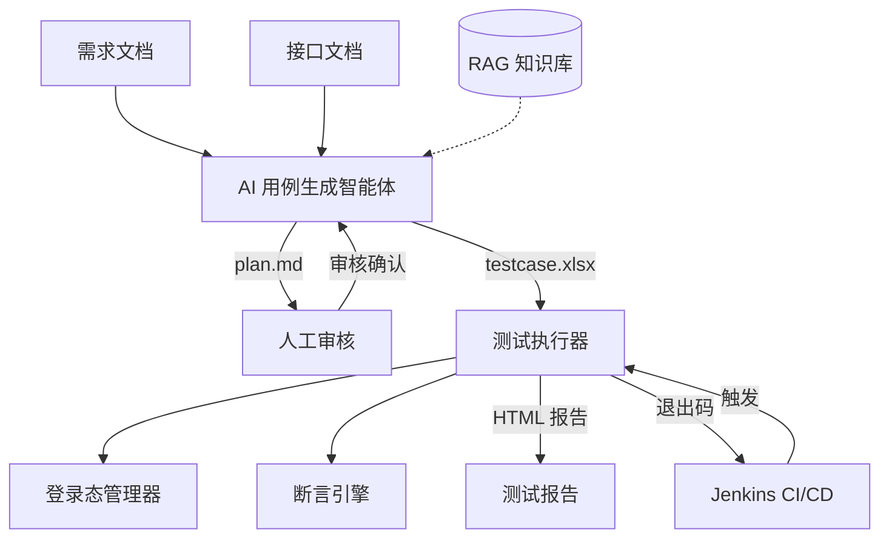

# Flow Forge — 接口自动化测试框架

 


基于 AI 智能体的接口自动化测试框架。输入需求文档和接口文档，智能体自动生成测试用例 Excel；将 Excel 交给命令行执行器，即可得到测试报告。执行器可无缝集成 Jenkins，实现 CI/CD 流水线。
AI智能体可以实现快速的用例输出，但由于AI生成可能产生幻觉，建议人工审核输出的用例。为了更方便人工审核，测试用例和参数放在了同一个Excel内，详细规则见 [agent/README.md](./agent/README.md)。

## 系统架构



整个框架由两个核心组件构成：

- **[agent/](./agent/)** — AI 用例生成智能体：读取需求文档 + 接口文档，经过"计划生成 → 人工审核 → 用例编排"两阶段流水线，输出符合执行器格式的 Excel 用例文件。
- **[python/](./python/)** — 接口测试执行器：读取 Excel 用例文件，自动管理登录态，多线程执行 HTTP 请求，运行断言，生成自包含 HTML 测试报告。

两个组件之间通过 **Excel 文件** 作为契约——智能体生成什么格式，执行器就解析什么格式。用户可以自由选择：用智能体自动生成用例，或手动编写 Excel 后直接用执行器运行。

## 工作流程

### 方式一：AI 智能体生成 + 执行器运行（全流程）

```text
需求文档 + 接口文档
       │
       ▼
  AI 智能体生成测试计划（plan.md）
       │
       ▼
  人工审核、修改测试计划
       │
       ▼
  AI 智能体生成 Excel 用例（testcase.xlsx）
       │
       ▼
  人工审核 Excel（可选修改参数）
       │
       ▼
  执行器运行 testcase.xlsx
       │
       ▼
  查看 HTML 测试报告
```

### 方式二：手动编写 Excel + 执行器运行

```text
手动编写 Excel 用例（按执行器格式）
       │
       ▼
  执行器运行 testcase.xlsx
       │
       ▼
  查看 HTML 测试报告
```

## 技术栈

|组件|技术|
|------|----|
|用例生成智能体|Python 3, OpenAI API, ChromaDB (RAG), prance (OpenAPI 解析), pymupdf (PDF 解析)|
|测试执行器|Python 3, requests, openpyxl, pyyaml|
|配置管理|YAML 多环境配置文件|
|报告输出|自包含 HTML（无需外部 CSS/JS）|
|CI/CD|Jenkins Pipeline|

## 设计理念

- **Excel 即契约**：智能体和执行器之间通过 Excel 文件解耦，用户可自由选择生成方式
- **人工审核节点**：AI 生成的测试计划需要人工确认后才生成最终用例，确保质量可控
- **命令行驱动**：执行器纯 CLI 设计，无 GUI 依赖，适配 CI/CD 环境
- **自包含报告**：HTML 报告内嵌所有样式和脚本，可直接在浏览器打开，无需 Web 服务器
