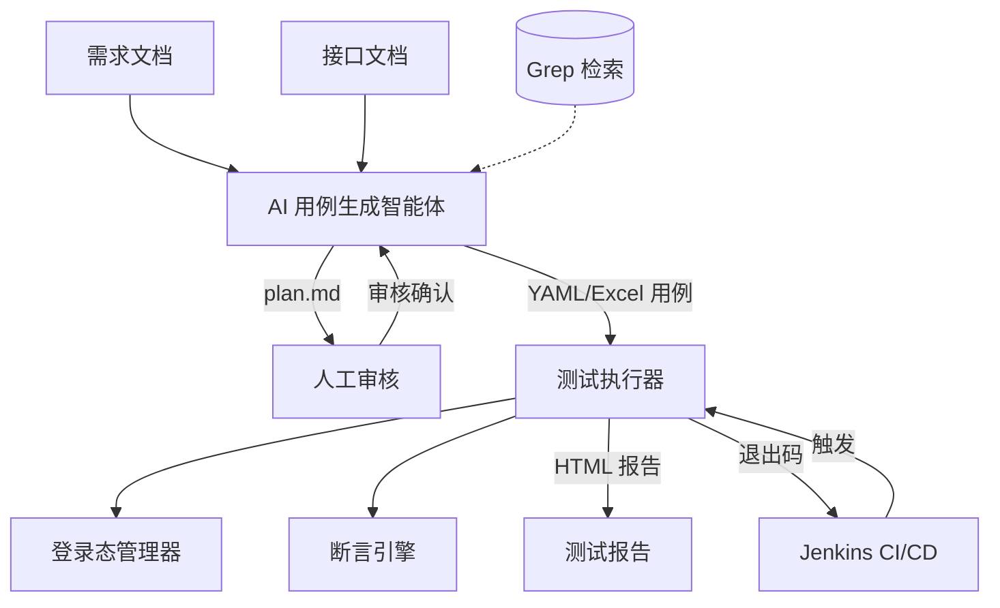

# Flow Forge — 接口自动化测试框架

**中文** | [English](README.en.md)

 


基于 AI 智能体的接口自动化测试框架。输入需求文档和接口文档，智能体自动生成测试用例 YAML 文件（可选导出 Excel）；将用例交给命令行执行器，即可得到测试报告。执行器可无缝集成 Jenkins，实现 CI/CD 流水线。

AI智能体可以实现快速的用例输出，但由于AI可能产生幻觉，在生成测试用例前需要人工审核智能体给出的测试计划，之后再进行单接口和业务链路用例的生成。测试用例以 YAML 文件形式独立存储，每个用例一个文件，便于 Git 版本管理和增量更新，也方便人工逐文件审核。支持断点续生成与增量更新——用例生成中断后可恢复，需求变更后无需全部重新生成。详细规则见 [agent/README.md](./agent/README.md)。

## 版本说明

目前已完成最小主要链路的验证。提供需求文档、接口文档和用户描述给智能体。智能体可以给出测试计划。人工审核并通过测试计划之后即可生成单接口和业务链路接口测试用例。拒绝测试计划并提交修改意见后可以正确修改测试计划，审核通过后可以生成测试用例。智能体使用的LLM是deepseek-v4-flash。

智能体使用示例，详情见 [agent/README.md](./agent/README.md)。

```bash
# 完整流水线（输出目录默认为 ./output_<timestamp>）
python agent/main.py --requirement docs/req.md --api docs/api.yaml

# 指定输出目录
python agent/main.py --requirement docs/req.md --api docs/api.yaml --output my_output

# 仅输出 YAML（不导出 Excel）
python agent/main.py --requirement docs/req.md --api docs/api.yaml --output-format yaml
```

执行器能够以单线程和多线程（并发执行多个用例，非压力测试）的方式执行测试用例。执行业务链路用例时，前面步骤的执行结果可以解析到当前步骤，实现测试数据的跨接口传递。断言引擎支持简单等值断言和高级多运算符断言规则（数值比较、正则匹配、列表聚合等）。

执行器使用示例，详情见 [python/README.md](./python/README.md)。

```bash
# 方式一：使用 YAML 用例
python main.py --config /path/to/env.yml --envName local --yamlDir ./output --apiMode all

# 方式二：使用 Excel 用例
python main.py --config /path/to/env.yml --scriptType APITest --envName local \
               --caseFilePath ./test_cases.xlsx --maxThread 5 --reportName MyReport \
               --apiMode all
```

已实现 Tauri 桌面应用 Flow Forge Studio。支持 Excel (.xlsx) 和 YAML (.yaml) 两种用例格式的可视化编辑，提供表单化 YAML 编辑、右键菜单文件操作、高级断言规则编辑器、JSON 树形编辑器、字体缩放（Ctrl+滚轮）、Markdown 计划批注器交互式批注弹窗等功能。同时提供用例格式转换工具，支持 Excel 与 YAML 的互相转换。详情见 [studio/README.md](./studio/README.md)。

## 系统架构



人工审核环节支持两种方式：(1) 直接在 CLI 中输入 `y`/`n` 及文字反馈；(2) 输入 `r` 通过 [studio 的 Markdown 计划批注器](./studio/README.md) 在渲染后的测试计划上添加结构化批注，支持点击批注高亮查看详情、直接编辑和删除批注，智能体将根据批注文件修改计划。

整个框架由两个核心组件构成：

- **[agent/](./agent/)** — AI 用例生成智能体：读取需求文档 + 接口文档，经过"计划生成 → 人工审核 → 用例编排"两阶段流水线，输出测试用例 YAML 文件（可选导出 Excel）。
- **[python/](./python/)** — 接口测试执行器 + 用例格式转换器：读取 YAML 用例目录/文件或 Excel 用例文件，自动管理登录态，多线程执行 HTTP 请求，运行断言，生成自包含 HTML 测试报告。同时提供 Excel ↔ YAML 用例格式双向转换工具。
- **[studio/](./studio/)** — Flow Forge Studio 桌面应用：提供测试用例的可视化编辑（Excel + YAML）、测试计划的 Markdown 交互式批注。

两个组件之间通过 **YAML 文件** 作为主要契约（Excel 仍兼容）——智能体生成什么格式，执行器就解析什么格式。用户可以自由选择：用智能体自动生成用例，手动编写 YAML/Excel 用例后直接用执行器运行，或使用 Excel 编辑器编辑用例。

## 项目基本结构

```text
flow-forge/
├── README.md                     # 项目总览（本文件）
├── agent/                        # AI 用例生成智能体
│   ├── plugins/                  # 自定义用例属性生成器插件（可选）
│   └── utils/                    # 工具模块（token_counter.py 等）
├── python/                       # 接口测试执行器 + 用例格式转换器
│   ├── converter/                # Excel ↔ YAML 用例格式转换工具
│   └── processors/               # 前置/后置处理器插件（可选）
└── studio/                       # Flow Forge Studio 桌面应用（用例编辑、计划批注）
```

## 工作流程

### 方式一：AI 智能体生成 + 执行器运行（全流程）

```text
需求文档 + 接口文档
       │
       ▼
  AI 智能体生成测试计划（plan.md）
       │
       ▼
  人工审核、修改测试计划
       │
       ▼
  AI 智能体生成 YAML 用例（output/ 目录）
       │
       ▼
  人工审核 YAML 用例（可选修改参数）
       │
       ▼
  执行器运行 YAML 目录
       │
       ▼
  查看 HTML 测试报告
```

### 方式二：手动编写 YAML/Excel + 执行器运行

```text
手动编写 YAML 或 Excel 用例（按执行器格式）
       │
       ▼
  执行器运行用例（--yamlDir 或 --caseFilePath）
       │
       ▼
  查看 HTML 测试报告
```

### 方式三：AI 生成 Excel → Studio 批量编辑 → 转 YAML 做 diff（推荐）

```text
AI 智能体输出 Excel 格式（--output-format excel 或 both）
       │
       ▼
  在 Flow Forge Studio 中批量查看和编辑（调整 Tag、补全参数、修改断言等）
       │
       ▼
  用 converter 将 Excel 转为 YAML 格式（python converter_main.py excel2yaml）
       │
       ▼
  YAML 纳入 Git 版本控制，逐文件 diff 审查变更
       │
       ▼
  执行器运行 YAML 目录
       │
       ▼
  查看 HTML 测试报告
```

> **为什么推荐这个工作流？** Excel 格式适合批量编辑——在 Studio 中可以快速浏览、排序、批量修改大量用例；YAML 格式适合做 diff——每个用例一个文件，git diff 可以清晰展示每次变更的内容，方便代码评审。先用 Excel 编辑，再转为 YAML 提交，兼顾效率和可追溯性。

## CI/CD 集成（Jenkins）

执行器是纯命令行工具，通过退出码反馈执行结果，可直接集成到 Jenkins 流水线中。

## 技术栈

|组件|技术|
|------|----|
|用例生成智能体|Python 3, OpenAI API, prance (OpenAPI 解析), pymupdf (PDF 解析)|
|测试执行器|Python 3, requests, openpyxl, pyyaml|
|配置管理|YAML 多环境配置文件|
|报告输出|自包含 HTML（无需外部 CSS/JS）|
|CI/CD|Jenkins Pipeline, 命令行退出码|

## 设计理念

- **YAML/Excel 即契约**：智能体和执行器之间通过 YAML/Excel 文件解耦，用户可自由选择生成方式
- **人工审核节点**：AI 生成的测试计划需要人工确认后才生成最终用例，确保质量可控
- **命令行驱动**：执行器纯 CLI 设计，无 GUI 依赖，适配 CI/CD 环境
- **自包含报告**：HTML 报告内嵌所有样式和脚本，可直接在浏览器打开，无需 Web 服务器
- **可扩展处理器**：预留前置/后置处理器扩展点，用户可自定义 HMAC 签名、SQL 清理等定制逻辑

## 插件与处理器系统

项目提供三层扩展机制，满足定制化需求：

| 模块 | 扩展点 | 说明 |
|------|--------|------|
| `python/processors/` | PreProcessor / PostProcessor | 请求前后的处理逻辑，修改请求/响应，处理外部资源 |
| `agent/plugins/` | CaseAttributeGenerator | AI 智能体插件，在用例生成后自动补充自定义属性 |
| `studio/` | PreProcessors / PostProcessors 字段 | 在编辑器中编辑、校验处理器配置 |

**典型场景**：
- 在请求前添加 HMAC 签名（PreProcessor）
- 在请求后清理数据库测试数据（PostProcessor）
- 通过 AI 智能体自动为生成的用例推荐处理器配置（agent plugin）

详见各子目录的 README：`python/README.md`、`agent/README.md`、`studio/README.md`。
