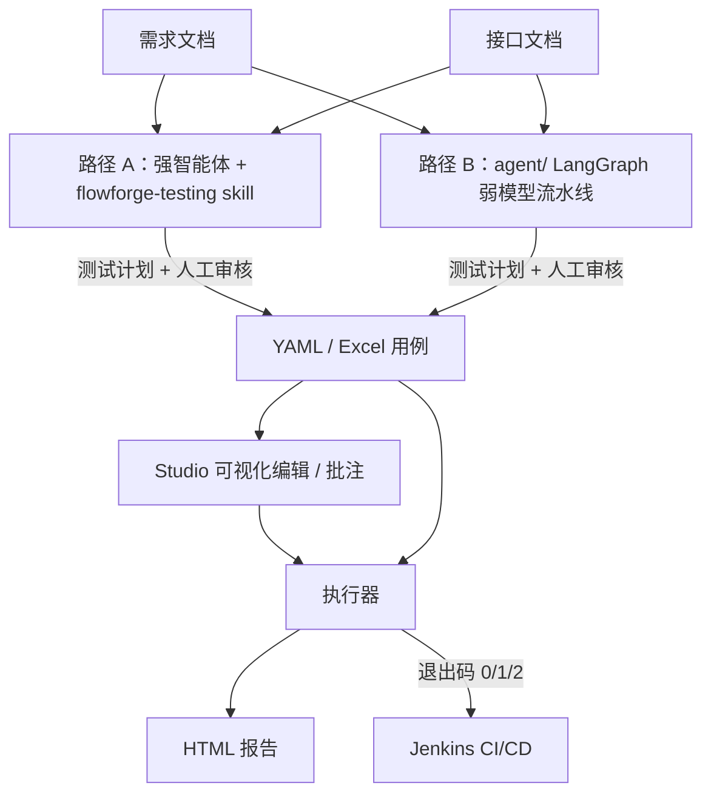
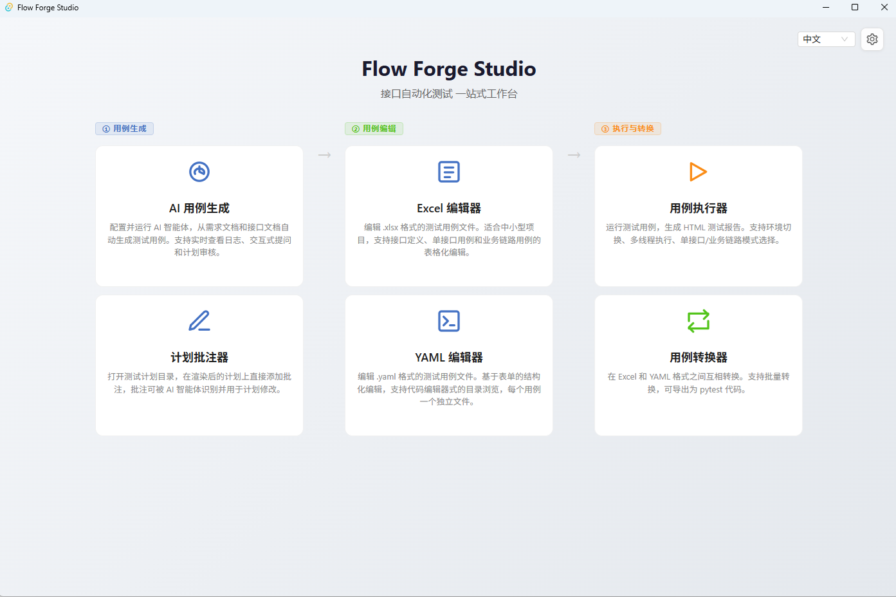

# Flow Forge — 接口自动化测试框架

**中文** | [English](README.en.md)


**输入需求文档和接口文档，AI 生成测试用例，命令行执行器一键运行并产出 HTML 报告。** 从需求到报告的全链路接口自动化测试：用例以 YAML/Excel 存储、便于 Git 管理和人工审核，执行器可集成 Jenkins CI/CD。

## 功能特性

- **两条 AI 用例生成路径**：`flowforge-testing` skill 驱动 Codex / opencode / Claude Code 等强智能体直接完成生成、校验、执行与分诊；`agent/` LangGraph 流水线面向 llama.cpp / Ollama 等本地弱模型。两条路径的产物都是同一套 YAML/Excel 用例。
- **从需求到报告的自动化闭环**：需求文档（Markdown/PDF/文本）+ 接口文档（OpenAPI/Markdown）→ 测试计划（人工审核）→ YAML/Excel 用例 → 执行 → 自包含 HTML 报告 → 退出码接入 Jenkins。
- **质量机制**：测试计划经人工确认后才生成用例；接口 URL 与文档原文比对纠错、输出数量校验抑制幻觉；`ff_tool validate` 按共享 schema 做静态校验。
- **Studio 桌面工作台（Windows）**：AI 用例生成、计划批注、Excel/YAML 可视化编辑、用例执行、格式转换六大功能一站完成，无需记忆 CLI 参数。
- **执行器与转换器**：多线程并发、登录态自动管理、跨步骤参数传递（inherit）、两级断言引擎；Excel↔YAML 双向转换，可导出零依赖 pytest 代码；处理器/插件可扩展。
- **随仓库示例**：[examples/foli-mall/](./examples/foli-mall/README.md) 提供基于电商靶场的可运行示例，并展示两条生成路径的真实产物。



## 路径 A —— 用强智能体 + skill 生成用例（推荐）

适合使用 Codex / opencode / Claude Code 等强智能体的用户。[flowforge-testing](./flowforge-testing/README.md) 把「多文档分析 → 测试计划 → YAML 生成 → schema 校验 → 执行 → 错误分诊 → 修改」的完整工作流提炼成一个 skill，智能体按 `SKILL.md` 的指令执行，只在需要确定性时调用 `python/` 执行器与转换器，省去面向弱模型的分块与压缩开销。

### 快速开始

1. 把 skill 接入你的智能体（以 Codex 为例）：

   ```bash
   # 复制或软链到用户级 skill 目录（推荐，可自动发现）
   ln -s <仓库根目录>/flowforge-testing ~/.codex/skills/flowforge-testing
   ```

   也可以在会话中直接指定：让智能体读取 `<仓库根目录>/flowforge-testing/SKILL.md` 后开始工作。

2. 生成配置文件并填写（`language` / `mode` / Python 环境）：

   ```bash
   cp flowforge-testing/flowforge.config.yaml.example flowforge-testing/flowforge.config.yaml
   ```

3. 在会话中说明需求，例如：「使用 flowforge-testing skill，根据 `docs/req.md` 与 `docs/api.yaml` 生成测试用例并执行」。智能体将：输出测试计划（默认 plan 模式，可先人工确认）→ 生成 YAML 用例 → 静态校验 → 执行 → 输出报告与分诊结论。

4. 也可以手动校验与执行（智能体会自动调用同一套命令）：

   ```bash
   python flowforge-testing/scripts/ff_tool.py validate --yamlDir <用例目录>
   python flowforge-testing/scripts/ff_tool.py execute --yamlDir <用例目录> --envName local
   ```

### 能力清单

- **生成**：需求/接口文档（可多份）+ 表结构/业务规则 → plan（默认）→ YAML 用例。
- **修改**：需求/接口变更 + 现有用例 → 差异分析 → 增改删 → 校验执行。
- **校验**：按 `shared/schemas` 静态校验（必填字段、断言、inherit、处理器配置）。
- **执行与分诊**：调用 `python/` 执行器，区分「用例错 / 业务 bug / 环境问题」。
- **转换**：YAML ↔ Excel（按需）。
- **两种模式**：plan（默认，先出计划确认）/ auto（无人值守直接跑）。

生成的 YAML 用例可直接在 [Studio](./studio/README.md) 中打开编辑、执行。

## 路径 B —— 弱模型 LangGraph 流水线

适合只有本地小参数模型（llama.cpp / Ollama 等），或对数据隐私、调用成本敏感的用户。[agent/](./agent/README.md) 是基于 LangGraph 的多智能体流水线，用英文提示词、文档分块、上下文压缩、分批生成与人工审核等机制适配弱模型，支持断点续写。

### 快速开始

```bash
cd agent
pip install -r requirements.txt
pip install -e ../shared/py          # 首次使用必须执行
cp env.example.yaml env.yaml         # 填写 api_key / model / base_url（兼容任意 OpenAI 兼容 API）

python main.py --requirement docs/req.md --api docs/api.yaml
# 审核测试计划：y 批准 / n 文字反馈 / r 按批注文件修改
# 审核通过后自动生成用例，输出到 ./output_<timestamp>/
```

调试完毕后可用 `--auto` 跳过人工审核，适合夜间批量生成：

```bash
python main.py --requirement docs/req.md --api docs/api.yaml --auto
```

与路径 A 可衔接：先用弱模型产出初版用例，再交给强智能体按 flowforge-testing 的修改模式修订。

## 路径选择建议

| 路径 | 适合谁 | 原理 | 产物 | 文档 |
|------|--------|------|------|------|
| **路径 A：强智能体 + skill** | 使用 Codex / opencode / Claude Code 的用户，追求效率与质量 | skill 将工作流固化为指令，直接驱动执行器与转换器 | 测试计划 + YAML 用例 + 校验/执行/分诊 | [flowforge-testing/README.md](./flowforge-testing/README.md) |
| **路径 B：弱模型流水线** | 本地小模型、离线/隐私/成本敏感场景 | LangGraph 多智能体 + 分块/压缩/人工审核 | YAML（可选 Excel）用例 | [agent/README.md](./agent/README.md) |

两条路径产物格式一致，可互相替换、衔接；生成之后的工作流（编辑、执行、报告、CI）完全相同。

## Flow Forge Studio（GUI 工作台）

Studio 是 Windows 桌面应用（Vue 3 + Tauri 2），把「生成 → 编辑 → 执行与转换」集中在一个界面，无需记忆 CLI 参数；两条路径生成的用例都可以在 Studio 中打开编辑。



| 入口 | 说明 |
|------|------|
| **AI 用例生成** | 配置需求/接口文档并启动智能体，实时日志与计划审核 |
| **计划批注器** | 在渲染后的测试计划上添加批注，供智能体修改计划 |
| **Excel 编辑器** | 表格化批量编辑接口定义/单接口用例/业务链路 |
| **YAML 编辑器** | 表单化编辑 + 原始 YAML 分屏，每用例一文件便于 git diff |
| **用例执行器** | 运行用例并生成 HTML 报告，多环境切换、多线程执行 |
| **用例转换器** | Excel ↔ YAML 互转 + 导出 pytest，支持批量转换 |

### 推荐工作流：Excel 编辑 → YAML 做 diff

1. 在 Studio 中启动 AI 生成用例（或直接打开两条路径产出的用例）；
2. 用 Excel 编辑器批量调整 Tag/参数/断言；
3. 用转换器转成 YAML（每用例一个文件）逐文件提交 Git，评审时变更一目了然；
4. 用执行器运行并生成 HTML 报告。

> Excel 适合批量编辑，YAML 适合做 diff，两者各取所长。需要独立测试时用 `yaml2pytest` / `excel2pytest` 生成零依赖 pytest 代码。编辑器内还提供 `▶ 运行` / `⟳ 转换` 快捷按钮，可对当前文件单文件调试。

### 安装与平台兼容性

<!-- RELEASE_MSI -->
> **下载安装包**：Windows 安装程序（MSI）随 [GitHub Releases](https://github.com/Remon-16/flow-forge/releases) 发布（当前版本 v0.3.2-beta）。也可以从源码构建。
<!-- /RELEASE_MSI -->

```bash
cd studio
npm install
npm run dev          # 开发模式
npm run build        # 生产构建 → src-tauri/target/release/
```

**仅支持 Windows**：Studio 的进程管理依赖 Windows Job Object 机制（`KILL_ON_JOB_CLOSE`）保证子进程自动终止，这是 Windows 内核功能，其他平台无等价替代。Linux/macOS 用户请使用跨平台的 [CLI 命令行](./python/README.md) 执行 agent / executor / converter。

## 执行器与转换器（python/）

`python/` 提供跨平台的命令行执行器与格式转换器，是两条路径共同的「下游」：

- **执行**：YAML 目录或 Excel 文件 → 多线程并发运行 → 自包含 HTML 报告；自动管理登录态，支持跨接口参数传递（`inherit`）与两级断言（`assert_dict` / `assert_rules`）。
- **CI/CD**：以退出码反馈结果（`0`=全通过，`1`=有失败，`2`=配置/解析错误），可直接集成 Jenkins。
- **转换**：`excel2yaml` / `yaml2excel` / `yaml2pytest` / `excel2pytest`。
- **扩展**：前置/后置处理器（HMAC 签名、SQL 清理、DB 夹具等），提供数据库/Redis/MQ/Kafka/Pulsar/RocketMQ 插件基类。

```bash
cd python
python main.py --yamlDir <用例目录> --envName local
# 报告输出到 python/report/，浏览器直接打开
```

## 示例用例

[examples/foli-mall/](./examples/foli-mall/README.md) 基于 foli-mall 电商靶场，按 agent-out → curated → raw 的顺序展示两条路径的真实产物：

- **agent-out/**：flowforge-testing skill + 强智能体生成的用例（测试计划 + YAML 用例 + 执行报告）。
- **curated/**：弱模型初版经修正后的可运行用例（YAML + 环境配置），拿到即可跑。
- **raw/**：弱模型（Qwen3-8B-Q4_K_M）原始输出（Excel，未修正），供对比「AI 生成 → 修正」的完整过程。

配套文档包含弱模型生成用例修改记录、前置数据插件指南与实测缺陷记录。

## 项目结构

| 子项目 | 作用 |
|--------|------|
| [studio/](./studio/README.md) | Windows 桌面工作台：可视化编辑、计划批注、GUI 启动智能体/执行器/转换器 |
| [agent/](./agent/README.md) | 弱模型 LangGraph 流水线：需求 + 接口文档 → 测试计划（人工审核）→ YAML/Excel 用例 |
| [python/](./python/README.md) | 执行器 + 转换器：运行用例 → HTML 报告；Excel↔YAML 互转、导出 pytest |
| [flowforge-testing/](./flowforge-testing/README.md) | 强智能体 skill：生成/修改/校验/执行/分诊工作流，Codex、opencode、Claude Code 可装载 |
| [shared/](./shared/schemas/README.md) | 跨语言共享 schema（列定义、字段映射、运算符），保证各端字段一致 |

agent、python、studio 以 YAML 文件为主要契约（Excel 兼容）：智能体生成什么格式，执行器就解析什么格式。用户可自由选择 AI 自动生成、手动编写或 Studio 可视化编辑。

## 插件与扩展机制

| 模块 | 扩展点 | 说明 |
|------|--------|------|
| [`python/processors/`](./python/docs/processors-and-report.md#前置处理器--后置处理器) | PreProcessor / PostProcessor | 请求前后的处理逻辑（HMAC 签名、SQL 清理、路径参数等） |
| [`agent/plugins/`](./agent/docs/plugins-and-skills.md) | CaseAttributeGenerator | 用例生成后自动补充属性（数据填充、断言生成等） |
| `studio/` | Agent Runner / Editor Toolbar / 处理器字段 | GUI 启动智能体、编辑器内执行/转换、可视化编辑处理器配置 |

## 测试代码

```bash
# agent/ 测试（LLM 调用均已 mock，无 API 费用）
cd agent && python -m pytest tests/ -v

# python/ 测试
cd python && python -m pytest tests/ -v

# skill 工具测试
python -m pytest flowforge-testing/scripts/tests -v
```

## 已知问题

### Studio 直接启动 Python 时报“进程可能已崩溃”（任务实际已完成）

**现象**：在 Studio 中将 Python 环境设为“系统 Python”（或 venv）并直接填写可执行文件路径时，在中文等非 UTF-8 区域设置的 Windows 上，执行器/转换器运行结束后日志会出现 `OSError: [Errno 22] Invalid argument`，界面提示“进程可能已崩溃”。此时任务与报告**实际已完成**，只是最后的完成状态未能回传 Studio。

**原因**：Studio 通过管道读取 Python 的 stdout，并要求内容为合法 UTF-8；而直接启动的 Python 其 stdout 使用系统 ANSI 代码页（中文系统为 GBK）。当 Python 向 stdout 输出中文（如执行器的统计摘要）时，Studio 读到非法 UTF-8 后关闭管道读端，Python 随后写入最后一行 JSON 完成消息即失败（Windows 将管道断裂表现为 `Errno 22`）。

**规避方案（无需修改代码）**：

1. 设置用户环境变量并重启 Studio（已在中文 Windows 环境实测有效）：

   ```powershell
   setx PYTHONIOENCODING utf-8
   ```

2. **完全退出并重新打开 Studio**，使新环境变量生效。

**恢复旧设置**：

- 修改前请先记录原值：若该变量原本不存在，恢复时直接删除即可；若原本有值，请用 `setx PYTHONIOENCODING <原值>` 恢复。
- 查看当前值（cmd 或 PowerShell 均可执行）：

  ```powershell
  reg query HKCU\Environment /v PYTHONIOENCODING
  ```

- 删除该变量（推荐在“系统属性 → 环境变量”界面操作，或使用以下命令）：

  ```powershell
  reg delete HKCU\Environment /v PYTHONIOENCODING /f
  ```

  删除后重新登录 Windows（必要时重启），并重启 Studio。

**补充说明**：

- 使用 Conda 模式（选择 Conda、填写环境名、不填可执行文件路径）不受影响，因为 conda 会为子进程设置 UTF-8 环境变量。
- 使用 `PYTHONUTF8=1` 亦可解决，但它还会改变文件读写等默认编码，影响面更大，建议优先使用 `PYTHONIOENCODING`。
- 使用 UTF-8 区域设置的 Windows（如英文系统）不会触发此问题。
- 此问题与测试逻辑无关，任务结果与 HTML 报告均不受影响。是否在后续版本从代码层面修复，将视项目推广反馈而定。

## 技术栈

| 组件 | 技术 |
|------|------|
| Studio 桌面应用 | Vue 3, Ant Design Vue, Vite, Tauri 2, TypeScript |
| agent 弱模型流水线 | Python 3.12, LangGraph, OpenAI 兼容 API, prance (OpenAPI), pymupdf (PDF), 上下文压缩 |
| skill 工具脚本 | Python 3.12（ff_tool / resolve_python，复用 python/ 执行器与转换器） |
| 执行器与转换器 | Python 3.12, requests, openpyxl, pyyaml |
| 配置管理 | YAML 多环境配置文件 |
| 报告输出 | 自包含 HTML（无需外部 CSS/JS） |
| CI/CD | Jenkins Pipeline, 命令行退出码 |
