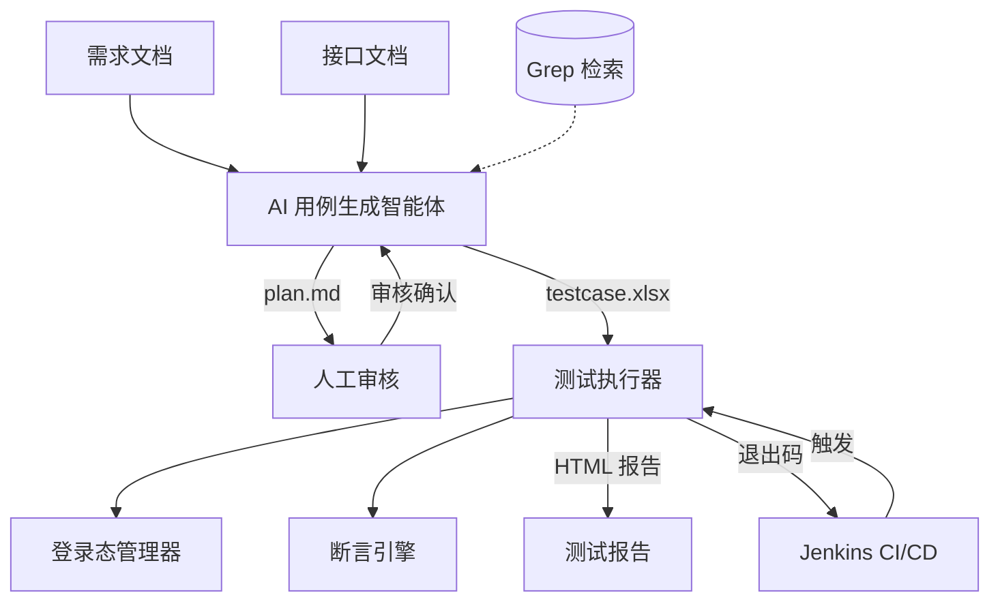

# Flow Forge — 接口自动化测试框架

[English](README.en.md) | **中文**

 


基于 AI 智能体的接口自动化测试框架。输入需求文档和接口文档，智能体自动生成测试用例 Excel；将 Excel 交给命令行执行器，即可得到测试报告。执行器可无缝集成 Jenkins，实现 CI/CD 流水线。

AI智能体可以实现快速的用例输出，但由于AI生成可能产生幻觉，建议人工审核输出的用例。为了更方便人工审核，测试用例和参数放在了同一个Excel内，详细规则见 [agent/README.md](./agent/README.md)。

## 版本说明

目前已完成最小主要链路的验证。提供需求文档、接口文档和用户描述给智能体。智能体可以给出测试计划。人工审核并通过测试计划之后即可生成单接口和业务链路接口测试用例。拒绝测试计划并提交修改意见后可以正确修改测试计划，审核通过后可以生成测试用例。智能体使用的LLM是deepseek-v4-flash。

智能体使用示例，详情见 [agent/README.md](./agent/README.md)。

```bash
python agent/main.py --requirement docs/req.md --api docs/api.yaml --output testcase.xlsx
```

执行器能够以单线程和多线程（并发执行多个用例，非压力测试）的方式执行测试用例。执行业务链路用例时，前面步骤的执行结果可以解析到当前步骤，实现测试数据的跨接口传递。断言引擎能够完成基本的“equals”。

执行器使用示例，详情见 [python/README.md](./python/README.md)。

```bash
python main.py --config /path/to/env.yml --scriptType APITest --envName local \
               --caseFilePath ./test_cases.xlsx --maxThread 5 --reportName MyReport \
               --apiMode all
```

## 后续计划

1. 继续验证其他方面的内容。
2. 优化Excel修改的交互体验，计划开发网页端。
3. 提升通用性，比如实现一个转换器，将Excel用例转为postman。

## 系统架构



整个框架由两个核心组件构成：

- **[agent/](./agent/)** — AI 用例生成智能体：读取需求文档 + 接口文档，经过"计划生成 → 人工审核 → 用例编排"两阶段流水线，输出符合执行器格式的 Excel 用例文件。
- **[python/](./python/)** — 接口测试执行器：读取 Excel 用例文件，自动管理登录态，多线程执行 HTTP 请求，运行断言，生成自包含 HTML 测试报告。

两个组件之间通过 **Excel 文件** 作为契约——智能体生成什么格式，执行器就解析什么格式。用户可以自由选择：用智能体自动生成用例，或手动编写 Excel 后直接用执行器运行。

## 项目基本结构

```text
flow-forge/
├── README.md                     # 项目总览（本文件）
├── agent/                        # AI 用例生成智能体
└── python/                       # 接口测试执行器
```

## 工作流程

### 方式一：AI 智能体生成 + 执行器运行（全流程）

```text
需求文档 + 接口文档
       │
       ▼
  AI 智能体生成测试计划（plan.md）
       │
       ▼
  人工审核、修改测试计划
       │
       ▼
  AI 智能体生成 Excel 用例（testcase.xlsx）
       │
       ▼
  人工审核 Excel（可选修改参数）
       │
       ▼
  执行器运行 testcase.xlsx
       │
       ▼
  查看 HTML 测试报告
```

### 方式二：手动编写 Excel + 执行器运行

```text
手动编写 Excel 用例（按执行器格式）
       │
       ▼
  执行器运行 testcase.xlsx
       │
       ▼
  查看 HTML 测试报告
```

## CI/CD 集成（Jenkins）

执行器是纯命令行工具，通过退出码反馈执行结果，可直接集成到 Jenkins 流水线中。

## 技术栈

|组件|技术|
|------|----|
|用例生成智能体|Python 3, OpenAI API, prance (OpenAPI 解析), pymupdf (PDF 解析)|
|测试执行器|Python 3, requests, openpyxl, pyyaml|
|配置管理|YAML 多环境配置文件|
|报告输出|自包含 HTML（无需外部 CSS/JS）|
|CI/CD|Jenkins Pipeline, 命令行退出码|

## 设计理念

- **Excel 即契约**：智能体和执行器之间通过 Excel 文件解耦，用户可自由选择生成方式
- **人工审核节点**：AI 生成的测试计划需要人工确认后才生成最终用例，确保质量可控
- **命令行驱动**：执行器纯 CLI 设计，无 GUI 依赖，适配 CI/CD 环境
- **自包含报告**：HTML 报告内嵌所有样式和脚本，可直接在浏览器打开，无需 Web 服务器
