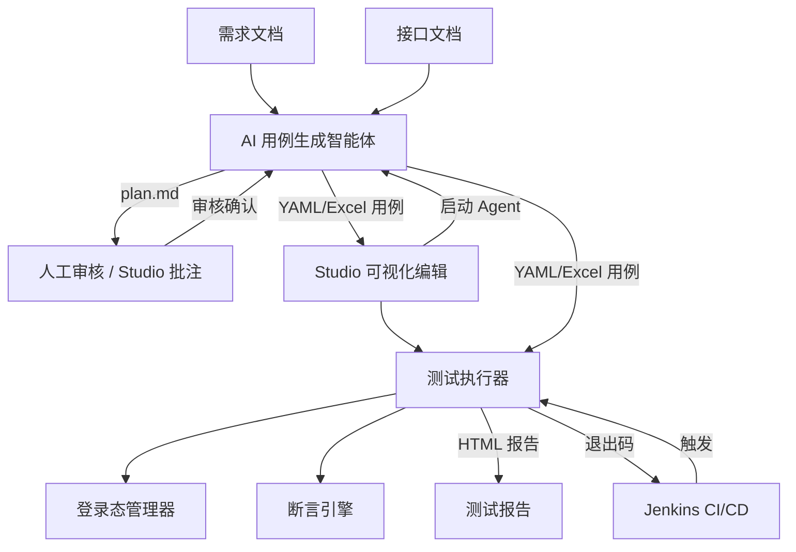

# Flow Forge — 接口自动化测试框架

**中文** | [English](README.en.md)


**输入需求文档和接口文档，AI 智能体自动生成测试用例，命令行执行器一键运行并产出测试报告。** 从需求到报告的接口自动化测试全链路，用例以 YAML/Excel 存储、便于 Git 管理和人工审核，执行器可无缝集成 Jenkins CI/CD。

## 它能做什么

- **AI 生成用例**：读需求文档（Markdown/PDF/文本）+ 接口文档（OpenAPI/Markdown），自动生成单接口和业务链路测试用例。
- **人工审核可控**：AI 产出的测试计划先经人工确认（支持在 Studio 中可视化批注），再生成用例，抑制 AI 幻觉。
- **可视化编辑**：Studio 桌面应用批量编辑 Excel/YAML 用例，图形化编辑 JSON 字段和断言规则。
- **多线程执行**：执行器并发运行用例，自动管理登录态，支持跨接口参数传递（token 等），两级断言引擎。
- **自包含报告**：产出内嵌样式脚本的 HTML 报告，浏览器直接打开；通过退出码集成 Jenkins。
- **格式灵活**：YAML/Excel 双向转换，还可生成零依赖的独立 pytest 代码。



## 推荐使用方式：Flow Forge Studio（GUI）

**Studio 桌面应用覆盖全部 6 大功能，一站式完成所有操作，无需记忆 CLI 参数。**

### 工作流：生成 → 编辑 → 执行与转换

```text
① 用例生成                ② 用例编辑                ③ 执行与转换
┌──────────────┐      ┌──────────────┐      ┌──────────────┐
│  AI 用例生成  │ ───▶ │  Excel 编辑器 │ ───▶ │  用例执行器   │
│  计划批注     │      │  YAML 编辑器  │      │  用例转换器   │
└──────────────┘      └──────────────┘      └──────────────┘
```

### 🏆 最推荐的工作方式

**先用 Excel 批量编辑，再转 YAML 做版本控制。** 这是兼顾效率与可追溯性的最佳实践：

1. **AI 生成 Excel**：在 Studio 的「AI 用例生成」中配置需求文档和接口文档，启动智能体生成测试用例。生成前可在计划批注器中审核测试计划、添加批注。
2. **Excel 批量编辑**：用 Excel 编辑器快速浏览、排序、批量修改 Tag/参数/断言。Excel 的表格化界面最适合大批量编辑。
3. **转 YAML 做 git diff**：用转换器将 Excel 转为 YAML（每个用例一个文件），逐文件提交 Git。代码评审时变更一目了然，轻松追溯每次修改。
4. **执行器运行**：在用例执行器中运行 YAML（或直接运行 Excel），生成 HTML 测试报告。

> **💡 为什么推荐 Excel → YAML？** Excel 适合批量编辑，YAML 适合做 diff。两者各取所长：编辑时用 Excel，提交时用 YAML。需要独立测试时用 `yaml2pytest` / `excel2pytest` 生成零依赖 pytest 代码。

### 🤖 调试完毕后的自动模式

当 Skill（业务规则）、插件配置调试完毕后，可在 CLI 下使用 `--auto` 跳过人工审核，适合夜间批量生成或 CI/CD 集成：

```bash
cd agent
python main.py --requirement docs/req.md --api docs/api.yaml --auto
```

### 💻 纯命令行方式（SSH / CI/CD）

如果偏好命令行或在服务器上操作，也支持全流程 CLI：

```bash
cd agent
python main.py --requirement docs/req.md --api docs/api.yaml  # AI 生成 + 人工审核
cd ../python
python main.py --yamlDir ../agent/output --envName local       # 执行器运行
```

> **编辑器内快捷执行**：在 Excel / YAML 编辑器中，右上角工具栏提供 `▶ 运行` 和 `⟳ 转换` 按钮，可直接对当前文件执行或转换，无需跳转到执行器/转换器视图，方便单文件调试。

### Studio 安装

<!-- RELEASE_MSI -->
> 🚧 **MSI 安装包即将推出**：安装包将在 [GitHub Releases](https://github.com/your-org/flow-forge/releases) 发布，敬请关注。
<!-- /RELEASE_MSI -->

当前可通过源码构建：

```bash
cd studio
npm install
npm run dev          # 开发模式
# 或
npm run build        # 生产构建 → src-tauri/target/release/
```

### 平台兼容性说明

**Flow Forge Studio 仅支持 Windows 平台。** Studio 的进程管理依赖 Windows Job Object 机制（`KILL_ON_JOB_CLOSE`）来保证子进程自动终止，这是 Windows 内核提供的功能，其他平台无等价替代。

- **Windows**：✅ 唯一支持平台。子进程自动终止（Job Object）、日志实时输出、进程树强制清理等全部功能完整可用。
- **Linux / macOS**：❌ 不支持。Studio 无法编译为 Linux/macOS 可执行文件，也不应在这些平台上运行。

> **非 Windows 用户请直接使用 [CLI 命令行](python/README.md) 执行 agent / executor / converter 任务。** 命令行工具是跨平台的，在 Windows、Linux、macOS 上均可正常运行。

### Studio 六大功能入口

| 入口 | 说明 |
| ------ | ------ |
| **AI 用例生成** | 配置并运行 AI 智能体，从需求文档和接口文档自动生成测试用例，支持实时日志和计划审核 |
| **计划批注器** | 在渲染后的测试计划上直接添加批注，批注可被 AI 识别用于计划修改 |
| **Excel 编辑器** | 表格化批量编辑 .xlsx 用例文件，支持接口定义、单接口用例、业务链路三个 Sheet |
| **YAML 编辑器** | 基于表单的结构化编辑，树形目录浏览，每用例一个文件，便于 git diff |
| **用例执行器** | 运行测试用例，生成 HTML 报告，支持多环境切换和多线程执行 |
| **用例转换器** | Excel ↔ YAML 互转 + 导出 pytest，支持批量转换 |

## 三大子项目

| 子项目 | 作用 | 快速进入 |
| -------- | ------ | ---------- |
| **[studio/](./studio/README.md)** | Flow Forge Studio 桌面应用：可视化编辑用例、计划批注、GUI 启动智能体/执行器/转换器 | [文档 →](./studio/README.md) |
| **[agent/](./agent/README.md)** | AI 用例生成智能体：需求 + 接口文档 → 测试计划（人工审核）→ YAML/Excel 用例 | [文档 →](./agent/README.md) |
| **[python/](./python/README.md)** | 接口测试执行器 + 格式转换器：运行 YAML/Excel 用例 → HTML 报告；Excel↔YAML 互转、导出 pytest | [文档 →](./python/README.md) |

三者通过 **YAML 文件**作为主要契约（Excel 仍兼容）——智能体生成什么格式，执行器就解析什么格式。用户可自由选择：AI 自动生成、手动编写、或 Studio 可视化编辑。

`shared/` 目录存放跨语言共享的 schema（列定义、字段映射、运算符等），保证 agent / python / studio 三端的字段定义一致。

## CI/CD 集成（Jenkins）

执行器是纯命令行工具，通过退出码反馈执行结果（`0`=全通过，`1`=有失败，`2`=配置/解析错误），可直接集成到 Jenkins 流水线。

## 反幻觉与质量控制

AI 难免幻觉，Flow Forge 通过多重机制控制质量：

- **人工审核节点**：测试计划需人工确认后才生成用例。
- **URL 纠错与数量校验**：接口 URL 与文档原文比对纠错，LLM 输出条目数自动校验重试（详见 [agent 反幻觉文档](./agent/docs/anti-hallucination.md)）。
- **纯文本限制**：仅处理可提取文本，二进制/扫描件明确报错，不静默产出空结果。

## 设计理念

- **YAML/Excel 即契约**：智能体与执行器解耦，用户自由选择生成方式。
- **人工审核**：AI 计划经人工确认后才生成用例，质量可控。
- **CLI 与 GUI 双模式**：Studio 桌面应用提供可视化操作，命令行保留用于 CI/CD。
- **自包含报告**：HTML 报告内嵌样式脚本，无需 Web 服务器。
- **可扩展处理器/插件**：用户可以自定义用例生成。执行用例可以应用自定义签名和插入时间戳等。

## 插件与扩展机制

| 模块 | 扩展点 | 说明 |
| ------ | -------- | ------ |
| [`python/processors/`](./python/docs/processors-and-report.md#前置处理器--后置处理器) | PreProcessor / PostProcessor | 请求前后的处理逻辑（HMAC 签名、SQL 清理、路径参数等） |
| [`agent/plugins/`](./agent/docs/plugins-and-skills.md) | CaseAttributeGenerator | 用例生成后自动补充属性（数据填充、断言生成等） |
| `studio/` | Agent Runner | 在 Studio 中配置并启动 AI 智能体，实时查看日志，交互式处理提问和计划审核 |
| `studio/` | Editor Toolbar | 在编辑器中直接执行或转换用例，方便单文件调试 |
| `studio/` | PreProcessors / PostProcessors 字段 | 在编辑器中可视化编辑、校验处理器配置 |

## 运行测试

```bash
# agent/ 测试（LLM 调用均已 mock，无 API 费用）
cd agent && python -m pytest tests/ -v

# python/ 测试
cd python && python -m pytest tests/ -v
```

## 技术栈

| 组件 | 技术 |
| ------ | ------ |
| Studio 桌面应用 | Vue 3, Ant Design Vue, Vite, Tauri 2, TypeScript |
| 用例生成智能体 | Python 3.12, LangGraph, OpenAI 兼容 API, prance (OpenAPI), pymupdf (PDF), 上下文压缩 |
| 用例执行器以及转换器 | Python 3.12, requests, openpyxl, pyyaml |
| 配置管理 | YAML 多环境配置文件 |
| 报告输出 | 自包含 HTML（无需外部 CSS/JS） |
| CI/CD | Jenkins Pipeline, 命令行退出码 |
