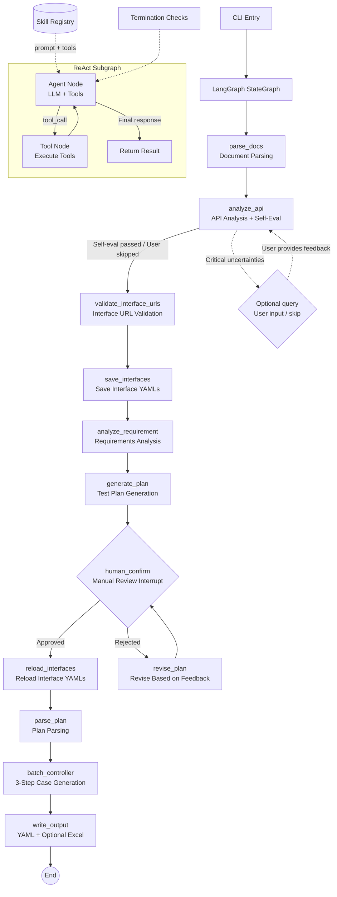

# Flow Forge — API Test Case Generation Agent

**English** | [中文](README.md)

A multi-agent system based on LangGraph + ReAct pattern that transforms requirement documents and API documentation into YAML test cases (with optional Excel export) compatible with the executor. Supports both simple assertions (`assert_dict`) and advanced multi-operator assertion rules (`assert_rules`), covering equality checks, numeric comparisons, regex matching, list aggregation, and more.

## System Architecture



Core workflow:

1. **Document Parsing**: Read requirement documents (Markdown / PDF / plain text) and API documentation (OpenAPI 3.0 / Markdown tables). Supports token-aware long text processing — input exceeding the context window (`LLM_CONTEXT_WINDOW`) is automatically chunked to stay within LLM limits

2. **API Analysis**: Analyze API documentation completeness — authentication methods, parameter patterns, missing information. Agent self-evaluates; auto-passes when quality is good, only asks user for critical uncertainties

3. **Interface URL Validation** (source-level): Validate each interface URL against the raw API documentation to ensure it actually exists in the source document. URLs failing validation trigger automatic correction retries. Only source-validated interfaces proceed downstream

4. **Save Interfaces**: Write validated interface definitions to `{output}/cases/interfaces/` directory, one YAML file per interface (with `case_type: interfaces`). Interface YAMLs are saved before test plan review — users can directly edit YAML files during the plan approval pause, and the system will reload edited interfaces after approval

5. **Requirements Analysis**: LLM extracts business flows, user roles, constraints, and exception scenarios from requirements

6. **Plan Generation**: Generate a Markdown test plan based on analysis results and interface definitions, automatically saved to the session directory

7. **Manual Review** (Mandatory interrupt): Display the plan; user can approve, provide text revision feedback, or use annotation-based revision

8. **Feedback Loop**: When rejected, the system revises the plan based on feedback and resubmits for review, looping until approval. Multi-round conversations employ automatic context compression — when conversation history approaches `LLM_CONTEXT_COMPRESSION_THRESHOLD` of `LLM_CONTEXT_WINDOW`, older messages are compressed to stay within LLM context limits

9. **Reload Interfaces**: After plan approval, reload interface YAML files to pick up any edits the user made during review, ensuring downstream steps use the latest interface definitions

10. **Case Skeleton Generation**: SingleSkeletonGenerator produces all single-API case skeletons in one shot; BizSkeletonGenerator produces all business flow skeletons in one shot. Includes meaningful test_id/StepID, relevance_id, api_name, method, url, remark, sheet_name. URLs and relevance_ids are strictly sourced from interface definitions

11. **URL Validation & Correction**: Every skeleton URL is checked against the raw API documentation text. URLs not found are submitted back to the skeleton generator for correction (up to 3 retries by default, configurable via `URL_CORRECTION_MAX_RETRIES`). Exhausted cases receive the `<URL not exist>` marker, skip subsequent steps, and are written directly to YAML with a failure summary printed to the console

12. **Test Data Filling**: SingleDataFiller / BizDataFiller process cases in code-based batches (no LLM batch decisions). Fills request_head, request_body, status_code, and tag based on interface definitions. Business flows additionally fill Trans and `#{varName}` references. Request bodies use interface-defined data types — no free-form invention. Set `BATCH_SIZE=-1` to disable batching

13. **Assertion Generation**: SingleAssertionGenerator / BizAssertionGenerator process cases in code-based batches. Generates assert_dict (simple equality assertions) and assert_rules (advanced operator-based rules) from interface response structures and test scenarios. Business flows additionally handle cross-step data dependency assertions (e.g., is_not_null on fields consumed by later steps)

14. **Validation** (Optional): CaseValidator checks each batch's format; errors trigger automatic retries (up to 3 times), with a final failure report

15. **Output**: YAML files (`single_cases/`, `biz_flows/`) + optional Excel export

Each step provides detailed progress output in the CLI, including: current step [N/9], file path and size, LLM model name, and generation statistics. Users always know what the system is doing.

## Custom Case-Attribute Generator Plugins

### Overview

After assertion generation is complete, users can enrich test cases with arbitrary attributes (such as `preprocessors`, `postprocessors`, etc.) via custom plugins. Plugins run as agent-based components, leveraging LLMs to analyze case content and automatically generate the corresponding configurations.

Four common plugin types:

- Single-API pre-processor agent
- Single-API post-processor agent
- Business flow pre-processor agent
- Business flow post-processor agent

### Configuration

Enable plugins and specify module paths in the `.env` file:

```
ENABLE_PLUGINS=true
# Comma-separated module paths, executed in order
PLUGIN_MODULES=my_plugins.single_pre_processor.SinglePreProcessor,my_plugins.biz_post_processor.BizPostProcessor
```

### Writing a Plugin

1. Inherit from the `CaseAttributeGenerator` base class (`plugins/base.py`)
2. Declare a `PluginDeclaration` (plugin name, target attributes, scope, etc.)
3. Implement the `generate()` method (receives a batch of completed cases, returns the enriched case list)

```python
from plugins.base import CaseAttributeGenerator, PluginDeclaration

class SinglePreProcessor(CaseAttributeGenerator):
    @property
    def declaration(self):
        return PluginDeclaration(
            plugin_name="single-pre-processor",
            attributes=["preprocessors"],
            applies_to_single=True,
            applies_to_biz=False,
            max_retries=1,
            error_strategy="skip",
        )

    def generate(self, cases, interfaces, api_summary, api_doc_text):
        # Use LLM to analyze each case and generate preprocessors
        for case in cases:
            case["preprocessors"] = [...]  # Generated by LLM
        return cases
```

### PluginDeclaration Fields

| Field | Type | Description |
|-------|------|-------------|
| `plugin_name` | str | Plugin name |
| `attributes` | List[str] | List of attribute names to add, e.g. `["preprocessors"]` |
| `applies_to_single` | bool | Whether the plugin applies to single-API cases |
| `applies_to_biz` | bool | Whether the plugin applies to business flow cases |
| `max_retries` | int | Max retries per batch on failure |
| `error_strategy` | str | Failure strategy: `"skip"` to skip / `"warn"` to warn / `"fail"` to abort |

## Technology Stack

| Dependency | Purpose |
|------------|---------|
| `langgraph` | StateGraph workflow orchestration, interrupts, checkpoints |
| `langchain-core` | ChatModel abstraction, message types |
| `langchain-openai` | OpenAI ChatModel adapter |
| `openai` | Direct LLM calls (OpenAI API compatible) |
| `openpyxl` | Excel file writing |
| `prance` | OpenAPI 3.0 spec parsing |
| `pymupdf` | PDF requirement document text extraction |
| `pyyaml` | YAML configuration and Skill definition parsing |
| `python-dotenv` | `.env` environment variable loading |

## Directory Structure

```text
agent/
├── main.py                      # CLI entry point
├── requirements.txt             # Python dependencies
├── .env.example                 # Environment variable template
│
├── config/
│   ├── __init__.py
│   ├── settings.py              # Config loading (.env → Settings dataclass)
│   └── prompts.yaml             # All agent prompts and ReAct termination conditions
│
├── models/
│   ├── __init__.py
│   ├── schema.py                # Data models (InterfaceDef, TestPlan, BizFlow, etc.)
│   └── state.py                 # AgentConfig + ReActTerminationConfig
│
├── llm/
│   ├── __init__.py
│   └── factory.py               # LLM provider factory (OpenAI / extensible)
│
├── prompts/
│   ├── __init__.py
│   ├── render.py                # {{variable}} template variable substitution
│   └── registry.py              # PromptRegistry: load prompts from YAML
│
├── tools/
│   ├── __init__.py
│   ├── base.py                  # BaseTool dataclass
│   ├── registry.py              # ToolRegistry: decorator registration + auto-discovery
│   ├── builtin/                 # Built-in tools
│   │   ├── __init__.py          # read_file, write_file, query_knowledge
│   │   ├── file_ops.py
│   │   └── rag_tool.py
│   └── custom/                  # User-defined tools directory
│       └── __init__.py
│
├── skills/
│   ├── __init__.py
│   ├── base.py                  # Skill dataclass
│   ├── registry.py              # SkillRegistry: load, query, inject
│   ├── builtin/                 # Built-in skills (YAML definitions)
│   │   ├── sql_data_fetch.yaml  # SQL data fetch skill
│   │   └── boundary_test.yaml   # Boundary value testing skill
│   └── custom/                  # User-defined skills directory
│       └── .gitkeep
│
├── plugins/
│   ├── __init__.py
│   ├── base.py                  # CaseAttributeGenerator base class + PluginDeclaration
│   ├── loader.py                # Plugin discovery and loader
│   └── builtin/                 # Built-in plugin directory
│
├── agents/
│   ├── __init__.py
│   ├── base.py                  # BaseAgent + create_react_agent() factory
│   ├── requirement_analyzer.py  # Requirements analysis
│   ├── api_analyzer.py          # API analysis
│   ├── plan_generator.py        # Plan generation
│   ├── plan_parser.py           # Plan parsing
│   ├── case_generator.py        # Case generation (legacy, kept for compatibility)
│   ├── skeleton_generator.py    # Case skeleton generation (single + biz)
│   ├── data_filler.py           # Test data filling (single + biz)
│   ├── assertion_generator.py   # Assertion generation (single + biz)
│   └── excel_writer.py          # Excel output
│
├── graph/
│   ├── __init__.py
│   ├── state.py                 # GraphState TypedDict (global state)
│   ├── workflow.py              # build_workflow() main StateGraph
│   └── nodes.py                 # All node functions + conditional routing
│
├── knowledge/
│   ├── __init__.py
│   ├── search.py                # grep-based text search knowledge base (zero dependencies)
│   ├── auth_token_convention.md # Token passing conventions
│   ├── crud_resource_referencing.md
│   ├── trans_format.md
│   ├── pagination_rules.md
│   ├── monetary_precision.md
│   ├── datetime_format.md
│   ├── test_strategy.md
│   └── trans_specification.md
│
├── doc_parser/
│   ├── __init__.py
│   ├── openapi_parser.py        # OpenAPI 3.0 parser
│   ├── markdown_parser.py       # Markdown table parser
│   ├── pdf_parser.py            # PDF text extractor
│   ├── llm_parser.py            # LLM interface extractor (--parse-mode llm)
│   ├── text_extractor.py        # Multi-format text extraction (DOCX/DOC/HTML)
│
├── utils/
│   ├── __init__.py
│   └── session_logger.py        # SessionLogger: session directory + structured event log
│
├── logs/                        # Runtime logs (auto-generated)
│   └── 2026-06-03_22-30-00/     # Timestamped session directory
│       ├── session.jsonl        # Event summary log (nodes, LLM calls, file ops)
│       ├── debug.log            # Debug log (full LLM I/O, only with --debug)
│       ├── plan.md              # Generated test plan
│       ├── state.json           # Final GraphState snapshot
│       └── excel_result.xlsx    # Output Excel copy
│
├── <output>/                    # Output directory (e.g. ./output_20260619_143052)
│   ├── cases/                   # Test case artifacts
│   │   ├── interfaces/          # Interface definition YAMLs (case_type: interfaces)
│   │   ├── single_cases/        # Single API test case YAMLs
│   │   ├── biz_flows/           # Business flow case YAMLs
│   │   ├── failures.yaml        # Validation failures
│   │   └── test_cases.xlsx      # Excel output (optional)
│   └── memory/                  # Agent output files (conversation memory)
│       ├── plan.md              # Generated test plan
│       ├── plan_comments.json   # Annotations (during review)
│       ├── history-comments/    # Archived annotations
│       └── snapshots/           # Intermediate pipeline state snapshots
│           ├── api_summary.json          # [always] API analysis summary
│           ├── requirement_analysis.json # [always] Requirement analysis
│           ├── plan_parsed.json          # [always] Structured test plan
│           ├── interfaces.json           # [--debug-snapshots]
│           └── extracted_texts.json      # [--debug-snapshots]
│
└── docs/
    ├── req.md                   # Example requirement document
    └── api.yaml                 # Example OpenAPI document
```

## Installation

```bash
cd agent
pip install -r requirements.txt
cp .env.example .env
# Edit .env to add your LLM API Key
```

## Quick Start

### 1. Full Pipeline (with Interactive Review)

```bash
python main.py --requirement docs/req.md --api docs/api.yaml
```

**Parse Mode Overview:**

| Mode | Argument | Behavior | Use Case |
|------|----------|----------|----------|
| raw (default) | `-m raw` | Read API doc as raw text; ApiAnalyzer LLM identifies interfaces from the text | Non-standard but somewhat structured docs, handwritten docs, DOCX/PDF |
| rule | `-m rule` | Use built-in rule-based parsers (OpenAPI/Markdown) or a custom parser via `--parser-path` | Standard OpenAPI 3.0 / Markdown tables |
| llm | `-m llm` | Use LLM to pre-extract structured interface definitions at the parse_docs stage | Non-standard docs containing API info, weakly structured or with weaker models |

Inject user guidance with `--prompt`:

```bash
python main.py --requirement docs/req.md --api docs/api.yaml \
    --prompt "Focus on VIP user discount logic and holiday special pricing"
```

Parse non-standard API docs with `--parse-mode llm`:

```bash
python main.py --requirement docs/req.md --api docs/handwritten_api.md \
    -m llm
```

Use a custom parser:

```bash
python main.py --requirement docs/req.md --api docs/my_api.json \
    -m rule --parser-path custom/my_parser.py
```

Enable debug mode (full LLM input/output written to session directory):

```bash
python main.py --requirement docs/req.md --api docs/api.yaml --debug
```

The system pauses after generating the plan, waiting for user review:

- Type `y` — approve the plan, continue to case generation
- Type `n` — enter text revision feedback; the system revises the plan based on your feedback and resubmits for review
- Type `r` — annotation-based revision. First add annotations to plan.md in case-editor, then the system reads plan_comments.json to apply revisions
- The review loop continues until the user approves

### 3. Using Multiple Requirement Documents

```bash
python main.py --requirement docs/req1.md docs/req2.txt docs/api_spec.pdf --api docs/api.yaml
```

## Input/Output Formats

### Input

**Requirement Documents**: Supports Markdown (`.md`), plain text (`.txt`), PDF (`.pdf`).

**API Documentation**: Prefer OpenAPI 3.0 format; also compatible with Markdown table format.

OpenAPI example:

```yaml
openapi: 3.0.0
info:
  title: E-Commerce Platform API
  version: 1.0.0
servers:
  - url: https://api.example.com
paths:
  /api/user/login:
    post:
      summary: User Login
      tags: [User Module]
      requestBody:
        content:
          application/json:
            schema:
              type: object
              properties:
                username:
                  type: string
                password:
                  type: string
      responses:
        '200':
          description: Login successful
```

Markdown table example:

| TestID | APIName | AppName | Method | URL |
|--------|---------|---------|--------|-----|
| api_login_post | User Login | someApp | POST | /api/user/login |

### Output

**Test Plan**: Markdown document, automatically saved to `logs/YYYY-MM-DD_HH-MM-SS/plan.md`, including business understanding, single-API test points, business flow tests, and Mermaid diagrams.

**Session Log**: Each run creates a timestamped directory under `logs/` containing `session.jsonl` (event stream), `state.json` (final state snapshot), and a copy of the output Excel. Use `--debug` to additionally generate `debug.log` (full LLM I/O).

**YAML Case Files** (default): Each interface/case is a separate `.yaml` file stored in `{output}/cases/interfaces/` (`case_type: interfaces`), `{output}/cases/single_cases/` (`case_type: single`), `{output}/cases/biz_flows/` (`case_type: biz`) directories. Enables Git version control, incremental generation, and resumable generation.

**Excel Case File** (optional): Set `OUTPUT_FORMAT=excel` or `both` to convert from YAML. Multi-sheet structure, fully compatible with executor format:
- Sheet 1 — API Definitions: interface definition table
- Sheet 2 — Single Cases: single-API test cases
- Sheet 3+ — Business Flow Cases (one sheet per business flow)

## Configuration

### .env Environment Variables

| Variable | Description | Default |
|----------|-------------|---------|
| `LLM_PROVIDER` | LLM service provider | `openai` |
| `LLM_API_KEY` | API key | Required |
| `LLM_BASE_URL` | Base URL | Not required, defaults to OpenAI endpoint |
| `LLM_MODEL` | Model name | `gpt-4o` |
| `LLM_TEMPERATURE` | Generation temperature (0-1) | `0.3` |
| `LLM_MAX_TOKENS` | Max output tokens (superseded by `LLM_MAX_OUTPUT_TOKENS`; still supported as fallback) | `4096` |
| `LLM_MAX_OUTPUT_TOKENS` | Max output tokens per LLM call. Replaces `LLM_MAX_TOKENS` (still supported as fallback) | `128000` |
| `ENABLE_KNOWLEDGE` | Enable external knowledge base (grep text search) | `false` |
| `KNOWLEDGE_DIR` | Knowledge base .md file directory | `./knowledge` |
| `LLM_DOC_MAX_CHARS` | Max characters sent to LLM during API doc parsing | `30000` (set 2000 for 8K models, 100000+ for 1M models) |
| `LLM_CONTEXT_WINDOW` | LLM context window size in tokens. Used to determine when to split long text or compress conversation history | `128000` |
| `LLM_CONTEXT_COMPRESSION_THRESHOLD` | Threshold (0.0-1.0) at which context compression triggers. Adjust higher for reasoning models (0.95), lower for small-window models (0.8) | `0.9` |
| `MAX_STEPS` | Max steps per agent | `10` |
| `MAX_STEPS_NO_PROGRESS` | Max consecutive no-progress LLM calls (triggers ConvergenceError) | `5` |
| `MAX_RETRIES` | Max LLM call retries | `3` |
| `OUTPUT_DIR` | Output root directory (test case artifacts and agent conversation memory) | `./output` |
| `BATCH_SIZE` | Max cases per generation batch (`-1` for no batching) | `10` |
| `URL_CORRECTION_MAX_RETRIES` | Max URL correction retries after validation failure | `3` |
| `ENABLE_VALIDATION` | Enable case format validation | `true` |
| `MAX_VALIDATION_RETRIES` | Max validation retries | `3` |
| `OUTPUT_FORMAT` | Output format (`yaml` / `excel` / `both`) | `both` |

### Output Directory Structure

When `--output` specifies the root output directory, the structure is:

```
{output_dir}/
├── cases/                         # Test case artifacts
│   ├── interfaces/                # Interface definition YAMLs (yaml/both mode)
│   │   └── <test_id>.yaml
│   ├── single_cases/              # Single API test case YAMLs (yaml/both mode)
│   │   └── <test_id>.yaml
│   ├── biz_flows/                 # Business flow case YAMLs (yaml/both mode)
│   │   └── <sheet_name>.yaml
│   ├── failures.yaml              # Validation failures (if any)
│   └── test_cases.xlsx            # Excel output (excel/both mode)
│
└── memory/                        # Agent output files (conversation memory)
    ├── plan.md                    # Generated / approved test plan
    ├── plan_comments.json         # Annotation data (during review)
    ├── history-comments/          # Archived annotation history
    └── snapshots/                 # Intermediate pipeline state snapshots
        ├── api_summary.json           # [always] API analysis summary
        ├── requirement_analysis.json  # [always] Requirement analysis
        ├── plan_parsed.json           # [always] Structured test plan
        ├── interfaces.json            # [--debug-snapshots] Interface snapshot
        └── extracted_texts.json       # [--debug-snapshots] Raw extracted texts
```

Basic snapshots (3, always saved) support LLM output quality debugging and resumable generation. Debug snapshots (2) are enabled via `--debug-snapshots` and are only needed when troubleshooting.

### config/prompts.yaml — Prompts & Termination Conditions

All agent system prompts, user templates, and ReAct termination conditions are centrally managed in `config/prompts.yaml`. Each agent can independently configure termination parameters:

```yaml
requirement_analyzer:
  system: |
    You are a professional test requirements analysis expert...
  user_template: |
    Please analyze the following requirement document...
  termination:
    max_iterations: 8
    max_time_seconds: 90

case_generator:
  system: |
    You are a professional test case orchestration expert...
  termination:
    max_iterations: 15
    max_time_seconds: 300
```

Agents without configured `termination` use global defaults.

## CLI Arguments

```
usage: main.py [-h] [--requirement REQUIREMENT [REQUIREMENT ...]]
               [--api API] [--output OUTPUT] [--env ENV] [-v]

Flow Forge — API Test Case Generation Agent

optional arguments:
  --requirement REQUIREMENT [REQUIREMENT ...]
                        Requirement document path(s) (.txt, .md, .pdf)
  --api API             API documentation path (OpenAPI .yaml/.json or Markdown .md)
  --output OUTPUT       Output root directory (default: ./output_&lt;timestamp&gt;)
  --output-format {yaml,excel,both}
                        Output format (default: both)
  --batch-size BATCH_SIZE
                        Max cases per batch (default: 10)
  --prompt PROMPT, -p PROMPT
                        User guidance injected into plan and case generation
  --parse-mode {raw,rule,llm}, -m {raw,rule,llm}
                        API doc parse mode (default: raw)
                          raw  : Extract raw text; ApiAnalyzer LLM identifies interfaces
                          rule : Use rule-based parser (OpenAPI / Markdown)
                          llm  : Use LLM to pre-extract structured interface definitions
  --parser-path PATH    Path to custom parser .py file (only effective with -m rule)
  --reference-dir REFERENCE_DIR
                        Reference directory for incremental updates. The system scans
                        existing plans/interfaces/cases and only plans for new or
                        changed scenarios
  --resume              Resume batch generation from existing output_dir. Skips
                        document parsing and plan generation
  --env ENV             Path to .env file
  -v, --verbose         Verbose console logging
  --debug               Debug mode: write full LLM input/output to session directory
  --debug-snapshots     Save optional debug snapshots (interfaces.json + extracted_texts.json)
```

## Progress-Based Step Counting

### How It Works

Traditional step counting increments on every LLM call and terminates when a hard limit is reached. This is problematic for weaker models that may repeatedly produce malformed JSON — each instance is rejected by the validator, retried, and wastes step quota. An estimated `_max_steps` cannot predict how many steps will be wasted, ultimately still triggering `ConvergenceError`.

Progress-based mode changes the count logic from "total LLM calls" to "consecutive calls without progress":

- Before each LLM call, the system computes a progress string (e.g., `single-[20:200]` meaning 20 out of 200 interfaces generated)
- Progress string is the **same** as last time → `_step_count += 1` (no progress, accumulate)
- Progress string is **different** → `_step_count = 1` (progress made, reset counter)
- When `_step_count > MAX_STEPS_NO_PROGRESS` (default 5) → raises `ConvergenceError`

### Benefits

- **Steadily-progressing models are never falsely terminated**: The counter resets whenever new cases are produced
- **Weak models are caught quickly**: Terminates after 5 consecutive LLM calls with zero progress
- **Backward compatible**: Agents without progress tracking continue using traditional counting

### Configuration

Set via the `MAX_STEPS_NO_PROGRESS` environment variable in `.env` (default: 5).

## Resumable Generation & Incremental Updates

### Scenario A: Resumable Generation (`--resume`)

When the pipeline crashes or the user interrupts it mid-run, use `--resume` to pick up where it left off. The system skips document parsing and plan generation, jumping directly to batch generation using the existing interfaces and cases in `output_dir`.

```bash
# Resume after pipeline interruption
python main.py --resume --output ./output --api docs/api.yaml
```

Prerequisite: The `{output}/cases/interfaces/` directory must already contain interface YAML files.

### Scenario B: Incremental Updates (`--reference-dir`)

When requirements or API documentation change (new scenarios, modified fields), re-run the full pipeline with `--reference-dir` pointing to the previous output directory. The system will:

1. Scan the reference directory for `plan.md`, `interfaces/`, `single_cases/`, `biz_flows/`
2. Build a summary of existing test assets and inject it into the plan generation LLM prompt
3. The LLM only plans for new or changed interfaces/scenarios, marking unchanged parts as "already covered"
4. Batch generation only processes new interfaces, automatically skipping existing cases
5. Save `plan.md` to `output_dir`

```bash
# Incremental update to a different directory (recommended: keep old output, new output separate)
python main.py --requirement docs/req_v2.md --api docs/api_v2.yaml \
    --reference-dir ./output_v1 --output ./output_v2

# In-place incremental update (same directory; files get _v2/_v3 suffixes on conflict)
python main.py --requirement docs/req_v2.md --api docs/api_v2.yaml \
    --reference-dir ./output --output ./output
```

### File Name Conflicts

When `--reference-dir` and `--output` point to the same directory (in-place incremental update), existing YAML files are not overwritten. Newly generated case files get `_v2`, `_v3` suffixes automatically, letting you choose which version to keep.

## Custom Parsers

Users can write their own parsing scripts and load them via `--parser-path`. The parser must implement the following interface:

```python
# my_parser.py
from typing import List
from models.schema import InterfaceDef

def parse(file_path: str) -> List[InterfaceDef]:
    """Parse an API document and return a list of interface definitions."""
    ...
```

Usage:

```bash
python main.py --requirement docs/req.md --api docs/my_api.json \
    -m rule --parser-path custom/my_parser.py
```

## Session Logs

Each run creates a timestamped session directory under `logs/`:

```text
logs/2026-06-03_22-30-00/
├── session.jsonl      # Structured event log
├── plan.md            # Generated test plan
├── state.json         # Final GraphState snapshot
└── excel_result.xlsx  # Copy of output Excel
```

**session.jsonl** records all key events:

```json
{"timestamp": "...", "event": "node_start", "node": "analyze_api", "stage": "2/8"}
{"timestamp": "...", "event": "llm_call", "agent": "ApiAnalyzer", "model": "gpt-4o", "text_length": 12345}
{"timestamp": "...", "event": "node_end", "node": "analyze_api"}
```

When using `--debug`, an additional `debug.log` is generated, containing complete LLM system prompts, user prompts, response text, and tool call parameters/return values — helpful for troubleshooting.

## Agent System

The system includes 5 LLM-driven agents and 1 pure-logic component, each inheriting from `BaseAgent` with LLM calling, retry, and JSON parsing capabilities:

| Agent | Responsibility | Notes |
|-------|---------------|-------|
| `ApiAnalyzer` | API documentation analysis | Analyzes API completeness, authentication methods, generates structured summaries; self-evaluates quality, only asks user for critical missing info |
| `RequirementAnalyzer` | Requirements analysis | Extracts business flows, roles, constraints, exception scenarios from requirement docs (JSON output) |
| `PlanGenerator` | Plan generation | Generates Markdown test plan based on requirements analysis and interface definitions |
| `PlanParser` | Plan parsing | Parses approved Markdown plan into structured TestPlan |
| `SkeletonGenerator` | Skeleton generation | Includes SingleSkeletonGenerator (single API) and BizSkeletonGenerator (business flows). Generates all case skeletons in one shot with meaningful IDs; URLs strictly from interface definitions |
| `DataFiller` | Data filling | Includes SingleDataFiller (single API) and BizDataFiller (business flows + Trans). Fills request data in code-based batches using interface-defined data types |
| `AssertionGenerator` | Assertion generation | Includes SingleAssertionGenerator (single API) and BizAssertionGenerator (business flows + cross-step dependencies). Generates assert_dict and assert_rules from response structures |
| `CaseValidator` | Format validation | Validates case structure completeness; errors trigger automatic retries (up to 3 times), with a failure summary |
| `PlanAnnotationReviser` | Annotation-based revision | In the review feedback loop, revises the test plan line-by-line based on annotations in plan_comments.json |

## LangGraph Orchestration

The system uses LangGraph `StateGraph` to manage the pipeline. All state is automatically passed between nodes via the `GraphState` TypedDict.

### Pipeline Nodes

| Node | Function |
|------|----------|
| `parse_docs` | Read requirement files and API docs, store in state |
| `analyze_api` | Call ApiAnalyzer to analyze API documentation completeness, generate structured summaries; auto-pass when quality is good, optionally ask user for critical uncertainties |
| `validate_interface_urls` | Validate interface URLs against raw API documentation text; non-existent URLs trigger automatic correction retries |
| `save_interfaces` | Save validated interface definitions as YAML files to {output}/cases/interfaces/. Saved before plan review so users can edit YAMLs during the approval pause |
| `analyze_requirement` | Call RequirementAnalyzer, extract structured analysis results |
| `generate_plan` | Call PlanGenerator, generate Markdown test plan based on analysis results, API summaries, and interface definitions |
| `human_confirm` | **Mandatory interrupt**, pause execution for manual review |
| `revise_plan` | Revise plan based on user feedback, then return to human_confirm |
| `reload_interfaces` | Reload interface YAMLs after plan approval to pick up any user edits made during review |
| `parse_plan` | Call PlanParser, parse plan into structured data |
| `batch_controller` | Run the 3-step generation pipeline: skeleton generation (one-shot) → data filling (batched) → assertion generation (batched). Supports resumable generation |
| `write_output` | Output YAML + optional Excel based on output_format setting |

### Interrupts & Feedback Loops

The system includes two types of interrupts:

| Interrupt | Type | Trigger Condition | User Action |
|-----------|------|-------------------|-------------|
| `analyze_api` | **Optional** | Agent detects critical uncertainties (unable to infer auth method, API purpose completely unknown) | Provide feedback / type `skip` to bypass |
| `human_confirm` | **Mandatory** | Always triggered after test plan generation | `y` to approve / `n` for text feedback / `r` for annotation-based revision |

The `human_confirm` node uses LangGraph's `interrupt()` mechanism to pause execution. When the CLI detects an interrupt:

1. Display a plan summary
2. Ask the user: `y` (approve), `n` (reject and enter text revision feedback), or `r` (annotation-based revision)
3. Approve → continue with `Command(resume="approved")`, route to `parse_plan`
4. Reject → continue with `Command(resume="feedback text")`, route to `revise_plan` → return to `human_confirm` after revision
5. Annotation revision → system reads `plan_comments.json`, invokes the `plan_annotation_reviser` agent to revise the plan line-by-line per annotations, returns to `human_confirm` after revision, and archives the comments file to `history-comments/`
6. Loop until user approval

The `analyze_api` node uses an agent self-evaluation mechanism: after generating the summary, it automatically checks for critical uncertainties (`auth_type` uncertain, `need_token` undetermined, API purpose completely unknown). If summary quality is good, it auto-passes without interrupting the user; only critical gaps trigger a user query. Users can provide feedback or type `skip` to continue with the uncertainties.

Press `Ctrl+C` at any time to abort.

### plan_comments.json Format

When the user adds line-level annotations to `plan.md` in case-editor, case-editor generates a `plan_comments.json` file. When the `r` revision mode is selected, the system reads this file and hands it to the `plan_annotation_reviser` agent to revise the plan line-by-line per annotations. The file format is as follows:

```json
[
  {
    "line_number": 12,
    "selected_text": "Method: GET",
    "review_comment": "This should be a POST request"
  },
  {
    "line_number": 25,
    "selected_text": "Assertion: status code 200",
    "review_comment": "Not only assert 200, but also assert that the response body contains a token field"
  }
]
```

Field descriptions:
- `line_number`: The line number where the annotation was placed
- `selected_text`: The text content selected by the annotation
- `review_comment`: The reviewer's revision comment

After revision is complete, `plan_comments.json` is automatically archived to the `history-comments/` directory for historical traceability.

### Checkpoints

The `MemorySaver` checkpoint mechanism preserves the execution state of each node, enabling precise recovery after an interrupt. At the end of each run, the complete `GraphState` snapshot is written to `logs/<session>/state.json`.

## ReAct Termination Conditions

Each ReAct subgraph has four layers of termination protection to prevent infinite loops caused by weak models or vague requirements:

| Layer | Condition | Description |
|-------|-----------|-------------|
| Hard limits | `max_iterations` / `max_tool_calls_total` / `max_time_seconds` | Max loop count, total tool calls, runtime |
| Token budget | `max_input_tokens` | Cumulative input token limit to prevent token explosion |
| No-progress detection | `max_consecutive_same_tool` / `max_consecutive_no_result_change` | Consecutive identical tool calls or unchanging results |
| Quality threshold | `min_improvement_ratio` | Minimum improvement ratio required per iteration |

On termination, the system degrades gracefully rather than crashing: it requests the LLM to produce a final summary based on existing information, retries after history truncation, or returns partial results.

Threshold defaults for each layer can be overridden per agent in `config/prompts.yaml`.

## Skill System

Skills are YAML-defined "skill packages" that inject additional prompt instructions and tools into agents. Users can add new capabilities without modifying Python code.

### Built-in Skills

- **boundary_test**: Automatically generates boundary value test cases for numeric and string parameters (min ± 1, overly long strings, special character injection, etc.)
- **sql_data_fetch**: Queries real test data from a database to populate test cases (requires `execute_sql` tool)

### Skill Definition

```yaml
name: my_custom_skill
description: User-defined business testing skill
version: "1.0"
target_agents:
  - case_generator          # Target agents (empty = all)
prompt_extension: |
  ## Custom Analysis Capability
  When generating test cases, pay extra attention to the following business rules:
  - VIP user discount logic
  - Holiday special pricing
tools:
  - my_custom_tool          # Tools this skill depends on (auto-injected)
```

### Usage

Create `.yaml` files under `skills/custom/` — the `SkillRegistry` auto-scans and loads them. When creating an agent:

1. `build_system_prompt()` automatically concatenates the base prompt with all applicable skill `prompt_extension` blocks
2. `get_tool_names()` collects tool names declared by all skills and auto-injects them

## Tool System

Register tool functions using the `@ToolRegistry.register()` decorator:

```python
from tools.registry import ToolRegistry

@ToolRegistry.register(
    name="execute_sql",
    description="Execute SQL query and return results"
)
def execute_sql(connection_string: str, query: str) -> list[dict]:
    ...
```

Place tool files under `tools/builtin/` or `tools/custom/` — they are auto-discovered at startup via `ToolRegistry.auto_discover()`.

### Built-in Tools

| Tool | Description |
|------|-------------|
| `read_file` | Read file contents (requirement docs, API specs, saved plans) |
| `write_file` | Write content to file (save plans, intermediate results) |
| `grep_knowledge` | Search knowledge base .md files (best practices, test strategies, domain rules); only available when `ENABLE_KNOWLEDGE=true` |

## Knowledge Base

The knowledge base (`knowledge/search.py`) provides grep-based plain-text keyword search, requiring no embedding models or external vector databases. Knowledge is stored as `.md` files under the `knowledge/` directory.

Controlled by the `ENABLE_KNOWLEDGE` switch in `.env`:

- **`ENABLE_KNOWLEDGE=false` (default)**: Knowledge base is not loaded. Agents rely solely on their own knowledge, skill-injected prompts, and tools.
- **`ENABLE_KNOWLEDGE=true`**: Initializes a `KnowledgeSearch` instance. When generating prompts, agents search `.md` files via grep and append matching knowledge snippets to the prompt.

Knowledge entry types:

- **Business Rules**: Token passing conventions, CRUD data dependencies, etc.
- **Test Strategies**: Positive/negative/boundary/business exception testing methods
- **Parameter Dependency Patterns**: Trans field format, `#{varName}` variable reference syntax
- **Defect Patterns**: Monetary precision, date formatting, null handling, and other common issues

Users can extend the knowledge base by adding `.md` files to the `knowledge/` directory. The `grep_knowledge` tool is also registered for future ReAct agents to decide when to invoke it.

## Design Philosophy

### Why LangGraph

LangGraph provides three key capabilities:

- **State Management**: `GraphState` TypedDict automatically passes state between nodes — no manual state objects or long function parameter chains
- **Interrupt & Resume**: `interrupt()` + `MemorySaver` natively supports human-in-the-loop review interrupts with precise recovery from breakpoints
- **Conditional Routing**: `add_conditional_edges()` makes review branches (approve/reject) a natural part of the graph, keeping logic clear and maintainable

### Why grep Instead of Embedding Search

Embedding models (e.g., `text-embedding-3-small`) require additional API calls and costs, and search results may not be relevant to the current context. grep keyword search:

- **Zero cost**: No embedding API calls needed
- **Zero external dependencies**: Uses only Python stdlib (`pathlib` + `re`)
- **Interpretable**: Exact keyword matching — no semantic drift
- **Extensible**: Users add knowledge by simply creating `.md` files — no index rebuild needed

Additionally, `ENABLE_KNOWLEDGE` defaults to `false` so scenarios that don't need external knowledge (weak models, already covered by Skills) remain unaffected.

### Why ReAct Pattern

The ReAct (Reasoning + Acting) loop lets the LLM call tools to obtain external information while reasoning. In the test case generation context, this means the agent can:

- Search the knowledge base via the `grep_knowledge` tool for test strategy references
- Read API documentation for interface details
- Query databases for real test data

Rather than relying solely on what the model learned during training.

### Why Multi-Layer Termination

Different models have vastly different tool-calling capabilities. Weak models (e.g., 32B self-hosted models) or vague requirements can trigger tool-calling infinite loops. The four-layer termination system (Hard limits → Token budget → No-progress detection → Quality threshold) intercepts at each layer by priority. Termination doesn't crash — it degrades gracefully, ensuring system robustness.

### Why Pluggable Skills

Test scenarios vary enormously across projects — different projects need different testing strategies. By packaging prompt extensions and tools as Skill YAML files, users customize agent behavior by simply creating files — no need to read or modify agent source code. This lowers the customization barrier, and ensures built-in and custom capabilities use the exact same mechanism.
