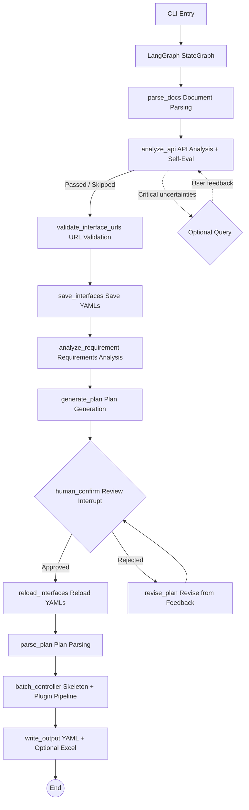

# Flow Forge — API Test Case Generation Agent

**English** | [中文](README.md)

A multi-agent system based on LangGraph pipeline pattern that transforms requirement documents and API documentation into YAML test cases (with optional Excel export) compatible with the executor. Supports both simple assertions (`assert_dict`) and advanced multi-operator assertion rules (`assert_rules`), covering equality checks, numeric comparisons, regex matching, list aggregation, and more.

## System Architecture



Core workflow (9 steps):

1. **Document Parsing**: Read requirement documents (Markdown / PDF / plain text) and API documentation (OpenAPI 3.0 / Markdown tables), with token-aware chunking for long texts

2. **API Analysis**: Analyze API documentation completeness — auth methods, parameter patterns, missing info. Auto-passes when quality is good, only asks user for critical uncertainties

3. **Interface URL Validation** (source-level): Verify each interface URL exists in the source document; URLs failing validation trigger automatic LLM correction retries

4. **Save Interfaces**: Write validated interfaces to YAML files. Users can edit these files during the plan review phase; edits are picked up after approval

5. **Requirements Analysis**: LLM extracts business flows, user roles, constraints, and exception scenarios

6. **Plan Generation**: Generate a Markdown test plan from analysis results and interface definitions

7. **Manual Review** (Mandatory interrupt): Display the plan; user can approve, provide text feedback, or use annotation-based revision. Feedback loop until approval

8. **Case Generation** (skeleton + plugin pipeline):
   - Skeleton generation: One-shot generation of all single/biz case skeletons (test_id, relevance_id, URL metadata)
   - URL validation: Check all skeleton URLs against source document; submit mis-matching URLs for correction
   - Plugin execution: Run plugins in the order configured in PLUGIN_MODULES (e.g. data filling, assertion generation)

9. **Output**: YAML files (`single_cases/`, `biz_flows/`) + optional Excel export

### Recommended Workflow: Excel for Editing + YAML for Version Control

- **Excel for batch editing**: Open in Flow Forge Studio to quickly browse, sort, and batch-modify cases
- **YAML for diffing**: Convert Excel to YAML with the converter; git diff shows every change
- **Converter is independently usable**: `python converter_main.py` converts between Excel and YAML at any time

## Plugin System

Flow Forge uses a plugin system to enrich test case skeletons with additional attributes after generation. All plugins are configured via `PLUGIN_MODULES` in `.env`:

```ini
ENABLE_PLUGINS=true
PLUGIN_MODULES=plugins.official.data_filling.DataFillingPlugin,plugins.official.assertion_generation.AssertionGenerationPlugin
```

### Official Plugins

| Plugin | Purpose | Attributes |
|--------|---------|------------|
| `data_filling` | Fill request data into skeletons (request_head, request_body, status_code, tag) | Single + Biz |
| `assertion_generation` | Generate assertions for filled cases (assert_dict, assert_rules) | Single + Biz |

Users may remove unwanted plugins from `PLUGIN_MODULES` or replace them with custom implementations.

### Writing a Custom Plugin

1. Subclass `CaseAttributeGenerator` (`plugins/base.py`)
2. Declare `PluginDeclaration` (name, attributes, scope, etc.)
3. Implement `generate()` (receives a batch of cases, returns enriched cases)

```python
from plugins.base import CaseAttributeGenerator, PluginDeclaration

class CustomPlugin(CaseAttributeGenerator):
    @property
    def declaration(self):
        return PluginDeclaration(
            plugin_name="my-custom-plugin",
            attributes=["preprocessors"],
            applies_to_single=True,
            applies_to_biz=False,
            max_retries=1,
            error_strategy="skip",
        )

    def generate(self, cases, interfaces, api_summary, api_doc_text):
        for case in cases:
            case["preprocessors"] = [...]
        return cases
```

Then add the plugin path to `PLUGIN_MODULES`.

### PluginDeclaration Fields

| Field | Type | Description |
|-------|------|-------------|
| `plugin_name` | str | Plugin name |
| `attributes` | List[str] | Attribute names to add |
| `applies_to_single` | bool | Apply to single-API cases |
| `applies_to_biz` | bool | Apply to business flow cases |
| `max_retries` | int | Retries per batch |
| `error_strategy` | str | Failure strategy: `"skip"` / `"warn"` / `"fail"` |

## Tech Stack

| Dependency | Purpose |
|------------|---------|
| `langgraph` | StateGraph workflow orchestration, interrupts, checkpoints |
| `langchain-core` | ChatModel abstraction, message types |
| `langchain-openai` | OpenAI ChatModel adapter |
| `openai` | Direct LLM calls (OpenAI-compatible API) |
| `openpyxl` | Excel file writing |
| `prance` | OpenAPI 3.0 spec parsing |
| `pymupdf` | PDF text extraction |
| `pyyaml` | YAML config and skill parsing |
| `python-dotenv` | `.env` environment variable loading |

## Directory Structure

```text
agent/
├── main.py                      # CLI entry (thin wrapper, logic in cli/)
├── requirements.txt             # Python dependencies
├── .env.example.cn              # Environment variable template (Chinese)
├── .env.example.en              # Environment variable template (English)
│
├── cli/
│   ├── parser.py                # CLI argument parsing
│   ├── interactive.py           # Interactive review loop
│   ├── bootstrap.py             # Logging setup + directory structure
│   └── runner.py                # Main pipeline orchestration
│
├── config/
│   └── settings.py              # .env → Settings dataclass
│
├── i18n/
│   ├── loader.py                # Load translations by AGENT_LANG
│   ├── zh_CN.json               # Chinese translations (default)
│   └── en_US.json               # English translations
│
├── models/
│   ├── schema.py                # Data models (InterfaceDef, TestPlan, etc.)
│   └── state.py                 # AgentConfig
│
├── llm/
│   └── factory.py               # LLM provider factory
│
├── prompts/
│   ├── __init__.py              # Unified prompt exports
│   ├── render.py                # {{variable}} template substitution
│   ├── registry.py              # PromptRegistry — Python module loader
│   └── *.py                     # One module per agent (SYSTEM + USER constants)
│
├── tools/
│   ├── registry.py              # ToolRegistry
│   ├── builtin/                 # Built-in tools
│   └── custom/                  # User custom tools
│
├── skills/
│   ├── registry.py              # SkillRegistry
│   ├── builtin/                 # Built-in skills
│   └── custom/                  # User custom skills
│
├── plugins/
│   ├── base.py                  # CaseAttributeGenerator base class
│   ├── loader.py                # Plugin loader
│   └── official/                # Official plugins
│       ├── data_filling.py      # Data filling plugin
│       └── assertion_generation.py # Assertion generation plugin
│
├── agents/
│   ├── base.py                  # BaseAgent foundation class
│   ├── requirement_analyzer.py  # Requirements analysis
│   ├── api_analyzer.py          # API analysis
│   ├── plan_generator.py        # Plan generation
│   ├── plan_parser.py           # Plan parsing
│   ├── case_generator.py        # Case generation (legacy)
│   ├── skeleton_generator.py    # Skeleton generation (single + biz)
│   ├── data_filler.py           # Data filling (single + biz)
│   ├── assertion_generator.py   # Assertion generation (single + biz)
│   ├── batch_controller.py      # Batch controller (plugin pipeline)
│   └── excel_writer.py          # Excel writer
│
├── graph/
│   ├── state.py                 # GraphState TypedDict
│   ├── workflow.py              # build_workflow() main StateGraph
│   ├── checkpoint.py            # Resume/checkpoint management
│   └── nodes/                   # Node functions (split by domain)
│       ├── helpers.py           # Shared helpers + dependency injection
│       ├── parse_docs.py        # Document parsing node
│       ├── analyze_api.py       # API analysis node
│       ├── analyze_requirement.py # Requirement analysis node
│       ├── generate_plan.py     # Plan generation node
│       ├── review.py            # Human review + plan revision nodes
│       ├── parse_plan.py        # Plan parsing node
│       ├── validate_urls.py     # URL validation node
│       ├── interfaces_io.py     # Interface save/reload nodes
│       ├── batch.py             # Batch controller node
│       ├── output.py            # Output writing node
│       └── routing.py           # Conditional routing functions
│
├── validators/
│   ├── case_validator.py        # Case format validation
│   └── url_checker.py           # URL existence check
│
├── knowledge/
│   ├── search.py                # Grep-based text search (zero deps)
│   └── *.md                     # Domain knowledge files
│
├── doc_parser/
│   ├── openapi_parser.py        # OpenAPI 3.0 parser
│   ├── markdown_parser.py       # Markdown table parser
│   ├── pdf_parser.py            # PDF text extractor
│   ├── llm_parser.py            # LLM interface extractor
│   └── text_extractor.py        # Multi-format text extraction
│
├── utils/
│   ├── session_logger.py        # Session event logging
│   └── token_counter.py         # Token counting
│
├── logs/                        # Session logs (auto-generated)
└── <output>/                    # Output directory
    ├── cases/
    │   ├── interfaces/
    │   ├── single_cases/
    │   ├── biz_flows/
    │   └── test_cases.xlsx
    └── memory/
        ├── plan.md
        └── snapshots/
```

## Prompt Management

All agent system prompts and user templates are stored as Python modules under `prompts/`. Each file exports `<AGENT>_SYSTEM` and `<AGENT>_USER` constants. ALL prompts are written in English — this improves instruction comprehension accuracy, especially for smaller open-source models that handle English better than other languages.

For prompts that generate user-visible text (test plans, API analysis questions, case fields like api_name/remark/sheet_name), the templates include a `{{language}}` variable that FORCES the LLM to output in the user's configured language, ensuring English system prompts do not cause the LLM to reply in English everywhere.

To modify prompts, simply edit the corresponding file — no business code changes needed. `PromptRegistry` provides programmatic access.

## CLI Arguments

```
usage: main.py [-h] [--requirement PATH [PATH ...]] [--api PATH]
               [--output PATH] [--parse-mode {raw,rule,llm}]
               [--prompt TEXT] [--batch-size N] [--resume]

Flow Forge — API Test Case Generation Agent

optional arguments:
  --requirement PATH [PATH ...]
                        Requirement document path(s) (.txt, .md, .pdf)
  --api PATH            API documentation path (OpenAPI .yaml/.json or .md)
  --output PATH         Output root directory (default: ./output_<timestamp>)
  --output-format {yaml,excel,both}
                        Output format (default: both)
  --batch-size N        Max cases per batch (default: 10, -1 to disable)
  --prompt TEXT, -p TEXT
                        User guidance injected into plan/case generation
  --parse-mode {raw,rule,llm}, -m {raw,rule,llm}
                        API doc parse mode (default: raw)
  --parser-path PATH    Custom parser .py file (only for -m rule)
  --reference-dir PATH  Reference directory for incremental updates
  --resume              Resume from existing output directory
  --resume-overwrite    Overwrite existing output when resuming
  --debug-snapshots     Save debug snapshots
  --debug               Enable debug logging (full LLM I/O)
  --env PATH            Path to .env file (default: .env)
  -v, --verbose         Enable verbose console logging
```

## Environment Variables

Create `.env` from a template:
- Chinese users: `cp .env.example.cn .env`
- English users: `cp .env.example.en .env`

Supported `.env` variables:

| Variable | Default | Description |
|----------|---------|-------------|
| `LLM_PROVIDER` | `openai` | LLM provider |
| `LLM_API_KEY` | — | API key (required) |
| `LLM_BASE_URL` | — | API base URL (OpenAI-compatible) |
| `LLM_MODEL` | `gpt-4o` | Model name |
| `LLM_TEMPERATURE` | `0.3` | Generation temperature |
| `LLM_MAX_OUTPUT_TOKENS` | `4096` | Max output tokens per call |
| `LLM_CONTEXT_WINDOW` | `128000` | Context window size |
| `LLM_CONTEXT_COMPRESSION_THRESHOLD` | `0.9` | Context compression threshold |
| `LLM_MAX_CONCURRENCY` | `1` | Max concurrent requests |
| `LLM_RATE_LIMIT_DELAY` | `0.0` | Delay between requests (seconds) |
| `LLM_RETRY_BASE_DELAY` | `2.0` | Retry base delay (exponential backoff) |
| `LLM_REQUEST_TIMEOUT` | `600.0` | HTTP request timeout (seconds) |
| `ENABLE_KNOWLEDGE` | `false` | Enable knowledge base search |
| `KNOWLEDGE_DIR` | `./knowledge` | Knowledge base directory |
| `ENABLE_VALIDATION` | `true` | Enable case format validation |
| `MAX_VALIDATION_RETRIES` | `3` | Validation retry limit |
| `MAX_STEPS` | `10` | Max agent steps |
| `MAX_RETRIES` | `3` | Max LLM call retries |
| `URL_CORRECTION_MAX_RETRIES` | `3` | URL correction retry limit |
| `BATCH_SIZE` | `10` | Cases per batch (-1 = no batching) |
| `CONSECUTIVE_BATCH_FAILURE_LIMIT` | `3` | Consecutive failure limit |
| `OUTPUT_DIR` | `./output` | Output root directory |
| `OUTPUT_FORMAT` | `both` | Output format |
| `ENABLE_PLUGINS` | `true` | Enable plugin system |
| `PLUGIN_MODULES` | (official plugins) | Plugin module paths (comma-separated) |
| `AGENT_LANG` | `zh_CN` | UI language + LLM output language: `zh_CN` for Simplified Chinese, `en_US` for English |

## Knowledge Base

The knowledge base (`knowledge/search.py`) provides grep-based keyword search — no embedding models or vector databases required. Knowledge is stored as `.md` files in the `knowledge/` directory.

Controlled by `ENABLE_KNOWLEDGE` in `.env`. When enabled, agents search `.md` files during prompt construction and append relevant knowledge snippets to provide domain-specific guidance.

Users can extend the knowledge base by adding `.md` files to the `knowledge/` directory.

## Design Rationale

### Why LangGraph

LangGraph provides three key capabilities:

- **State management**: `GraphState` TypedDict auto-passes between nodes — no manual state handling
- **Interrupts & resume**: `interrupt()` + `MemorySaver` natively support human-in-the-loop with exact resumption
- **Conditional routing**: `add_conditional_edges()` makes review branches a natural part of the graph

### Why grep over embedding search

- **Zero cost**: No embedding API calls needed
- **Zero external deps**: Pure Python standard library
- **Interpretable**: Exact keyword matching, no semantic drift
- **Extensible**: Users just create `.md` files — no reindexing needed

### Why pipeline pattern

The pipeline pattern decomposes test case generation into sequential, independent stages (doc parsing → API analysis → plan generation → review → skeleton generation → plugin execution → output). Each stage has a single responsibility, can be tested independently, and can be replaced individually. Compared to the ReAct pattern, the pipeline is better suited for batch processing — avoiding the overhead and uncertainty of tool-calling loops.

### Why plugin architecture

Data filling and assertion generation are provided as official plugins, configured via `PLUGIN_MODULES`. Users can remove unwanted plugins or register custom plugins to extend the default behavior. Different projects have different testing needs — some require HMAC signing preprocessors, others need database-backed verification — and the plugin architecture allows customizing the generation pipeline without modifying framework code.

### Why English prompts

All agent system and user prompts are written in English. English instructions are structurally simpler with less ambiguity — smaller open-source models typically achieve higher comprehension accuracy with English prompts than with other languages. When generating user-visible content (test plans, API analysis questions, case fields like api_name/remark/sheet_name), the `{{language}}` template variable forces the LLM to output in the language configured by `AGENT_LANG`, preventing English system prompts from causing the LLM to reply in English throughout all interactive steps.
