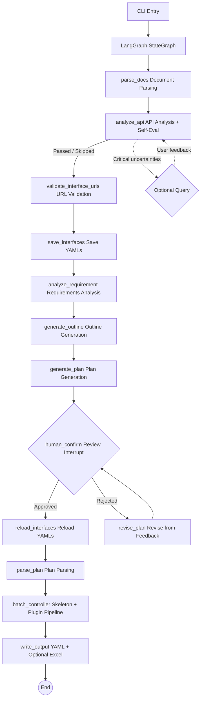

# Flow Forge — API Test Case Generation Agent

**English** | [中文](README.md)

A multi-agent system based on LangGraph pipeline pattern that transforms requirement documents and API documentation into YAML test cases (with optional Excel export) compatible with the executor. Supports both simple assertions (`assert_dict`) and advanced multi-operator assertion rules (`assert_rules`), covering equality checks, numeric comparisons, regex matching, list aggregation, and more.

## System Architecture



Core workflow (11 steps):

1. **Document Parsing**: Read requirement documents (Markdown / PDF / plain text) and API documentation (OpenAPI 3.0 / Markdown tables), with token-aware chunking for long texts

2. **API Analysis**: Analyze API documentation completeness — auth methods, parameter patterns, missing info. Auto-passes when quality is good, only asks user for critical uncertainties

3. **Interface URL Validation** (source-level): Verify each interface URL exists in the source document; URLs failing validation trigger automatic LLM correction retries

4. **Save Interfaces**: Write validated interfaces to YAML files. Users can edit these files during the plan review phase; edits are picked up after approval

5. **Requirements Analysis**: LLM extracts business flows, user roles, constraints, and exception scenarios

6. **Outline Generation (generate_outline)**: Generates a lightweight JSON outline from requirement analysis and interface list (names/URLs only), grouping interfaces by business domain and listing business flows. The outline is very small (< 1000 tokens), guaranteeing no truncation.

7. **Plan Generation**: Generate a Markdown test plan in chunks from the outline (default 8 interfaces per chunk), preventing LLM output truncation for large projects

8. **Manual Review** (Mandatory interrupt): Display the plan; user can approve, provide text feedback, or use annotation-based revision. Feedback loop until approval

9. **Plan Parsing**: Parse the approved Markdown test plan into structured data, extracting test point lists for downstream case generation

10. **Case Generation** (skeleton + plugin pipeline):
   - Skeleton generation: Generates single/biz case skeletons in batches of `skeleton_batch_size` (default 30). When test points exceed the batch size, they are automatically split into multiple batches, each calling the LLM independently, then merged
   - URL validation: Check all skeleton URLs against source document; submit mis-matching URLs for correction. Validation strategy (fail/warn/skip) is configurable via `validation.rules` → `url_check`
   - Plugin execution: Run plugins in the order configured in PLUGIN_MODULES (e.g. data filling, assertion generation)

11. **Output**: YAML files (`single_cases/`, `biz_flows/`) + optional Excel export

### Recommended Workflow: Excel for Editing + YAML for Version Control

- **Excel for batch editing**: Open in Flow Forge Studio to quickly browse, sort, and batch-modify cases
- **YAML for diffing**: Convert Excel to YAML with the converter; git diff shows every change
- **Converter is independently usable**: `python converter_main.py` converts between Excel and YAML at any time

## Plugin System

Flow Forge uses a plugin system to enrich test case skeletons with additional attributes after generation. All plugins are configured via the `plugins` section in `env.yaml`:

```yaml
plugins:
  enabled: true
  modules:
    - plugins.official.data_filling.DataFillingPlugin
    - plugins.official.assertion_generation.AssertionGenerationPlugin
```

### Official Plugins

| Plugin | Purpose | Attributes |
|--------|---------|------------|
| `data_filling` | Fill request data into skeletons (request_head, request_body, status_code, tag) | Single + Biz |
| `assertion_generation` | Generate assertions for filled cases (assert_dict, assert_rules) | Single + Biz |

Users may remove unwanted plugins from the `plugins.modules` list or replace them with custom implementations.

### Writing a Custom Plugin

1. Subclass `CaseAttributeGenerator` (`plugins/base.py`)
2. Declare `PluginDeclaration` (name, attributes, scope, etc.)
3. Implement `generate()` (receives a batch of cases, returns enriched cases)

```python
from plugins.base import CaseAttributeGenerator, PluginDeclaration

class CustomPlugin(CaseAttributeGenerator):
    @property
    def declaration(self):
        return PluginDeclaration(
            plugin_name="my-custom-plugin",
            attributes=["preprocessors"],
            applies_to_single=True,
            applies_to_biz=False,
            max_retries=1,
            error_strategy="skip",
        )

    def generate(self, cases, interfaces, api_summary, api_doc_text):
        for case in cases:
            case["preprocessors"] = [...]
        return cases
```

Then add the plugin path to the `plugins.modules` list in `env.yaml`.

### PluginDeclaration Fields

| Field | Type | Description |
|-------|------|-------------|
| `plugin_name` | str | Plugin name |
| `attributes` | List[str] | Attribute names to add |
| `applies_to_single` | bool | Apply to single-API cases |
| `applies_to_biz` | bool | Apply to business flow cases |
| `max_retries` | int | Retries per batch |
| `error_strategy` | str | Failure strategy: `"skip"` / `"warn"` / `"fail"` |

## Tech Stack

| Dependency | Purpose |
|------------|---------|
| `langgraph` | StateGraph workflow orchestration, interrupts, checkpoints |
| `langchain-core` | ChatModel abstraction, message types |
| `langchain-openai` | OpenAI ChatModel adapter |
| `openai` | Direct LLM calls (OpenAI-compatible API) |
| `openpyxl` | Excel file writing |
| `prance` | OpenAPI 3.0 spec parsing |
| `pymupdf` | PDF text extraction |
| `pyyaml` | YAML config and skill parsing |
| `tiktoken` | Accurate token counting (falls back to char estimation) |

## Directory Structure

```text
agent/
├── main.py                      # CLI entry (thin wrapper, logic in cli/)
├── requirements.txt             # Python dependencies
├── env.example.yaml             # YAML config template (bilingual comments)
│
├── cli/
│   ├── parser.py                # CLI argument parsing
│   ├── interactive.py           # Interactive review loop
│   ├── bootstrap.py             # Logging setup + directory structure
│   └── runner.py                # Main pipeline orchestration
│
├── config/
│   └── settings.py              # .env → Settings dataclass
│
├── i18n/
│   ├── loader.py                # Load translations by AGENT_LANG
│   ├── zh_CN.json               # Chinese translations (default)
│   └── en_US.json               # English translations
│
├── models/
│   ├── schema.py                # Data models (InterfaceDef, TestPlan, etc.)
│   └── state.py                 # AgentConfig
│
├── llm/
│   └── factory.py               # LLM provider factory
│
├── prompts/
│   ├── __init__.py              # Unified prompt exports
│   ├── render.py                # {{variable}} template substitution
│   ├── registry.py              # PromptRegistry — Python module loader
│   ├── compression.py           # Context compression prompts
│   ├── json_fix.py              # JSON fix prompt
│   └── *.py                     # One module per agent (SYSTEM + USER constants)
│
├── tools/
│   ├── registry.py              # ToolRegistry
│   ├── builtin/                 # Built-in tools
│   └── custom/                  # User custom tools
│
├── skills/
│   ├── registry.py              # SkillRegistry (loads YAML, injects into agents)
│   ├── builtin/                 # Built-in skills (reserved)
│   └── custom/                  # User custom skills (reserved)
│
├── plugins/
│   ├── base.py                  # CaseAttributeGenerator base class
│   ├── loader.py                # Plugin loader
│   ├── skill_loader.py          # Skill loader (reads skill config from settings)
│   └── official/                # Official plugins
│       ├── __init__.py
│       ├── data_filling.py      # Data filling plugin entry point
│       ├── assertion_generation.py # Assertion generation plugin entry point
│       ├── agents/              #   Internal agent implementations
│       │   ├── __init__.py
│       │   ├── data_filler.py
│       │   └── assertion_generator.py
│       ├── prompts/             #   Internal prompt templates
│       │   ├── __init__.py
│       │   ├── data_filling.py
│       │   └── assertion_generation.py
│       └── skills/              #   Plugin-specific skills (YAML data files)
│           ├── foli_mall_data_filling.yaml
│           └── foli_mall_assertion.yaml
│
├── agents/
│   ├── base.py                  # BaseAgent foundation class
│   ├── requirement_analyzer.py  # Requirements analysis
│   ├── api_analyzer.py          # API analysis
│   ├── plan_generator.py        # Plan generation
│   ├── plan_parser.py           # Plan parsing
│   ├── case_generator.py        # Case generation (legacy)
│   ├── skeleton_generator.py    # Skeleton generation (single + biz)
│   ├── batch_controller.py      # Batch controller (plugin pipeline)
│   └── excel_writer.py          # Excel writer
│
├── graph/
│   ├── state.py                 # GraphState TypedDict
│   ├── workflow.py              # build_workflow() main StateGraph
│   ├── checkpoint.py            # Resume/checkpoint management
│   └── nodes/                   # Node functions (split by domain)
│       ├── helpers.py           # Shared helpers + dependency injection
│       ├── parse_docs.py        # Document parsing node
│       ├── analyze_api.py       # API analysis node
│       ├── analyze_requirement.py # Requirement analysis node
│       ├── generate_plan.py     # Plan generation node
│       ├── review.py            # Human review + plan revision nodes
│       ├── parse_plan.py        # Plan parsing node
│       ├── validate_urls.py     # URL validation node
│       ├── interfaces_io.py     # Interface save/reload nodes
│       ├── batch.py             # Batch controller node
│       ├── output.py            # Output writing node
│       └── routing.py           # Conditional routing functions
│
├── validators/
│   ├── case_validator.py        # Case format validation
│   └── url_checker.py           # URL existence check
│
├── knowledge/
│   ├── search.py                # Grep-based text search (zero deps)
│   └── *.md                     # Domain knowledge files
│
├── doc_parser/
│   ├── openapi_parser.py        # OpenAPI 3.0 parser
│   ├── markdown_parser.py       # Markdown table parser
│   ├── pdf_parser.py            # PDF text extractor
│   ├── llm_parser.py            # LLM interface extractor
│   └── text_extractor.py        # Multi-format text extraction
│
├── utils/
│   ├── session_logger.py        # Session event logging
│   └── token_counter.py         # Token counting
│
├── logs/                        # Session logs (runtime-generated)
└── <output>/                    # Output directory (runtime-generated)
    ├── cases/
    │   ├── interfaces/
    │   ├── single_cases/
    │   ├── biz_flows/
    │   └── test_cases.xlsx
    └── memory/
        ├── plan.md
        └── snapshots/
```

## Prompt Management

All agent system prompts and user templates are stored as Python modules under `prompts/`. Each file exports `<AGENT>_SYSTEM` and `<AGENT>_USER` constants. ALL prompts are written in English — this improves instruction comprehension accuracy, especially for smaller open-source models that handle English better than other languages.

For prompts that generate user-visible text (test plans, API analysis questions, case fields like api_name/remark/sheet_name), the templates include a `{{language}}` variable that FORCES the LLM to output in the user's configured language, ensuring English system prompts do not cause the LLM to reply in English everywhere.

To modify prompts, simply edit the corresponding file — no business code changes needed. `PromptRegistry` provides programmatic access.

## CLI Arguments

```
usage: main.py [-h] [--requirement PATH [PATH ...]] [--api PATH]
               [--output PATH] [--parse-mode {raw,rule,llm}]
               [--prompt TEXT] [--batch-size N] [--resume]

Flow Forge — API Test Case Generation Agent

optional arguments:
  --requirement PATH [PATH ...]
                        Requirement document path(s) (.txt, .md, .pdf)
  --api PATH            API documentation path (OpenAPI .yaml/.json or .md)
  --output PATH         Output root directory (default: ./output_<timestamp>)
  --output-format {yaml,excel,both}
                        Output format (default: both)
  --batch-size N        Max cases per batch (default: 10, -1 to disable)
  --prompt TEXT, -p TEXT
                        User guidance injected into plan/case generation
  --parse-mode {raw,rule,llm}, -m {raw,rule,llm}
                        API doc parse mode (default: raw)
  --parser-path PATH    Custom parser .py file (only for -m rule)
  --reference-dir PATH  Reference directory for incremental updates
  --resume              Resume from existing output directory
  --resume-overwrite    Overwrite existing output when resuming
  --auto                Auto mode: skip all human review, ideal for nightly batch
  --debug-snapshots     Save debug snapshots
  --debug               Enable debug logging (full LLM I/O)
  --env PATH            Path to .env file (default: .env)
  -v, --verbose         Enable verbose console logging
  --log-to-output       Persist logs to output directory ({output_dir}/logs/agent.log)
```

## Configuration File

Flow Forge uses `env.yaml` as its unified configuration file (YAML format). Create it from the template:

```bash
cp env.example.yaml env.yaml
# Edit env.yaml with your settings
```

### Configuration Structure

```yaml
llm:                # LLM provider settings
  provider: openai
  api_key: sk-...   # API key (required)
  model: gpt-4o
  temperature: 0.3
  max_output_tokens: 4096
  context_window: 128000
  context_compression_threshold: 0.9
  base_url: ""      # Third-party API base URL
  max_concurrency: 1
  rate_limit_delay: 0.0
  retry_base_delay: 2.0
  request_timeout: 600.0

pipeline:           # Pipeline settings
  max_steps: 10
  max_retries: 3
  max_steps_no_progress: 5
  consecutive_batch_failure_limit: 3
  url_correction_max_retries: 3
  skeleton_batch_size: 30   # Skeleton generation batch size (test points per batch)
  auto: false        # Auto mode: skip human review (enable for nightly batch)
  plan_chunk_size: 8         # Plan chunk size (interfaces per chunk)

knowledge:          # Knowledge base (grep-based text search)
  enabled: false
  dir: ./knowledge

validation:         # Case validation
  enabled: true
  max_retries: 3
  rules:            # Validation rules (each entry: check + strategy)
    - check: skeleton_count     # Skeleton count validation
      strategy: fail            # fail | warn | skip
    - check: url_check          # URL existence check
      strategy: warn            # fail | warn | skip
    - check: data_fill_count    # Data fill count validation
      strategy: fail            # fail | warn | skip
    - check: assertion_count    # Assertion count validation
      strategy: fail            # fail | warn | skip

output:             # Output settings
  dir: ./output
  batch_size: 10
  format: both      # yaml | excel | both

plugins:            # Plugin system
  enabled: true
  modules:          # YAML list syntax, executed in declaration order
    - plugins.official.data_filling.DataFillingPlugin
    - plugins.official.assertion_generation.AssertionGenerationPlugin

skills:             # Skill system (plugin-attached configs)
  enabled: true     # Global switch: false disables all skill injection
  agents:           # Assign skill files to agents (without .yaml extension)
    # Plugin agents
    data_filler:
      - foli_mall_data_filling
    assertion_generator:
      - foli_mall_assertion
    # Main pipeline agents (uncomment as needed)
    # requirement_analyzer: []
    # api_analyzer: []
    # plan_generator: []
    # case_generator:
    #   - boundary_test

agent:              # UI language
  lang: zh_CN       # zh_CN | en_US

# --- Logging Settings ---
logging:
  # Persist logs to output_dir/logs/agent.log
  log_to_output: false
```

### Skill Toggle

- **Global disable**: `skills.enabled: false` — all skill injection stops; plugins still run normally
- **Fine-grained control**: edit `skills.agents` to remove unwanted agent entries or individual skills

## Knowledge Base

The knowledge base (`knowledge/search.py`) provides grep-based keyword search — no embedding models or vector databases required. Knowledge is stored as `.md` files in the `knowledge/` directory.

Controlled by `ENABLE_KNOWLEDGE` in `.env`. When enabled, agents search `.md` files during prompt construction and append relevant knowledge snippets to provide domain-specific guidance.

Users can extend the knowledge base by adding `.md` files to the `knowledge/` directory.

## Auto Mode

Auto mode runs the full pipeline while skipping all human review checkpoints. It is ideal for nightly batch generation after Skills and plugins have been thoroughly tested.

### Enabling

- **CLI**: `--auto` flag
- **Config**: set `pipeline.auto: true` in `env.yaml`
- When both are present, the CLI flag takes precedence

### Behavior

| Checkpoint | Auto Mode Behavior |
|------------|-------------------|
| API analysis uncertainties | Log warning and skip, continue execution |
| Test plan review | Auto-approve, proceed to case generation |

### Use Cases

- **Nightly batch generation**: Once Skills and plugins are configured correctly, use `--auto` for unattended runs:
  ```bash
  python main.py --requirement docs/req.md --api docs/api.yaml --auto
  ```
- **Combined with --resume**: Resume after power loss without manual intervention:
  ```bash
  python main.py --resume --output output_20240101_120000 --auto
  ```

### Prerequisites

Before using auto mode, ensure the following are properly configured to maintain test case quality:

- **Skills**: Encode project-specific business rules into Skills, such as:
  - Expected HTTP status code conventions (200 OK vs 201 Created)
  - Authentication method (JWT, API Key, Session Cookie)
  - Baseline test credentials and data field formats
- **Plugins**: Verify that data filling and assertion generation plugins are correctly configured
- **--prompt guidance**: Use `--prompt` to pass additional business guidance for better generation quality

### Comparison with --resume

| Flag | Purpose | When to Use |
|------|---------|-------------|
| `--auto` | Skip human interaction, run full pipeline | First-time nightly batch run |
| `--resume` | Continue from last completed stage (full pipeline) | Recovery after power loss / crash |
| `--resume --auto` | Resume + auto-approve remaining reviews | Unattended recovery after power loss |

## Anti-Hallucination & Error Handling

- **Text-Only Limitation**: The agent only processes text. Image/scanned content in PDFs will NOT be extracted — provide PDFs with extractable text layers or plain-text documents. Binary files (.png, .jpg) are explicitly rejected.
- **LLM Output Count Validation (Anti-Hallucination)**: After skeleton generation, data filling, assertion generation, and URL correction, output item count is automatically validated against input. Mismatches trigger automatic retries (using temperature > 0 for varied outputs). Each validation check supports configurable strategies (`fail` to abort, `warn` to log and continue, `skip` to bypass) via `validation.rules` in `env.yaml`. Skeleton generation uses batched LLM calls (default batch size: 30) to improve count accuracy for large test plans. Plan generation uses an "outline + chunking" two-step approach — first generating a lightweight JSON outline, then chunking the full plan from the outline (default 8 interfaces per chunk), preventing output truncation for large projects.
- **Plugin Error Handling**: Supports `skip`/`warn`/`fail` error strategies. The `fail` strategy aborts the pipeline; resume can restart from the failed stage (requires the checkpoint phase name fix).

## Running Tests

```bash
python -m pytest tests/ -v
```

Tests incur zero LLM API costs (all LLM calls are mocked).

## Design Rationale

### Why LangGraph

LangGraph provides three key capabilities:

- **State management**: `GraphState` TypedDict auto-passes between nodes — no manual state handling
- **Interrupts & resume**: `interrupt()` + `MemorySaver` natively support human-in-the-loop with exact resumption
- **Conditional routing**: `add_conditional_edges()` makes review branches a natural part of the graph

### Why grep over embedding search

- **Zero cost**: No embedding API calls needed
- **Zero external deps**: Pure Python standard library
- **Interpretable**: Exact keyword matching, no semantic drift
- **Extensible**: Users just create `.md` files — no reindexing needed

### Why pipeline pattern

The pipeline pattern decomposes test case generation into sequential, independent stages (doc parsing → API analysis → plan generation → review → skeleton generation → plugin execution → output). Each stage has a single responsibility, can be tested independently, and can be replaced individually. Compared to the ReAct pattern, the pipeline is better suited for batch processing — avoiding the overhead and uncertainty of tool-calling loops.

### Why plugin architecture

Data filling and assertion generation are provided as official plugins, configured via `PLUGIN_MODULES`. Users can remove unwanted plugins or register custom plugins to extend the default behavior. Different projects have different testing needs — some require HMAC signing preprocessors, others need database-backed verification — and the plugin architecture allows customizing the generation pipeline without modifying framework code.

### Why Skill system

Skills are YAML files that append domain knowledge or business rules to agent system prompts via the `prompt_extension` field, customizing agent behavior without code changes.

Skills can be injected into **all** agents — both main pipeline agents and plugin-internal agents:
- **Main pipeline agents**: `requirement_analyzer`, `api_analyzer`, `plan_generator`, `plan_parser`, `case_generator`, `skeleton_generator` — skills stored in `skills/builtin/`
- **Plugin agents**: `data_filler`, `assertion_generator` — skills stored in `plugins/official/skills/`

Skill injection uses a two-layer control: `skills.enabled` in `env.yaml` acts as a global on/off switch, while `skills.agents` maps target agents to their skill files. Users can comment out or remove individual skill entries for fine-grained control, or disable the global switch to turn off all skill injection at once.

### Why English prompts

All agent system and user prompts are written in English. English instructions are structurally simpler with less ambiguity — smaller open-source models typically achieve higher comprehension accuracy with English prompts than with other languages. When generating user-visible content (test plans, API analysis questions, case fields like api_name/remark/sheet_name), the `{{language}}` template variable forces the LLM to output in the language configured by `AGENT_LANG`, preventing English system prompts from causing the LLM to reply in English throughout all interactive steps.

### Context Compression

When processing long documents, the system splits text into chunks at paragraph boundaries and processes each chunk sequentially. Before each round, token usage is checked: when input tokens exceed `LLM_CONTEXT_COMPRESSION_THRESHOLD × LLM_CONTEXT_WINDOW` (default 90%), an LLM-driven compression is triggered — distilling intermediate results from prior rounds into a concise summary of key points, freeing up context window space. Compression only applies to accumulated chunk processing results; system prompts and skill content remain untouched. The agent's core instructions stay intact across all processing rounds.
