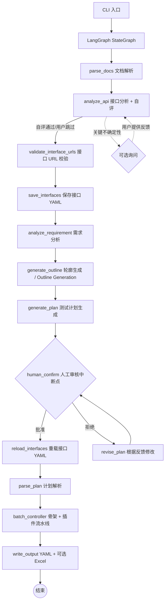

# Flow Forge — 接口自动化用例生成智能体

**中文** | [English](README.en.md)

基于 LangGraph 流水线模式的多智能体系统，将需求文档和接口文档转化为符合执行器格式的 YAML 测试用例（可选导出 Excel）。支持简单断言（`assert_dict`）和高级多运算符断言规则（`assert_rules`），覆盖等值校验、数值比较、正则匹配、列表聚合等场景。

## 系统架构



核心流程（共 11 步）：

1. **文档解析**：读取需求文档（Markdown / PDF / 纯文本）和接口文档（OpenAPI 3.0 / Markdown 表格）。支持 Token 感知的长文本分块处理

2. **接口分析**：分析接口文档完整性——认证方式、参数模式、缺失信息；自评通过则自动继续，仅关键不确定性时询问用户

3. **接口 URL 校验**（源级验证）：将接口 URL 与文档原文比对，未通过校验的 URL 自动触发 LLM 纠错重试

4. **保存接口定义**：将校验后的接口定义写入 YAML 文件。用户可在审核期间直接编辑 YAML，审核通过后系统重新加载

5. **需求分析**：LLM 从需求中提取业务流程、用户角色、约束条件、异常场景

6. **轮廓生成（generate_outline）**：基于需求分析和接口列表（仅名称/URL），生成轻量级 JSON 轮廓，将接口按业务领域分组、列出业务流程。轮廓数据量很小（< 1000 token），确保不会被截断。

7. **计划生成**：基于轮廓分块生成 Markdown 测试计划——Phase A 生成全局业务理解 + 流程图，Phase B 按接口分组（`plan_single_batch_size` 控制每组接口数，`-1` 合为 1 组），Phase C 按批次（`plan_biz_flow_batch_size` 控制每批合并数，`-1` 合为 1 批），Phase D 拼接。每批独立 LLM 调用，避免大项目下输出截断。强模型可将两个配置设为 `-1` 加快执行速度

8. **人工审核**（强制中断点）：展示计划，用户可批准、提出文字修改意见或按批注文件修改。支持反馈循环直至批准

9. **计划解析**：将审核通过后的 Markdown 测试计划解析为结构化数据，提取测试点列表供后续用例生成使用

10. **用例生成**（骨架 + 插件流水线）：
   - 骨架生成：按 `skeleton_batch_size`（默认 30）分批生成单接口/业务链路用例骨架。测试点超过分批大小时自动拆分为多批，每批独立调用 LLM 后合并结果
   - URL 校验：检查骨架中所有 URL 是否在文档原文中存在，不存在的提交纠错重试。校验策略（fail/warn/skip）和失败处理动作（discard/keep）可通过 `validation.rules` 中的 `url_check` 配置
   - 插件执行：按 PLUGIN_MODULES 配置的插件列表依次执行（如数据填充、断言生成等）

11. **输出**：YAML 文件（`single_cases/`、`biz_flows/`）+ 可选 Excel 导出

### 推荐工作流：Excel 编辑 + YAML 版本控制

- **Excel 适合批量编辑**：在 Flow Forge Studio 中打开生成的 Excel，快速浏览、排序、批量修改大量用例
- **YAML 适合做 diff**：用 converter 将 Excel 转为 YAML，git diff 可清晰展示变更内容
- **转换工具独立可用**：`python converter_main.py` 可在 Excel 和 YAML 之间互相转换

## 插件系统

Flow Forge 通过插件系统在用例骨架生成后补充用例属性。所有插件通过 `env.yaml` 中的 `plugins` 段配置：

```yaml
plugins:
  enabled: true
  modules:
    - plugins.official.data_filling.DataFillingPlugin
    - plugins.official.assertion_generation.AssertionGenerationPlugin
```

### 官方插件

| 插件 | 作用 | 属性 |
|------|------|------|
| `data_filling` | 为用例骨架填充请求数据（request_head, request_body, status_code, tag） | 单接口 + 业务链路 |
| `assertion_generation` | 为已填充用例生成断言（assert_dict, assert_rules） | 单接口 + 业务链路 |

用户可以在 `plugins.modules` 列表中删减不需要的插件，或用自定义实现替换。

### 编写自定义插件

1. 继承 `CaseAttributeGenerator` 基类（`plugins/base.py`）
2. 声明 `PluginDeclaration`（插件名称、作用的属性、适用范围等）
3. 实现 `generate()` 方法（接收一批用例，返回补充属性后的用例列表）

```python
from plugins.base import CaseAttributeGenerator, PluginDeclaration

class CustomPlugin(CaseAttributeGenerator):
    @property
    def declaration(self):
        return PluginDeclaration(
            plugin_name="my-custom-plugin",
            attributes=["preprocessors"],
            applies_to_single=True,
            applies_to_biz=False,
            max_retries=1,
            error_strategy="skip",
        )

    def generate(self, cases, interfaces, api_summary, api_doc_text):
        for case in cases:
            case["preprocessors"] = [...]
        return cases
```

然后将插件路径加入 `env.yaml` 的 `plugins.modules` 列表即可。

### PluginDeclaration 字段说明

| 字段 | 类型 | 说明 |
|------|------|------|
| `plugin_name` | str | 插件名称 |
| `attributes` | List[str] | 要添加的属性名列表 |
| `applies_to_single` | bool | 是否作用于单接口用例 |
| `applies_to_biz` | bool | 是否作用于业务链路用例 |
| `max_retries` | int | 每批失败重试次数 |
| `error_strategy` | str | 彻底失败策略: `"skip"` / `"warn"` / `"fail"` |

## 技术栈

| 依赖 | 用途 |
|------|------|
| `langgraph` | StateGraph 工作流编排、中断点、检查点 |
| `langchain-core` | ChatModel 抽象、消息类型 |
| `langchain-openai` | OpenAI ChatModel 适配器 |
| `openai` | 直接 LLM 调用（兼容 OpenAI API） |
| `openpyxl` | Excel 文件写入 |
| `prance` | OpenAPI 3.0 规范解析 |
| `pymupdf` | PDF 需求文档文本提取 |
| `pyyaml` | YAML 配置与 Skill 定义解析 |
| `tiktoken` | Token 精确计数（回退到字符估算） |

## 目录结构

```text
agent/
├── main.py                      # CLI 入口（薄入口，实际逻辑在 cli/）
├── translate_cases.py           # 用例字段翻译工具入口 / Translation tool entry
├── requirements.txt             # Python 依赖
├── env.example.yaml             # YAML 配置模板（双语注释）
├── translate_env.example.yaml   # 翻译智能体独立配置模板 / Translator config template
│
├── cli/
│   ├── __init__.py
│   ├── parser.py                # 命令行参数解析
│   ├── interactive.py           # 交互式审核循环
│   ├── bootstrap.py             # 日志设置 + 目录结构创建
│   └── runner.py                # 主流水线编排
│
├── config/
│   ├── __init__.py
│   └── settings.py              # 配置加载（.env → Settings dataclass）
│
├── i18n/
│   ├── __init__.py
│   ├── loader.py                # 根据 AGENT_LANG 加载翻译
│   ├── zh_CN.json               # 中文翻译表（默认）
│   └── en_US.json               # 英文翻译表
│
├── models/
│   ├── __init__.py
│   ├── schema.py                # 数据模型（InterfaceDef, TestPlan 等）
│   └── state.py                 # AgentConfig
│
├── llm/
│   ├── __init__.py
│   └── factory.py               # LLM 供应商工厂
│
├── prompts/
│   ├── __init__.py              # 统一导出所有提示词常量
│   ├── render.py                # {{variable}} 模板变量替换
│   ├── registry.py              # PromptRegistry：从 Python 模块加载
│   ├── compression.py           # 上下文压缩提示词
│   ├── json_fix.py              # JSON 修复提示词
│   ├── api_analyzer.py          # 接口分析提示词
│   ├── requirement_analysis.py  # 需求分析提示词
│   ├── plan_generator.py        # 计划生成提示词
│   ├── plan_reviser.py          # 计划修订提示词
│   ├── plan_parser.py           # 计划解析提示词
│   ├── case_generator.py        # 用例生成提示词（旧版）
│   ├── skeleton_generation.py   # 骨架生成提示词
│   ├── url_correction.py        # URL 纠错提示词
│   └── doc_parser.py            # 文档解析提示词
│
├── tools/
│   ├── __init__.py
│   ├── base.py                  # BaseTool 数据类
│   ├── registry.py              # ToolRegistry
│   ├── builtin/                 # 内置工具
│   └── custom/                  # 用户自定义工具
│
├── skills/
│   ├── __init__.py
│   ├── base.py                  # Skill 数据类
│   ├── registry.py              # SkillRegistry（加载 YAML 并注入到 Agent）
│   ├── builtin/                 # 内置 Skill（预留）
│   └── custom/                  # 用户自定义 Skill（预留）
│
├── plugins/
│   ├── __init__.py
│   ├── base.py                  # CaseAttributeGenerator 基类
│   ├── loader.py                # 插件加载器
│   ├── skill_loader.py          # Skill 加载辅助（从配置读取 Skill 映射）
│   └── official/                # 官方插件
│       ├── __init__.py
│       ├── data_filling.py      # 数据填充插件入口
│       ├── assertion_generation.py # 断言生成插件入口
│       ├── agents/              #   内部 Agent 实现
│       │   ├── __init__.py
│       │   ├── data_filler.py
│       │   └── assertion_generator.py
│       ├── prompts/             #   内部 Prompt 模板
│       │   ├── __init__.py
│       │   ├── data_filling.py
│       │   └── assertion_generation.py
│       └── skills/              #   插件专属 Skill (YAML)
│           ├── foli_mall_data_filling.yaml
│           └── foli_mall_assertion.yaml
│
├── agents/
│   ├── __init__.py
│   ├── base.py                  # BaseAgent 基类
│   ├── requirement_analyzer.py  # 需求分析
│   ├── api_analyzer.py          # 接口分析
│   ├── plan_generator.py        # 计划生成
│   ├── plan_parser.py           # 计划解析
│   ├── case_generator.py        # 用例生成（旧版）
│   ├── skeleton_generator.py    # 用例骨架生成
│   ├── batch_controller.py      # 分批控制器（插件流水线编排）
│   └── excel_writer.py          # Excel 写入
│
├── graph/
│   ├── __init__.py
│   ├── state.py                 # GraphState TypedDict
│   ├── workflow.py              # build_workflow() 主 StateGraph
│   ├── checkpoint.py            # 断点续写管理
│   └── nodes/                   # 工作流节点（按职责拆分）
│       ├── __init__.py
│       ├── helpers.py           # 共享辅助函数
│       ├── parse_docs.py        # 文档解析节点
│       ├── analyze_api.py       # 接口分析节点
│       ├── analyze_requirement.py # 需求分析节点
│       ├── generate_plan.py     # 计划生成节点
│       ├── review.py            # 审核 + 修订节点
│       ├── parse_plan.py        # 计划解析节点
│       ├── generate_cases.py    # 用例生成节点（旧版）
│       ├── validate_urls.py     # URL 校验节点
│       ├── interfaces_io.py     # 接口保存/重载节点
│       ├── batch.py             # 分批控制节点
│       ├── output.py            # 输出写入节点
│       └── routing.py           # 条件路由函数
│
├── validators/
│   ├── __init__.py
│   ├── case_validator.py        # 用例格式校验
│   └── url_checker.py           # URL 存在性检查
│
├── knowledge/
│   ├── __init__.py
│   ├── search.py                # grep 文本检索知识库
│   └── *.md                     # 领域知识文件
│
├── doc_parser/
│   ├── __init__.py
│   ├── openapi_parser.py        # OpenAPI 3.0 解析器
│   ├── markdown_parser.py       # Markdown 表格解析器
│   ├── pdf_parser.py            # PDF 文本提取器
│   ├── llm_parser.py            # LLM 接口提取器
│   └── text_extractor.py        # 多格式文本提取
│
├── utils/
│   ├── __init__.py
│   ├── session_logger.py        # 会话日志记录
│   └── token_counter.py         # Token 计数
│
├── logs/                        # 运行日志（运行时生成）
│   └── <timestamp>/
│       ├── session.jsonl
│       ├── debug.log
│       ├── plan.md
│       ├── state.json
│       └── excel_result.xlsx
│
└── <output>/                    # 输出目录（运行时生成）
    ├── cases/
    │   ├── interfaces/
    │   ├── single_cases/
    │   ├── biz_flows/
    │   ├── failures.yaml
    │   └── test_cases.xlsx
    └── memory/
        ├── plan.md
        ├── plan_comments.json
        ├── history-comments/
        └── snapshots/
```

## 提示词管理

所有智能体的 system prompt 和 user template 统一存放在 `prompts/` 目录下的 Python 模块中。每个文件导出 `<AGENT>_SYSTEM` 和 `<AGENT>_USER` 常量。所有提示词使用英文编写，以提升弱模型对指令的理解准确度。

对于需要生成用户可见文本的提示词（测试计划、API 分析问题、用例中的 api_name/remark/sheet_name 等字段），模板中通过 `{{language}}` 变量强制要求 LLM 以用户配置的语言输出，确保英文提示词不会导致 LLM 始终用英文回复。

修改提示词只需编辑对应文件，无需修改业务代码。`PromptRegistry` 提供程序化访问接口。

## 命令行参数

```
usage: main.py [-h] [--requirement REQUIREMENT [REQUIREMENT ...]]
               [--api API] [--output OUTPUT] [--env ENV] [--debug]
               [--parse-mode {raw,rule,llm}] [--prompt PROMPT]
               [--batch-size BATCH_SIZE] [--resume] [--resume-overwrite]

Flow Forge — API Test Case Generation Agent

optional arguments:
  --requirement PATH [PATH ...]
                        需求文档路径（.txt, .md, .pdf）
  --api PATH            接口文档路径（OpenAPI .yaml/.json 或 Markdown .md）
  --output PATH         输出根目录（默认 ./output_<timestamp>）
  --output-format {yaml,excel,both}
                        输出格式（默认 both）
  --prompt TEXT, -p TEXT
                        用户补充指导，注入到计划生成和用例生成阶段
  --parse-mode {raw,rule,llm}, -m {raw,rule,llm}
                        API 文档解析模式（默认 raw）
  --parser-path PATH    自定义解析器 .py 文件路径（仅 -m rule 时生效）
  --reference-dir PATH  增量更新参考目录
  --resume              从已有 output 目录恢复执行
  --resume-overwrite    恢复时覆盖已有输出
  --auto                自动模式，跳过所有人工审核，适合夜间批量生成
  --case-type {single,biz,both}
                        用例生成类型: single=仅单接口, biz=仅业务链路, both=全部 (默认)
  --debug-snapshots     保存调试快照
  --debug               启用调试日志（完整 LLM I/O）
  --env PATH            .env 文件路径（默认 .env）
  -v, --verbose         启用详细控制台日志
  --log-to-output       将日志持久化到输出目录 ({output_dir}/logs/agent.log)
```

## 用例字段翻译工具（兜底）

当使用弱模型（如本地 Ollama 小参数量模型）生成测试用例时，部分文本字段（`api_name`、`sheet_name`、`remark`）可能出现中英文混合或全英文的情况。翻译工具作为**兜底机制**，对已生成的用例进行字段翻译，确保输出语言的纯净性。

> **使用时机**：建议在用例生成后**第一时间运行翻译**，然后再进行人工修改。翻译后再修改用例可以确保手工调整不被覆盖。

### 使用方法

```bash
# 翻译整个输出目录下的所有用例
python translate_cases.py output/cases/ --target-lang zh_CN

# 翻译到指定输出目录（保留原始目录不变）
python translate_cases.py output/cases/ -o translated_cases/

# 预览模式（不写文件，仅查看哪些用例需要翻译）
python translate_cases.py output/cases/ --target-lang zh_CN --dry-run

# 禁用已翻译检测（全量翻译）
python translate_cases.py output/cases/ --no-detection

# 详细日志 + 持久化日志文件
python translate_cases.py output/cases/ -v --log-to-output
```

### 翻译策略

- **场景推断**：翻译工具会参考用例的 method、URL 等字段推断测试场景，生成符合业务语义的自然翻译。例如 `DELETE /api/cart` 会翻译为 "删除购物车"，而非逐词翻译 HTTP 方法
- **字段保护**：只修改 `api_name`、`sheet_name`、`remark` 字段，其他字段（test_id、method、URL 等）严格保持不变
- **已翻译检测**：默认自动跳过已是目标语言的用例（可配置 `detection.enabled`）

### 输入优先级

- **YAML 优先**：若输入目录下存在 YAML 文件，优先翻译 YAML
- **Excel 回退**：仅当无 YAML 文件时，才读取 Excel 文件进行翻译
- 若输入含 Excel 且使用 YAML 翻译，输出时也会同时导出一份 Excel

### 命令行参数

| 参数 | 说明 |
|------|------|
| `input_dir` | 用例目录路径（通常是 agent 的 output/cases/） |
| `--output`, `-o` | 输出根目录（默认：`<input_dir>_translated`） |
| `--config`, `-c` | 翻译配置文件（默认 `translate_env.yaml`） |
| `--target-lang` | 目标语言：`zh_CN` 或 `en_US` |
| `--batch-size` | 每批最大用例数（覆盖配置文件） |
| `--no-detection` | 禁用已翻译检测 |
| `--dry-run` | 预览模式，不写入文件 |
| `--log-to-output` | 将日志持久化到输出目录 |
| `-v`, `--verbose` | 详细控制台日志 |

### 独立配置文件

翻译智能体使用独立的配置文件 `translate_env.yaml`（模板：`translate_env.example.yaml`），与主流水线的 `env.yaml` 完全独立、互不影响。用户可以为翻译任务配置不同的 LLM（例如主流水线使用本地弱模型，翻译使用云端强模型）。

```bash
cp translate_env.example.yaml translate_env.yaml
# 编辑 translate_env.yaml 并填入翻译专用 LLM 配置
```

## 配置文件

Flow Forge 使用 `env.yaml` 作为统一配置文件（YAML 格式）。通过复制模板创建：

```bash
cp env.example.yaml env.yaml
# 编辑 env.yaml 并填入配置
```

### 配置结构

```yaml
llm:                # LLM 供应商配置
  provider: openai
  api_key: sk-...   # API 密钥（必填）
  model: gpt-4o
  temperature: 0.3
  max_output_tokens: 4096
  context_window: 128000
  context_compression_threshold: 0.9
  base_url: ""      # 第三方 API Base URL
  max_concurrency: 1
  rate_limit_delay: 0.0
  retry_base_delay: 2.0
  request_timeout: 600.0
  extra_params: {}    # 额外 API 参数（如思考模式）/ Extra API params (e.g. thinking)

pipeline:           # 流水线设置
  max_steps: 10
  max_retries: 3
  max_steps_no_progress: 5
  consecutive_batch_failure_limit: 3
  url_correction_max_retries: 3
  skeleton_batch_size: 30   # 骨架生成分批大小（每个批次包含的测试点数量）
  auto: false        # 自动模式：跳过人工审核（夜间批量生成时建议开启）
  plan_single_batch_size: 8   # 单接口测试点分组大小（-1=不拆分）/ Single API batch size (-1=no split)
  plan_biz_flow_batch_size: 3 # 业务链路每批合并数（-1=不拆分）/ Biz flow batch size (-1=no split)
  case_type: both      # 用例生成类型 / Case type: both | single | biz
  plugin_batch_size: 10 # 插件处理批次大小（-1=不分批）/ Plugin batch size (-1=no split)

knowledge:          # 知识库（grep 文本搜索）
  enabled: false
  dir: ./knowledge

validation:         # 用例校验
  enabled: true
  max_retries: 3
  rules:            # 校验规则列表（每项: check + strategy [+ failure_action]）
    - check: skeleton_count     # 骨架数量校验
      strategy: fail            # fail | warn | skip
    - check: url_check          # URL 存在性校验
      strategy: warn            # fail | warn | skip
      failure_action: discard   # [url_check 子规则] discard (丢弃到 failures.yaml, 默认) | keep (保留继续插件处理)
    - check: data_fill_count    # 数据填充数量校验
      strategy: fail            # fail | warn | skip
    - check: assertion_count    # 断言生成数量校验
      strategy: fail            # fail | warn | skip

output:             # 输出设置
  dir: ./output
  format: both      # yaml | excel | both

plugins:            # 插件系统
  enabled: true
  modules:          # YAML 列表语法，按声明顺序执行
    - plugins.official.data_filling.DataFillingPlugin
    - plugins.official.assertion_generation.AssertionGenerationPlugin

skills:             # Skill 系统（插件附属配置）
  enabled: true     # 全局开关：false 关闭所有 Skill 注入
  agents:           # 按目标 Agent 分配 Skill 文件（不含 .yaml 扩展名）
    # 插件 Agent
    data_filler:
      - foli_mall_data_filling
    assertion_generator:
      - foli_mall_assertion
    # 主流水线 Agent（按需取消注释）
    # requirement_analyzer: []
    # api_analyzer: []
    # plan_generator: []
    # case_generator:
    #   - boundary_test

agent:              # 界面语言
  lang: zh_CN       # zh_CN | en_US

# --- 日志设置 / Logging Settings ---
logging:
  # 是否将日志持久化到 output_dir/logs/agent.log / Persist logs to output_dir
  log_to_output: false
```

### Skill 开关说明

- **全局关闭**：`skills.enabled: false` → 所有 Skill 注入停止，插件正常运行
- **精细控制**：编辑 `skills.agents`，删除不需要的 Agent 或 Skill 条目

### 思考模式（Thinking Mode）

通过 `llm.extra_params` 配置厂商特定的思考/推理模式参数。参数将以 `**kwargs` 形式原样传递给 OpenAI SDK 的 `chat.completions.create()` 调用。

```yaml
# DeepSeek 思考模式示例 / DeepSeek thinking mode example:
llm:
  extra_params:
    thinking:
      type: enabled

# OpenAI o-series 推理强度示例 / OpenAI o-series reasoning effort example:
llm:
  extra_params:
    reasoning_effort: medium
```

> **注意**：参数名和值取决于具体的模型/API 厂商，配置前请先查阅对应厂商的 API 文档。不支持的参数可能被忽略或导致错误。

### 用例类型选择（Case Type）

通过 `pipeline.case_type` 或 `--case-type` CLI 参数可选择生成范围：

| 值 | 说明 |
|----|------|
| `both` | 同时生成单接口用例和业务链路用例（默认） |
| `single` | 仅生成单接口用例，跳过 Phase C 和业务链路骨架 |
| `biz` | 仅生成业务链路用例，跳过 Phase B 和单接口骨架 |

跳过逻辑在代码级别执行，不影响轮廓生成——轮廓仍会包含完整的 `api_groups` 和 `biz_flows`。

## 知识库

知识库 (`knowledge/search.py`) 提供基于 grep 的纯文本关键词搜索，无需 embedding 模型或外部向量数据库。知识以 `.md` 文件形式存放在 `knowledge/` 目录下。

通过 `.env` 中的 `ENABLE_KNOWLEDGE` 开关控制。启用后，各智能体在生成 prompt 时通过 grep 搜索 `.md` 文件，将匹配的知识片段追加到 prompt 末尾，提供领域知识和最佳实践参考。

用户可以自行在 `knowledge/` 目录下添加 `.md` 文件来扩展知识库。

## 自动模式（Auto Mode）

自动模式允许流水线跳过所有人工审核环节，完整运行整个用例生成流程。适用于 Skill 和插件已调试完毕后的批量生成场景。

### 启用方式

- **命令行**：`--auto` 标志
- **配置文件**：`env.yaml` 中设置 `pipeline.auto: true`
- 两者同时使用时，CLI 标志优先

### 行为说明

| 审核点 | 自动模式行为 |
|--------|-------------|
| API 分析不确定项询问 | 打印警告并跳过，继续执行 |
| 测试计划审核 | 自动批准，直接进入用例生成 |

### 使用场景

- **夜间批量生成**：配置好 Skill 和插件后，通过 `--auto` 模式无需值守。例如：
  ```bash
  python main.py --requirement docs/req.md --api docs/api.yaml --auto
  ```
- **与 --resume 组合**：断电恢复后无需人工交互
  ```bash
  python main.py --resume --output output_20240101_120000 --auto
  ```

### 使用前提

在使用自动模式之前，建议确保以下配置已调试完毕，以保证自动生成的测试用例质量：

- **Skill**：将待测项目的业务规则写入 Skill，例如：
  - 接口约定的 HTTP 状态码（成功返回 200 vs 201）
  - 认证方式（JWT Token、API Key、Session Cookie）
  - 基础登录账号、测试数据字段格式
- **插件**：确认数据填充和断言生成插件配置正确
- **--prompt 指导**：可通过 `--prompt` 传入补充业务指导，提升生成质量

### 与 --resume 的区别

| 标志 | 作用 | 适用场景 |
|------|------|---------|
| `--auto` | 跳过人工交互，运行完整流水线 | 夜间首次批量生成 |
| `--resume` | 从上次中断处恢复（支持全流程） | 断电/异常后继续 |
| `--resume --auto` | 恢复 + 自动通过剩余审核 | 断电后无人值守恢复 |

## 反幻觉与错误处理

- **纯文本模态限制**：智能体仅支持文本输入。PDF 中的图片/扫描件内容不会被提取，请提供文本层可提取的 PDF 或纯文本格式文档。传入二进制文件（如 .png、.jpg）会明确报错。
- **LLM 输出数量校验（反幻觉）**：骨架生成、数据填充、断言生成和 URL 纠错后，自动校验 LLM 输出条目数与输入是否一致。数量不匹配时自动重试（利用 temperature > 0 产生不同输出）。每个校验项在 `validation.rules` 中支持三级策略（`fail` 终止 / `warn` 警告继续 / `skip` 跳过）。骨架生成采用分批机制（默认每批 30 个测试点），提高大批量测试计划的计数精度。测试计划生成采用"轮廓 + 分块"两步法——先生成轻量 JSON 轮廓，再基于轮廓分四阶段生成完整计划：A) 全局业务理解 + 流程图 → B) 按 `plan_single_batch_size` 分组的单接口测试点 → C) 按 `plan_biz_flow_batch_size` 合并的业务链路测试 → D) 拼接。每个分块独立调用 LLM 并重置步数计数器，防止单次调用耗尽 `max_steps` 配额。两个配置均支持 `-1`（不拆分），强模型可设为 `-1` 加快执行速度。
- **插件错误处理**：支持 `skip`/`warn`/`fail` 三种错误策略。`fail` 策略下流水线终止，断点续写可从失败阶段恢复（需先修复 checkpoint 阶段名不匹配的 bug）。

## 运行测试

```bash
python -m pytest tests/ -v
```

测试不产生任何 LLM API 费用（所有 LLM 调用均已 mock）。

## 设计理念

### 为什么用 LangGraph

LangGraph 提供三个关键能力：

- **状态管理**：`GraphState` TypedDict 在节点间自动传递，无需手动维护状态对象
- **中断与恢复**：`interrupt()` + `MemorySaver` 原生支持人工审核中断，可从断点精确恢复
- **条件路由**：`add_conditional_edges()` 让审核分支成为图的自然组成部分

### 为什么用 grep 替代 embedding 检索

- **零成本**：不需要 embedding API 调用
- **零外部依赖**：仅使用 Python 标准库
- **可解释**：精确匹配关键词，不会出现语义漂移
- **可扩展**：用户只需创建 `.md` 文件即可添加知识

### 为什么用流水线模式

流水线模式将测试用例生成分解为顺序执行的独立阶段（文档解析 → 接口分析 → 计划生成 → 审核 → 骨架生成 → 插件执行 → 输出）。每个阶段职责单一、可独立测试、可单独替换。相比 ReAct 模式，流水线模式更适合批处理场景，避免了工具调用循环的开销和不确定性。

### 为什么用插件架构

数据填充和断言生成为官方插件，通过 `PLUGIN_MODULES` 自由配置。用户可删减不需要的插件或注册自定义插件来扩展行为。不同项目的测试需求差异很大——某些项目需要 HMAC 签名预处理、某些需要数据库连接验证——插件架构允许用户在不修改框架代码的前提下定制用例生成流程。

### 为什么用 Skill 系统

Skill 以 YAML 文件形式存放，通过 `prompt_extension` 字段向 Agent 的系统提示词追加领域知识或业务规则，不修改代码即可定制 Agent 行为。

Skill 可注入到**所有** Agent（包括主流水线 Agent 和插件内部 Agent）：
- **主流水线 Agent**：`requirement_analyzer`、`api_analyzer`、`plan_generator`、`plan_parser`、`case_generator`、`skeleton_generator`，Skill 存放于 `skills/builtin/`
- **插件 Agent**：`data_filler`、`assertion_generator`，Skill 存放于 `plugins/official/skills/`

Skill 注入采用两层控制：`env.yaml` 中 `skills.enabled` 作为全局开关，`skills.agents` 按目标 Agent 列出要加载的 Skill 文件。用户可通过注释/删除条目精细控制单个 Skill，或关闭全局开关一键禁用所有 Skill 注入。

### 为什么用英文提示词

所有智能体的系统提示词和用户提示词均为英文编写。英文指令结构更简洁、歧义更少，弱模型（如小参数量的开源模型）对英文指令的理解准确度通常优于中文。在生成用户可见内容（测试计划、API 分析问题、用例中的 api_name/remark/sheet_name 等字段）时，通过 `{{language}}` 模板变量强制 LLM 以 `AGENT_LANG` 配置的语言输出，确保英文系统提示词不会导致 LLM 在所有交互环节都用英文回复。

### 上下文压缩

处理长文档时，系统按段落边界将文本拆分为多个块，逐块调用 LLM 处理。每轮处理前检查 token 使用率：当输入 token 超过 `LLM_CONTEXT_COMPRESSION_THRESHOLD × LLM_CONTEXT_WINDOW`（默认 90%）时，触发 LLM 驱动的上下文压缩——将前几轮的中间结果浓缩为关键要点摘要，释放上下文空间。压缩仅作用于分块处理的累积结果，不触及系统提示词和 Skill 内容；智能体的核心指令在所有处理轮次中始终保持完整。
