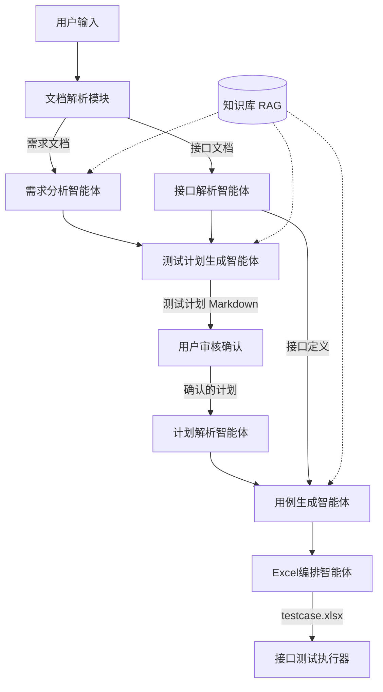

# Flow Forge — 接口自动化用例生成智能体

基于 LLM 的多智能体系统，用于将需求文档和接口文档转化为符合执行器格式的 Excel 测试用例。

## 系统架构



## 概述

Flow Forge 智能体系统将需求文档和 API 接口文档自动转化为可执行的测试用例（Excel 格式），输出文件可直接用于 Flow Forge 测试执行器。

**核心能力：**

- **需求分析**：从需求文档中提取业务流程、用户角色、约束条件和异常场景
- **计划生成**：基于需求分析结果生成包含 Mermaid 流程图的测试计划
- **用例编排**：根据审核通过的计划生成具体的单接口用例和业务链路用例
- **Excel 导出**：将用例输出为符合执行器格式的多 Sheet Excel 文件
- **知识增强**：内置 RAG 知识库，提供测试策略、参数依赖等最佳实践参考

### 依赖说明

| 依赖 | 用途 |
|------|------|
| openai | LLM 调用（兼容 OpenAI API 的模型） |
| chromadb | RAG 知识库向量存储 |
| openpyxl | Excel 文件读写 |
| prance | OpenAPI 3.0 规范解析 |
| pymupdf | PDF 需求文档解析 |
| pyyaml | YAML 配置文件解析 |
| python-dotenv | 环境变量加载 |

## 输入文件格式

### 需求文档

支持以下格式：
- **Markdown** (`.md`)：推荐格式，支持表格、列表等结构化内容
- **纯文本** (`.txt`)：任意文本格式的需求描述
- **PDF** (`.pdf`)：自动提取文本内容

### 接口文档

优先使用 **OpenAPI 3.0** 格式（JSON/YAML），也兼容 **Markdown 表格** 格式。

#### OpenAPI 3.0 示例

```yaml
openapi: 3.0.0
info:
  title: 电商平台 API
  version: 1.0.0
servers:
  - url: https://api.example.com
paths:
  /api/user/login:
    post:
      summary: 用户登录
      tags: [用户模块]
      requestBody:
        content:
          application/json:
            schema:
              type: object
              properties:
                username:
                  type: string
                password:
                  type: string
      responses:
        '200':
          description: 登录成功
```

#### Markdown 表格示例

| TestID | APIName | AppName | Method | URL | RequestHead | RequestBody | StatusCode | AssertDict |
|--------|---------|---------|--------|-----|-------------|-------------|------------|------------|
| api_login_post | 用户登录 | someApp | POST | /api/user/login | {"Content-Type":"application/json"} | {"username":"","password":""} | 200 | {"status_code":200} |

## 输出说明

### 测试计划 (plan_*.md)

Markdown 格式文档，包含：

1. **业务理解**：对需求的整体分析
2. **单接口测试点**：每个接口的正向/负向/边界/业务异常用例
3. **业务链路测试**：多步骤业务场景
4. **Mermaid 流程图**：关键业务流程的可视化图表

### Excel 用例文件

多 Sheet 结构，与执行器格式完全兼容：

- **Sheet 1 - API Definitions**：接口定义（TestID, APIName, AppName, Method, URL, RequestHead, RequestBody, StatusCode, AssertDict, Remark）
- **Sheet 2 - Single Cases**：单接口测试用例（额外包含 RelevanceID 和 Tag 列）
- **Sheet 3+**：业务链路用例（一个业务流一个 Sheet，包含 StepID, RelevanceID, Trans 等列）

## 配置说明

编辑 `.env` 文件配置 LLM 连接参数：

| 环境变量 | 说明 | 默认值 |
|----------|------|--------|
| `LLM_PROVIDER` | LLM 服务提供商 | `openai` |
| `LLM_API_KEY` | API 密钥 | （必填） |
| `LLM_MODEL` | 模型名称 | `gpt-4o` |
| `LLM_TEMPERATURE` | 生成温度 (0-1) | `0.3` |
| `LLM_MAX_TOKENS` | 最大输出 Token | `4096` |
| `EMBEDDING_MODEL` | 嵌入模型 | `text-embedding-3-small` |
| `KNOWLEDGE_DB_PATH` | 知识库路径 | `./chroma_data` |
| `MAX_STEPS` | 单智能体最大步数 | `10` |
| `MAX_RETRIES` | LLM 调用最大重试 | `3` |

## 智能体架构详解

### 文档解析模块 (`doc_parser/`)

负责读取和解析不同格式的输入文件：

| 解析器 | 输入 | 输出 |
|--------|------|------|
| `OpenApiParser` | OpenAPI 3.0 (JSON/YAML) | `List[InterfaceDef]` |
| `MarkdownParser` | Markdown 表格 | `List[InterfaceDef]` |
| `PdfParser` | PDF 文档 | 纯文本 |

### 智能体 (`agents/`)

每个智能体继承自 `BaseAgent`，具有 LLM 调用、重试和结构化输出能力：

| 智能体 | 职责 |
|--------|------|
| `RequirementAnalyzer` | 分析需求文档，提取业务流、角色、约束 |
| `ApiParser` | 自动识别并解析接口文档 |
| `PlanGenerator` | 生成 Markdown 测试计划 |
| `PlanParser` | 解析审核后的计划为结构化数据 |
| `CaseGenerator` | 生成具体参数值的测试用例 |
| `ExcelWriter` | 将用例写入 Excel 文件 |

### 流水线 (`pipeline/`)

`PipelineOrchestrator` 协调两阶段流水线：

1. **Phase 1 - 计划生成**：文档解析 → 需求分析 → 计划生成 → 保存 plan.md
2. **Phase 2 - 用例生成**：计划解析 → 用例生成 → Excel 写入

### 知识库 (`knowledge/`)

内置 RAG 知识库包含以下类型的知识条目：

- **业务规则**：如登录 Token 传递规范、CRUD 数据依赖
- **测试策略**：正向/负向/边界/业务异常测试方法
- **参数依赖模式**：Trans 字段格式、变量引用语法
- **缺陷模式**：金额精度、日期格式、空值处理等常见问题

知识库使用 ChromaDB 存储，首次运行时会自动初始化。如果 ChromaDB 不可用，会自动降级为内存关键词匹配。
