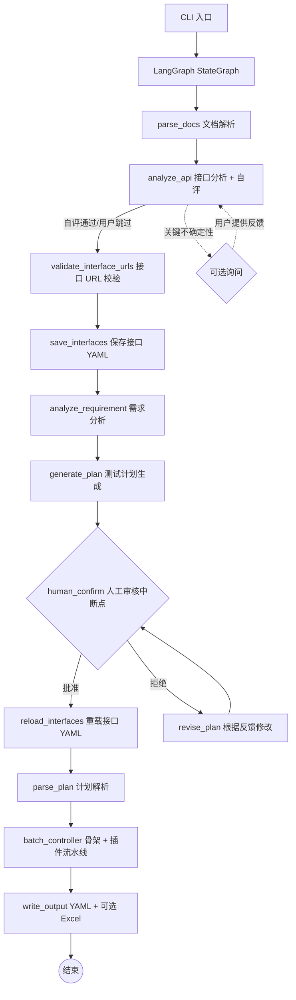

# Flow Forge — 接口自动化用例生成智能体

**中文** | [English](README.en.md)

基于 LangGraph 流水线模式的多智能体系统，将需求文档和接口文档转化为符合执行器格式的 YAML 测试用例（可选导出 Excel）。支持简单断言（`assert_dict`）和高级多运算符断言规则（`assert_rules`），覆盖等值校验、数值比较、正则匹配、列表聚合等场景。

## 系统架构



核心流程（共 9 步）：

1. **文档解析**：读取需求文档（Markdown / PDF / 纯文本）和接口文档（OpenAPI 3.0 / Markdown 表格）。支持 Token 感知的长文本分块处理

2. **接口分析**：分析接口文档完整性——认证方式、参数模式、缺失信息；自评通过则自动继续，仅关键不确定性时询问用户

3. **接口 URL 校验**（源级验证）：将接口 URL 与文档原文比对，未通过校验的 URL 自动触发 LLM 纠错重试

4. **保存接口定义**：将校验后的接口定义写入 YAML 文件。用户可在审核期间直接编辑 YAML，审核通过后系统重新加载

5. **需求分析**：LLM 从需求中提取业务流程、用户角色、约束条件、异常场景

6. **计划生成**：基于分析结果和接口定义生成 Markdown 测试计划

7. **人工审核**（强制中断点）：展示计划，用户可批准、提出文字修改意见或按批注文件修改。支持反馈循环直至批准

8. **用例生成**（骨架 + 插件流水线）：
   - 骨架生成：一次性生成全部单接口/业务链路用例骨架（含 test_id、relevance_id、URL 等元数据）
   - URL 校验：检查骨架中所有 URL 是否在文档原文中存在，不存在的提交纠错重试
   - 数据填充插件（默认）：按 batch_size 分批，根据接口定义填充 request_head、request_body、status_code、tag
   - 断言生成插件（默认）：分批生成 assert_dict（简单等值断言）和 assert_rules（高级断言规则）
   - 用户自定义插件（可选）：通过 `PLUGIN_MODULES` 注册，可在断言生成后补充任意用例属性

9. **输出**：YAML 文件（`single_cases/`、`biz_flows/`）+ 可选 Excel 导出

### 推荐工作流：Excel 编辑 + YAML 版本控制

- **Excel 适合批量编辑**：在 Flow Forge Studio 中打开生成的 Excel，快速浏览、排序、批量修改大量用例
- **YAML 适合做 diff**：用 converter 将 Excel 转为 YAML，git diff 可清晰展示变更内容
- **转换工具独立可用**：`python converter_main.py` 可在 Excel 和 YAML 之间互相转换

## 插件系统

### 默认插件

系统默认提供两个插件，无需配置即可使用：

| 插件 | 作用 | 属性 |
|------|------|------|
| `data_filling` | 为用例骨架填充请求数据（request_head, request_body, status_code, tag） | 单接口 + 业务链路 |
| `assertion_generation` | 为已填充用例生成断言（assert_dict, assert_rules） | 单接口 + 业务链路 |

### 用户自定义插件

在 `.env` 文件中启用并指定模块路径：

```
ENABLE_PLUGINS=true
PLUGIN_MODULES=my_plugins.pre_processor.PreProcessor,my_plugins.post_processor.PostProcessor
```

编写插件：

1. 继承 `CaseAttributeGenerator` 基类（`plugins/base.py`）
2. 声明 `PluginDeclaration`（插件名称、作用的属性、适用范围等）
3. 实现 `generate()` 方法（接收一批用例，返回补充属性后的用例列表）

```python
from plugins.base import CaseAttributeGenerator, PluginDeclaration

class CustomPlugin(CaseAttributeGenerator):
    @property
    def declaration(self):
        return PluginDeclaration(
            plugin_name="my-custom-plugin",
            attributes=["preprocessors"],
            applies_to_single=True,
            applies_to_biz=False,
            max_retries=1,
            error_strategy="skip",
        )

    def generate(self, cases, interfaces, api_summary, api_doc_text):
        for case in cases:
            case["preprocessors"] = [...]
        return cases
```

用户可通过 `PLUGIN_MODULES` 中显式指定与默认插件同名的插件来替换默认插件。

### PluginDeclaration 字段说明

| 字段 | 类型 | 说明 |
|------|------|------|
| `plugin_name` | str | 插件名称 |
| `attributes` | List[str] | 要添加的属性名列表 |
| `applies_to_single` | bool | 是否作用于单接口用例 |
| `applies_to_biz` | bool | 是否作用于业务链路用例 |
| `max_retries` | int | 每批失败重试次数 |
| `error_strategy` | str | 彻底失败策略: `"skip"` / `"warn"` / `"fail"` |

## 技术栈

| 依赖 | 用途 |
|------|------|
| `langgraph` | StateGraph 工作流编排、中断点、检查点 |
| `langchain-core` | ChatModel 抽象、消息类型 |
| `langchain-openai` | OpenAI ChatModel 适配器 |
| `openai` | 直接 LLM 调用（兼容 OpenAI API） |
| `openpyxl` | Excel 文件写入 |
| `prance` | OpenAPI 3.0 规范解析 |
| `pymupdf` | PDF 需求文档文本提取 |
| `pyyaml` | YAML 配置与 Skill 定义解析 |
| `python-dotenv` | `.env` 环境变量加载 |

## 目录结构

```text
agent/
├── main.py                      # CLI 入口（薄入口，实际逻辑在 cli/）
├── requirements.txt             # Python 依赖
├── .env.example                 # 环境变量模板
│
├── cli/
│   ├── __init__.py
│   ├── parser.py                # 命令行参数解析
│   ├── interactive.py           # 交互式审核循环
│   ├── bootstrap.py             # 日志设置 + 目录结构创建
│   └── runner.py                # 主流水线编排
│
├── config/
│   ├── __init__.py
│   └── settings.py              # 配置加载（.env → Settings dataclass）
│
├── i18n/
│   ├── __init__.py
│   ├── loader.py                # 根据 AGENT_LANG 加载翻译
│   ├── zh_CN.json               # 中文翻译表（默认）
│   └── en_US.json               # 英文翻译表
│
├── models/
│   ├── __init__.py
│   ├── schema.py                # 数据模型（InterfaceDef, TestPlan 等）
│   └── state.py                 # AgentConfig
│
├── llm/
│   ├── __init__.py
│   └── factory.py               # LLM 供应商工厂
│
├── prompts/
│   ├── __init__.py              # 统一导出所有提示词常量
│   ├── render.py                # {{variable}} 模板变量替换
│   ├── registry.py              # PromptRegistry：从 Python 模块加载
│   ├── api_analyzer.py          # 接口分析提示词
│   ├── requirement_analyzer.py  # 需求分析提示词
│   ├── plan_generator.py        # 计划生成提示词
│   ├── plan_reviser.py          # 计划修订提示词
│   ├── plan_parser.py           # 计划解析提示词
│   ├── case_generator.py        # 用例生成提示词（旧版）
│   ├── skeleton_generation.py   # 骨架生成提示词
│   ├── data_filling.py          # 数据填充提示词
│   ├── assertion_generation.py  # 断言生成提示词
│   ├── url_correction.py        # URL 纠错提示词
│   └── doc_parser.py            # 文档解析提示词
│
├── tools/
│   ├── __init__.py
│   ├── base.py                  # BaseTool 数据类
│   ├── registry.py              # ToolRegistry
│   ├── builtin/                 # 内置工具
│   └── custom/                  # 用户自定义工具
│
├── skills/
│   ├── __init__.py
│   ├── base.py                  # Skill 数据类
│   ├── registry.py              # SkillRegistry
│   ├── builtin/                 # 内置 Skill
│   └── custom/                  # 用户自定义 Skill
│
├── plugins/
│   ├── __init__.py
│   ├── base.py                  # CaseAttributeGenerator 基类
│   ├── loader.py                # 统一插件加载（默认 + 用户）
│   ├── default/                 # 默认插件
│   │   ├── __init__.py
│   │   ├── data_filling.py      # 数据填充插件
│   │   └── assertion_generation.py # 断言生成插件
│   └── custom/                  # 用户自定义插件
│
├── agents/
│   ├── __init__.py
│   ├── base.py                  # BaseAgent 基类
│   ├── requirement_analyzer.py  # 需求分析
│   ├── api_analyzer.py          # 接口分析
│   ├── plan_generator.py        # 计划生成
│   ├── plan_parser.py           # 计划解析
│   ├── case_generator.py        # 用例生成（旧版）
│   ├── skeleton_generator.py    # 用例骨架生成
│   ├── data_filler.py           # 测试数据填充
│   ├── assertion_generator.py   # 断言生成
│   ├── batch_controller.py      # 分批控制器（插件流水线编排）
│   └── excel_writer.py          # Excel 写入
│
├── graph/
│   ├── __init__.py
│   ├── state.py                 # GraphState TypedDict
│   ├── workflow.py              # build_workflow() 主 StateGraph
│   ├── checkpoint.py            # 断点续写管理
│   └── nodes/                   # 工作流节点（按职责拆分）
│       ├── __init__.py
│       ├── helpers.py           # 共享辅助函数
│       ├── parse_docs.py        # 文档解析节点
│       ├── analyze_api.py       # 接口分析节点
│       ├── analyze_requirement.py # 需求分析节点
│       ├── generate_plan.py     # 计划生成节点
│       ├── review.py            # 审核 + 修订节点
│       ├── parse_plan.py        # 计划解析节点
│       ├── generate_cases.py    # 用例生成节点（旧版）
│       ├── validate_urls.py     # URL 校验节点
│       ├── interfaces_io.py     # 接口保存/重载节点
│       ├── batch.py             # 分批控制节点
│       ├── output.py            # 输出写入节点
│       └── routing.py           # 条件路由函数
│
├── validators/
│   ├── __init__.py
│   ├── case_validator.py        # 用例格式校验
│   └── url_checker.py           # URL 存在性检查
│
├── knowledge/
│   ├── __init__.py
│   ├── search.py                # grep 文本检索知识库
│   └── *.md                     # 领域知识文件
│
├── doc_parser/
│   ├── __init__.py
│   ├── openapi_parser.py        # OpenAPI 3.0 解析器
│   ├── markdown_parser.py       # Markdown 表格解析器
│   ├── pdf_parser.py            # PDF 文本提取器
│   ├── llm_parser.py            # LLM 接口提取器
│   └── text_extractor.py        # 多格式文本提取
│
├── utils/
│   ├── __init__.py
│   ├── session_logger.py        # 会话日志记录
│   └── token_counter.py         # Token 计数
│
├── logs/                        # 运行日志（自动生成）
│   └── <timestamp>/
│       ├── session.jsonl
│       ├── debug.log
│       ├── plan.md
│       ├── state.json
│       └── excel_result.xlsx
│
└── <output>/                    # 输出目录
    ├── cases/
    │   ├── interfaces/
    │   ├── single_cases/
    │   ├── biz_flows/
    │   ├── failures.yaml
    │   └── test_cases.xlsx
    └── memory/
        ├── plan.md
        ├── plan_comments.json
        ├── history-comments/
        └── snapshots/
```

## 提示词管理

所有智能体的 system prompt 和 user template 统一存放在 `prompts/` 目录下的 Python 模块中。每个文件导出 `<AGENT>_SYSTEM` 和 `<AGENT>_USER` 常量。

修改提示词只需编辑对应文件，无需修改业务代码。`PromptRegistry` 提供程序化访问接口。

## 命令行参数

```
usage: main.py [-h] [--requirement REQUIREMENT [REQUIREMENT ...]]
               [--api API] [--output OUTPUT] [--env ENV] [--debug]
               [--parse-mode {raw,rule,llm}] [--prompt PROMPT]
               [--batch-size BATCH_SIZE] [--resume] [--resume-overwrite]

Flow Forge — API Test Case Generation Agent

optional arguments:
  --requirement PATH [PATH ...]
                        需求文档路径（.txt, .md, .pdf）
  --api PATH            接口文档路径（OpenAPI .yaml/.json 或 Markdown .md）
  --output PATH         输出根目录（默认 ./output_<timestamp>）
  --output-format {yaml,excel,both}
                        输出格式（默认 both）
  --batch-size N        每批最大用例数（默认 10，-1 不分批）
  --prompt TEXT, -p TEXT
                        用户补充指导，注入到计划生成和用例生成阶段
  --parse-mode {raw,rule,llm}, -m {raw,rule,llm}
                        API 文档解析模式（默认 raw）
  --parser-path PATH    自定义解析器 .py 文件路径（仅 -m rule 时生效）
  --reference-dir PATH  增量更新参考目录
  --resume              从已有 output 目录恢复执行
  --resume-overwrite    恢复时覆盖已有输出
  --debug-snapshots     保存调试快照
  --debug               启用调试日志（完整 LLM I/O）
  --env PATH            .env 文件路径（默认 .env）
  -v, --verbose         启用详细控制台日志
```

## 环境变量配置

`.env` 文件支持的环境变量：

| 变量 | 默认值 | 说明 |
|------|--------|------|
| `LLM_PROVIDER` | `openai` | LLM 供应商 |
| `LLM_API_KEY` | — | API 密钥（必填） |
| `LLM_BASE_URL` | — | API Base URL（兼容 OpenAI 的第三方 API） |
| `LLM_MODEL` | `gpt-4o` | 模型名称 |
| `LLM_TEMPERATURE` | `0.3` | 生成温度 |
| `LLM_MAX_OUTPUT_TOKENS` | `4096` | 单次最大输出 token |
| `LLM_CONTEXT_WINDOW` | `128000` | 上下文窗口大小 |
| `LLM_CONTEXT_COMPRESSION_THRESHOLD` | `0.9` | 上下文压缩阈值 |
| `LLM_MAX_CONCURRENCY` | `1` | 最大并发请求数 |
| `LLM_RATE_LIMIT_DELAY` | `0.0` | 请求间隔（秒） |
| `LLM_RETRY_BASE_DELAY` | `2.0` | 重试基础延迟（指数退避） |
| `LLM_REQUEST_TIMEOUT` | `600.0` | HTTP 请求超时（秒） |
| `ENABLE_KNOWLEDGE` | `false` | 启用知识库搜索 |
| `KNOWLEDGE_DIR` | `./knowledge` | 知识库目录 |
| `ENABLE_VALIDATION` | `true` | 启用用例格式校验 |
| `MAX_VALIDATION_RETRIES` | `3` | 校验失败重试次数 |
| `MAX_STEPS` | `10` | 最大智能体步数 |
| `MAX_RETRIES` | `3` | LLM 调用最大重试 |
| `URL_CORRECTION_MAX_RETRIES` | `3` | URL 纠错最大重试 |
| `BATCH_SIZE` | `10` | 每批用例数（-1 不分批） |
| `CONSECUTIVE_BATCH_FAILURE_LIMIT` | `3` | 连续批次失败上限 |
| `OUTPUT_DIR` | `./output` | 输出根目录 |
| `OUTPUT_FORMAT` | `both` | 输出格式 |
| `ENABLE_PLUGINS` | `false` | 启用用户自定义插件 |
| `PLUGIN_MODULES` | — | 用户插件模块路径（逗号分隔） |
| `AGENT_LANG` | `zh_CN` | 界面语言：`zh_CN` / `en_US` |

## 知识库

知识库 (`knowledge/search.py`) 提供基于 grep 的纯文本关键词搜索，无需 embedding 模型或外部向量数据库。知识以 `.md` 文件形式存放在 `knowledge/` 目录下。

通过 `.env` 中的 `ENABLE_KNOWLEDGE` 开关控制。启用后，各智能体在生成 prompt 时通过 grep 搜索 `.md` 文件，将匹配的知识片段追加到 prompt 末尾，提供领域知识和最佳实践参考。

用户可以自行在 `knowledge/` 目录下添加 `.md` 文件来扩展知识库。

## 设计理念

### 为什么用 LangGraph

LangGraph 提供三个关键能力：

- **状态管理**：`GraphState` TypedDict 在节点间自动传递，无需手动维护状态对象
- **中断与恢复**：`interrupt()` + `MemorySaver` 原生支持人工审核中断，可从断点精确恢复
- **条件路由**：`add_conditional_edges()` 让审核分支成为图的自然组成部分

### 为什么用 grep 替代 embedding 检索

- **零成本**：不需要 embedding API 调用
- **零外部依赖**：仅使用 Python 标准库
- **可解释**：精确匹配关键词，不会出现语义漂移
- **可扩展**：用户只需创建 `.md` 文件即可添加知识

### 为什么用流水线模式

流水线模式将测试用例生成分解为顺序执行的独立阶段（文档解析 → 接口分析 → 计划生成 → 审核 → 骨架生成 → 插件执行 → 输出）。每个阶段职责单一、可独立测试、可单独替换。相比 ReAct 模式，流水线模式更适合批处理场景，避免了工具调用循环的开销和不确定性。

### 为什么用插件架构

数据填充和断言生成作为默认插件提供，用户可以通过 `PLUGIN_MODULES` 注册自定义插件来替换或扩展默认行为。不同项目的测试需求差异很大——某些项目需要 HMAC 签名预处理、某些需要数据库连接验证——插件架构允许用户在不修改框架代码的前提下定制用例生成流程。
