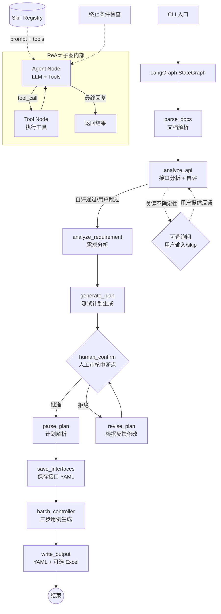

# Flow Forge — 接口自动化用例生成智能体

**中文** | [English](README.en.md)

基于 LangGraph + ReAct 模式的多智能体系统，将需求文档和接口文档转化为符合执行器格式的 YAML 测试用例（可选导出 Excel）。支持简单断言（`assert_dict`）和高级多运算符断言规则（`assert_rules`），覆盖等值校验、数值比较、正则匹配、列表聚合等场景。

## 系统架构



核心流程：

1. **文档解析**：读取需求文档（Markdown / PDF / 纯文本）和接口文档（OpenAPI 3.0 / Markdown 表格）
2. **接口分析**：分析接口文档完整性——认证方式、参数模式、缺失信息；智能体自评通过则自动继续，仅关键不确定性时询问用户
3. **需求分析**：LLM 从需求中提取业务流程、用户角色、约束条件、异常场景
4. **计划生成**：基于分析结果和接口定义生成 Markdown 测试计划，自动保存至 session 目录
5. **人工审核**（强制中断点）：展示计划，用户可批准、提出文字修改意见或按批注文件修改
6. **反馈循环**：用户拒绝时，系统根据反馈修改计划后重新提交审核，直至批准
7. **保存接口定义**：将分析后的接口定义写入 `{output}/cases/interfaces/` 目录，每个接口一个 YAML 文件，便于版本管理
8. **用例骨架生成**：SingleSkeletonGenerator 一次性生成全部单接口用例骨架；BizSkeletonGenerator 一次性生成全部业务链路骨架。包含 test_id/StepID（有含义）、relevance_id、api_name、method、url、remark、sheet_name。URL/relevance_id 严格来自接口定义
9. **URL 校验与纠错**：检查骨架中所有 URL 是否在接口文档原文中存在。不存在的 URL 提交给骨架生成器纠错重试（默认最多 3 次，通过 `URL_CORRECTION_MAX_RETRIES` 配置）。重试耗尽后添加 `<URL not exist>` 标记，跳过后续步骤直接写入 YAML，打印失败清单告知用户
10. **测试数据填充**：SingleDataFiller / BizDataFiller 按 `batch_size` 分批（纯代码切分，不再由 LLM 决定批次）。根据接口定义填充 request_head、request_body、status_code、tag；业务链路额外填充 Trans 和 `#{varName}` 引用。请求体使用接口定义中的数据类型，不自由发挥。设 `BATCH_SIZE=-1` 不分批
11. **断言生成**：SingleAssertionGenerator / BizAssertionGenerator 按 `batch_size` 分批。根据接口响应结构和测试场景生成 assert_dict（简单等值断言）和 assert_rules（高级断言规则）。业务链路额外处理跨步骤数据依赖的非空断言
12. **格式校验**（可选）：CaseValidator 校验每批生成的用例格式，错误自动重试（最多 3 次），最终报告失败用例
13. **输出**：YAML 文件（`single_cases/`、`biz_flows/`）+ 可选 Excel 导出

每个步骤在 CLI 中均有详细进度输出，包括：当前步骤 [N/9]、文件路径与大小、LLM 调用模型名、生成结果统计。用户始终清楚系统正在做什么。

## 自定义用例属性生成器插件

### 概念

在断言生成完成后，用户可以通过自定义插件为测试用例补充任意属性（如 `preprocessors`、`postprocessors` 等）。插件以智能体的形式运行，利用 LLM 分析用例内容，自动生成相应的配置。

常见的 4 种插件类型：

- 单接口前置处理器智能体
- 单接口后置处理器智能体
- 业务链路前置处理器智能体
- 业务链路后置处理器智能体

### 配置

在 `.env` 文件中启用插件并指定模块路径：

```
ENABLE_PLUGINS=true
# 逗号分隔多个模块路径，按顺序执行
PLUGIN_MODULES=my_plugins.single_pre_processor.SinglePreProcessor,my_plugins.biz_post_processor.BizPostProcessor
```

### 编写插件

1. 继承 `CaseAttributeGenerator` 基类（`plugins/base.py`）
2. 声明 `PluginDeclaration`（插件名称、作用的属性、适用范围等）
3. 实现 `generate()` 方法（接收一批已完成的用例，返回补充属性后的用例列表）

```python
from plugins.base import CaseAttributeGenerator, PluginDeclaration

class SinglePreProcessor(CaseAttributeGenerator):
    @property
    def declaration(self):
        return PluginDeclaration(
            plugin_name="single-pre-processor",
            attributes=["preprocessors"],
            applies_to_single=True,
            applies_to_biz=False,
            max_retries=1,
            error_strategy="skip",
        )

    def generate(self, cases, interfaces, api_summary, api_doc_text):
        # 用 LLM 分析每个用例，生成 preprocessors 列表
        for case in cases:
            case["preprocessors"] = [...]  # 由 LLM 生成
        return cases
```

### PluginDeclaration 字段说明

| 字段 | 类型 | 说明 |
|------|------|------|
| `plugin_name` | str | 插件名称 |
| `attributes` | List[str] | 要添加的属性名列表，如 `["preprocessors"]` |
| `applies_to_single` | bool | 是否作用于单接口用例 |
| `applies_to_biz` | bool | 是否作用于业务链路用例 |
| `max_retries` | int | 每批失败重试次数 |
| `error_strategy` | str | 彻底失败策略: `"skip"` 跳过 / `"warn"` 警告 / `"fail"` 终止 |

## 技术栈

| 依赖 | 用途 |
|------|------|
| `langgraph` | StateGraph 工作流编排、中断点、检查点 |
| `langchain-core` | ChatModel 抽象、消息类型 |
| `langchain-openai` | OpenAI ChatModel 适配器 |
| `openai` | 直接 LLM 调用（兼容 OpenAI API） |
| `openpyxl` | Excel 文件写入 |
| `prance` | OpenAPI 3.0 规范解析 |
| `pymupdf` | PDF 需求文档文本提取 |
| `pyyaml` | YAML 配置与 Skill 定义解析 |
| `python-dotenv` | `.env` 环境变量加载 |

## 目录结构

```text
agent/
├── main.py                      # CLI 入口
├── requirements.txt             # Python 依赖
├── .env.example                 # 环境变量模板
│
├── config/
│   ├── __init__.py
│   ├── settings.py              # 配置加载（.env → Settings dataclass）
│   └── prompts.yaml             # 所有智能体的提示词与 ReAct 终止条件
│
├── models/
│   ├── __init__.py
│   ├── schema.py                # 数据模型（InterfaceDef, TestPlan, BizFlow 等）
│   └── state.py                 # AgentConfig + ReActTerminationConfig
│
├── llm/
│   ├── __init__.py
│   └── factory.py               # LLM 供应商工厂（OpenAI / 可扩展）
│
├── prompts/
│   ├── __init__.py
│   ├── render.py                # {{variable}} 模板变量替换
│   └── registry.py              # PromptRegistry：从 YAML 加载提示词
│
├── tools/
│   ├── __init__.py
│   ├── base.py                  # BaseTool 数据类
│   ├── registry.py              # ToolRegistry：装饰器注册 + 自动发现
│   ├── builtin/                 # 内置工具
│   │   ├── __init__.py          # read_file, write_file, query_knowledge
│   │   ├── file_ops.py
│   │   └── rag_tool.py
│   └── custom/                  # 用户自定义工具目录
│       └── __init__.py
│
├── skills/
│   ├── __init__.py
│   ├── base.py                  # Skill 数据类
│   ├── registry.py              # SkillRegistry：加载、查询、注入
│   ├── builtin/                 # 内置 Skill（YAML 定义）
│   │   ├── sql_data_fetch.yaml  # SQL 数据获取技能
│   │   └── boundary_test.yaml   # 边界值测试技能
│   └── custom/                  # 用户自定义 Skill 目录
│       └── .gitkeep
│
├── plugins/
│   ├── __init__.py
│   ├── base.py                  # CaseAttributeGenerator 基类 + PluginDeclaration
│   ├── loader.py                # 插件发现与加载器
│   └── builtin/                 # 内置插件目录
│
├── agents/
│   ├── __init__.py
│   ├── base.py                  # BaseAgent + create_react_agent() 工厂
│   ├── requirement_analyzer.py  # 需求分析
│   ├── api_analyzer.py          # 接口分析
│   ├── plan_generator.py        # 计划生成
│   ├── plan_parser.py           # 计划解析
│   ├── case_generator.py        # 用例生成（旧，保留兼容）
│   ├── skeleton_generator.py    # 用例骨架生成（单接口 + 业务链路）
│   ├── data_filler.py           # 测试数据填充（单接口 + 业务链路）
│   ├── assertion_generator.py   # 断言生成（单接口 + 业务链路）
│   └── excel_writer.py          # Excel 写入
│
├── graph/
│   ├── __init__.py
│   ├── state.py                 # GraphState TypedDict（全局状态）
│   ├── workflow.py              # build_workflow() 主 StateGraph
│   └── nodes.py                 # 所有节点函数 + 条件路由
│
├── knowledge/
│   ├── __init__.py
│   ├── search.py                  # grep 文本检索知识库（零依赖）
│   ├── auth_token_convention.md   # Token 传递规范
│   ├── crud_resource_referencing.md
│   ├── trans_format.md
│   ├── pagination_rules.md
│   ├── monetary_precision.md
│   ├── datetime_format.md
│   ├── test_strategy.md
│   └── trans_specification.md
│
├── doc_parser/
│   ├── __init__.py
│   ├── openapi_parser.py        # OpenAPI 3.0 解析器
│   ├── markdown_parser.py       # Markdown 表格解析器
│   └── pdf_parser.py            # PDF 文本提取器
│   ├── llm_parser.py            # LLM 接口提取器 (--parse-mode llm)
│   ├── text_extractor.py        # 多格式文本提取 (DOCX/DOC/HTML)
│
├── utils/
│   ├── __init__.py
│   └── session_logger.py        # SessionLogger：会话目录 + 结构化事件日志
│
├── logs/                        # 运行日志（自动生成）
│   └── 2026-06-03_22-30-00/     # 按时间戳命名的会话目录
│       ├── session.jsonl        # 事件摘要日志（节点、LLM 调用、文件操作）
│       ├── debug.log            # 调试日志（完整 LLM I/O，仅 --debug 时生成）
│       ├── plan.md              # 生成的测试计划
│       ├── state.json           # 最终 GraphState 快照
│       └── excel_result.xlsx    # 输出 Excel 副本
│
├── <output>/                    # 输出目录（例: ./output_20260619_143052）
│   ├── cases/                   # 测试用例产物
│   │   ├── interfaces/          # 接口定义 YAML
│   │   ├── single_cases/        # 单接口测试用例 YAML
│   │   ├── biz_flows/           # 业务链路用例 YAML
│   │   ├── failures.yaml        # 校验失败的用例
│   │   └── test_cases.xlsx      # Excel 输出（可选）
│   └── memory/                  # 智能体输出文件（对话记忆）
│       ├── plan.md              # 生成的测试计划
│       ├── plan_comments.json   # 批注数据（审核期间）
│       ├── history-comments/    # 历史批注归档
│       └── snapshots/           # 各步骤中间状态快照
│           ├── api_summary.json          # [始终保存] 接口分析摘要
│           ├── requirement_analysis.json # [始终保存] 需求分析结果
│           ├── plan_parsed.json          # [始终保存] 结构化测试计划
│           ├── interfaces.json           # [--debug-snapshots]
│           └── extracted_texts.json      # [--debug-snapshots]
│
└── docs/
    ├── req.md                   # 示例需求文档
    └── api.yaml                 # 示例 OpenAPI 文档
```

## 安装指南

```bash
cd agent
pip install -r requirements.txt
cp .env.example .env
# 编辑 .env 文件，填入 LLM API Key
```

## 快速开始

### 1. 全流程（含交互式审核）

```bash
python main.py --requirement docs/req.md --api docs/api.yaml
```

**解析模式说明：**

| 模式 | 命令参数 | 行为 | 适用场景 |
|------|---------|------|---------|
| raw (默认) | `-m raw` | 读取 API 文档原文，由 ApiAnalyzer LLM 从文本中识别接口 | 非标准格式但具有一定结构、手写文档、DOCX/PDF |
| rule | `-m rule` | 使用内置规则解析器（OpenAPI/Markdown）或 `--parser-path` 指定的自定义解析器 | 标准 OpenAPI 3.0 / Markdown 表格 |
| llm | `-m llm` | 在 parse_docs 阶段用 LLM 预提取结构化接口定义 | 非标准但含 API 信息的文档，结构较弱或者模型较弱 |

使用 `--prompt` 注入用户补充指导：

```bash
python main.py --requirement docs/req.md --api docs/api.yaml \\
    --prompt "关注 VIP 用户的折扣逻辑和节假日特殊定价"
```

使用 `--parse-mode llm` 解析非标准 API 文档：

```bash
python main.py --requirement docs/req.md --api docs/handwritten_api.md \\
    -m llm
```

使用自定义解析器：

```bash
python main.py --requirement docs/req.md --api docs/my_api.json \\
    -m rule --parser-path custom/my_parser.py
```

开启调试模式（完整 LLM 输入输出写入 session 目录）：

```bash
python main.py --requirement docs/req.md --api docs/api.yaml --debug
```

系统生成计划后暂停，等待用户审核：

- 输入 `y` —— 批准计划，继续执行用例生成
- 输入 `n` —— 输入文字修改意见，系统根据反馈修改计划后重新提交审核
- 输入 `r` —— 按批注文件修改。需先在 case-editor 中对 plan.md 添加批注，系统会读取 plan_comments.json 进行修订
- 审核循环进行，直到用户批准为止

### 3. 使用多个需求文档

```bash
python main.py --requirement docs/req1.md docs/req2.txt docs/api_spec.pdf --api docs/api.yaml
```

## 输入/输出格式

### 输入

**需求文档**：支持 Markdown (`.md`)、纯文本 (`.txt`)、PDF (`.pdf`)。

**接口文档**：优先使用 OpenAPI 3.0 格式，也兼容 Markdown 表格格式。

OpenAPI 示例：

```yaml
openapi: 3.0.0
info:
  title: 电商平台 API
  version: 1.0.0
servers:
  - url: https://api.example.com
paths:
  /api/user/login:
    post:
      summary: 用户登录
      tags: [用户模块]
      requestBody:
        content:
          application/json:
            schema:
              type: object
              properties:
                username:
                  type: string
                password:
                  type: string
      responses:
        '200':
          description: 登录成功
```

Markdown 表格示例：

| TestID | APIName | AppName | Method | URL |
|--------|---------|---------|--------|-----|
| api_login_post | 用户登录 | someApp | POST | /api/user/login |

### 输出

**测试计划**：Markdown 文档，自动保存至 `logs/YYYY-MM-DD_HH-MM-SS/plan.md`，包含业务理解、单接口测试点、业务链路测试、Mermaid 流程图。

**会话日志**：每次运行在 `logs/` 下创建按时间戳命名的目录，包含 `session.jsonl`（事件流）、`state.json`（最终状态快照）和输出 Excel 副本。使用 `--debug` 时额外生成 `debug.log`（完整 LLM I/O）。

**YAML 用例文件**（默认）：每个接口/用例独立一个 `.yaml` 文件，存放在 `{output}/cases/interfaces/`、`{output}/cases/single_cases/`、`{output}/cases/biz_flows/` 目录下。便于 Git 版本管理、增量生成和断点续生成。

**Excel 用例文件**（可选）：设置 `OUTPUT_FORMAT=excel` 或 `both` 时从 YAML 转换生成，多 Sheet 结构，与执行器格式完全兼容：
- Sheet 1 — API Definitions：接口定义表
- Sheet 2 — Single Cases：单接口测试用例
- Sheet 3+ — 业务链路用例（每个业务流一个 Sheet）

## 配置说明

### .env 环境变量

| 环境变量 | 说明 | 默认值 |
|----------|------|--------|
| `LLM_PROVIDER` | LLM 服务提供商 | `openai` |
| `LLM_API_KEY` | API 密钥 | 必填 |
| `LLM_BASE_URL` | Base URL | 非必填，默认OpenAI端点 |
| `LLM_MODEL` | 模型名称 | `gpt-4o` |
| `LLM_TEMPERATURE` | 生成温度 (0-1) | `0.3` |
| `LLM_MAX_TOKENS` | 最大输出 Token | `4096` |
| `ENABLE_KNOWLEDGE` | 启用外部知识库（grep 文本检索） | `false` |
| `KNOWLEDGE_DIR` | 知识库 .md 文件目录 | `./knowledge` |
| `LLM_DOC_MAX_CHARS` | API 文档解析时发送给 LLM 的最大字符数 | `30000`（8K模型设2000，1M模型设100000+） |
| `MAX_STEPS` | 单智能体最大步数 | `10` |
| `MAX_STEPS_NO_PROGRESS` | 连续无进展 LLM 调用上限（触发 ConvergenceError） | `5` |
| `MAX_RETRIES` | LLM 调用最大重试 | `3` |
| `OUTPUT_DIR` | 输出根目录（测试用例产物与智能体对话记忆） | `./output` |
| `BATCH_SIZE` | 每批生成用例数上限（`-1` 表示不分批） | `10` |
| `URL_CORRECTION_MAX_RETRIES` | URL 校验失败后最大纠错重试次数 | `3` |
| `ENABLE_VALIDATION` | 是否启用用例格式校验 | `true` |
| `MAX_VALIDATION_RETRIES` | 校验失败最大重试次数 | `3` |
| `OUTPUT_FORMAT` | 输出格式（`yaml` / `excel` / `both`） | `both` |

### 输出目录结构

`--output` 指定输出根目录后，目录结构如下：

```
{output_dir}/
├── cases/                         # 测试用例产物
│   ├── interfaces/                # 接口定义 YAML（yaml/both 模式）
│   │   └── <test_id>.yaml
│   ├── single_cases/              # 单接口用例 YAML（yaml/both 模式）
│   │   └── <test_id>.yaml
│   ├── biz_flows/                 # 业务链路用例 YAML（yaml/both 模式）
│   │   └── <sheet_name>.yaml
│   ├── failures.yaml              # 校验失败的用例（如有）
│   └── test_cases.xlsx            # Excel 输出（excel/both 模式）
│
└── memory/                        # 智能体输出文件（对话记忆）
    ├── plan.md                    # 生成的 / 审核通过的测试计划
    ├── plan_comments.json         # 批注数据（审核期临时文件）
    ├── history-comments/          # 历史批注归档
    └── snapshots/                 # 各步骤中间状态快照
        ├── api_summary.json           # [始终保存] 接口分析摘要
        ├── requirement_analysis.json  # [始终保存] 需求分析结果
        ├── plan_parsed.json           # [始终保存] 结构化测试计划
        ├── interfaces.json            # [--debug-snapshots] 接口定义快照
        └── extracted_texts.json       # [--debug-snapshots] 文档提取原文
```

基础快照（3 个，始终保存）用于排查 LLM 生成质量和断点续写。调试快照（2 个）通过 `--debug-snapshots` 参数启用，仅在排查问题时需要。

### config/prompts.yaml — 提示词与终止条件

所有智能体的 system prompt、user template 和 ReAct 终止条件集中管理在 `config/prompts.yaml` 中。每个智能体可独立配置终止参数：

```yaml
requirement_analyzer:
  system: |
    你是一个专业的测试需求分析专家...
  user_template: |
    请分析以下需求文档...
  termination:
    max_iterations: 8
    max_time_seconds: 90

case_generator:
  system: |
    你是一个专业的测试用例编排专家...
  termination:
    max_iterations: 15
    max_time_seconds: 300
```

不配置 `termination` 的智能体使用全局默认值。

## 命令行参数

```
usage: main.py [-h] [--requirement REQUIREMENT [REQUIREMENT ...]]
               [--api API] [--output OUTPUT] [--env ENV] [-v]

Flow Forge — API Test Case Generation Agent

optional arguments:
  --requirement REQUIREMENT [REQUIREMENT ...]
                        需求文档路径（支持 .txt, .md, .pdf）
  --api API             接口文档路径（OpenAPI .yaml/.json 或 Markdown .md）
  --output OUTPUT       输出根目录（默认 ./output_&lt;timestamp&gt;）
  --output-format {yaml,excel,both}
                        输出格式（默认 both）
  --batch-size BATCH_SIZE
                        每批最大用例数（默认 10）
  --prompt PROMPT, -p PROMPT
                        用户补充指导，注入到计划生成和用例生成阶段
  --parse-mode {raw,rule,llm}, -m {raw,rule,llm}
                        API 文档解析模式（默认 raw）
                          raw  : 提取原文，由 ApiAnalyzer LLM 识别接口
                          rule : 使用规则解析器（OpenAPI / Markdown）
                          llm  : 用 LLM 预提取结构化接口定义
  --parser-path PATH    自定义解析器 .py 文件路径（仅 -m rule 时生效）
  --reference-dir REFERENCE_DIR
                        参考目录（增量更新场景），系统扫描已有计划/接口/用例，
                        仅对新增或变更部分进行规划
  --resume              断点续生成，跳过文档解析和计划生成，直接从已有
                        output 目录继续批量生成
  --env ENV             .env 文件路径
  -v, --verbose         详细控制台日志输出
  --debug               调试模式，在 session 目录中写入完整 LLM 输入输出
  --debug-snapshots     额外保存调试快照（interfaces.json + extracted_texts.json）
```

## 进度感知步数计数

### 原理

传统的步数计数方式是对所有 LLM 调用次数进行累加，达到上限即终止。这种方式在弱模型场景下存在问题：弱模型可能反复生成格式不正确的 JSON，每次都被校验器拒绝、触发重试，消耗步数配额。预估的 `_max_steps` 无法预知浪费多少步，最终仍会因 `ConvergenceError` 异常退出。

进度感知模式将计数逻辑从"总调用次数"改为"连续无进展的调用次数"：

- 每次 LLM 调用前，系统计算当前生成进度字符串（如 `single-[20:200]` 表示 200 个接口中已生成 20 个）
- 进度字符串与上次**相同** → `_step_count += 1`（无进展，累计）
- 进度字符串与上次**不同** → `_step_count = 1`（有进展，重置计数）
- 当 `_step_count > MAX_STEPS_NO_PROGRESS`（默认 5）→ 抛出 `ConvergenceError`

### 优势

- **持续进步的模型永不误杀**：只要每步都在产出新用例，步数计数器会持续重置
- **弱模型快速拦截**：连续 5 次 LLM 调用无任何进展时终止，避免无限重试
- **向后兼容**：未启用进度追踪的智能体仍使用传统计数方式

### 配置

通过 `.env` 中的 `MAX_STEPS_NO_PROGRESS` 环境变量设置（默认 5）。

## 断点续生成与增量更新

### 场景 A：断点续生成（`--resume`）

管道中途崩溃或用户主动中断后，使用 `--resume` 恢复生成。系统跳过文档解析和计划生成，直接从已有 `output_dir` 的接口和用例继续批量生成。

```bash
# 管道中断后继续生成
python main.py --resume --output ./output --api docs/api.yaml
```

前提：`{output}/cases/interfaces/` 目录中已存在接口 YAML 文件。

### 场景 B：增量更新（`--reference-dir`）

需求文档或接口文档发生变更（增加场景、修改字段）后，重新运行完整管道。通过 `--reference-dir` 指定旧产出目录，系统会：

1. 扫描参考目录中的 `plan.md`、`interfaces/`、`single_cases/`、`biz_flows/`
2. 将已有测试资产汇总，注入计划生成 LLM 提示中
3. LLM 仅对新增或变更的接口/场景进行规划，未变更部分标注"已覆盖"
4. 批量生成阶段仅处理新接口，已有用例自动跳过
5. 计划 `plan.md` 自动保存到 `output_dir`

```bash
# 不同目录增量更新（推荐：保留旧产出，新产出独立存放）
python main.py --requirement docs/req_v2.md --api docs/api_v2.yaml \
    --reference-dir ./output_v1 --output ./output_v2

# 同目录增量更新（原地扩展，文件重名时自动添加 _v2/_v3 后缀）
python main.py --requirement docs/req_v2.md --api docs/api_v2.yaml \
    --reference-dir ./output --output ./output
```

### 文件重名处理

当 `--reference-dir` 与 `--output` 指定的目录相同时（同目录增量更新），已存在的 YAML 文件不会被覆盖。新生成的用例文件自动添加 `_v2`、`_v3` 等后缀，用户可自行挑选保留哪个版本。

## 自定义解析器

用户可编写自己的解析脚本，通过  挂载。解析器需实现以下接口：


使用方式：


## 会话日志

每次运行会在  目录下创建按时间戳命名的会话目录：


**session.jsonl** 记录所有关键事件：


使用  参数时，额外生成 ，包含完整的 LLM system prompt、user prompt、response 全文和工具调用参数/返回值，方便定位问题。

## 智能体体系

系统包含 5 个 LLM 驱动的智能体和 1 个纯逻辑组件，每个都继承自 `BaseAgent`，具备 LLM 调用、重试和 JSON 解析能力：

| 智能体 | 职责 | 说明 |
|--------|------|------|
| `ApiAnalyzer` | 接口文档分析 | 分析接口完整性、认证方式、生成结构化摘要；自评质量，仅在关键信息缺失时询问用户 |
| `RequirementAnalyzer` | 需求分析 | 从需求文档提取业务流、角色、约束、异常场景（JSON 输出） |
| `PlanGenerator` | 计划生成 | 基于需求分析和接口定义生成 Markdown 测试计划 |
| `PlanParser` | 计划解析 | 将审核通过的 Markdown 计划解析为结构化 TestPlan |
| `SkeletonGenerator` | 骨架生成 | 包含 SingleSkeletonGenerator（单接口）和 BizSkeletonGenerator（业务链路），一次性生成全部用例骨架，ID 有含义，URL 严格来自接口定义 |
| `DataFiller` | 数据填充 | 包含 SingleDataFiller（单接口）和 BizDataFiller（业务链路+Trans），根据接口定义分批填充请求数据，不自由发挥 |
| `AssertionGenerator` | 断言生成 | 包含 SingleAssertionGenerator（单接口）和 BizAssertionGenerator（业务链路+跨步骤依赖），根据响应结构生成 assert_dict 和 assert_rules |
| `CaseValidator` | 格式校验 | 校验用例结构完整性，错误自动重试（最多 3 次），汇总失败报告 |
| `PlanReviser` | 计划修改 | 在审核反馈循环中，根据用户意见修改测试计划 |
| `PlanAnnotationReviser` | 批注修订 | 在审核反馈循环中，根据 plan_comments.json 中的行级批注逐条修改测试计划 |
| `ExcelWriter` | Excel 写入 | 将用例写入多 Sheet Excel 文件（不需要 LLM） |
| `YamlWriter` | YAML 读写 | 接口/用例的 YAML 文件读写（不需要 LLM） |

## LangGraph 编排

系统使用 LangGraph `StateGraph` 管理流水线，所有状态通过 `GraphState` TypedDict 在节点间自动传递。

### 流程节点

| 节点 | 功能 |
|------|------|
| `parse_docs` | 读取需求文件和 API 文档，存入 state |
| `analyze_api` | 调用 ApiAnalyzer 分析接口文档完整性，生成结构化摘要；自评通过则自动继续，关键不确定性时可选询问用户 |
| `analyze_requirement` | 调用 RequirementAnalyzer，提取结构化分析结果 |
| `generate_plan` | 调用 PlanGenerator，基于分析结果、接口摘要、接口定义生成 Markdown 测试计划 |
| `human_confirm` | **强制中断点**，暂停执行等待人工审核 |
| `revise_plan` | 根据用户反馈修改计划，完成后回到 human_confirm |
| `parse_plan` | 调用 PlanParser，解析计划为结构化数据 |
| `save_interfaces` | 将接口定义保存为 YAML 文件到 {output}/cases/interfaces/ |
| `batch_controller` | 运行三步生成流程：骨架生成（一次性）→ 数据填充（分批）→ 断言生成（分批）。支持断点续生成 |
| `write_output` | 根据 output_format 输出 YAML + 可选 Excel |

### 中断点与反馈循环

系统包含两种类型的中断点：

| 中断点 | 类型 | 触发条件 | 用户操作 |
|--------|------|----------|----------|
| `analyze_api` | **可选** | 智能体发现关键不确定性（认证方式无法推断、接口用途完全不明） | 提供反馈 / 输入 `skip` 跳过 |
| `human_confirm` | **强制** | 测试计划生成后始终触发 | `y` 批准 / `n` 提出文字修改意见 / `r` 按批注文件修改 |

`human_confirm` 节点使用 LangGraph 的 `interrupt()` 机制暂停执行。CLI 在检测到中断后：

1. 展示计划摘要
2. 询问用户：`y`（批准）、`n`（拒绝并输入文字修改意见）或 `r`（按批注文件修改）
3. 批准 → 以 `Command(resume="approved")` 继续，路由到 `parse_plan`
4. 拒绝 → 以 `Command(resume="反馈内容")` 继续，路由到 `revise_plan` → 修改完成后回到 `human_confirm`
5. 批注修订 → 系统读取 `plan_comments.json`，调用 `plan_annotation_reviser` 智能体按批注逐条修订计划，完成后回到 `human_confirm`，并将批注文件归档到 `history-comments/` 目录
6. 循环直到用户批准

`analyze_api` 采用智能体自评机制：生成摘要后自动检查是否存在关键不确定性（`auth_type` 不确定、`need_token` 无法判断、接口用途完全不明）。如果摘要质量良好则自动通过不打断用户；仅当存在关键缺失时才询问用户。用户可输入修改意见或输入 `skip` 带着未确定性继续。

用户可通过 `Ctrl+C` 随时终止进程。

### plan_comments.json 格式

当用户在 case-editor 中对 `plan.md` 添加行级批注后，case-editor 会生成 `plan_comments.json` 文件。选择 `r` 修订模式时，系统读取该文件并交由 `plan_annotation_reviser` 智能体按批注逐条修订计划。文件格式如下：

```json
[
  {
    "line_number": 12,
    "selected_text": "请求方法: GET",
    "review_comment": "这里应该是POST请求"
  },
  {
    "line_number": 25,
    "selected_text": "断言: 状态码 200",
    "review_comment": "不仅要断言200，还要断言返回体里有token字段"
  }
]
```

字段说明：
- `line_number`：批注所在的行号
- `selected_text`：被批注选中的文本内容
- `review_comment`：审阅者的修改意见

修订完成后，`plan_comments.json` 会被自动归档到 `history-comments/` 目录下，便于追溯历史批注记录。

### 检查点

通过 `MemorySaver` 检查点机制保存每个节点的执行状态，支持流程中断后的精确恢复。每次运行结束时，完整的 `GraphState` 快照写入 `logs/<session>/state.json`。

## ReAct 终止条件

每个 ReAct 子图内置四层终止保护，防止弱模型或模糊需求导致死循环：

| 层级 | 条件 | 说明 |
|------|------|------|
| 硬性上限 | `max_iterations` / `max_tool_calls_total` / `max_time_seconds` | 最大循环次数、工具调用总数、运行时间 |
| Token 预算 | `max_input_tokens` | 累计输入 token 上限，防止 token 爆炸 |
| 无进展检测 | `max_consecutive_same_tool` / `max_consecutive_no_result_change` | 连续调用同一工具或结果无变化 |
| 质量阈值 | `min_improvement_ratio` | 每次循环需有最低改进比 |

终止时不直接崩溃，而是采用降级策略：请求 LLM 基于已有信息做最终总结、截断历史后重试、或返回部分结果。

每层阈值的默认值可在 `config/prompts.yaml` 中按智能体独立覆写。

## Skill 系统

Skill 是一组 YAML 定义的"技能包"，为智能体注入额外的提示词指令和工具。用户无需修改 Python 代码即可为智能体添加新能力。

### 内置 Skill

- **boundary_test**：为数值型和字符串型参数自动生成边界值用例（最小值 ± 1、超长字符串、特殊字符注入等）
- **sql_data_fetch**：从数据库查询真实测试数据填充用例（依赖 `execute_sql` 工具）

### Skill 定义

```yaml
name: my_custom_skill
description: 用户自定义的业务测试技能
version: "1.0"
target_agents:
  - case_generator          # 应用到哪些智能体（空 = 所有）
prompt_extension: |
  ## 自定义分析能力
  在生成用例时，额外关注以下业务规则：
  - VIP 用户的折扣逻辑
  - 节假日特殊定价
tools:
  - my_custom_tool          # 该 Skill 依赖的工具（自动注入）
```

### 使用方式

在 `skills/custom/` 下创建 `.yaml` 文件即可，`SkillRegistry` 会自动扫描加载。创建智能体时：

1. `build_system_prompt()` 自动拼接基础 prompt + 所有适用 Skill 的 `prompt_extension`
2. `get_tool_names()` 收集所有 Skill 声明的工具名称，自动注入

## 工具系统

使用 `@ToolRegistry.register()` 装饰器注册工具函数：

```python
from tools.registry import ToolRegistry

@ToolRegistry.register(
    name="execute_sql",
    description="执行 SQL 查询并返回结果"
)
def execute_sql(connection_string: str, query: str) -> list[dict]:
    ...
```

工具文件放置于 `tools/builtin/` 或 `tools/custom/` 目录下，启动时通过 `ToolRegistry.auto_discover()` 自动发现。

### 内置工具

| 工具 | 说明 |
|------|------|
| `read_file` | 读取文件内容（需求文档、API 规范、已保存的计划） |
| `write_file` | 写入内容到文件（保存计划、中间结果） |
| `grep_knowledge` | 搜索知识库 .md 文件（最佳实践、测试策略、领域规则），仅在 ENABLE_KNOWLEDGE=true 时可用 |

## 知识库

知识库 (`knowledge/search.py`) 提供基于 grep 的纯文本关键词搜索，无需 embedding 模型或外部向量数据库。知识以 `.md` 文件形式存放在 `knowledge/` 目录下。

通过 `.env` 中的 `ENABLE_KNOWLEDGE` 开关控制：

- **`ENABLE_KNOWLEDGE=false`（默认）**：不加载知识库。智能体仅依赖自身知识、Skill 注入的提示词和工具完成工作
- **`ENABLE_KNOWLEDGE=true`**：初始化 `KnowledgeSearch` 实例。智能体在生成 prompt 时通过 grep 搜索 `.md` 文件，将匹配的知识片段追加到 prompt 末尾

知识条目类型：

- **业务规则**：Token 传递规范、CRUD 数据依赖等
- **测试策略**：正向/负向/边界/业务异常测试方法
- **参数依赖模式**：Trans 字段格式、`#{varName}` 变量引用语法
- **缺陷模式**：金额精度、日期格式、空值处理等常见问题

用户可以自行在 `knowledge/` 目录下添加 `.md` 文件来扩展知识库。同时注册了 `grep_knowledge` 工具供未来 ReAct 智能体自行决定调用时机。

## 设计理念

### 为什么用 LangGraph

LangGraph 提供了三个关键能力：

- **状态管理**：`GraphState` TypedDict 在节点间自动传递，无需手动维护状态对象或函数参数链
- **中断与恢复**：`interrupt()` + `MemorySaver` 组合原生支持人工审核中断，并可从断点精确恢复
- **条件路由**：`add_conditional_edges()` 让审核分支（批准/拒绝）成为图的自然组成部分，逻辑清晰可维护

### 为什么用 grep 替代 embedding 检索

Embedding 模型（如 `text-embedding-3-small`）需要额外的 API 调用和费用，检索结果也不一定与当前场景相关。grep 关键词搜索：

- **零成本**：不需要 embedding API 调用
- **零外部依赖**：仅使用 Python 标准库（`pathlib` + `re`）
- **可解释**：精确匹配关键词，不会出现语义漂移
- **可扩展**：用户只需创建 `.md` 文件即可添加知识，无需重建索引

同时，`ENABLE_KNOWLEDGE` 默认为 `false`，让不需要外部知识的场景（弱模型、Skill 已覆盖）不受干扰。

### 为什么用 ReAct 模式

ReAct（Reasoning + Acting）循环让 LLM 在推理的同时能够调用工具获取外部信息。在测试用例生成场景中，这意味着智能体可以：

- 通过 `grep_knowledge` 工具搜索知识库获取测试策略参考
- 读取 API 文档获取接口细节
- 查询数据库获取真实测试数据

而不仅仅是依赖模型训练时学到的知识。

### 为什么设多层终止条件

不同模型的工具调用能力差异很大，弱模型（如 32B 自建模型）或模糊需求可能触发工具调用死循环。四层终止条件（硬上限 → Token 预算 → 无进展检测 → 质量阈值）按优先级逐层拦截，终止后不是崩溃而是降级处理，保障系统的鲁棒性。

### 为什么用可插拔 Skill

测试场景千差万别，不同项目需要不同的测试策略。将提示词扩展和工具封装为 Skill YAML，用户只需创建文件即可定制智能体行为，无需阅读或修改 Agent 源码。这降低了定制门槛，也使内置能力与自定义能力使用完全相同的机制。
