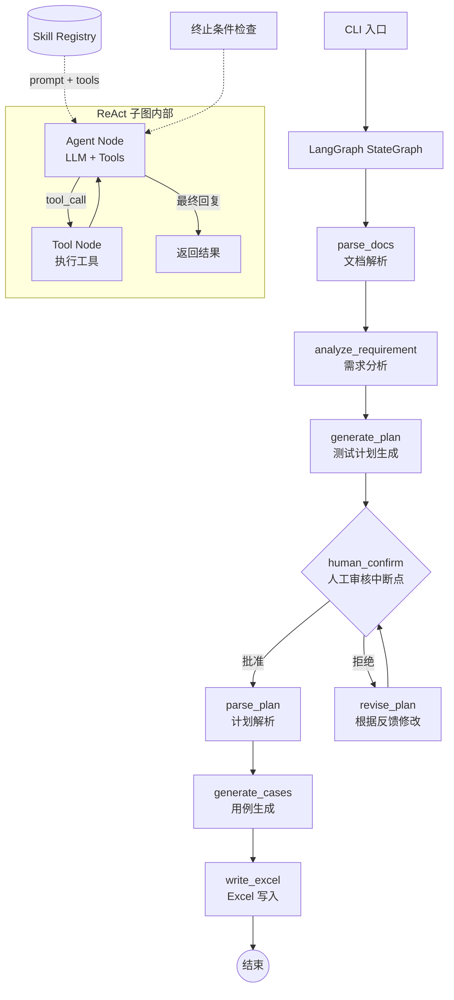

# Flow Forge — 接口自动化用例生成智能体

基于 LangGraph + ReAct 模式的多智能体系统，将需求文档和接口文档转化为符合执行器格式的 Excel 测试用例。

## 系统架构



核心流程：

1. **文档解析**：读取需求文档（Markdown / PDF / 纯文本）和接口文档（OpenAPI 3.0 / Markdown 表格）
2. **需求分析**：LLM 从需求中提取业务流程、用户角色、约束条件、异常场景
3. **计划生成**：基于分析结果和接口定义生成 Markdown 测试计划
4. **人工审核**（中断点）：展示计划，用户可批准或提出修改意见
5. **反馈循环**：用户拒绝时，系统根据反馈修改计划后重新提交审核，直至批准
6. **计划解析**：将审核通过的计划解析为结构化数据
7. **用例生成**：生成包含具体参数值的单接口用例和业务链路用例
8. **Excel 输出**：写入多 Sheet Excel 文件，与执行器格式完全兼容

## 技术栈

| 依赖 | 用途 |
|------|------|
| `langgraph` | StateGraph 工作流编排、中断点、检查点 |
| `langchain-core` | ChatModel 抽象、消息类型 |
| `langchain-openai` | OpenAI ChatModel 适配器 |
| `openai` | 直接 LLM 调用（兼容 OpenAI API） |
| `chromadb` | RAG 知识库向量存储 |
| `openpyxl` | Excel 文件写入 |
| `prance` | OpenAPI 3.0 规范解析 |
| `pymupdf` | PDF 需求文档文本提取 |
| `pyyaml` | YAML 配置与 Skill 定义解析 |
| `python-dotenv` | `.env` 环境变量加载 |

## 目录结构

```text
agent/
├── main.py                      # CLI 入口
├── requirements.txt             # Python 依赖
├── .env.example                 # 环境变量模板
│
├── config/
│   ├── __init__.py
│   ├── settings.py              # 配置加载（.env → Settings dataclass）
│   └── prompts.yaml             # 所有智能体的提示词与 ReAct 终止条件
│
├── models/
│   ├── __init__.py
│   ├── schema.py                # 数据模型（InterfaceDef, TestPlan, BizFlow 等）
│   └── state.py                 # AgentConfig + ReActTerminationConfig
│
├── llm/
│   ├── __init__.py
│   └── factory.py               # LLM 供应商工厂（OpenAI / 可扩展）
│
├── prompts/
│   ├── __init__.py
│   ├── render.py                # {{variable}} 模板变量替换
│   └── registry.py              # PromptRegistry：从 YAML 加载提示词
│
├── tools/
│   ├── __init__.py
│   ├── base.py                  # BaseTool 数据类
│   ├── registry.py              # ToolRegistry：装饰器注册 + 自动发现
│   ├── builtin/                 # 内置工具
│   │   ├── __init__.py          # read_file, write_file, query_knowledge
│   │   ├── file_ops.py
│   │   └── rag_tool.py
│   └── custom/                  # 用户自定义工具目录
│       └── __init__.py
│
├── skills/
│   ├── __init__.py
│   ├── base.py                  # Skill 数据类
│   ├── registry.py              # SkillRegistry：加载、查询、注入
│   ├── builtin/                 # 内置 Skill（YAML 定义）
│   │   ├── sql_data_fetch.yaml  # SQL 数据获取技能
│   │   └── boundary_test.yaml   # 边界值测试技能
│   └── custom/                  # 用户自定义 Skill 目录
│       └── .gitkeep
│
├── agents/
│   ├── __init__.py
│   ├── base.py                  # BaseAgent + create_react_agent() 工厂
│   ├── requirement_analyzer.py  # 需求分析
│   ├── plan_generator.py        # 计划生成
│   ├── plan_parser.py           # 计划解析
│   ├── case_generator.py        # 用例生成
│   └── excel_writer.py          # Excel 写入
│
├── graph/
│   ├── __init__.py
│   ├── state.py                 # GraphState TypedDict（全局状态）
│   ├── workflow.py              # build_workflow() 主 StateGraph
│   └── nodes.py                 # 所有节点函数 + 条件路由
│
├── knowledge/
│   ├── __init__.py
│   └── rag.py                   # RAG 知识库（ChromaDB + 内存降级）
│
├── doc_parser/
│   ├── __init__.py
│   ├── openapi_parser.py        # OpenAPI 3.0 解析器
│   ├── markdown_parser.py       # Markdown 表格解析器
│   └── pdf_parser.py            # PDF 文本提取器
│
└── docs/
    ├── req.md                   # 示例需求文档
    └── api.yaml                 # 示例 OpenAPI 文档
```

## 安装指南

```bash
cd agent
pip install -r requirements.txt
cp .env.example .env
# 编辑 .env 文件，填入 LLM API Key
```

## 快速开始

### 1. 生成测试计划（两阶段模式）

```bash
# Phase 1: 生成测试计划
python main.py --requirement docs/req.md --api docs/api.yaml --plan-only
```

系统生成 `plan_YYYYMMDD_HHMMSS.md`，人工审核后：

```bash
# Phase 2: 基于审核通过的计划生成 Excel
python main.py --from-plan plan_20260601_120000.md --api docs/api.yaml --output testcase.xlsx
```

### 2. 全流程（含交互式审核）

```bash
python main.py --requirement docs/req.md --api docs/api.yaml --output testcase.xlsx
```

系统生成计划后暂停，等待用户审核：

- 输入 `y` —— 批准计划，继续执行用例生成
- 输入 `n` —— 输入修改意见，系统根据反馈修改计划后重新提交审核
- 审核循环进行，直到用户批准为止

### 3. 使用多个需求文档

```bash
python main.py --requirement docs/req1.md docs/req2.txt docs/api_spec.pdf --api docs/api.yaml --output testcase.xlsx
```

## 输入/输出格式

### 输入

**需求文档**：支持 Markdown (`.md`)、纯文本 (`.txt`)、PDF (`.pdf`)。

**接口文档**：优先使用 OpenAPI 3.0 格式，也兼容 Markdown 表格格式。

OpenAPI 示例：

```yaml
openapi: 3.0.0
info:
  title: 电商平台 API
  version: 1.0.0
servers:
  - url: https://api.example.com
paths:
  /api/user/login:
    post:
      summary: 用户登录
      tags: [用户模块]
      requestBody:
        content:
          application/json:
            schema:
              type: object
              properties:
                username:
                  type: string
                password:
                  type: string
      responses:
        '200':
          description: 登录成功
```

Markdown 表格示例：

| TestID | APIName | AppName | Method | URL |
|--------|---------|---------|--------|-----|
| api_login_post | 用户登录 | someApp | POST | /api/user/login |

### 输出

**测试计划** (`plan_*.md`)：Markdown 文档，包含业务理解、单接口测试点、业务链路测试、Mermaid 流程图。

**Excel 用例文件**：多 Sheet 结构，与执行器格式完全兼容：
- Sheet 1 — API Definitions：接口定义表
- Sheet 2 — Single Cases：单接口测试用例
- Sheet 3+ — 业务链路用例（每个业务流一个 Sheet）

## 配置说明

### .env 环境变量

| 环境变量 | 说明 | 默认值 |
|----------|------|--------|
| `LLM_PROVIDER` | LLM 服务提供商 | `openai` |
| `LLM_API_KEY` | API 密钥 | （必填） |
| `LLM_MODEL` | 模型名称 | `gpt-4o` |
| `LLM_TEMPERATURE` | 生成温度 (0-1) | `0.3` |
| `LLM_MAX_TOKENS` | 最大输出 Token | `4096` |
| `EMBEDDING_MODEL` | 嵌入模型 | `text-embedding-3-small` |
| `KNOWLEDGE_DB_PATH` | 知识库路径 | `./chroma_data` |
| `MAX_STEPS` | 单智能体最大步数 | `10` |
| `MAX_RETRIES` | LLM 调用最大重试 | `3` |

### config/prompts.yaml — 提示词与终止条件

所有智能体的 system prompt、user template 和 ReAct 终止条件集中管理在 `config/prompts.yaml` 中。每个智能体可独立配置终止参数：

```yaml
requirement_analyzer:
  system: |
    你是一个专业的测试需求分析专家...
  user_template: |
    请分析以下需求文档...
  termination:
    max_iterations: 8
    max_time_seconds: 90

case_generator:
  system: |
    你是一个专业的测试用例编排专家...
  termination:
    max_iterations: 15
    max_time_seconds: 300
```

不配置 `termination` 的智能体使用全局默认值。

## 命令行参数

```
usage: main.py [-h] [--requirement REQUIREMENT [REQUIREMENT ...]]
               [--api API] [--output OUTPUT] [--plan-only]
               [--from-plan FROM_PLAN] [--env ENV] [-v]

Flow Forge — API Test Case Generation Agent

optional arguments:
  --requirement REQUIREMENT [REQUIREMENT ...]
                        需求文档路径（支持 .txt, .md, .pdf）
  --api API             接口文档路径（OpenAPI .yaml/.json 或 Markdown .md）
  --output OUTPUT       输出 Excel 文件路径
  --plan-only           仅生成测试计划，不生成 Excel
  --from-plan FROM_PLAN
                        从已审核通过的计划生成 Excel
  --env ENV             .env 文件路径
  -v, --verbose         详细日志输出
```

## 智能体体系

系统包含 5 个 LLM 驱动的智能体和 1 个纯逻辑组件，每个都继承自 `BaseAgent`，具备 LLM 调用、重试和 JSON 解析能力：

| 智能体 | 职责 | 说明 |
|--------|------|------|
| `RequirementAnalyzer` | 需求分析 | 从需求文档提取业务流、角色、约束、异常场景（JSON 输出） |
| `PlanGenerator` | 计划生成 | 基于需求分析和接口定义生成 Markdown 测试计划 |
| `PlanParser` | 计划解析 | 将审核通过的 Markdown 计划解析为结构化 TestPlan |
| `CaseGenerator` | 用例生成 | 生成包含具体参数值的单接口用例和业务链路用例 |
| `PlanReviser` | 计划修改 | 在审核反馈循环中，根据用户意见修改测试计划 |
| `ExcelWriter` | Excel 写入 | 将用例写入多 Sheet Excel 文件（不需要 LLM） |

## LangGraph 编排

系统使用 LangGraph `StateGraph` 管理流水线，所有状态通过 `GraphState` TypedDict 在节点间自动传递。

### 流程节点

| 节点 | 功能 |
|------|------|
| `parse_docs` | 读取需求文件和 API 文档，存入 state |
| `analyze_requirement` | 调用 RequirementAnalyzer，提取结构化分析结果 |
| `generate_plan` | 调用 PlanGenerator，生成 Markdown 测试计划 |
| `human_confirm` | **中断点**，暂停执行等待人工审核 |
| `revise_plan` | 根据用户反馈修改计划，完成后回到 human_confirm |
| `parse_plan` | 调用 PlanParser，解析计划为结构化数据 |
| `generate_cases` | 调用 CaseGenerator，生成具体用例 |
| `write_excel` | 调用 ExcelWriter，输出 Excel 文件 |

### 中断点与反馈循环

`human_confirm` 节点使用 LangGraph 的 `interrupt()` 机制暂停执行。CLI 在检测到中断后：

1. 展示计划摘要
2. 询问用户：`y`（批准）或 `n`（拒绝并输入修改意见）
3. 批准 → 以 `Command(resume="approved")` 继续，路由到 `parse_plan`
4. 拒绝 → 以 `Command(resume="反馈内容")` 继续，路由到 `revise_plan` → 修改完成后回到 `human_confirm`
5. 循环直到用户批准

用户可通过 `Ctrl+C` 随时终止进程。

### 检查点

通过 `MemorySaver` 检查点机制保存每个节点的执行状态，支持流程中断后的精确恢复。

## ReAct 终止条件

每个 ReAct 子图内置四层终止保护，防止弱模型或模糊需求导致死循环：

| 层级 | 条件 | 说明 |
|------|------|------|
| 硬性上限 | `max_iterations` / `max_tool_calls_total` / `max_time_seconds` | 最大循环次数、工具调用总数、运行时间 |
| Token 预算 | `max_input_tokens` | 累计输入 token 上限，防止 token 爆炸 |
| 无进展检测 | `max_consecutive_same_tool` / `max_consecutive_no_result_change` | 连续调用同一工具或结果无变化 |
| 质量阈值 | `min_improvement_ratio` | 每次循环需有最低改进比 |

终止时不直接崩溃，而是采用降级策略：请求 LLM 基于已有信息做最终总结、截断历史后重试、或返回部分结果。

每层阈值的默认值可在 `config/prompts.yaml` 中按智能体独立覆写。

## Skill 系统

Skill 是一组 YAML 定义的"技能包"，为智能体注入额外的提示词指令和工具。用户无需修改 Python 代码即可为智能体添加新能力。

### 内置 Skill

- **boundary_test**：为数值型和字符串型参数自动生成边界值用例（最小值 ± 1、超长字符串、特殊字符注入等）
- **sql_data_fetch**：从数据库查询真实测试数据填充用例（依赖 `execute_sql` 工具）

### Skill 定义

```yaml
name: my_custom_skill
description: 用户自定义的业务测试技能
version: "1.0"
target_agents:
  - case_generator          # 应用到哪些智能体（空 = 所有）
prompt_extension: |
  ## 自定义分析能力
  在生成用例时，额外关注以下业务规则：
  - VIP 用户的折扣逻辑
  - 节假日特殊定价
tools:
  - my_custom_tool          # 该 Skill 依赖的工具（自动注入）
```

### 使用方式

在 `skills/custom/` 下创建 `.yaml` 文件即可，`SkillRegistry` 会自动扫描加载。创建智能体时：

1. `build_system_prompt()` 自动拼接基础 prompt + 所有适用 Skill 的 `prompt_extension`
2. `get_tool_names()` 收集所有 Skill 声明的工具名称，自动注入

## 工具系统

使用 `@ToolRegistry.register()` 装饰器注册工具函数：

```python
from tools.registry import ToolRegistry

@ToolRegistry.register(
    name="execute_sql",
    description="执行 SQL 查询并返回结果"
)
def execute_sql(connection_string: str, query: str) -> list[dict]:
    ...
```

工具文件放置于 `tools/builtin/` 或 `tools/custom/` 目录下，启动时通过 `ToolRegistry.auto_discover()` 自动发现。

### 内置工具

| 工具 | 说明 |
|------|------|
| `read_file` | 读取文件内容（需求文档、API 规范、已保存的计划） |
| `write_file` | 写入内容到文件（保存计划、中间结果） |
| `query_knowledge` | 查询 RAG 知识库（最佳实践、测试策略、领域规则） |

## 知识库

RAG 知识库 (`knowledge/rag.py`) 使用 ChromaDB 存储，为智能体提供领域知识参考。包含以下类型的知识条目：

- **业务规则**：Token 传递规范、CRUD 数据依赖等
- **测试策略**：正向/负向/边界/业务异常测试方法
- **参数依赖模式**：Trans 字段格式、`#{varName}` 变量引用语法
- **缺陷模式**：金额精度、日期格式、空值处理等常见问题

首次运行时自动初始化。ChromaDB 不可用时自动降级为内存关键词匹配。

## 设计理念

### 为什么用 LangGraph

LangGraph 提供了三个关键能力：

- **状态管理**：`GraphState` TypedDict 在节点间自动传递，无需手动维护状态对象或函数参数链
- **中断与恢复**：`interrupt()` + `MemorySaver` 组合原生支持人工审核中断，并可从断点精确恢复
- **条件路由**：`add_conditional_edges()` 让审核分支（批准/拒绝）成为图的自然组成部分，逻辑清晰可维护

### 为什么用 ReAct 模式

ReAct（Reasoning + Acting）循环让 LLM 在推理的同时能够调用工具获取外部信息。在测试用例生成场景中，这意味着智能体可以：

- 查询 RAG 知识库获取测试策略参考
- 读取 API 文档获取接口细节
- 查询数据库获取真实测试数据

而不仅仅是依赖模型训练时学到的知识。

### 为什么设多层终止条件

不同模型的工具调用能力差异很大，弱模型（如 32B 自建模型）或模糊需求可能触发工具调用死循环。四层终止条件（硬上限 → Token 预算 → 无进展检测 → 质量阈值）按优先级逐层拦截，终止后不是崩溃而是降级处理，保障系统的鲁棒性。

### 为什么用可插拔 Skill

测试场景千差万别，不同项目需要不同的测试策略。将提示词扩展和工具封装为 Skill YAML，用户只需创建文件即可定制智能体行为，无需阅读或修改 Agent 源码。这降低了定制门槛，也使内置能力与自定义能力使用完全相同的机制。
