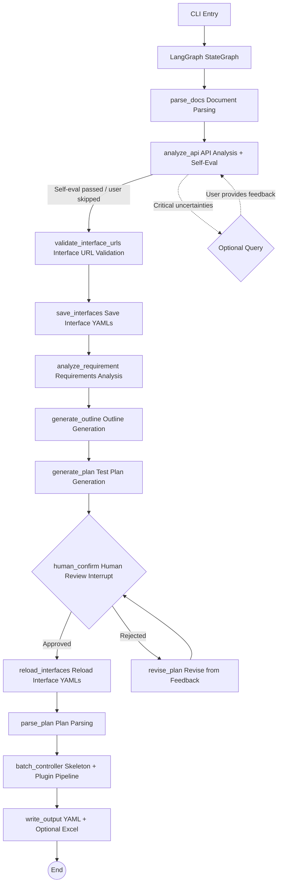

# How It Works

[← Back to agent/README](../README.en.md)

This document explains the agent's internal mechanics: the pipeline architecture, human review modes (y/n/r), prompt management, auto mode, directory structure, and design philosophy.

---

## System Architecture

A multi-agent pipeline built on the LangGraph StateGraph that turns requirement documents and API documentation into YAML cases in the executor's format (with optional Excel export).



### Core Workflow (11 Steps)

1. **Document Parsing**: Reads requirement documents (Markdown / PDF / plain text) and API documentation (OpenAPI 3.0 / Markdown tables), with token-aware chunking for long texts.
2. **API Analysis**: Analyzes the completeness of the API documentation — authentication methods, parameter patterns, missing information; when the self-evaluation passes it continues automatically, only asking the user about critical uncertainties.
3. **Interface URL Validation** (source-level): Compares interface URLs against the source document; URLs that fail trigger automatic LLM correction retries (see [anti-hallucination.md](./anti-hallucination.en.md#url-correction)).
4. **Save Interface Definitions**: Writes the validated interface definitions to YAML. Users can edit the YAML directly during review; the system reloads it after approval.
5. **Requirements Analysis**: The LLM extracts business flows, user roles, constraints, and exception scenarios from the requirements.
6. **Outline Generation**: Based on the requirements analysis and the interface list (names/URLs only), generates a lightweight JSON outline that groups interfaces by business domain and lists business flows. The outline is very small (< 1000 tokens), guaranteeing it is not truncated.
7. **Plan Generation**: Generates a Markdown test plan from the outline in chunks (the four-phase approach; see [anti-hallucination.md](./anti-hallucination.en.md#skeleton-batching-and-plan-chunking)).
8. **Human Review** (mandatory interrupt): Displays the plan; the user chooses to approve, provide text feedback, or revise from an annotation file, with a feedback loop until approval (see [Human Review Modes](#human-review-modes-ynr) below).
9. **Plan Parsing**: Parses the approved Markdown plan into structured data and extracts the list of test points.
10. **Case Generation** (skeleton + plugin pipeline): Generates skeletons in batches → URL validation → runs plugins in the configured order (data filling, assertion generation, etc.). See [plugins-and-skills.md](./plugins-and-skills.en.md) for details.
11. **Output**: YAML files (`single_cases/`, `biz_flows/`) + optional Excel export.

---

## Human Review Modes (y/n/r)

Step 8, "Human Review," is a mandatory interrupt. After the CLI displays the generated test plan, the user enters one of the following three options at the interactive prompt:

| Input | Meaning | Behavior |
|------|------|------|
| `y` | Approve | Confirms the plan; the pipeline continues to case generation |
| `n` | Text feedback | Enter revision notes as text; the agent revises the plan accordingly and returns to review |
| `r` | Revise from annotation file | The agent reads the structured annotations in `memory/plan_comments.json` (produced by [Studio's Markdown Plan Annotator](../../studio/README.en.md)) and revises the plan accordingly |

- `n` (text feedback) uses chunk-level revision: Section Impact Analysis (LLM determines which top-level sections are affected) → Chunk Intent Analysis (LLM determines which chunks need which operations) → Execute (shared code path with r mode).
- `r` (annotation-based revision) uses chunk-level revision: Annotation-to-Chunk mapping (code-level) → Intent Analysis (LLM → noop/fix/delete_chunk/add_chunk) → Execute Chunk Actions (fix regenerates from outline / delete_chunk removes / add_chunk creates new). For business flow chunks, fix regenerates the Mermaid diagram first, then the plan text.
- The test plan's chunk structure is determined during outline generation (`plan_sections.json`), which serves as the authoritative data source for all subsequent revisions — no more reverse-parsing from `plan.md`.
- The feedback loop supports multiple rounds until the user enters `y` to approve.
- If critical uncertainties arise during the API analysis stage (step 2), it will also interrupt to ask; the user can enter text feedback or `skip` to bypass it.

---

## Auto Mode

Auto mode skips all human review and runs the entire case generation flow end to end. It is intended for batch generation scenarios after skills and plugins have been fully tuned.

### How to Enable

- **CLI**: `--auto`
- **Config file**: `pipeline.auto: true` in `env.yaml`
- When both are set, the CLI flag takes precedence

### Behavior

| Review point | Auto mode behavior |
|--------|-------------|
| API analysis uncertainty prompts | Print a warning and skip, then continue |
| Test plan review | Auto-approve and proceed directly to case generation |

### Use Cases

```bash
# Nightly batch generation
python main.py --requirement docs/req.md --api docs/api.yaml --auto

# Unattended continuation after a power loss
python main.py --resume --output output_20240101_120000 --auto
```

### Difference Between --auto and --resume

| Flag | Purpose | When to Use |
|------|------|---------|
| `--auto` | Skip human interaction and run the full pipeline | First-time nightly batch generation |
| `--resume` | Resume from the last interruption (full pipeline supported), automatically loads the original run configuration | Continue after a power loss / error |
| `--resume --auto` | Resume + auto-approve remaining reviews | Unattended recovery after a power loss |

> **Prerequisites**: Before using auto mode, tune your skills (business rules) and plugin configuration first, and consider passing additional business guidance via `--prompt` to ensure the quality of automatic generation.

---

## Checkpoint System & Manual Editing

### Two-Layer Checkpoint Architecture

Flow Forge uses a two-layer checkpoint mechanism for precise recovery after interruption:

| Layer | File | Purpose |
|-------|------|---------|
| **Pipeline layer (Layer 1)** | `memory/pipeline_state.json` | Tracks the current LangGraph node; determines which node to resume from |
| **Batch layer (Layer 2)** | `memory/checkpoint.json` + `memory/checkpoint_data.json` | Tracks per-batch progress inside the `batch_controller` node; resume continues from the interruption point instead of restarting |

### `memory/` Files Overview

All files reside in the `memory/` subdirectory under the output directory:

| File | Purpose | Manually Editable |
|------|---------|:---:|
| `pipeline_state.json` | Pipeline node progress (`completed_stage` + `stages` list) | ✅ |
| `checkpoint.json` | Batch metadata: `phase`, `phase_status`, `phase_progress`, `settings` | ✅ |
| `checkpoint_data.json` | Case data (`single_cases`, `biz_cases`, `failures`) | ❌ Machine-maintained |
| `run_config.json` | CLI args / config snapshot from first run | ✅ (affects unexecuted stages only) |
| `plan_chunks_progress.json` | Plan generation chunk-by-chunk progress | ❌ Machine-maintained |
| `plan_outline.json` / `plan_parsed.json` etc. | Intermediate artifacts from pipeline nodes | ❌ Machine-maintained |

### Manual Editing Examples

#### 1. Adjusting batch_size

Edit `settings.batch_size` in `memory/checkpoint.json`:

```json
{
  "settings": {
    "batch_size": 5
  }
}
```

On resume, `_restore_from_checkpoint()` reads this value; all subsequent batches use the new size. The plugin execution batch size and skeleton generation batch size (`skeleton_batch_size`) are stored separately in `settings`.

#### 2. Force re-running a phase

`phase_progress` in `checkpoint.json` tracks the completion status of each phase/sub-step. For example, to re-run the single skeleton sub-step, set its status to `"in_progress"` and reset `completed_count`:

```json
{
  "phase_progress": {
    "skeletons_generated": {
      "status": "in_progress",
      "single": {"status": "in_progress", "total_items": 100, "completed_count": 0}
    }
  }
}
```

You can also set `phase_status` to `"in_progress"` and set `phase` to the target phase name to resume from that phase.

#### 3. Skipping a sub-step

Set the sub-step `status` to `"completed"` with `completed_count = total_items`:

```json
{
  "phase_progress": {
    "plugin_data_filling": {
      "status": "in_progress",
      "single": {"status": "completed", "total_items": 100, "completed_count": 100}
    }
  }
}
```

On resume, this sub-step will be skipped and execution proceeds to the next sub-step.

#### 4. Force re-running a pipeline node

Edit `completed_stage` in `pipeline_state.json` to the name of the previous node, or delete the artifact file for nodes you want to re-run.

### ⚠️ Important Notes

- **Do not** manually edit `checkpoint_data.json` — data integrity depends on internal logic; incorrect edits may corrupt data
- Incorrect edits to `checkpoint.json` may cause resume to skip phases or restart from the beginning
- Emergency recovery: delete `checkpoint.json` + `checkpoint_data.json` to force a clean restart of `batch_controller` (previously completed pipeline nodes are unaffected)
- Setting `phase` to a value not in the `phases` list will cause a fallback to the first phase

---

## Context Window Management & Document Chunking Strategy

Flow Forge's core strategy for handling large documents is "**user splitting first, automatic splitting as fallback**" — giving users control over document granularity, with auto-chunking only as a safety net for extremely long texts.

### Phase 1: User-Controlled Splitting (Recommended)

Users can pass multiple files via `--requirement` and `--api`; the system makes one independent LLM call per document, then merges results.

**Why split documents yourself?**
- One document = one independent LLM call, preserving parse quality
- Avoids context breakage from auto-splitting at arbitrary boundaries
- Critical for weaker models: smaller per-document context → more focused model → higher quality output

**Usage guidance**:
- Recommend **14 interfaces or fewer** per submission
- Large tasks can be split into multiple document files, or run as parallel CLI jobs
- Use `--auto` mode for overnight batch execution to skip manual review

**API document merge rules**: Interface lists from multiple API docs are deduplicated by `(api_path, method)`. `test_id` values from different LLM calls are unreliable — URL + method is the true unique identifier for an interface.

**Requirement document merge rules**: Analysis results from multiple requirement docs are merged by key (`business_flows`, `roles`, `constraints`, `exceptions`), with string-level deduplication within each key.

### Phase 2: Automatic Token-Aware Chunking

When a single document exceeds the context window threshold, the system automatically invokes `_process_long_text()` for chunked processing.

**Trigger**: `estimated_input_tokens > context_window * compression_threshold` (default `128000 * 0.9 = 115200` tokens).

**Chunking algorithm** (`BaseAgent._chunk_text()`):
1. **Level 1**: Split by `\n\n` (paragraph boundaries), accumulating paragraphs until the token budget is reached
2. **Level 2**: If a single paragraph exceeds budget, fall back to sentence-level splitting using `(?<=[。.!！?？])\s*` (Chinese and English punctuation)

**Chunk token budget**:
```
max_chunk = context_window - system_prompt_tokens - max(output_tokens, 4096) - 200(overlap_reserve)
```
Clamped to a floor of 1000 tokens when necessary.

**Chunk notices**: Each chunk is prepended with a notice string (e.g. `REQ_CHUNK_NOTICE`, `RAW_API_CHUNK_NOTICE`, `DOC_CHUNK_NOTICE`) telling the LLM this is part of a larger document.

### Phase 3: Context Accumulation & Compression

`_process_long_text()` maintains progressive context across multiple rounds:

- **Sliding window**: Only the last **3 results** (as JSON) are passed as accumulated context to the next chunk. Earlier results are preserved only indirectly via the compression summary.

- **Context compression** (`_compress_conversation()`): When accumulated context approaches the window limit, an LLM call condenses historical results into a key-point summary. Compression only touches chunk processing results — it **never modifies system prompts or skill content**.

- **Dual threshold**:
  - `compression_threshold` (default `0.9`, soft threshold): logs a warning only, no blocking
  - Hard limit (`1.0`): returns False, forcing compression before proceeding

- **Overlap reserve**: 200 tokens reserved per chunk as overlap buffer. This is a budget reservation, not literal text overlap — continuity is maintained by accumulated context and the compression summary.

### Chunking Strategy by Pipeline Stage

Different stages use different chunking strategies tailored to their needs:

| Stage | Splitting Method | Merge Strategy | Notes |
|------|---------|---------|------|
| **parse_docs** (document input) | User-split (one file at a time) | Dedup interfaces by `(api_path, method)` | No auto-chunking; N files = N LLM calls |
| **analyze_requirement** (requirement analysis) | `_process_long_text()` auto-chunking | Merge by key (`business_flows`, `roles`, `constraints`, `exceptions`), string dedup | Only triggered when single doc exceeds threshold |
| **analyze_api** (API analysis, raw mode) | `_process_long_text()` auto-chunking | Dedup interface list by `(api_path, method)` | Triggered when single doc exceeds threshold |
| **generate_plan** (plan generation) | Four-phase logical split (Phases A/B/C/D) | Concatenate in phase order | Not token-based; splits by **API groups and biz flow batches**; each batch is an independent LLM call with global context injected |
| **parse_plan** (plan parsing) | Adaptive heading-level split + `_process_long_text()` | Dedup by `test_id` + `url` | Uses `detect_section_level()` to auto-detect the plan's primary heading level, then delegates to `_process_long_text()` for token-aware chunked LLM parsing |
| **batch_controller** (case generation) | `skeleton_batch_size` controls test points per batch | Concatenate case lists | Not token-based; splits by **test point count** per batch |
| **revise_plan** (plan revision) | Adaptive heading-level section split + annotation/feedback targeted to chunks | Replace by chunk key, reassemble | See "Plan Review & Revision" below |

### Four-Phase Plan Generation (Phases A/B/C/D)

Plan generation does not use the generic `_process_long_text()`. Instead it splits by **logical boundaries** in four phases:

- **Phase A**: Global context (single LLM call with full interface overview)
- **Phase B**: Split by API groups. `plan_single_batch_size` (default 8) controls interfaces per batch; set to `-1` to merge all into one batch
- **Phase C**: Split by biz flow batches. `plan_biz_flow_batch_size` (default 1) controls flows per batch. Defaults to 1 because Mermaid sequence diagrams require per-flow generation
- **Phase D**: Assembly — concatenate Phase A/B/C outputs in order, no LLM call

Each phase/batch saves progress to `plan_chunks_progress.json`, supporting resume from interruption.

### Plan Review & Revision

The test plan is not a one-shot generation. The system provides a `human_confirm → revise_plan` loop supporting multiple revision rounds:

**Section parsing infrastructure** (shared by n-mode and r-mode):
- `detect_section_level(plan_md)`: Adaptive heading-level detection — scans all Markdown headings, selects the shallowest level that appears ≥2 times as the primary split level
- `classify_section(heading_text)`: Keyword-based classification into global ("Business Understanding"), API ("Single Interface Test Points"), or biz ("Business Flow Testing") categories
- `_parse_plan_to_sections()`: Parses plan.md into `{global, sections: [{key, type, name, content}]}` structure, mapping chunks to outline entries by name
- `_assemble_plan(sections)`: Reassembles all chunks back into complete plan.md after revision

**Plan Sections structure**:
```
plan.md
  │ detect_section_level() → find primary split level (e.g. ##)
  │ _parse_plan_to_sections()
  ▼
{
  global: "<Business Understanding + Mermaid diagrams>",
  sections: [
    { key: "api_Payment", type: "api_group", content: "### Payment\n...test points..." },
    { key: "biz_Login",  type: "biz_flow",  content: "### Login flow\n...steps..." },
  ]
}
  │ Modify sections[n].content → _assemble_plan()
  ▼
Revised plan.md
```

**n-mode (text feedback) — three stages**:
1. **Section impact analysis**: Send user feedback to LLM to determine which broad categories (global/single_api/biz_flows) are affected. Returns `{global: bool, single_api: bool, biz_flows: bool}`
2. **Chunk-level intent analysis**: For each affected category, send chunk names and descriptions to LLM (without full content) to classify each as `noop`/`fix`/`delete_chunk`/`add_chunk`
3. **Execute chunk actions**: Shared with r-mode (below)

**r-mode (annotations) — four steps**:
1. **Load section registry**: Parse plan.md into chunk list
2. **Map annotations to sections**: Locate target chunks via `selected_text` substring matching; fall back to line-number positioning on match failure
3. **Intent analysis**: Batch annotations + chunk content to LLM; LLM outputs one action per annotation (`noop`/`fix`/`delete_chunk`/`add_chunk`). Output validated; defaults to `noop` on validation failure
4. **Execute chunk actions**: Shared execution layer

**Shared chunk action execution layer** (used by both modes):
- **noop**: No modification
- **fix**: Inject revision instructions into chunk generation prompt, have LLM regenerate content. For biz-type chunks, Mermaid diagram is regenerated first
- **delete_chunk**: Remove from sections and outline
- **add_chunk**: Create new outline entry, register section, generate content via LLM

After revision, chunks are reassembled into complete plan.md, and the graph loops back to `human_confirm` for re-review.

---

## Prompt Management

All agents' system prompts and user templates are stored uniformly as Python modules under the `prompts/` directory; each file exports `<AGENT>_SYSTEM` and `<AGENT>_USER` constants. All prompts are written in English to improve weak models' accuracy in understanding the instructions.

For prompts that generate user-visible text (test plans, API analysis questions, case fields like `api_name`/`remark`/`sheet_name`, etc.), the template uses a `{{language}}` variable to force the LLM to output in the user's configured language, ensuring English prompts do not cause the LLM to always reply in English.

To modify a prompt, just edit the corresponding file — no business code changes needed. `PromptRegistry` provides a programmatic access interface.

---

## Technology Stack

| Dependency | Purpose |
|------|------|
| `langgraph` | StateGraph workflow orchestration, interrupts, checkpoints |
| `langchain-core` | ChatModel abstraction, message types |
| `langchain-openai` | OpenAI ChatModel adapter |
| `openai` | Direct LLM calls (OpenAI-compatible API) |
| `openpyxl` | Excel file writing |
| `prance` | OpenAPI 3.0 spec parsing |
| `pymupdf` | PDF requirement-document text extraction |
| `pyyaml` | YAML config and skill definition parsing |
| `tiktoken` | Accurate token counting (falls back to character estimation) |

---

## Directory Structure

```text
agent/
├── main.py                      # CLI entry (thin wrapper; actual logic lives in cli/)
├── translate_cases.py           # Case field translation tool entry
├── requirements.txt             # Python dependencies
├── env.example.yaml             # YAML config template (bilingual comments)
├── translate_env.example.yaml   # Translator standalone config template
│
├── cli/                         # Command line: argument parsing, interactive review, pipeline orchestration
├── config/                      # Config loading (settings.py)
├── i18n/                        # Internationalization (zh_CN / en_US)
├── models/                      # Data models and state
├── llm/                         # LLM provider factory
├── prompts/                     # All prompt modules (English)
├── tools/                       # Tool registry (built-in + custom)
├── skills/                      # Skill data classes, registry, built-in/custom skills
├── plugins/                     # Plugin base classes, loader, official plugins
│   └── official/                #   data_filling / assertion_generation
├── agents/                      # Individual agent implementations (requirement/API/plan/skeleton/batch controller)
├── graph/                       # StateGraph workflow and nodes
│   └── nodes/                   #   Workflow nodes split by responsibility
├── validators/                  # Case format validation, URL existence checks
├── doc_parser/                  # OpenAPI / Markdown / PDF / LLM document parsing
├── utils/                       # Session logging, token counting
├── logs/                        # Runtime logs (generated at runtime)
└── <output>/                    # Output directory (cases/ + memory/, generated at runtime)
```

---

## Design Philosophy

### Why LangGraph

- **State management**: The `GraphState` TypedDict is passed automatically between nodes — no manual state object maintenance needed.
- **Interrupts and resume**: `interrupt()` + `MemorySaver` natively support human review interrupts and resume precisely from the checkpoint.
- **Conditional routing**: `add_conditional_edges()` makes the review branch a natural part of the graph.

### Why the Pipeline Pattern

The pipeline decomposes case generation into independent stages executed in sequence (document parsing → API analysis → plan generation → review → skeleton generation → plugin execution → output). Each stage has a single responsibility, can be tested independently, and can be replaced individually. Compared with the ReAct pattern, the pipeline is better suited to batch processing, avoiding the overhead and uncertainty of tool-calling loops.

### Why the Plugin Architecture

Different projects have very different testing needs — some require HMAC signing pre-processing, others require database-backed verification. The plugin architecture lets users remove, replace, or add case-generation behavior without modifying the framework code.

### Why the Skill System

Skills are stored as YAML and append domain knowledge or business rules to an agent's system prompt via the `prompt_extension` field, customizing the agent without code changes. Two-layer control (a global switch + per-agent assignment) makes fine-grained management easy.

### Why English Prompts

English instructions are structurally simpler and less ambiguous, and weak models generally understand English instructions better than Chinese. When generating user-visible content, the `{{language}}` variable forces the LLM to output in the configured language, ensuring English system prompts do not cause replies in the wrong language.

### Context Compression

When processing long documents, text is split at paragraph boundaries and the LLM is called chunk by chunk. Before each round, token usage is checked: when input tokens exceed `context_compression_threshold × context_window` (90% by default), an LLM-driven context compression is triggered — condensing the intermediate results from previous rounds into a summary of key points to free up context space. Compression applies only to the accumulated results of chunk processing; it never touches the system prompt or skill content.
