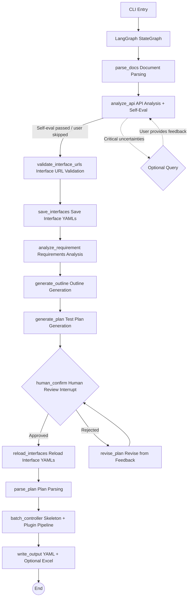

# How It Works

[← Back to agent/README](../README.en.md)

This document explains the agent's internal mechanics: the pipeline architecture, human review modes (y/n/r), the knowledge base, prompt management, auto mode, directory structure, and design philosophy.

---

## System Architecture

A multi-agent pipeline built on the LangGraph StateGraph that turns requirement documents and API documentation into YAML cases in the executor's format (with optional Excel export).



### Core Workflow (11 Steps)

1. **Document Parsing**: Reads requirement documents (Markdown / PDF / plain text) and API documentation (OpenAPI 3.0 / Markdown tables), with token-aware chunking for long texts.
2. **API Analysis**: Analyzes the completeness of the API documentation — authentication methods, parameter patterns, missing information; when the self-evaluation passes it continues automatically, only asking the user about critical uncertainties.
3. **Interface URL Validation** (source-level): Compares interface URLs against the source document; URLs that fail trigger automatic LLM correction retries (see [anti-hallucination.md](./anti-hallucination.en.md#url-correction)).
4. **Save Interface Definitions**: Writes the validated interface definitions to YAML. Users can edit the YAML directly during review; the system reloads it after approval.
5. **Requirements Analysis**: The LLM extracts business flows, user roles, constraints, and exception scenarios from the requirements.
6. **Outline Generation**: Based on the requirements analysis and the interface list (names/URLs only), generates a lightweight JSON outline that groups interfaces by business domain and lists business flows. The outline is very small (< 1000 tokens), guaranteeing it is not truncated.
7. **Plan Generation**: Generates a Markdown test plan from the outline in chunks (the four-phase approach; see [anti-hallucination.md](./anti-hallucination.en.md#skeleton-batching-and-plan-chunking)).
8. **Human Review** (mandatory interrupt): Displays the plan; the user chooses to approve, provide text feedback, or revise from an annotation file, with a feedback loop until approval (see [Human Review Modes](#human-review-modes-ynr) below).
9. **Plan Parsing**: Parses the approved Markdown plan into structured data and extracts the list of test points.
10. **Case Generation** (skeleton + plugin pipeline): Generates skeletons in batches → URL validation → runs plugins in the configured order (data filling, assertion generation, etc.). See [plugins-and-skills.md](./plugins-and-skills.en.md) for details.
11. **Output**: YAML files (`single_cases/`, `biz_flows/`) + optional Excel export.

---

## Human Review Modes (y/n/r)

Step 8, "Human Review," is a mandatory interrupt. After the CLI displays the generated test plan, the user enters one of the following three options at the interactive prompt:

| Input | Meaning | Behavior |
|------|------|------|
| `y` | Approve | Confirms the plan; the pipeline continues to case generation |
| `n` | Text feedback | Enter revision notes as text; the agent revises the plan accordingly and returns to review |
| `r` | Revise from annotation file | The agent reads the structured annotations in `memory/plan_comments.json` (produced by [Studio's Markdown Plan Annotator](../../studio/README.en.md)) and revises the plan accordingly |

- `n` (text feedback) takes the text-revision path: a small plan can be revised as a whole; an oversized plan falls back to "impact analysis + regenerating only the affected chunks."
- `r` (annotation-based revision) takes the three-phase annotation revision path: intent analysis → deletion → chunk-by-chunk content generation.
- The feedback loop supports multiple rounds until the user enters `y` to approve.
- If critical uncertainties arise during the API analysis stage (step 2), it will also interrupt to ask; the user can enter text feedback or `skip` to bypass it.

---

## Auto Mode

Auto mode skips all human review and runs the entire case generation flow end to end. It is intended for batch generation scenarios after skills and plugins have been fully tuned.

### How to Enable

- **CLI**: `--auto`
- **Config file**: `pipeline.auto: true` in `env.yaml`
- When both are set, the CLI flag takes precedence

### Behavior

| Review point | Auto mode behavior |
|--------|-------------|
| API analysis uncertainty prompts | Print a warning and skip, then continue |
| Test plan review | Auto-approve and proceed directly to case generation |

### Use Cases

```bash
# Nightly batch generation
python main.py --requirement docs/req.md --api docs/api.yaml --auto

# Unattended continuation after a power loss
python main.py --resume --output output_20240101_120000 --auto
```

### Difference Between --auto and --resume

| Flag | Purpose | When to Use |
|------|------|---------|
| `--auto` | Skip human interaction and run the full pipeline | First-time nightly batch generation |
| `--resume` | Resume from the last interruption (full pipeline supported) | Continue after a power loss / error |
| `--resume --auto` | Resume + auto-approve remaining reviews | Unattended recovery after a power loss |

> **Prerequisites**: Before using auto mode, tune your skills (business rules) and plugin configuration first, and consider passing additional business guidance via `--prompt` to ensure the quality of automatic generation.

---

## Knowledge Base

The knowledge base (`knowledge/search.py`) provides grep-based plain-text keyword search — no embedding model or external vector database required. Knowledge is stored as `.md` files under the `knowledge/` directory.

It is controlled by the `knowledge.enabled` switch in `env.yaml`. When enabled, each agent uses grep to search the `.md` files while building its prompt, appending matching knowledge snippets to the end of the prompt to provide domain knowledge and best-practice references.

Users can extend the knowledge base by adding their own `.md` files to the `knowledge/` directory.

---

## Prompt Management

All agents' system prompts and user templates are stored uniformly as Python modules under the `prompts/` directory; each file exports `<AGENT>_SYSTEM` and `<AGENT>_USER` constants. All prompts are written in English to improve weak models' accuracy in understanding the instructions.

For prompts that generate user-visible text (test plans, API analysis questions, case fields like `api_name`/`remark`/`sheet_name`, etc.), the template uses a `{{language}}` variable to force the LLM to output in the user's configured language, ensuring English prompts do not cause the LLM to always reply in English.

To modify a prompt, just edit the corresponding file — no business code changes needed. `PromptRegistry` provides a programmatic access interface.

---

## Technology Stack

| Dependency | Purpose |
|------|------|
| `langgraph` | StateGraph workflow orchestration, interrupts, checkpoints |
| `langchain-core` | ChatModel abstraction, message types |
| `langchain-openai` | OpenAI ChatModel adapter |
| `openai` | Direct LLM calls (OpenAI-compatible API) |
| `openpyxl` | Excel file writing |
| `prance` | OpenAPI 3.0 spec parsing |
| `pymupdf` | PDF requirement-document text extraction |
| `pyyaml` | YAML config and skill definition parsing |
| `tiktoken` | Accurate token counting (falls back to character estimation) |

---

## Directory Structure

```text
agent/
├── main.py                      # CLI entry (thin wrapper; actual logic lives in cli/)
├── translate_cases.py           # Case field translation tool entry
├── requirements.txt             # Python dependencies
├── env.example.yaml             # YAML config template (bilingual comments)
├── translate_env.example.yaml   # Translator standalone config template
│
├── cli/                         # Command line: argument parsing, interactive review, pipeline orchestration
├── config/                      # Config loading (settings.py)
├── i18n/                        # Internationalization (zh_CN / en_US)
├── models/                      # Data models and state
├── llm/                         # LLM provider factory
├── prompts/                     # All prompt modules (English)
├── tools/                       # Tool registry (built-in + custom)
├── skills/                      # Skill data classes, registry, built-in/custom skills
├── plugins/                     # Plugin base classes, loader, official plugins
│   └── official/                #   data_filling / assertion_generation
├── agents/                      # Individual agent implementations (requirement/API/plan/skeleton/batch controller)
├── graph/                       # StateGraph workflow and nodes
│   └── nodes/                   #   Workflow nodes split by responsibility
├── validators/                  # Case format validation, URL existence checks
├── knowledge/                   # grep knowledge base (.md files)
├── doc_parser/                  # OpenAPI / Markdown / PDF / LLM document parsing
├── utils/                       # Session logging, token counting
├── logs/                        # Runtime logs (generated at runtime)
└── <output>/                    # Output directory (cases/ + memory/, generated at runtime)
```

---

## Design Philosophy

### Why LangGraph

- **State management**: The `GraphState` TypedDict is passed automatically between nodes — no manual state object maintenance needed.
- **Interrupts and resume**: `interrupt()` + `MemorySaver` natively support human review interrupts and resume precisely from the checkpoint.
- **Conditional routing**: `add_conditional_edges()` makes the review branch a natural part of the graph.

### Why grep Instead of Embedding Search

Zero cost (no embedding API calls), zero external dependencies (standard library only), interpretable (exact matching, no semantic drift), and extensible (just create a `.md` file to add knowledge).

### Why the Pipeline Pattern

The pipeline decomposes case generation into independent stages executed in sequence (document parsing → API analysis → plan generation → review → skeleton generation → plugin execution → output). Each stage has a single responsibility, can be tested independently, and can be replaced individually. Compared with the ReAct pattern, the pipeline is better suited to batch processing, avoiding the overhead and uncertainty of tool-calling loops.

### Why the Plugin Architecture

Different projects have very different testing needs — some require HMAC signing pre-processing, others require database-backed verification. The plugin architecture lets users remove, replace, or add case-generation behavior without modifying the framework code.

### Why the Skill System

Skills are stored as YAML and append domain knowledge or business rules to an agent's system prompt via the `prompt_extension` field, customizing the agent without code changes. Two-layer control (a global switch + per-agent assignment) makes fine-grained management easy.

### Why English Prompts

English instructions are structurally simpler and less ambiguous, and weak models generally understand English instructions better than Chinese. When generating user-visible content, the `{{language}}` variable forces the LLM to output in the configured language, ensuring English system prompts do not cause replies in the wrong language.

### Context Compression

When processing long documents, text is split at paragraph boundaries and the LLM is called chunk by chunk. Before each round, token usage is checked: when input tokens exceed `context_compression_threshold × context_window` (90% by default), an LLM-driven context compression is triggered — condensing the intermediate results from previous rounds into a summary of key points to free up context space. Compression applies only to the accumulated results of chunk processing; it never touches the system prompt or skill content.
