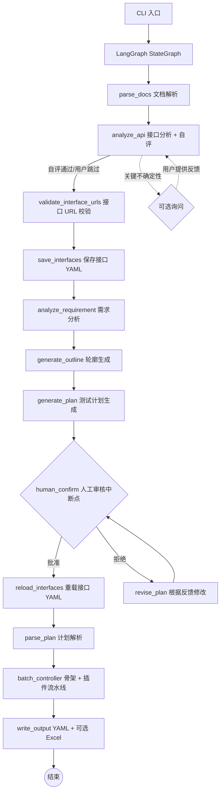

# 工作原理

[← 返回 agent/README](../README.md)

本文档讲解智能体的内部机制：流水线架构、人工审核模式（y/n/r）、知识库、提示词管理、自动模式、目录结构与设计理念。

---

## 系统架构

基于 LangGraph StateGraph 的多智能体流水线，将需求文档和接口文档转化为符合执行器格式的 YAML 用例（可选导出 Excel）。



### 核心流程（共 11 步）

1. **文档解析**：读取需求文档（Markdown / PDF / 纯文本）和接口文档（OpenAPI 3.0 / Markdown 表格）。支持 Token 感知的长文本分块处理。
2. **接口分析**：分析接口文档完整性——认证方式、参数模式、缺失信息；自评通过则自动继续，仅关键不确定性时询问用户。
3. **接口 URL 校验**（源级验证）：将接口 URL 与文档原文比对，未通过的 URL 自动触发 LLM 纠错重试（详见 [anti-hallucination.md](./anti-hallucination.md#url-纠错)）。
4. **保存接口定义**：将校验后的接口定义写入 YAML。用户可在审核期间直接编辑 YAML，审核通过后系统重新加载。
5. **需求分析**：LLM 从需求中提取业务流程、用户角色、约束条件、异常场景。
6. **轮廓生成**：基于需求分析和接口列表（仅名称/URL），生成轻量级 JSON 轮廓，将接口按业务领域分组、列出业务流程。数据量很小（< 1000 token），确保不被截断。
7. **计划生成**：基于轮廓分块生成 Markdown 测试计划（四阶段法，见 [anti-hallucination.md](./anti-hallucination.md#骨架分批与计划分块)）。
8. **人工审核**（强制中断点）：展示计划，用户选择批准、文字修改或按批注文件修改，支持反馈循环直至批准（见下方 [人工审核模式](#人工审核模式ynr)）。
9. **计划解析**：将审核通过的 Markdown 计划解析为结构化数据，提取测试点列表。
10. **用例生成**（骨架 + 插件流水线）：分批生成骨架 → URL 校验 → 按配置依次执行插件（数据填充、断言生成等）。详见 [plugins-and-skills.md](./plugins-and-skills.md)。
11. **输出**：YAML 文件（`single_cases/`、`biz_flows/`）+ 可选 Excel 导出。

---

## 人工审核模式（y/n/r）

第 8 步「人工审核」是强制中断点。CLI 展示生成的测试计划后，用户在交互提示中输入以下三种选项之一：

| 输入 | 含义 | 行为 |
|------|------|------|
| `y` | 批准 | 确认计划，流水线继续进入用例生成 |
| `n` | 文字反馈 | 输入修改意见文本，智能体据此修订计划，再次回到审核 |
| `r` | 按批注文件修改 | 智能体读取 `memory/plan_comments.json` 中的结构化批注（由 [Studio 的 Markdown 计划批注器](../../studio/README.md) 生成），据此修订计划 |

- `n`（文字反馈）走文本修订路径：计划较小可直接整体修订；计划过大则回退到"影响分析 + 仅重生成受影响块"。
- `r`（批注修改）走三阶段批注修订：意图分析 → 删除 → 逐块内容生成。
- 反馈循环支持多轮，直到用户输入 `y` 批准。
- 接口分析阶段（第 2 步）若出现关键不确定性，也会中断询问，用户可输入文字反馈或 `skip` 跳过。

---

## 自动模式（Auto Mode）

自动模式跳过所有人工审核，完整运行整个用例生成流程，适用于 Skill 和插件已调试完毕后的批量生成场景。

### 启用方式

- **命令行**：`--auto`
- **配置文件**：`env.yaml` 中 `pipeline.auto: true`
- 两者同时使用时，CLI 标志优先

### 行为

| 审核点 | 自动模式行为 |
|--------|-------------|
| API 分析不确定项询问 | 打印警告并跳过，继续执行 |
| 测试计划审核 | 自动批准，直接进入用例生成 |

### 使用场景

```bash
# 夜间批量生成
python main.py --requirement docs/req.md --api docs/api.yaml --auto

# 断电恢复后无人值守继续
python main.py --resume --output output_20240101_120000 --auto
```

### --auto 与 --resume 的区别

| 标志 | 作用 | 适用场景 |
|------|------|---------|
| `--auto` | 跳过人工交互，运行完整流水线 | 夜间首次批量生成 |
| `--resume` | 从上次中断处恢复（支持全流程），自动加载首次运行时的配置 | 断电/异常后继续 |
| `--resume --auto` | 恢复 + 自动通过剩余审核 | 断电后无人值守恢复 |

> **使用前提**：使用自动模式前建议先调试好 Skill（业务规则）、插件配置，并可通过 `--prompt` 传入补充业务指导，以保证自动生成质量。

---

## 知识库

知识库（`knowledge/search.py`）提供基于 grep 的纯文本关键词搜索，无需 embedding 模型或外部向量数据库。知识以 `.md` 文件形式存放在 `knowledge/` 目录下。

通过 `env.yaml` 中的 `knowledge.enabled` 开关控制。启用后，各智能体在生成 prompt 时通过 grep 搜索 `.md` 文件，将匹配的知识片段追加到 prompt 末尾，提供领域知识和最佳实践参考。

用户可自行在 `knowledge/` 目录添加 `.md` 文件扩展知识库。

---

## 提示词管理

所有智能体的 system prompt 和 user template 统一存放在 `prompts/` 目录的 Python 模块中，每个文件导出 `<AGENT>_SYSTEM` 和 `<AGENT>_USER` 常量。所有提示词使用英文编写，以提升弱模型对指令的理解准确度。

对于需要生成用户可见文本的提示词（测试计划、API 分析问题、用例中的 `api_name`/`remark`/`sheet_name` 等），模板通过 `{{language}}` 变量强制 LLM 以用户配置的语言输出，确保英文提示词不会导致 LLM 始终用英文回复。

修改提示词只需编辑对应文件，无需改业务代码。`PromptRegistry` 提供程序化访问接口。

---

## 技术栈

| 依赖 | 用途 |
|------|------|
| `langgraph` | StateGraph 工作流编排、中断点、检查点 |
| `langchain-core` | ChatModel 抽象、消息类型 |
| `langchain-openai` | OpenAI ChatModel 适配器 |
| `openai` | 直接 LLM 调用（兼容 OpenAI API） |
| `openpyxl` | Excel 文件写入 |
| `prance` | OpenAPI 3.0 规范解析 |
| `pymupdf` | PDF 需求文档文本提取 |
| `pyyaml` | YAML 配置与 Skill 定义解析 |
| `tiktoken` | Token 精确计数（回退到字符估算） |

---

## 目录结构

```text
agent/
├── main.py                      # CLI 入口（薄入口，实际逻辑在 cli/）
├── translate_cases.py           # 用例字段翻译工具入口
├── requirements.txt             # Python 依赖
├── env.example.yaml             # YAML 配置模板（双语注释）
├── translate_env.example.yaml   # 翻译工具独立配置模板
│
├── cli/                         # 命令行：参数解析、交互式审核、流水线编排
├── config/                      # 配置加载（settings.py）
├── i18n/                        # 国际化（zh_CN / en_US）
├── models/                      # 数据模型与状态
├── llm/                         # LLM 供应商工厂
├── prompts/                     # 所有提示词模块（英文）
├── tools/                       # 工具注册表（内置 + 自定义）
├── skills/                      # Skill 数据类、注册表、内置/自定义 Skill
├── plugins/                     # 插件基类、加载器、官方插件
│   └── official/                #   data_filling / assertion_generation
├── agents/                      # 各 Agent 实现（需求/接口/计划/骨架/分批控制器）
├── graph/                       # StateGraph 工作流与节点
│   └── nodes/                   #   按职责拆分的工作流节点
├── validators/                  # 用例格式校验、URL 存在性检查
├── knowledge/                   # grep 知识库（.md 文件）
├── doc_parser/                  # OpenAPI / Markdown / PDF / LLM 文档解析
├── utils/                       # 会话日志、Token 计数
├── logs/                        # 运行日志（运行时生成）
└── <output>/                    # 输出目录（cases/ + memory/，运行时生成）
```

---

## 设计理念

### 为什么用 LangGraph

- **状态管理**：`GraphState` TypedDict 在节点间自动传递，无需手动维护状态对象。
- **中断与恢复**：`interrupt()` + `MemorySaver` 原生支持人工审核中断，可从断点精确恢复。
- **条件路由**：`add_conditional_edges()` 让审核分支成为图的自然组成部分。

### 为什么用 grep 替代 embedding 检索

零成本（无 embedding API 调用）、零外部依赖（仅标准库）、可解释（精确匹配、不语义漂移）、可扩展（创建 `.md` 即可添加知识）。

### 为什么用流水线模式

流水线将用例生成分解为顺序执行的独立阶段（文档解析 → 接口分析 → 计划生成 → 审核 → 骨架生成 → 插件执行 → 输出）。每阶段职责单一、可独立测试、可单独替换。相比 ReAct 模式，流水线更适合批处理，避免工具调用循环的开销和不确定性。

### 为什么用插件架构

不同项目的测试需求差异很大——某些需要 HMAC 签名预处理、某些需要数据库连接验证。插件架构允许用户在不修改框架代码的前提下删减/替换/新增用例生成行为。

### 为什么用 Skill 系统

Skill 以 YAML 存放，通过 `prompt_extension` 向 Agent 系统提示词追加领域知识或业务规则，不改代码即可定制 Agent。两层控制（全局开关 + 按 Agent 分配）便于精细管理。

### 为什么用英文提示词

英文指令结构更简洁、歧义更少，弱模型对英文指令的理解通常优于中文。生成用户可见内容时通过 `{{language}}` 变量强制 LLM 以配置语言输出，确保英文系统提示词不会导致回复语言错误。

### 上下文压缩

处理长文档时按段落边界分块，逐块调用 LLM。每轮前检查 token 使用率：当输入 token 超过 `context_compression_threshold × context_window`（默认 90%）时，触发 LLM 驱动的上下文压缩——将前几轮中间结果浓缩为要点摘要，释放上下文空间。压缩仅作用于分块处理的累积结果，不触及系统提示词和 Skill 内容。
