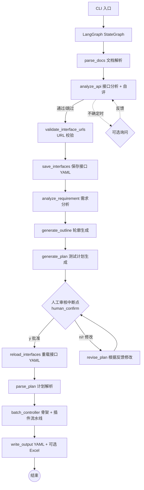

# 工作原理

[← 返回 agent/README](../README.md)

本文档讲解智能体的内部机制：流水线架构、人工审核模式（y/n/r）、提示词管理、自动模式、目录结构与设计理念。

---

## 系统架构

基于 LangGraph StateGraph 的多智能体流水线，将需求文档和接口文档转化为符合执行器格式的 YAML 用例（可选导出 Excel）。



### 核心流程（共 11 步）

1. **文档解析**：读取需求文档（Markdown / PDF / 纯文本）和接口文档（OpenAPI 3.0 / Markdown 表格）。支持 Token 感知的长文本分块处理。
2. **接口分析**：分析接口文档完整性——认证方式、参数模式、缺失信息；自评通过则自动继续，仅关键不确定性时询问用户。
3. **接口 URL 校验**（源级验证）：将接口 URL 与文档原文比对，未通过的 URL 自动触发 LLM 纠错重试（详见 [anti-hallucination.md](./anti-hallucination.md#url-纠错)）。
4. **保存接口定义**：将校验后的接口定义写入 YAML。用户可在审核期间直接编辑 YAML，审核通过后系统重新加载。
5. **需求分析**：LLM 从需求中提取业务流程、用户角色、约束条件、异常场景。
6. **轮廓生成**：基于需求分析和接口列表（仅名称/URL），生成轻量级 JSON 轮廓，将接口按业务领域分组、列出业务流程。数据量很小（< 1000 token），确保不被截断。
7. **计划生成**：基于轮廓分块生成 Markdown 测试计划（四阶段法），同时输出 `plan_sections.json` 作为结构化数据源（见 [anti-hallucination.md](./anti-hallucination.md#骨架分批与计划分块)）。`plan.md` 仅作展示，代码不再读取。
8. **人工审核**（强制中断点）：展示计划，用户选择批准、文字修改或按批注文件修改。批注直接携带 `chunk_id`（由 Studio 批注器提供），无需行号匹配。支持反馈循环直至批准（见下方 [人工审核模式](#人工审核模式ynr)）。
9. **计划解析**：从 `plan_sections.json` 读取已切割好的 section 数据，通过 token 感知的贪心切分算法解析为结构化 TestPlan（整体 → case_type 拆分 → 贪心分批）。不再解析 `plan.md`。
10. **用例生成**（骨架 + 插件流水线）：分批生成骨架 → URL 校验 → 按配置依次执行插件（数据填充、断言生成等）。详见 [plugins-and-skills.md](./plugins-and-skills.md)。
11. **输出**：YAML 文件（`single_cases/`、`biz_flows/`）+ 可选 Excel 导出。

---

## 人工审核模式（y/n/r）

第 8 步「人工审核」是强制中断点。CLI 展示生成的测试计划后，用户在交互提示中输入以下三种选项之一：

| 输入 | 含义 | 行为 |
|------|------|------|
| `y` | 批准 | 确认计划，流水线继续进入用例生成 |
| `n` | 文字反馈 | 输入修改意见文本，智能体据此修订计划，再次回到审核 |
| `r` | 按批注文件修改 | 智能体读取 `memory/plan_comments.json` 中的结构化批注（由 [Studio 的 Markdown 计划批注器](../../studio/README.md) 生成），据此修订计划 |

- `n`（文字反馈）走 Chunk 级修订：Section 影响分析（LLM 判断涉及哪些顶层 Section）→ Chunk 意图分析（LLM 判断具体哪个 Chunk 需要什么操作）→ 执行操作（与 r 模式共用代码）。
- `r`（批注修改）走 Chunk 级修订：批注→Chunk 映射（代码级）→ 意图分析（LLM → noop/fix/delete_chunk/add_chunk）→ 执行 Chunk 操作（fix 从 outline 重生成 / delete_chunk 删除 / add_chunk 新增）。业务流 Chunk 的 fix 先重画 Mermaid 图，再生成计划文本。
- 测试计划的 Chunk 结构（分块）在轮廓生成时就已确定（`plan_sections.json`），后续修订始终以它为权威数据源，不再从 `plan.md` 反向解析。
- 反馈循环支持多轮，直到用户输入 `y` 批准。
- 接口分析阶段（第 2 步）若出现关键不确定性，也会中断询问，用户可输入文字反馈或 `skip` 跳过。

---

## 自动模式（Auto Mode）

自动模式跳过所有人工审核，完整运行整个用例生成流程，适用于 Skill 和插件已调试完毕后的批量生成场景。

### 启用方式

- **命令行**：`--auto`
- **配置文件**：`env.yaml` 中 `pipeline.auto: true`
- 两者同时使用时，CLI 标志优先

### 行为

| 审核点 | 自动模式行为 |
|--------|-------------|
| API 分析不确定项询问 | 打印警告并跳过，继续执行 |
| 测试计划审核 | 自动批准，直接进入用例生成 |

### 使用场景

```bash
# 夜间批量生成
python main.py --requirement docs/req.md --api docs/api.yaml --auto

# 断电恢复后无人值守继续
python main.py --resume --output output_20240101_120000 --auto
```

### --auto 与 --resume 的区别

| 标志 | 作用 | 适用场景 |
|------|------|---------|
| `--auto` | 跳过人工交互，运行完整流水线 | 夜间首次批量生成 |
| `--resume` | 从上次中断处恢复（支持全流程），自动加载首次运行时的配置 | 断电/异常后继续 |
| `--resume --auto` | 恢复 + 自动通过剩余审核 | 断电后无人值守恢复 |

> **使用前提**：使用自动模式前建议先调试好 Skill（业务规则）、插件配置，并可通过 `--prompt` 传入补充业务指导，以保证自动生成质量。

---

## 检查点系统与手动编辑

### 两层检查点架构

Flow Forge 使用两层检查点机制确保中断后可精确恢复：

| 层级 | 文件 | 作用 |
|------|------|------|
| **流水线层（Layer 1）** | `memory/pipeline_state.json` | 记录当前 LangGraph 节点，resume 时决定从哪个节点开始执行 |
| **批处理层（Layer 2）** | `memory/checkpoint.json` + `memory/checkpoint_data.json` | 记录 `batch_controller` 节点内部的逐批进度，resume 时从断点批次继续而非从头开始 |

### `memory/` 文件一览

所有文件位于输出目录的 `memory/` 子目录下：

| 文件 | 用途 | 是否可手动编辑 |
|------|------|:---:|
| `pipeline_state.json` | 流水线节点进度（`completed_stage` + `stages` 列表）| ✅ |
| `checkpoint.json` | 批处理元数据：`phase`、`phase_status`、`phase_progress`、`settings` | ✅ |
| `checkpoint_data.json` | 用例数据（`single_cases`、`biz_cases`、`failures`）| ❌ 机器维护 |
| `run_config.json` | 首次运行时的 CLI 参数 / 配置快照 | ✅（仅影响未执行阶段）|
| `plan_chunks_progress.json` | 计划生成阶段的逐 chunk 进度 | ❌ 机器维护 |
| `plan_outline.json` / `plan_parsed.json` 等 | 各流水线节点的中间产物 | ❌ 机器维护 |

### 手动编辑示例

#### 1. 调整 batch_size

编辑 `memory/checkpoint.json` 中的 `settings.batch_size`：

```json
{
  "settings": {
    "batch_size": 5
  }
}
```

Resume 时，`_restore_from_checkpoint()` 读取此值，后续所有 batch 使用新大小。插件执行和骨架生成各自的 `batch_size`（`skeleton_batch_size`）分别存储在 `settings` 中。

#### 2. 强制重跑某个阶段

`checkpoint.json` 中的 `phase_progress` 跟踪各阶段/子步骤的完成状态。例如，将骨架生成的 single 子步骤改为 `"in_progress"` 并重置 `completed_count`：

```json
{
  "phase_progress": {
    "skeletons_generated": {
      "status": "in_progress",
      "single": {"status": "in_progress", "total_items": 100, "completed_count": 0}
    }
  }
}
```

也可以将 `phase_status` 改为 `"in_progress"` 且把 `phase` 设为目标阶段名，使 resume 从该阶段重新开始。

#### 3. 跳过一个子步骤

将子步骤的 `status` 改为 `"completed"` 并设置 `completed_count = total_items`：

```json
{
  "phase_progress": {
    "plugin_data_filling": {
      "status": "in_progress",
      "single": {"status": "completed", "total_items": 100, "completed_count": 100}
    }
  }
}
```

Resume 时该子步骤将被跳过，直接进入下一个子步骤。

#### 4. 强制重跑流水线节点

编辑 `pipeline_state.json` 中的 `completed_stage`，改为前一个节点的名称，或删除已完成节点的对应 artifact 文件。

### ⚠️ 注意事项

- **不要**手动编辑 `checkpoint_data.json`——数据一致性依赖内部逻辑，编辑错误可能导致数据损坏
- 编辑 `checkpoint.json` 错误可能导致 resume 跳过阶段或从头开始
- 紧急恢复：删除 `checkpoint.json` + `checkpoint_data.json` 可以强制从头执行 `batch_controller`（不影响之前已完成的流水线节点）
- 将 `phase` 改为不在 `phases` 列表中的值会导致 fallback 到第一阶段

---

## 上下文窗口管理与文档切分策略

Flow Forge 处理大文档的核心策略是"**用户主动切分优先，自动切分兜底**"——将文档粒度控制权交给用户，自动切分仅作为超长文本的保底机制。

### 第一阶段：用户主动切分（推荐）

用户可通过 `--requirement` 和 `--api` 传入多个文件，系统对每个文档独立调用一次 LLM 进行解析，然后合并结果。

**为什么推荐用户自行切分？**
- 一份文档 = 一次独立的 LLM 调用，解析质量有保证
- 避免自动切分在语义边界处截断导致的上下文断裂
- 对弱模型尤其关键：单文档上下文小 → 模型更专注 → 产出质量更高

**使用建议**：
- 每次提交建议控制在 **14 个接口以下**
- 大任务可拆分为多个文档文件，或通过 CLI 并行提交多个任务
- 夜间批量执行时可配合 `--auto` 模式跳过人工审核

**API 文档合并规则**：多个 API 文档解析后的接口列表按 `(api_path, method)` 去重。不同 LLM 调用产出的 `test_id` 相互不可靠，URL + 方法才是接口的唯一标识。

**需求文档合并规则**：多个需求文档分别分析后，按 key（`business_flows`、`roles`、`constraints`、`exceptions`）合并，每个 key 内部按字符串值去重。

### 第二阶段：自动 Token 感知切分

当单文档超过上下文窗口阈值时，系统自动触发 `_process_long_text()` 进行逐 chunk 处理。

**触发条件**：`estimated_input_tokens > context_window * compression_threshold`（默认 `128000 * 0.9 = 115200` tokens）。

**切分算法**（`BaseAgent._chunk_text()`）：
1. **第一级**：按 `\n\n`（段落边界）切分，逐段累积直到达到 token 预算上限
2. **第二级**：若单个段落超预算，降级到句子级切分，使用正则 `(?<=[。.!！?？])\s*` 在中英文标点处分割

**Chunk Token 预算**：
```
max_chunk = context_window - system_prompt_tokens - max(output_tokens, 4096) - 200(overlap_reserve)
```
`max_chunk` 低于 1000 时 clamp 到 1000，保证即使极限场景也能处理。

**Chunk 通知**：每个 chunk 前注入通知字符串（如 `REQ_CHUNK_NOTICE`、`RAW_API_CHUNK_NOTICE`、`DOC_CHUNK_NOTICE`），告知 LLM 当前文档是部分内容，需继续处理。

### 第三阶段：上下文累积与压缩

`_process_long_text()` 在多轮处理中维护渐进上下文：

- **滑动窗口**：chunk 间仅保留最近 **3 个结果的 JSON** 作为累积上下文传递给下一个 chunk。超过 3 个时，更早的结果仅通过下文介绍的压缩摘要间接保留。

- **上下文压缩**（`_compress_conversation()`）：当累积上下文接近窗口上限时，调用 LLM 将历史结果压缩为一段关键点摘要，释放 token 空间。压缩仅作用于 chunk 处理结果，**不触碰 system prompt 和 skill 内容**。

- **双重阈值**：
  - `compression_threshold`（默认 `0.9`，软阈值）：仅记录警告，不阻断
  - 硬限制（`1.0`）：返回 False，触发强制压缩后才能继续

- **Overlap Reserve**：每个 chunk 的预算预留 200 tokens 作为重叠缓冲区。这不是字面上的文本重叠——连续性由累积上下文和压缩摘要共同维护。

### 各流水线阶段的切分策略差异

不同阶段根据自身需求采用不同的切分方式：

| 阶段 | 切分方式 | 合并策略 | 说明 |
|------|---------|---------|------|
| **parse_docs**（文档输入） | 用户切分（每文件独立） | 接口按 `(api_path, method)` 去重 | 不做自动切分；文档数 = LLM 调用数 |
| **analyze_requirement**（需求分析） | `_process_long_text()` 自动切分 | 按 key（`business_flows`, `roles`, `constraints`, `exceptions`）合并去重 | 仅当单文档超阈值时触发 |
| **analyze_api**（API 分析 raw 模式） | `_process_long_text()` 自动切分 | 接口列表按 `(api_path, method)` 去重 | 单文档超阈值时触发 |
| **generate_plan**（测试计划生成） | 四阶段逻辑切分（Phase A/B/C/D） | 按阶段顺序拼接 | 不基于 token，基于**接口分组和业务流批次**拆分；每批独立 LLM 调用 + 全局上下文注入 |
| **parse_plan**（计划解析） | plan_sections.json 结构切分 + 贪心算法 | 按 `test_id` + `url` 去重 | 从 `plan_sections.json` 读取已切好的 section，3 级策略：整体 → case_type 拆分（`single_api` / `biz_flows`）→ 贪心逐 section 累加，每批不超过 token 预算 |
| **batch_controller**（用例生成） | `skeleton_batch_size` 控制每批测试点数 | 用例列表拼接 | 不基于 token，基于**测试点数量**分批次 |
| **revise_plan**（计划修订） | 标题层级自适应章节切分 + 注释/反馈精确定位到区块 | 按区块 key 替换后重新拼接 | 详见下文"计划审核与修订" |

### 测试计划四阶段切分（Phase A/B/C/D）

测试计划生成不使用通用的 `_process_long_text()`，而是按**逻辑边界**进行四阶段拆分：

- **Phase A**：全局上下文（一次 LLM 调用，包含全部接口概要）
- **Phase B**：按 API 组拆分。`plan_single_batch_size`（默认 8）控制每批接口数；设为 `-1` 则所有接口合并为一批
- **Phase C**：按业务流批次拆分。`plan_biz_flow_batch_size`（默认 1）控制每批流数。因为 Mermaid 时序图需要逐流生成，此值默认为 1
- **Phase D**：组装——将 Phase A/B/C 的产出按顺序拼接，无 LLM 调用

每个 Phase/Batch 完成后写入 `plan_chunks_progress.json`，支持中断后从断点恢复。

### 计划审核与修订

测试计划并非一次性生成即通过。系统提供 `human_confirm → revise_plan` 循环，支持多轮修订：

**章节解析基础设施**（n 模式和 r 模式共用）：
- `detect_section_level(plan_md)`：自适应标题层级检测——扫描所有 Markdown 标题，选择出现次数 ≥2 的最浅层级作为主分割级别。若 plan.md 用 `###` 做主标题则自动适配 `###`，不硬编码 `##`
- `classify_section(heading_text)`：基于中英文关键词分类——全局（"商业理解"/"Business Understanding"）、API（"单接口测试点"/"Single Interface"）、业务流（"商业流程测试"/"Business Flow"）
- `_parse_plan_to_sections()`：将 plan.md 拆分为 `{global, sections: [{key, type, name, content}]}` 结构，通过名称匹配与 outline 关联
- `_assemble_plan(sections)`：修订后按原顺序拼接回完整 plan.md

**Plan Sections 结构**（`plan_sections.json`，由 `agent/schemas/plan_sections.schema.json` 定义）：
```json
{
  "business_understanding": "<业务理解 markdown 文本>",
  "single_api": [
    {
      "chunk_id": "api_auth", "key": "api_auth", "type": "api",
      "name": "认证授权模块", "section": "single_api",
      "content": "### 认证授权\n...测试点..."
    }
  ],
  "biz_flows": [
    {
      "chunk_id": "biz_login", "key": "biz_login", "type": "biz",
      "name": "用户登录流程", "section": "biz_flows",
      "content": "### 登录流程\n...步骤...",
      "mermaid": "```mermaid\nsequenceDiagram\n...\n```"
    }
  ]
}
```
  │ 修改 sections[n].content / sections[n].mermaid → _assemble_plan()
  ▼
修订后 plan.md（仅展示用，代码不再读取）

**n 模式（文本反馈）——三阶段**：
1. **章节影响分析**：将用户反馈发给 LLM，判断影响了哪些大类（全局/单接口/业务流）。返回 `{global: bool, single_api: bool, biz_flows: bool}`
2. **区块级意图分析**：对每个受影响的大类，将区块名称和描述列表发给 LLM（不发送完整内容），LLM 判断每个区块是否需要 `fix`/`delete_chunk`/`add_chunk`
3. **执行区块操作**：与 r 模式共享（见下文）

**r 模式（批注）——三步骤**：
1. **加载章节注册表**：从 `plan_sections.json` 加载 sections 结构
2. **注释定位**：优先用 annotation 中的 `chunk_id` 直接匹配（Studio 批注器在用户选中文本时自动捕获所在 chunk 的 chunk_id）；兜底用 `selected_text` 子串匹配
3. **意图分析**：将注释 + 所在区块内容分批发给 LLM，LLM 对每个注释输出操作（`noop`/`fix`/`delete_chunk`/`add_chunk`）
4. **执行区块操作**：共享执行层
4. **执行区块操作**：共享执行层

**共享的区块操作执行层**：
- **noop**：不做任何修改
- **fix**：将修订指令注入到区块生成提示词，LLM 重新生成该区块内容。biz 类型的区块优先重生成 Mermaid 图
- **delete_chunk**：从 sections 移除，同时从 outline 移除
- **add_chunk**：在 outline 创建新条目，调用 LLM 生成内容

修订完成后拼接回完整 plan.md，循环回到 `human_confirm` 供用户再次审核。

---

## 提示词管理

所有智能体的 system prompt 和 user template 统一存放在 `prompts/` 目录的 Python 模块中，每个文件导出 `<AGENT>_SYSTEM` 和 `<AGENT>_USER` 常量。所有提示词使用英文编写，以提升弱模型对指令的理解准确度。

对于需要生成用户可见文本的提示词（测试计划、API 分析问题、用例中的 `api_name`/`remark`/`sheet_name` 等），模板通过 `{{language}}` 变量强制 LLM 以用户配置的语言输出，确保英文提示词不会导致 LLM 始终用英文回复。

修改提示词只需编辑对应文件，无需改业务代码。`PromptRegistry` 提供程序化访问接口。

---

## 技术栈

| 依赖 | 用途 |
|------|------|
| `langgraph` | StateGraph 工作流编排、中断点、检查点 |
| `langchain-core` | ChatModel 抽象、消息类型 |
| `langchain-openai` | OpenAI ChatModel 适配器 |
| `openai` | 直接 LLM 调用（兼容 OpenAI API） |
| `openpyxl` | Excel 文件写入 |
| `prance` | OpenAPI 3.0 规范解析 |
| `pymupdf` | PDF 需求文档文本提取 |
| `pyyaml` | YAML 配置与 Skill 定义解析 |
| `tiktoken` | Token 精确计数（回退到字符估算） |

---

## 目录结构

```text
agent/
├── main.py                      # CLI 入口（薄入口，实际逻辑在 cli/）
├── translate_cases.py           # 用例字段翻译工具入口
├── requirements.txt             # Python 依赖
├── env.example.yaml             # YAML 配置模板（双语注释）
├── translate_env.example.yaml   # 翻译工具独立配置模板
│
├── cli/                         # 命令行：参数解析、交互式审核、流水线编排
├── config/                      # 配置加载（settings.py）
├── i18n/                        # 国际化（zh_CN / en_US）
├── models/                      # 数据模型与状态
├── llm/                         # LLM 供应商工厂
├── prompts/                     # 所有提示词模块（英文）
├── tools/                       # 工具注册表（内置 + 自定义）
├── skills/                      # Skill 数据类、注册表、内置/自定义 Skill
├── plugins/                     # 插件基类、加载器、官方插件
│   └── official/                #   data_filling / assertion_generation
├── agents/                      # 各 Agent 实现（需求/接口/计划/骨架/分批控制器）
├── graph/                       # StateGraph 工作流与节点
│   └── nodes/                   #   按职责拆分的工作流节点
├── validators/                  # 用例格式校验、URL 存在性检查
├── doc_parser/                  # OpenAPI / Markdown / PDF / LLM 文档解析
├── utils/                       # 会话日志、Token 计数
├── logs/                        # 运行日志（运行时生成）
└── <output>/                    # 输出目录（cases/ + memory/，运行时生成）
```

---

## 设计理念

### 为什么用 LangGraph

- **状态管理**：`GraphState` TypedDict 在节点间自动传递，无需手动维护状态对象。
- **中断与恢复**：`interrupt()` + `MemorySaver` 原生支持人工审核中断，可从断点精确恢复。
- **条件路由**：`add_conditional_edges()` 让审核分支成为图的自然组成部分。

### 为什么用流水线模式

流水线将用例生成分解为顺序执行的独立阶段（文档解析 → 接口分析 → 计划生成 → 审核 → 骨架生成 → 插件执行 → 输出）。每阶段职责单一、可独立测试、可单独替换。相比 ReAct 模式，流水线更适合批处理，避免工具调用循环的开销和不确定性。

### 为什么用插件架构

不同项目的测试需求差异很大——某些需要 HMAC 签名预处理、某些需要数据库连接验证。插件架构允许用户在不修改框架代码的前提下删减/替换/新增用例生成行为。

### 为什么用 Skill 系统

Skill 以 YAML 存放，通过 `prompt_extension` 向 Agent 系统提示词追加领域知识或业务规则，不改代码即可定制 Agent。两层控制（全局开关 + 按 Agent 分配）便于精细管理。

### 为什么用英文提示词

英文指令结构更简洁、歧义更少，弱模型对英文指令的理解通常优于中文。生成用户可见内容时通过 `{{language}}` 变量强制 LLM 以配置语言输出，确保英文系统提示词不会导致回复语言错误。

### 上下文压缩

处理长文档时按段落边界分块，逐块调用 LLM。每轮前检查 token 使用率：当输入 token 超过 `context_compression_threshold × context_window`（默认 90%）时，触发 LLM 驱动的上下文压缩——将前几轮中间结果浓缩为要点摘要，释放上下文空间。压缩仅作用于分块处理的累积结果，不触及系统提示词和 Skill 内容。
