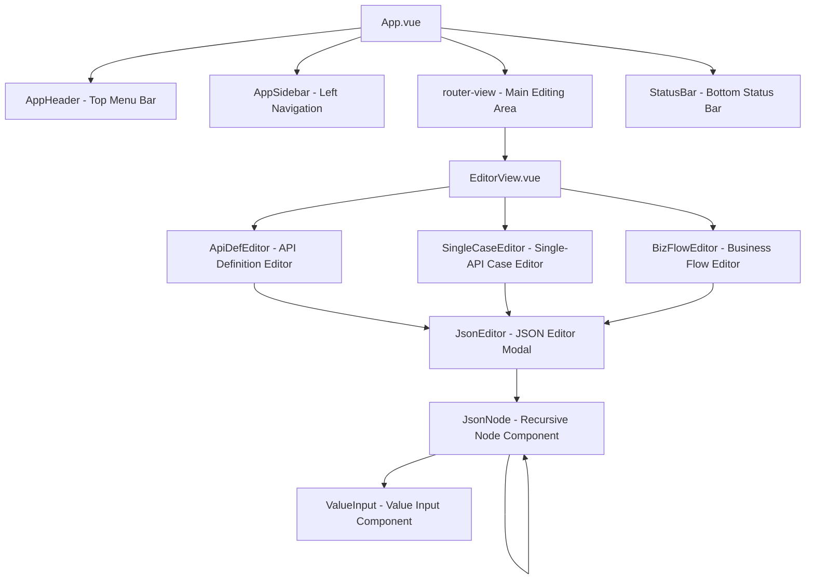
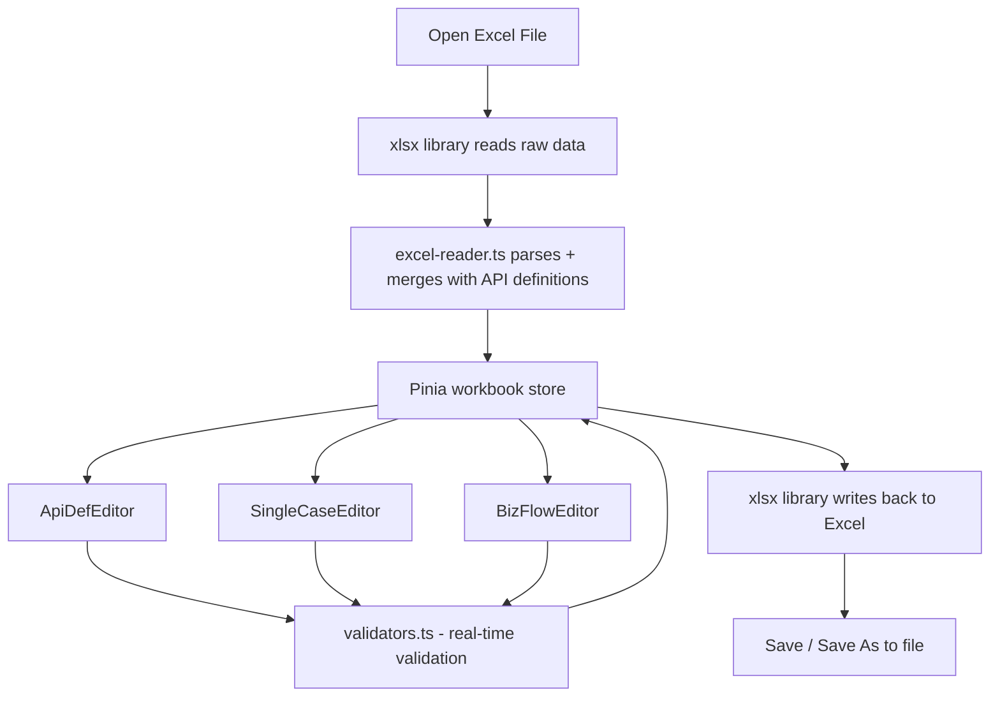

# Flow Forge — Test Case Editor

**English** | [中文](README.md)

A visual editor for Flow Forge test case Excel files, built with Vue 3 and Ant Design Vue.

## Quick Start

```bash
cd case-editor
npm install
npm run dev
```

Open `http://localhost:5173` in your browser.

## Tech Stack

| Layer | Technology |
|-------|------------|
| Framework | Vue 3 (Composition API + `<script setup>`) |
| UI Library | Ant Design Vue 4.x |
| Build Tool | Vite 5.x |
| State Management | Pinia |
| Internationalization | vue-i18n 9.x |
| Excel I/O | SheetJS (xlsx) |
| Language | TypeScript |

## Features

- Open, edit, and save Excel test case files (`.xlsx` format)
- API definition editing (table view with add/delete row support)
- Single-API test case editing (with RelevanceID cross-reference validation)
- Business flow test case editing (StepID uniqueness check, Trans field format validation)
- **Visual JSON editor** — turns JSON fields (RequestHead, RequestBody, AssertDict, etc.) into an interactive tree editor:
  - Paste a JSON string to auto-parse into a tree structure
  - Each field displays key, type, and value — all three columns are editable
  - Supports 6 types: string, number, boolean, date, list, dictionary
  - Each type has a corresponding value input control
  - Recursive editing for nested Dict/List structures
- Real-time validation (RelevanceID existence, StepID uniqueness, Trans format) — invalid cells are highlighted in red
- Bilingual Chinese/English interface with on-the-fly switching
- Save (Ctrl+S) and Save As (Ctrl+Alt+S) keyboard shortcuts
- Windows-style layout

## Architecture

### Component Tree



### Data Flow



## Project Structure

```text
case-editor/
├── README.md
├── README.en.md
├── package.json
├── vite.config.ts
├── tsconfig.json
├── index.html
└── src/
    ├── main.ts                     # Entry point, plugin registration
    ├── App.vue                     # Root component, global layout
    ├── router/index.ts             # Vue Router configuration
    ├── stores/
    │   ├── workbook.ts             # Workbook data (core store)
    │   ├── editor.ts               # Editor UI state
    │   └── settings.ts             # Settings (language)
    ├── i18n/
    │   ├── index.ts                # vue-i18n initialization
    │   ├── zh-CN.json              # Chinese locale
    │   └── en-US.json              # English locale
    ├── types/
    │   ├── excel.ts                # Excel data type definitions
    │   └── editor.ts              # Editor UI type definitions
    ├── utils/
    │   ├── excel-reader.ts         # Excel read + merge logic
    │   ├── excel-writer.ts         # Excel write logic
    │   ├── validators.ts           # Validation utilities
    │   ├── deep-merge.ts           # Deep merge utility
    │   └── json-helper.ts          # JSON parse/serialize helpers
    ├── components/
    │   ├── layout/
    │   │   ├── AppHeader.vue       # Top menu bar
    │   │   ├── AppSidebar.vue      # Left sheet navigation
    │   │   └── StatusBar.vue       # Bottom status bar
    │   ├── editor/
    │   │   ├── ApiDefEditor.vue    # API definition editor
    │   │   ├── SingleCaseEditor.vue # Single-API case editor
    │   │   └── BizFlowEditor.vue   # Business flow editor
    │   └── json-editor/
    │       ├── JsonEditor.vue      # JSON editor modal
    │       ├── JsonNode.vue        # Recursive node component
    │       └── ValueInput.vue      # Value input component
    ├── views/
    │   └── EditorView.vue          # Main editor view
    └── assets/styles/
        └── global.css              # Global styles
```

## User Guide

### Opening a File

Click the **Open** button in the top toolbar (or press Ctrl+O), then select a `.xlsx` test case file. The editor will automatically read and merge the data.

### Editing API Definitions

Click **API Definitions** in the left sidebar to switch to the API definition sheet. Edit fields directly in the table:

- Plain text columns (TestID, APIName, etc.): direct input
- Method column: dropdown to select HTTP method
- StatusCode column: numeric input
- RequestHead / RequestBody / AssertDict columns: click the button to open the JSON editor

### JSON Editor

1. **Paste mode**: paste a JSON string into the text area at the top and click **Parse** to auto-generate the tree structure
2. **Tree editing mode**:
   - Each field displays three columns: **key** (field name), **type** (data type), **value** (current value)
   - Changing the type automatically resets the corresponding value
   - Dict/List types can be expanded/collapsed and support recursive child node editing
   - Click **Add Field** to add a top-level field
3. Click **OK** to save changes, or **Cancel** to discard them

### Editing Business Flows

Click a business flow name in the left sidebar to switch to that sheet:

- **StepID**: duplicate values are highlighted in red
- **RelevanceID**: type manually or select from a dropdown (sourced from the API definition TestID column); non-existent IDs are highlighted in red
- **Trans**: format validation (`key=value, key=value...`); mismatched brackets or Chinese characters are flagged in red with an error tooltip
- Steps can be reordered (move up / move down)

### Saving Files

- **Export** (Ctrl+S): downloads a new Excel file

### Language Switching

Use the dropdown on the right side of the top menu bar to switch between Chinese and English. The selection takes effect immediately and is persisted to the browser's localStorage.

## Validation Rules

| Rule | Applies To | Description | UI Indicator |
|------|-----------|-------------|--------------|
| RelevanceID | Single-API cases, Business flows | Must exist in the API definition TestID set | Red cell highlight |
| StepID | Business flows | Must be unique within the same sheet | Red cell highlight |
| Trans format | Business flows | `key=value, key=value` format | Red cell + tooltip |
| Trans brackets | Business flows | `[` and `]` counts must match; `(` and `)` counts must match | Red cell + tooltip |
| Trans Chinese chars | Business flows | Chinese characters are not allowed | Red cell + tooltip |

## Keyboard Shortcuts

| Shortcut | Action |
|----------|--------|
| Ctrl+O | Open file |
| Ctrl+S | Save |
| Ctrl+Alt+S | Save As |
| Ctrl+N | New blank workbook |

## Development

### Local Development

```bash
npm install
npm run dev
```

### Production Build

```bash
npm run build
```

Output goes to the `dist/` directory, which can be deployed to any static file server.

### Extending the Editor

- **Add a new JSON type**: add the type to `JsonType` in `types/excel.ts`, then add the corresponding input control in `ValueInput.vue`
- **Add a new validation rule**: add the validation function in `utils/validators.ts`, then invoke it in `runAllValidations()` in `stores/workbook.ts`
- **Add a new locale**: add a new locale JSON file in `i18n/`, then register it in `i18n/index.ts`

### Compatibility with the Python Executor

The Excel format read and written by the editor is fully compatible with `python/excel_reader/excel_parser.py`:

- Sheet order: API Definitions → Single-API Cases → Business Flows
- Merge logic: case-level values take precedence, supplemented by API definitions
- JSON field serialization: compact JSON strings
- Column names are identical
