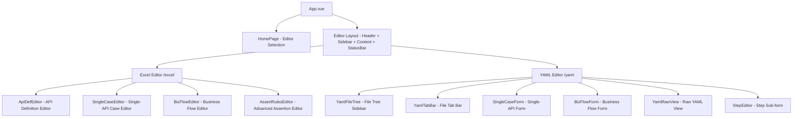
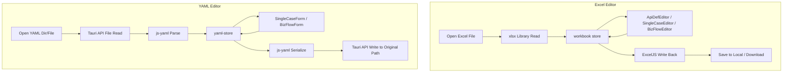

# Flow Forge — Test Case Editor

**English** | [中文](README.md)

A desktop test case editor built with Vue 3 + Ant Design Vue + Tauri 2, supporting visual editing of both Excel (.xlsx) and YAML (.yaml) test case formats.

## Quick Start

```bash
cd case-editor
npm install

# Browser dev mode
npm run dev

# Tauri desktop app dev mode
npm run dev:desktop
```

- Browser mode: visit `http://localhost:5173`
- Desktop mode: Tauri window launches automatically

## Tech Stack

| Layer | Technology |
|-------|------------|
| Frontend Framework | Vue 3 (Composition API + `<script setup>`) |
| UI Library | Ant Design Vue 4.x |
| Build Tool | Vite 8.x |
| Desktop Framework | Tauri 2.x |
| State Management | Pinia |
| Internationalization | vue-i18n 9.x |
| Excel I/O | SheetJS (xlsx) + ExcelJS |
| YAML Parsing | js-yaml 4.x |
| Language | TypeScript |

## Features

### General
- Home page with editor selection (Excel / YAML)
- Tauri desktop app with native local file save to original path
- Bilingual Chinese/English interface with on-the-fly switching
- Save (Ctrl+S) and Save As (Ctrl+Alt+S) keyboard shortcuts
- **Find & Replace** (Ctrl+F / Ctrl+H): search cells in Excel sheets or raw text in YAML files, with match-case, whole-word, and regex options
- **Edit Menu**: new "Edit" dropdown in the toolbar with Find, Replace, Find in Files, and Replace in Files entries
- **Global Search**: Find in Files searches across all sheets (Excel) or all open files (YAML), with results grouped by source; Replace in Files supports both per-match review/replace and replace-all

### Excel Editor
- Open / edit / save Excel test case files (.xlsx format)
- API definition editing (table view with add/delete row support)
- Single-API test case editing (with RelevanceID cross-reference validation)
- Business flow test case editing (StepID uniqueness check, Trans field format validation)
- **Find & Replace**: search and replace cell values within the current sheet — matching rows are highlighted; batch replace supported
- **Visual JSON Editor**: turns JSON fields (RequestHead, RequestBody, AssertDict, etc.) into an interactive tree editor
  - Paste a JSON string to auto-parse into a tree structure
  - Each field displays key / type / value — all three columns are editable
  - Supports 6 types: string, number, boolean, date, list, dictionary
  - Recursive editing for nested Dict/List structures
- **Advanced Assertion Editor (AssertRules)**: per-rule editing with real-time format validation
  - Supports 12 operators: `==` `!=` `>` `>=` `<` `<=` `=~` `in` `contains` `not_contains` `is_null` `is_not_null` `typeof`
  - Supports 3 functions: `.length()` `SUM()` `SUM_PRODUCT()`
  - Real-time format error hints (operator validity, path syntax, function names, missing expected values, etc.)
- Real-time validation (RelevanceID existence, StepID uniqueness, Trans format) — invalid cells highlighted in red

### YAML Editor
- **Form-based editing**: not a text editor — edit YAML cases through structured form fields
- **Right-side YAML edit panel**: direct raw YAML editing by default with real-time auto-sync to form (500ms debounce); toggle to read-only preview mode (similar to Markdown editor split view)
- Auto-detect case type via `case_type` field: `single` (single-API case) / `biz` (business flow case)
- Open a directory (left file tree browsing, VS Code style) or open a single .yaml file (via header "Open" dropdown menu)
- **File tabs**: open multiple files simultaneously, switch between them via tabs (similar to VS Code)
- Single-API form: full fields (test_id, relevance_id, tag, api_name, method, url, request_head/body, assert_dict/rules, etc.)
- Business flow form: sheet_name + step list (draggable sort), each step with full fields
- Reuses Excel editor's JSON Editor and AssertRules Editor
- Field validation mirrors Excel editor (StepID duplicate, Trans format)
- **Find & Replace**: search and replace within the raw YAML text — auto-expands the right-side panel on activation; matching line numbers and content are clearly displayed

## Architecture

### Component Tree



### Data Flow



## Project Structure

```text
case-editor/
├── README.md
├── README.en.md
├── package.json
├── vite.config.ts
├── tsconfig.json
├── tauri.conf.json
├── index.html
├── src-tauri/                         # Tauri Rust backend
│   ├── Cargo.toml
│   ├── src/
│   │   ├── main.rs
│   │   └── lib.rs                    # Plugin registration + custom commands
│   ├── capabilities/
│   │   └── default.json              # Permission configuration
│   └── icons/
└── src/
    ├── main.ts                        # Renderer process entry
    ├── App.vue                        # Root component, conditional layout
    ├── env.d.ts                       # Type declarations
    ├── router/index.ts                # Three routes: /, /excel, /yaml
    ├── stores/
    │   ├── workbook.ts                # Excel workbook data (core store)
    │   ├── yaml-store.ts             # YAML editor data store
    │   ├── editor.ts                  # Editor UI state
    │   └── settings.ts               # Settings (language)
    ├── i18n/
    │   ├── index.ts                   # vue-i18n initialization
    │   ├── zh-CN.json                 # Chinese locale
    │   └── en-US.json                 # English locale
    ├── types/
    │   ├── excel.ts                   # Excel data type definitions
    │   ├── yaml.ts                    # YAML data type definitions
    │   └── editor.ts                  # Editor UI type definitions
    ├── utils/
    │   ├── excel-reader.ts            # Excel read + parse
    │   ├── excel-writer.ts            # Excel write logic
    │   ├── yaml-parser.ts            # YAML parse / serialize
    │   ├── assert-rules-validator.ts  # AssertRules format validation engine
    │   ├── validators.ts             # General validation utilities
    │   ├── desktop-bridge.ts         # Tauri API bridge + browser fallback
    │   ├── deep-merge.ts             # Deep merge utility
    │   └── json-helper.ts            # JSON parse / serialize helpers
    ├── components/
    │   ├── layout/
    │   │   ├── AppHeader.vue          # Top menu bar
    │   │   ├── AppSidebar.vue         # Left navigation
    │   │   └── StatusBar.vue          # Bottom status bar
    │   ├── editor/
    │   │   ├── ApiDefEditor.vue         # API definition editor
    │   │   ├── SingleCaseEditor.vue     # Single-API case editor
    │   │   ├── BizFlowEditor.vue        # Business flow editor
    │   │   ├── AssertRulesEditor.vue    # Advanced assertion rule editor
    │   │   └── AssertRulesModal.vue     # Assertion rules structured editor modal
    │   ├── yaml-editor/
    │   │   ├── YamlFileTree.vue         # YAML file tree sidebar
    │   │   ├── YamlTabBar.vue           # File tab bar
    │   │   ├── SingleCaseForm.vue       # Single-API case form
    │   │   ├── BizFlowForm.vue          # Business flow form
    │   │   ├── StepEditor.vue           # Step sub-form
    │   │   └── YamlRawView.vue          # Raw YAML text view
    │   └── json-editor/
    │       ├── JsonEditor.vue         # JSON editor modal
    │       ├── JsonNode.vue           # Recursive node component
    │       └── ValueInput.vue         # Value input component
    ├── views/
    │   ├── HomePage.vue              # Home page (editor selection)
    │   ├── EditorView.vue            # Excel editor view
    │   └── YamlEditorView.vue        # YAML editor view
    └── assets/styles/
        └── global.css                 # Global styles
```

## User Guide

### Home Page

The app opens to a home page with two selection cards:
- **Excel Editor**: click to enter Excel spreadsheet editing mode
- **YAML Editor**: click to enter YAML form-based editing mode

### Excel Editor

#### Opening a File

Click the **Open** button in the top toolbar (or press Ctrl+O), then select a `.xlsx` test case file. In Tauri mode, the file is read directly from the local path; in browser mode, it is read via a file dialog.

#### Editing API Definitions

Click **API Definitions** in the left sidebar to switch to the API definition sheet. Edit fields directly in the table:

- Plain text columns: direct input
- Method column: dropdown to select HTTP method
- StatusCode column: text input
- RequestHead / RequestBody / AssertDict columns: click the button to open the JSON Editor
- AssertRules column: read-only preview area + "Edit Details" button, opens the structured assertion rules editing modal

#### Editing AssertRules

The AssertRules column shows a read-only preview area (one rule per line). Click the **Edit Details** button to open the structured editing modal:
- Each rule is edited with three separate fields: Path, Operator, Expected
- Supports 12 operators (== != > >= < <= =~ contains not_contains in typeof is_null is_not_null)
- Real-time format validation with error hints
- **Batch Paste** is supported: paste multiple lines and they are auto-parsed into structured rows

#### Saving Files

- **Save** (Ctrl+S): in Tauri mode, writes directly back to the original file path; in browser mode, downloads a new file
- **Save As** (Ctrl+Alt+S): opens a save dialog to choose a new path

### YAML Editor

#### Opening Cases

- **Open Directory**: Click header "Open" → "Open Directory" to select a directory containing .yaml files; a file tree appears on the left
- **Open File**: Click header "Open" → "Open File" to directly select a single .yaml file to edit
- **File Tabs**: Open multiple files simultaneously, switch between them via tabs, click × to close

#### Form Editing

The form type automatically switches based on the `case_type` field in the YAML file:
- `single`: single-API case form (test_id, relevance_id, api_name, method, url, etc.)
- `biz`: business flow form (sheet_name + step list)

Simple fields are arranged in a two-column grid layout, while JSON fields (RequestHead, RequestBody, AssertDict), AssertRules, and Remark each occupy a full row. JSON and AssertRules fields can be edited directly in the text area (auto-saves on blur), or the "Edit Details" button opens a structured editor for visual editing. JSON text areas auto-size to fit content.

#### YAML Preview Panel

The right-side panel can be toggled between:
- Collapsed: only shows the toggle button
- Edit mode (default): allows direct editing of YAML text with real-time auto-parse to the form (500ms debounce), ideal for bulk copy-paste workflows
- Preview mode: displays the serialized YAML text from the current form data in real time (read-only)

#### Saving

- **Save** (Ctrl+S): writes directly back to the original file
- **Save As** (Ctrl+Alt+S): opens a save dialog to choose a new path

## Validation Rules

### Excel Editor

| Rule | Applies To | Description | UI Indicator |
|------|-----------|-------------|--------------|
| RelevanceID | Single-API cases, Business flows | Must exist in the API definition TestID set | Red cell highlight |
| StepID | Business flows | Must be unique within the same sheet | Red cell highlight |
| Trans format | Business flows | `key=value, key=value` format | Red cell + tooltip |
| Trans brackets | Business flows | `[` and `]` counts must match; `(` and `)` counts must match | Red cell + tooltip |
| Trans Chinese chars | Business flows | Chinese characters are not allowed | Red cell + tooltip |
| AssertRules format | All | Operator validity, path syntax, function names, expected values | Red ✗ icon + tooltip |
| JSON format | JSON fields | Must be valid JSON string | Red hint below text area |

### YAML Editor

| Rule | Applies To | Description | UI Indicator |
|------|-----------|-------------|--------------|
| StepID | Business flows | Must be unique within the same file | Red input highlight |
| Trans format | Business flows | `key=value, key=value` format, bracket matching, no Chinese chars | Red input + tooltip |
| AssertRules format | All | Same as Excel editor | Red ✗ icon + tooltip |

## AssertRules Operators & Functions Reference

### Operators

| Operator | Description | Example |
|----------|-------------|---------|
| `==` | Equal to | `$.data.code == 0` |
| `!=` | Not equal to | `$.data.status != ERROR` |
| `>` | Greater than (numeric) | `$.data.price > 10.5` |
| `>=` | Greater than or equal (numeric) | `$.data.total >= 100` |
| `<` | Less than (numeric) | `$.data.age < 150` |
| `<=` | Less than or equal (numeric) | `$.data.size <= 1000` |
| `=~` | Regex match | `$.data.time =~ ^\\d{4}-\\d{2}-\\d{2}$` |
| `in` | Value in list | `$.data.status in ["PAID","PENDING"]` |
| `contains` | Contains substring | `$.data.tags contains "premium"` |
| `not_contains` | Does not contain substring | `$.data.error not_contains "timeout"` |
| `is_null` | Is null/empty | `$.data.error is_null` |
| `is_not_null` | Is not null/empty | `$.data.token is_not_null` |
| `typeof` | Type check | `$.data.count typeof int` |

### Functions

| Function | Description | Example |
|----------|-------------|---------|
| `.length()` | Array length | `$.data.list.length() == 3` |
| `SUM(path)` | Sum over wildcard path | `SUM($.data.list[*].price)` |
| `SUM_PRODUCT(p1, p2)` | Element-wise product sum over two wildcard paths | `SUM_PRODUCT($.data.items[*].price, $.data.items[*].qty)` |

## Keyboard Shortcuts

| Shortcut | Action |
|----------|--------|
| Ctrl+O | Open file |
| Ctrl+S | Save |
| Ctrl+Alt+S | Save As |
| Ctrl+N | New blank workbook |
| Ctrl+F | Find |
| Ctrl+H | Replace |
| Esc | Close search bar |

## Development

### Local Development

```bash
# Pure browser mode (no Tauri dependency)
npm run dev

# Tauri desktop app mode
npm run dev:desktop
```

### Build

```bash
# Pure web build (static file deployment)
npm run build

# Tauri desktop app packaging
npm run build:desktop
```

- Web build output goes to `dist/`
- Tauri package output goes to `src-tauri/target/release/`

### Extending the Editor

- **Add a new JSON type**: add the type to `JsonType` in `types/excel.ts`, then add the corresponding input control in `ValueInput.vue`
- **Add a new validation rule**: add the validation function in `utils/validators.ts`, then invoke it in the corresponding store
- **Add a new locale**: add a new locale JSON file in `i18n/`, then register it in `i18n/index.ts`

### Compatibility with the Python Executor

The Excel/YAML formats read and written by the editor are fully compatible with the `python/` executor:

- **Excel**: sheet order is API Definitions → Single-API Cases → Business Flows; column names are identical; JSON fields use compact JSON serialization
- **YAML**: one `.yaml` file per case; `case_type` field distinguishes type (`single`/`biz`); field names use snake_case, fully compatible with the executor's YAML parser
