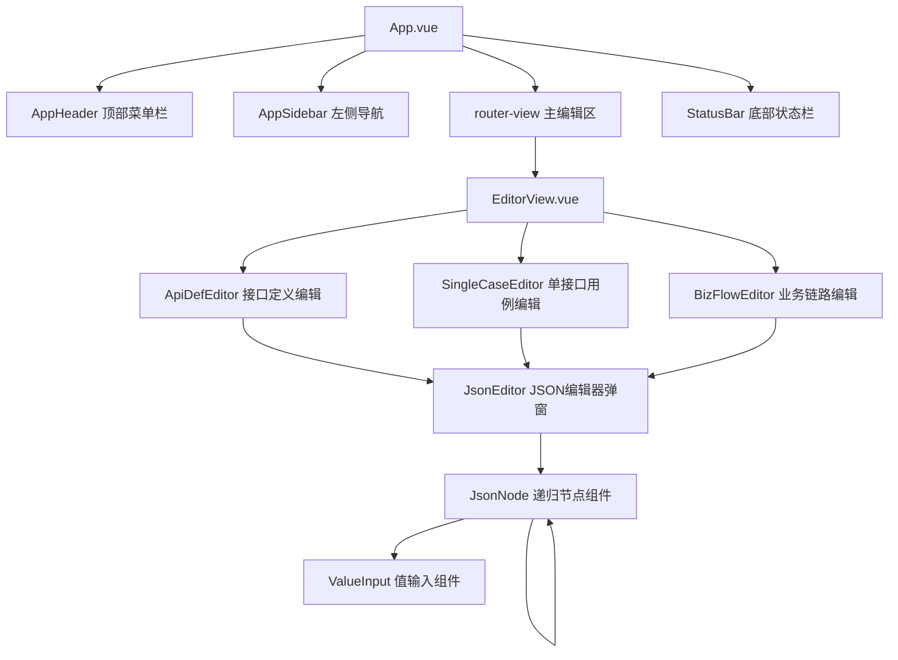
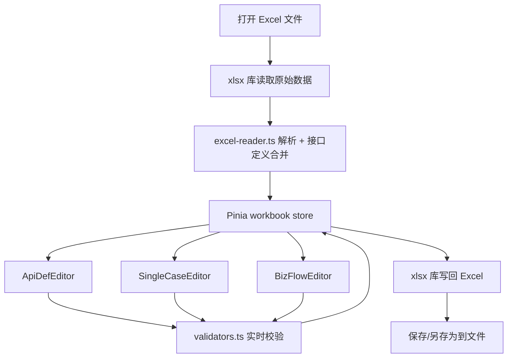

# Flow Forge — 测试用例编辑器

**中文** | [English](README.en.md)

基于 Vue3 + Ant Design 的 Excel 测试用例可视化编辑器，用于读取和编辑 Flow Forge 框架的测试用例 Excel 文件。

## 快速开始

```bash
cd case-editor
npm install
npm run dev
```

浏览器访问 `http://localhost:5173` 即可打开编辑器。

## 技术栈

| 层面 | 技术 |
|------|------|
| 前端框架 | Vue 3 (Composition API + `<script setup>`) |
| UI 组件库 | Ant Design Vue 4.x |
| 构建工具 | Vite 5.x |
| 状态管理 | Pinia |
| 国际化 | vue-i18n 9.x |
| Excel 读写 | SheetJS (xlsx) |
| 语言 | TypeScript |

## 功能列表

- 打开/编辑/保存 Excel 测试用例文件（.xlsx 格式）
- 接口定义页编辑（表格形式，支持新增/删除行）
- 单接口测试用例编辑（RelevanceID 关联校验）
- 业务链路用例编辑（StepID 重复校验、Trans 字段格式校验）
- **JSON 可视化编辑器**：将 RequestHead、RequestBody、AssertDict 等 JSON 字段转化为交互友好的树形编辑器
  - 支持粘贴 JSON 字符串自动解析
  - 每个字段展示 key / type / value 三列，均可编辑
  - 支持 6 种类型：字符串、数字、布尔、日期、列表、字典
  - 不同类型对应不同的 value 输入控件
  - 支持嵌套 Dict/List 的递归编辑
- 实时校验（RelevanceID 存在性、StepID 唯一性、Trans 格式），校验失败标红
- 中英文双语界面，可随时切换
- 保存（Ctrl+S）和另存为（Ctrl+Alt+S）快捷键
- Windows 风格的界面布局

## 架构设计

### 组件树



### 数据流



## 项目结构

```text
case-editor/
├── README.md
├── package.json
├── vite.config.ts
├── tsconfig.json
├── index.html
└── src/
    ├── main.ts                        # 入口，注册插件
    ├── App.vue                        # 根组件，全局布局
    ├── router/index.ts                # Vue Router 配置
    ├── stores/
    │   ├── workbook.ts                # 工作簿数据（核心 store）
    │   ├── editor.ts                  # 编辑器 UI 状态
    │   └── settings.ts               # 设置（语言）
    ├── i18n/
    │   ├── index.ts                   # vue-i18n 初始化
    │   ├── zh-CN.json                 # 中文语言包
    │   └── en-US.json                 # 英文语言包
    ├── types/
    │   ├── excel.ts                   # Excel 数据类型定义
    │   └── editor.ts                  # 编辑器 UI 类型定义
    ├── utils/
    │   ├── excel-reader.ts            # Excel 读取 + 合并逻辑
    │   ├── excel-writer.ts            # Excel 写入逻辑
    │   ├── validators.ts             # 校验工具
    │   ├── deep-merge.ts             # 深度合并
    │   └── json-helper.ts            # JSON 解析/序列化辅助
    ├── components/
    │   ├── layout/
    │   │   ├── AppHeader.vue          # 顶部菜单栏
    │   │   ├── AppSidebar.vue         # 左侧 Sheet 导航
    │   │   └── StatusBar.vue          # 底部状态栏
    │   ├── editor/
    │   │   ├── ApiDefEditor.vue       # 接口定义页编辑器
    │   │   ├── SingleCaseEditor.vue   # 单接口用例编辑
    │   │   └── BizFlowEditor.vue      # 业务链路编辑
    │   └── json-editor/
    │       ├── JsonEditor.vue         # JSON 编辑器弹窗
    │       ├── JsonNode.vue           # 递归节点组件
    │       └── ValueInput.vue         # 值输入组件
    ├── views/
    │   └── EditorView.vue             # 主编辑器视图
    └── assets/styles/
        └── global.css                 # 全局样式
```

## 使用说明

### 打开文件

点击顶部工具栏「打开」按钮（或 Ctrl+O），选择 `.xlsx` 格式的测试用例 Excel 文件。编辑器将自动读取并合并数据。

### 编辑接口定义

左侧点击「接口定义」切换到接口定义页。表格中可直接编辑各字段：
- 普通文本列（TestID、APIName 等）：直接输入
- Method 列：下拉选择 HTTP 方法
- StatusCode 列：数字输入
- RequestHead / RequestBody / AssertDict 列：点击按钮弹出 JSON 编辑器

### JSON 编辑器

1. **粘贴模式**：在上方文本框中粘贴 JSON 字符串，点击「解析」按钮自动生成树形结构
2. **树形编辑模式**：
   - 每个字段展示 **key**（键名）、**type**（类型）、**value**（值）三列
   - 修改类型后会自动重置对应的值
   - Dict/List 类型可展开/折叠，支持递归添加子节点
   - 点击「添加字段」添加顶级字段
3. 编辑完成后点击「确定」保存，或「取消」放弃修改

### 编辑业务链路

左侧点击业务链路名称切换到对应 Sheet：
- **StepID**：重复时单元格标红
- **RelevanceID**：既可手动输入也可下拉选择（数据源为接口定义页 TestID），不存在时标红
- **Trans**：格式校验（key=value, key=value...），括号不匹配或包含中文时标红并显示错误提示
- 支持调整步骤顺序（上移/下移）

### 保存文件

- **导出**（Ctrl+S）：下载新的Excel文件

### 语言切换

顶部菜单栏右侧下拉框可切换中文/English，选择后立即生效并持久化到浏览器 localStorage。

## 校验规则

| 校验项 | 适用范围 | 规则 | UI 表现 |
|--------|---------|------|---------|
| RelevanceID | 单接口用例、业务链路 | 必须在接口定义页的 TestID 集合中存在 | 单元格标红 |
| StepID | 业务链路 | 同一 Sheet 内不得重复 | 单元格标红 |
| Trans 格式 | 业务链路 | `key=value, key=value` 格式 | 单元格标红 + Tooltip |
| Trans 括号 | 业务链路 | `[` 与 `]` 数量一致，`(` 与 `)` 数量一致 | 单元格标红 + Tooltip |
| Trans 中文 | 业务链路 | 不允许包含中文字符 | 单元格标红 + Tooltip |

## 快捷键

| 快捷键 | 功能 |
|--------|------|
| Ctrl+O | 打开文件 |
| Ctrl+S | 保存 |
| Ctrl+Alt+S | 另存为 |
| Ctrl+N | 新建空白工作簿 |

## 开发说明

### 本地开发

```bash
npm install
npm run dev
```

### 构建生产版本

```bash
npm run build
```

产物输出到 `dist/` 目录，可直接部署到任意静态文件服务器。

### 扩展开发

- **新增 JSON 类型**：在 `types/excel.ts` 的 `JsonType` 中添加新类型，在 `ValueInput.vue` 中添加对应的输入控件
- **新增校验规则**：在 `utils/validators.ts` 中添加校验函数，在 `stores/workbook.ts` 的 `runAllValidations()` 中调用
- **新增国际化语言**：在 `i18n/` 下添加新的语言包 JSON 文件，在 `i18n/index.ts` 中注册

### 与 Python 执行器的兼容性

编辑器读取和保存的 Excel 格式与 `python/excel_reader/excel_parser.py` 完全兼容：

- Sheet 顺序：接口定义 → 单接口用例 → 业务链路
- 合并逻辑：用例值优先，接口定义补充
- JSON 字段序列化：紧凑 JSON 字符串
- 列名完全一致
