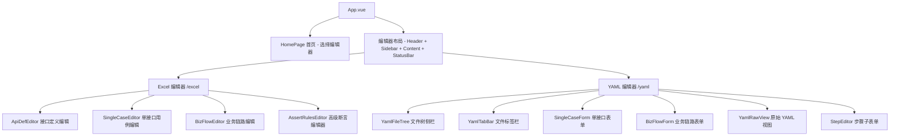
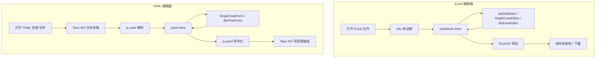

# Flow Forge — 测试用例编辑器

**中文** | [English](README.en.md)

基于 Vue 3 + Ant Design Vue + Tauri 2 的桌面测试用例编辑器，支持 Excel (.xlsx) 和 YAML (.yaml) 两种用例格式的可视化编辑。

## 快速开始

```bash
cd case-editor
npm install

# 浏览器开发模式
npm run dev

# Tauri 桌面应用开发模式
npm run dev:desktop
```

- 浏览器模式：访问 `http://localhost:5173`
- 桌面模式：自动启动 Tauri 窗口

## 技术栈

| 层面 | 技术 |
|------|------|
| 前端框架 | Vue 3 (Composition API + `<script setup>`) |
| UI 组件库 | Ant Design Vue 4.x |
| 构建工具 | Vite 8.x |
| 桌面框架 | Tauri 2.x |
| 状态管理 | Pinia |
| 国际化 | vue-i18n 9.x |
| Excel 读写 | SheetJS (xlsx) + ExcelJS |
| YAML 解析 | js-yaml 4.x |
| 语言 | TypeScript |

## 功能列表

### 通用
- 首页编辑器选择（Excel / YAML）
- Tauri 桌面应用，支持本地文件保存回原路径
- 中英文双语界面，可随时切换
- 保存（Ctrl+S）和另存为（Ctrl+Alt+S）快捷键
- **查找与替换**（Ctrl+F / Ctrl+H）：在 Excel 中按表格单元格查找，在 YAML 中按原始文本查找，支持大小写、全词匹配和正则表达式
- **「编辑」菜单**：工具栏新增「编辑」下拉菜单，提供「查找」「替换」「在文件中查找」「在文件中替换」四种操作入口
- **全局搜索**：「在文件中查找」跨所有 Sheet（Excel）或项目目录中所有 YAML 文件搜索，结果按来源分组显示；「在文件中替换」支持逐条审查替换和全部替换

### Excel 编辑器
- 打开/编辑/保存 Excel 测试用例文件（.xlsx 格式）
- 接口定义页编辑（表格形式，支持新增/删除行）
- 单接口测试用例编辑（RelevanceID 关联校验）
- 业务链路用例编辑（StepID 重复校验、Trans 字段格式校验）
- **查找与替换**：在当前 Sheet 页中按单元格内容查找/替换，匹配行高亮显示，支持批量替换
- **JSON 可视化编辑器**：将 RequestHead、RequestBody、AssertDict 等 JSON 字段转化为交互友好的树形编辑器
  - 支持粘贴 JSON 字符串自动解析
  - 每个字段展示 key / type / value 三列，均可编辑
  - 支持 6 种类型：字符串、数字、布尔、日期、列表、字典
  - 支持嵌套 Dict/List 的递归编辑
- **高级断言编辑器（AssertRules）**：逐条规则编辑，支持实时格式校验
  - 支持 12 种运算符：`==` `!=` `>` `>=` `<` `<=` `=~` `in` `contains` `not_contains` `is_null` `is_not_null` `typeof`
  - 支持 3 种函数：`.length()` `SUM()` `SUM_PRODUCT()`
  - 格式错误实时提示（运算符合法性、路径语法、函数名、期望值缺失等）
- 实时校验（RelevanceID 存在性、StepID 唯一性、Trans 格式），校验失败标红

### YAML 编辑器
- **表单化编辑**：非文本编辑器，通过结构化表单字段编辑 YAML 用例
- **右侧 YAML 编辑面板**：默认可直接编辑原生 YAML 文本，支持实时自动同步到表单（半秒延迟），也支持切换为只读预览模式（类似 Markdown 编辑器分屏视图）
- 通过 `case_type` 字段自动识别用例类型：`single`（单接口用例）/ `biz`（业务链路用例）
- 支持打开目录（左侧文件树浏览，VS Code 风格）或单独打开 .yaml 文件（通过头部「打开」下拉菜单）
- **文件标签页**：支持同时打开多个文件，通过标签页切换（类似 VS Code）
- 单接口表单：完整字段（test_id、relevance_id、tag、api_name、method、url、request_head/body、assert_dict/rules 等）
- 业务链路表单：sheet_name + 步骤列表（可拖拽排序），每步含完整字段
- 复用 Excel 编辑器的 JSON 编辑器和 AssertRules 编辑器
- 字段校验镜像 Excel 编辑器（StepID 重复、Trans 格式）
- **查找与替换**：在 YAML 原始文本中查找/替换，自动展开右侧 YAML 面板，匹配行号及内容一目了然

## 架构设计

### 组件树



### 数据流



## 项目结构

```text
case-editor/
├── README.md
├── README.en.md
├── package.json
├── vite.config.ts
├── tsconfig.json
├── tauri.conf.json
├── index.html
├── src-tauri/                         # Tauri Rust 后端
│   ├── Cargo.toml
│   ├── src/
│   │   ├── main.rs
│   │   └── lib.rs                    # 插件注册 + 自定义 command
│   ├── capabilities/
│   │   └── default.json              # 权限配置
│   └── icons/
└── src/
    ├── main.ts                        # 渲染进程入口
    ├── App.vue                        # 根组件，条件布局
    ├── env.d.ts                       # 类型声明
    ├── router/index.ts                # 三路由：/、/excel、/yaml
    ├── stores/
    │   ├── workbook.ts                # Excel 工作簿数据（核心 store）
    │   ├── yaml-store.ts             # YAML 编辑器数据 store
    │   ├── editor.ts                  # 编辑器 UI 状态
    │   └── settings.ts               # 设置（语言）
    ├── i18n/
    │   ├── index.ts                   # vue-i18n 初始化
    │   ├── zh-CN.json                 # 中文语言包
    │   └── en-US.json                 # 英文语言包
    ├── types/
    │   ├── excel.ts                   # Excel 数据类型定义
    │   ├── yaml.ts                    # YAML 数据类型定义
    │   └── editor.ts                  # 编辑器 UI 类型定义
    ├── utils/
    │   ├── excel-reader.ts            # Excel 读取 + 解析
    │   ├── excel-writer.ts            # Excel 写入逻辑
    │   ├── yaml-parser.ts            # YAML 解析 / 序列化
    │   ├── assert-rules-validator.ts  # AssertRules 格式校验引擎
    │   ├── validators.ts             # 通用校验工具
    │   ├── desktop-bridge.ts         # Tauri API 桥接 + 浏览器降级
    │   ├── deep-merge.ts             # 深度合并
    │   └── json-helper.ts            # JSON 解析 / 序列化辅助
    ├── components/
    │   ├── layout/
    │   │   ├── AppHeader.vue          # 顶部菜单栏
    │   │   ├── AppSidebar.vue         # 左侧导航
    │   │   └── StatusBar.vue          # 底部状态栏
    │   ├── editor/
    │   │   ├── ApiDefEditor.vue         # 接口定义页编辑器
    │   │   ├── SingleCaseEditor.vue     # 单接口用例编辑
    │   │   ├── BizFlowEditor.vue        # 业务链路编辑
    │   │   ├── AssertRulesEditor.vue    # 高级断言规则编辑器
    │   │   └── AssertRulesModal.vue     # 断言规则结构化编辑弹窗
    │   ├── yaml-editor/
    │   │   ├── YamlFileTree.vue         # YAML 文件树侧栏
    │   │   ├── YamlTabBar.vue           # 文件标签栏
    │   │   ├── SingleCaseForm.vue       # 单接口用例表单
    │   │   ├── BizFlowForm.vue          # 业务链路表单
    │   │   ├── StepEditor.vue           # 步骤子表单
    │   │   └── YamlRawView.vue          # 原始 YAML 文本视图
    │   └── json-editor/
    │       ├── JsonEditor.vue         # JSON 编辑器弹窗
    │       ├── JsonNode.vue           # 递归节点组件
    │       └── ValueInput.vue         # 值输入组件
    ├── views/
    │   ├── HomePage.vue              # 首页（选择编辑器）
    │   ├── EditorView.vue            # Excel 编辑器视图
    │   └── YamlEditorView.vue        # YAML 编辑器视图
    └── assets/styles/
        └── global.css                 # 全局样式
```

## 使用说明

### 首页

启动应用后进入首页，展示两张选择卡片：
- **Excel 编辑器**：点击进入 Excel 表格化编辑模式
- **YAML 编辑器**：点击进入 YAML 表单化编辑模式

### Excel 编辑器

#### 打开文件

点击顶部工具栏「打开」按钮（或 Ctrl+O），选择 `.xlsx` 格式的测试用例文件。Tauri 模式下直接读取本地文件并记录路径，浏览器模式通过文件对话框读取。

#### 编辑接口定义

左侧点击「接口定义」切换到接口定义页。表格中可直接编辑各字段：
- 普通文本列：直接输入
- Method 列：下拉选择 HTTP 方法
- StatusCode 列：文本输入
- RequestHead / RequestBody / AssertDict 列：点击按钮弹出 JSON 编辑器
- AssertRules 列：只读预览区 + 「编辑详情」按钮，点击打开结构化断言规则编辑弹窗

#### 编辑高级断言（AssertRules）

AssertRules 列显示只读预览区（每行一条规则），点击「编辑详情」按钮打开结构化编辑弹窗：
- 每条规则分为路径、运算符、期望值三列独立编辑
- 支持 12 种运算符（== != > >= < <= =~ contains not_contains in typeof is_null is_not_null）
- 实时校验格式并提示错误
- 支持「批量粘贴」：一次性粘贴多行规则，自动拆分解析

#### 保存文件

- **保存**（Ctrl+S）：Tauri 模式下直接写回原始文件路径；浏览器模式下载新文件
- **另存为**（Ctrl+Alt+S）：弹出保存对话框选择新路径

### YAML 编辑器

#### 打开用例

- **打开目录**：点击头部「打开」→「打开目录」，选择包含 .yaml 文件的目录，左侧显示文件树
- **打开文件**：点击头部「打开」→「打开文件」，直接选择一个 .yaml 文件进行编辑
- **文件标签页**：支持同时打开多个文件，通过标签页切换，点击 × 关闭标签

#### 表单编辑

根据 YAML 文件中的 `case_type` 字段自动切换表单类型：
- `single`：单接口用例表单（test_id、relevance_id、api_name、method、url 等字段）
- `biz`：业务链路表单（sheet_name + 步骤列表）

简单字段以两列网格布局呈现，JSON 字段（RequestHead、RequestBody、AssertDict）、AssertRules 和备注字段独占一行。JSON 和 AssertRules 字段可直接在文本框中编辑原始内容（失焦自动保存），也可点击「编辑详情」按钮打开结构化编辑器进行可视化编辑。JSON 文本区域高度自适应内容。

#### YAML 预览面板

右侧面板可切换显示：
- 折叠状态：只显示切换按钮
- 编辑模式（默认）：可直接编辑 YAML 文本，输入半秒后自动解析更新中间表单，适合大批量复制粘贴场景
- 预览模式：实时显示当前表单数据序列化后的 YAML 文本（只读）

#### 保存

- **保存**（Ctrl+S）：直接写回原文件
- **另存为**（Ctrl+Alt+S）：弹出保存对话框选择新路径

## 校验规则

### Excel 编辑器

| 校验项 | 适用范围 | 规则 | UI 表现 |
|--------|---------|------|---------|
| RelevanceID | 单接口用例、业务链路 | 必须在接口定义页的 TestID 集合中存在 | 单元格标红 |
| StepID | 业务链路 | 同一 Sheet 内不得重复 | 单元格标红 |
| Trans 格式 | 业务链路 | `key=value, key=value` 格式 | 单元格标红 + Tooltip |
| Trans 括号 | 业务链路 | `[` 与 `]` 数量一致，`(` 与 `)` 数量一致 | 单元格标红 + Tooltip |
| Trans 中文 | 业务链路 | 不允许包含中文字符 | 单元格标红 + Tooltip |
| AssertRules 格式 | 全部 | 运算符合法性、路径语法、函数名、期望值 | 行尾 ✗ 图标 + Tooltip |
| JSON 格式 | JSON 字段 | 合法 JSON 字符串 | 文本区下方红色提示 |

### YAML 编辑器

| 校验项 | 适用范围 | 规则 | UI 表现 |
|--------|---------|------|---------|
| StepID | 业务链路 | 同一文件内不得重复 | 输入框标红 |
| Trans 格式 | 业务链路 | `key=value, key=value` 格式，括号匹配，无中文 | 输入框标红 + Tooltip |
| AssertRules 格式 | 全部 | 同 Excel 编辑器 | 行尾 ✗ 图标 + Tooltip |

## AssertRules 运算符与函数参考

### 运算符

| 运算符 | 说明 | 示例 |
|--------|------|------|
| `==` | 等于 | `$.data.code == 0` |
| `!=` | 不等于 | `$.data.status != ERROR` |
| `>` | 大于（数值） | `$.data.price > 10.5` |
| `>=` | 大于等于（数值） | `$.data.total >= 100` |
| `<` | 小于（数值） | `$.data.age < 150` |
| `<=` | 小于等于（数值） | `$.data.size <= 1000` |
| `=~` | 正则匹配 | `$.data.time =~ ^\\d{4}-\\d{2}-\\d{2}$` |
| `in` | 值在列表中 | `$.data.status in ["PAID","PENDING"]` |
| `contains` | 包含子串 | `$.data.tags contains "premium"` |
| `not_contains` | 不包含子串 | `$.data.error not_contains "timeout"` |
| `is_null` | 为空 | `$.data.error is_null` |
| `is_not_null` | 不为空 | `$.data.token is_not_null` |
| `typeof` | 类型检查 | `$.data.count typeof int` |

### 函数

| 函数 | 说明 | 示例 |
|------|------|------|
| `.length()` | 数组长度 | `$.data.list.length() == 3` |
| `SUM(path)` | 通配路径求和 | `SUM($.data.list[*].price)` |
| `SUM_PRODUCT(p1, p2)` | 两个通配路径逐元素乘积求和 | `SUM_PRODUCT($.data.items[*].price, $.data.items[*].qty)` |

## 快捷键

| 快捷键 | 功能 |
|--------|------|
| Ctrl+O | 打开文件 |
| Ctrl+S | 保存 |
| Ctrl+Alt+S | 另存为 |
| Ctrl+N | 新建空白工作簿 |
| Ctrl+F | 查找 |
| Ctrl+H | 替换 |
| Esc | 关闭查找栏 |

## 开发说明

### 本地开发

```bash
# 纯浏览器模式（不依赖 Tauri）
npm run dev

# Tauri 桌面应用模式
npm run dev:desktop
```

### 构建

```bash
# 纯 Web 构建（静态文件部署）
npm run build

# Tauri 桌面应用打包
npm run build:desktop
```

- Web 构建产物输出到 `dist/`
- Tauri 打包产物输出到 `src-tauri/target/release/`

### 扩展开发

- **新增 JSON 类型**：在 `types/excel.ts` 的 `JsonType` 中添加新类型，在 `ValueInput.vue` 中添加对应的输入控件
- **新增校验规则**：在 `utils/validators.ts` 中添加校验函数，在对应 store 中调用
- **新增国际化语言**：在 `i18n/` 下添加新的语言包 JSON 文件，在 `i18n/index.ts` 中注册

### 与 Python 执行器的兼容性

编辑器读取和保存的 Excel/YAML 格式与 `python/` 执行器完全兼容：

- **Excel**：Sheet 顺序为接口定义 → 单接口用例 → 业务链路，列名完全一致，JSON 字段使用紧凑 JSON 序列化
- **YAML**：每用例一个 `.yaml` 文件，`case_type` 字段区分类型（`single`/`biz`），字段名使用 snake_case，与执行器的 YAML 解析器完全兼容
