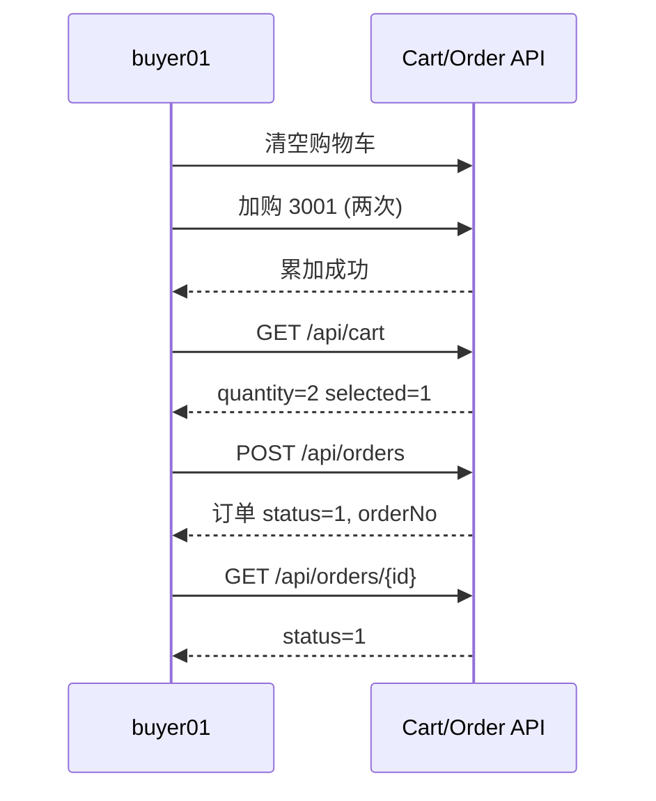
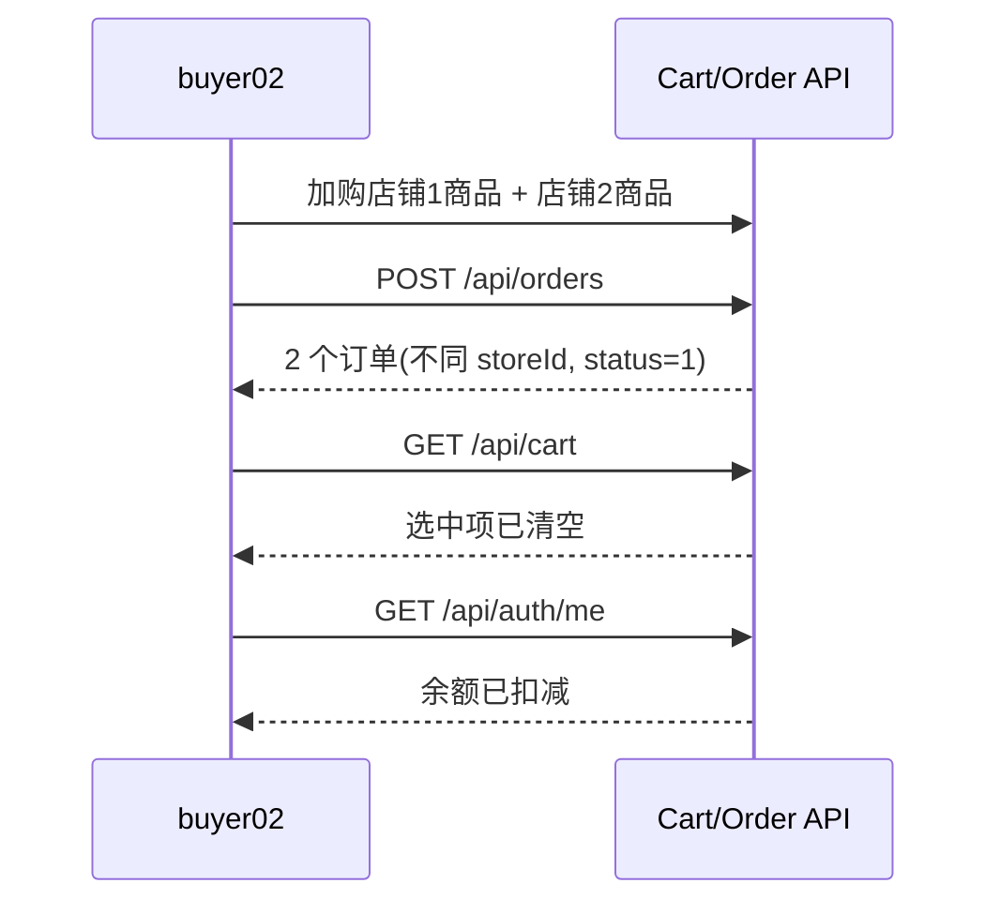
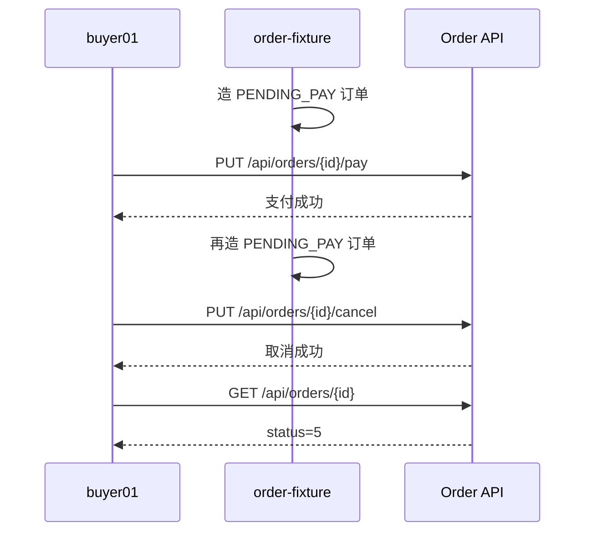
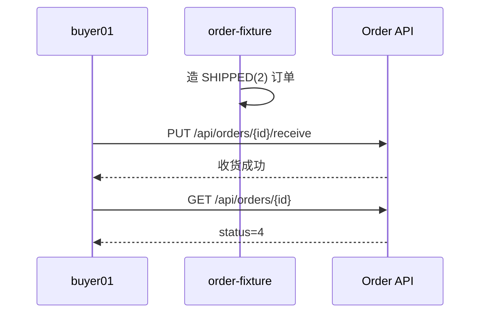
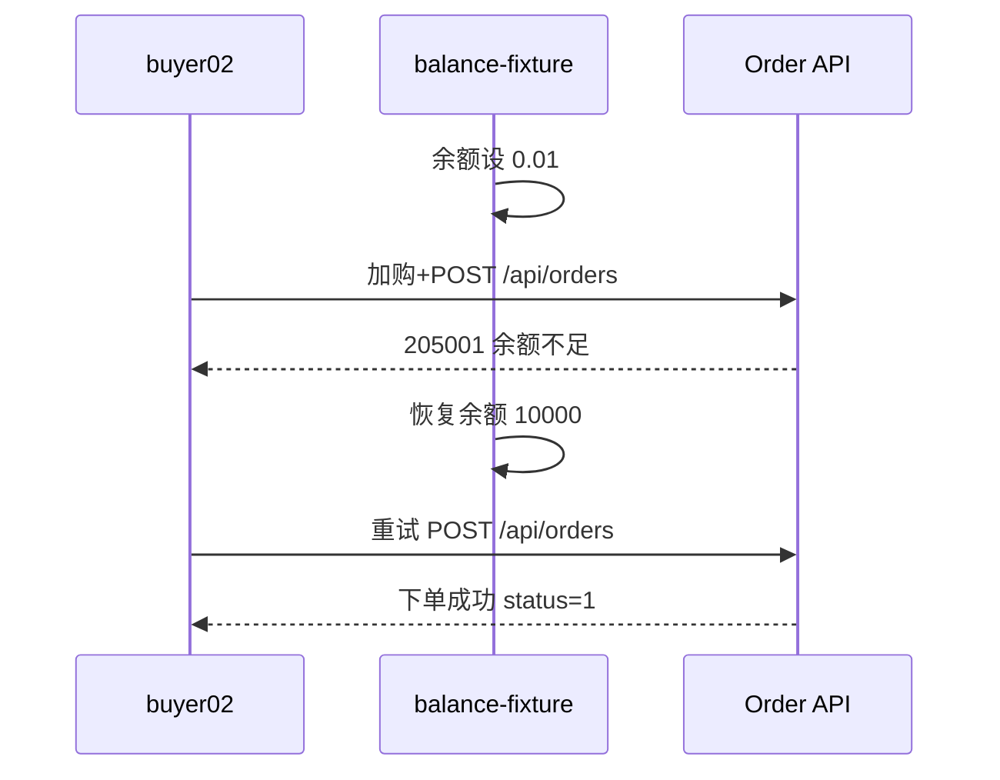
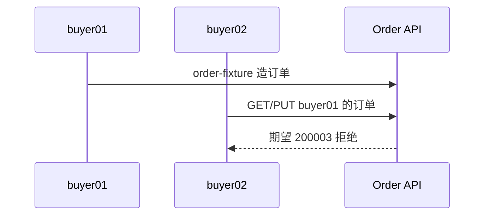

# Foli Mall 购物车与订单 测试计划（flowforge-testing）

## 业务理解

本次测试对象为 Foli Mall 的购物车与订单模块（需求 FOLI-REQ-005 v2.1.0），核心能力为：购物车 CRUD 与同商品去重累加、下单时按店铺拆分订单并余额一体化支付（乐观锁扣库存+扣余额）、订单生命周期（支付→发货→收货→完成→取消）及余额流水。发货接口未出现在接口文档中，本轮不生成发货用例（记为文档缺口，待补充后再纳入）；收货场景用 `order-fixture` 直接造 SHIPPED(2) 订单覆盖。

角色分 BUYER（购物车/下单/支付/取消/收货）、SELLER（发货）、ADMIN（查看所有，文档无对应接口，不覆盖）。测试目标：验证正常业务链路、多店铺拆分与事务一致性、状态机约束、业务异常码（203001/203002/203003/203004、205001/205002、207001/207002）、越权隔离，并如实报告发现的缺陷。

## 接口摘要

**共 14 个接口，其中 12 个需登录，按 3 个业务域分组**（认证 3、购物车 5、订单 6）。所有需登录接口均为 Bearer JWT，应用名 `foliMail`，baseURL `http://localhost:8080`，统一返回 `200 + code(6位)`。

### 认证 Auth
| 接口路径 | 方法 | 描述 | 需登录 | 认证方式 | 请求参数摘要 | 响应摘要 | 不确定项 |
|---|---|---|---|---|---|---|---|
| /api/auth/register | POST | 用户注册 | 否 | 无 | username: string(必), password: string(必), nickname: string(选) | Result\<UserVO\> | 无 |
| /api/auth/login | POST | 用户登录 | 否 | 无 | username, password: string(必) | Result\<LoginVO\>: token, userId | 无 |
| /api/auth/me | GET | 当前用户信息 | 是 | Bearer | 无 | Result\<UserVO\> | 无 |

### 购物车 Cart
| 接口路径 | 方法 | 描述 | 需登录 | 认证方式 | 请求参数摘要 | 响应摘要 | 不确定项 |
|---|---|---|---|---|---|---|---|
| /api/cart | POST | 添加商品 | 是 | Bearer | productId: int64(必), quantity: int32(选) | Result\<Void\> | 无 |
| /api/cart | GET | 购物车列表 | 是 | Bearer | 无 | Result\<List\<CartItemVO\>\> | 无 |
| /api/cart/{id} | PUT | 更新数量/选中 | 是 | Bearer | id: path(必); quantity/selected: int32(选) | Result\<Void\> | 是否校验归属未知 |
| /api/cart/{id} | DELETE | 删除购物车项 | 是 | Bearer | id: path(必) | Result\<Void\> | 无 |
| /api/cart | DELETE | 清空购物车 | 是 | Bearer | 无 | Result\<Void\> | 无 |

### 订单 Orders
| 接口路径 | 方法 | 描述 | 需登录 | 认证方式 | 请求参数摘要 | 响应摘要 | 不确定项 |
|---|---|---|---|---|---|---|---|
| /api/orders | POST | 创建订单（按店铺拆分） | 是 | Bearer | receiverName/Phone/Address: string(均选) | Result\<List\<OrderVO\>\> | 无 |
| /api/orders | GET | 买家订单列表 | 是 | Bearer | page/pageSize: int32(选), status: int32(选) | Result\<PageResult\<OrderVO\>\> | 无 |
| /api/orders/{id} | GET | 订单详情 | 是 | Bearer | id: path(必) | Result\<OrderVO\> | 越权返回行为未知 |
| /api/orders/{id}/pay | PUT | 支付订单 | 是 | Bearer | id: path(必) | Result\<Void\> | 状态机错误码未知 |
| /api/orders/{id}/cancel | PUT | 取消订单 | 是 | Bearer | id: path(必) | Result\<Void\> | 状态机错误码未知 |
| /api/orders/{id}/receive | PUT | 确认收货 | 是 | Bearer | id: path(必) | Result\<Void\> | 状态机错误码未知 |

## 单接口用例测试点

### 认证 Auth（P2）
- 注册：正常注册；重复用户名(201001)；空用户名/空密码(400+200001)。依赖：`user-fixture` predelete+cleanup。
- 登录：buyer01 正确凭据；密码错误(201002)；用户不存在(201002)；空用户名(400+200001)。
- me：有效 token；缺失 token(401+200001)。

### 购物车 Cart（P0/P1，请求头统一 `Authorization: "Bearer #{buyer01/buyer02}"`）
- POST /api/cart：默认 quantity=1；指定数量；重复添加（去重，数量校验在 BF_01）；商品不存在 203001；商品下架 203004；数量超库存（期望 203002，缺陷证据：foli-mall 加购不校验数量≤库存）。依赖：`cart-fixture`、`product-fixture`。
- GET /api/cart：有选中项；空购物车；未登录(401+200001)；商品已删除后商品信息为 null。
- PUT /api/cart/{id}：改数量；改 selected；数量=0 边界；数量超库存（期望 203002，缺陷证据）；项不存在 207002。依赖：`cart-fixture`、`product-fixture`。
- DELETE /api/cart/{id}：删除单项；删除不存在项 207002；删除下架商品购物车项仍成功。依赖：`cart-fixture`、`product-fixture`。
- DELETE /api/cart：清空成功；空车清空幂等。依赖：`cart-fixture`。

### 订单 Orders（P0/P1）
- POST /api/orders：单店铺下单成功（status=1、payTime 非空、orderNo 匹配 `FO+yyyyMMdd+6位数字`）；收货信息缺省仍成功；购物车空 207001；商品不存在 203001；下架 203004；库存不足 203002；余额不足 205001。依赖：`cart-fixture`、`product-fixture`、`balance-fixture`。
- GET /api/orders：分页正常；按 status 过滤；页码越界空列表；负数页码行为记录。依赖：`order-fixture`。
- GET /api/orders/{id}：详情含 items 快照；订单不存在 204001。依赖：`order-fixture`。
- PUT /api/orders/{id}/pay：PENDING_PAY(0) 支付成功；余额不足 205001；已发货(2) 支付 204002。依赖：`order-fixture`、`balance-fixture`。
- PUT /api/orders/{id}/cancel：PENDING_PAY(0) 取消成功；已支付(1)/已发货(2) 取消 204002。依赖：`order-fixture`。
- PUT /api/orders/{id}/receive：SHIPPED(2) 收货成功；已支付(1) 收货 204002；订单不存在 204001。依赖：`order-fixture`。

## 业务链路用例（6 条，均含 Mermaid 时序图）

### BF_01 登录→加购去重→单店铺下单→订单校验（P0，buyer01）
清空购物车 → 加购 3001×1 → 再加购 3001×1（断言累加）→ 列表断言 quantity=2/selected=1 → 下单（balance-fixture 10000）断言 status=1、orderNo 格式 → 详情断言 status=1 → me 断言余额已扣减 → 列表断言购物车已清空。

### BF_02 多店铺拆分下单→余额一次性扣减→选中项清空（P0，buyer02）
清空购物车 → 加购店铺1商品 3001 → 加购店铺2商品 3013 → 下单断言返回 2 个订单且均 PAID → 购物车断言已清空 → me 断言余额一次性扣减。

### BF_03 PENDING_PAY 支付→取消→状态校验（P1，buyer01）
`order-fixture` 造 status=0 订单 → pay 成功 → 再造 status=0 订单 → cancel 成功 → 详情断言 status=5。

### BF_04 SHIPPED 订单→确认收货→COMPLETED（P1，buyer01）
`order-fixture` 造 status=2 订单 → 买家 `PUT /api/orders/{id}/receive` → 详情断言 status=4 且 receiveTime/completeTime 非空。

### BF_05 余额不足下单失败→充值→重试成功（P1，buyer02）
`balance-fixture` 设 0.01 → 加购 → 下单断言 205001（事务回滚）→ `balance-fixture` 恢复 10000 → 重试下单成功 → me 断言余额已扣减。

### BF_06 越权访问与操作隔离（P2，buyer01 造单，buyer02 操作）
`order-fixture` 为 buyer01 造 3 条订单（status 0/0/2）→ buyer02 分别 GET 详情、pay、cancel、receive，全部断言 200003（缺陷证据：getOrderDetail 已知缺少属主校验）。

## 测试执行计划

- 环境已就绪（已自检）：foli-mall 应用 `http://localhost:8080` 运行中（`/v3/api-docs` 200），H2 运行于 `9092`；执行器 `envName=local`，`maxThread=1` 串行执行，避免共享用户干扰。
- 配置说明：为避免改动 flow-forge 仓库，执行配置放在本目录 `config/`（`env.yml` + `env-local.yml`，复制自 `python/` 并补充 `product-fixture`/`user-fixture` 的 H2 连接），由 `main.py --config` 指定。
- 流程：生成 YAML → `ff_tool.py validate --yamlDir <order>/cases --config-dir <order>/config --env-name local` 修正至零错误 → `main.py --config <order>/config/env.yml --yamlDir <order>/cases --envName local --apiMode all` → 按 schema/断言/环境三类 triage → 报告 HTML 路径、通过率、业务缺陷与阻塞项。
- 输出：本目录 `plan.md`、`cases/`、`report/`；HTML 报告由执行器写入 `python/report/` 后复制到 `report/`。
- 用例命名：`TC_AUTH_xxx`/`TC_CART_xxx`/`TC_ORDER_xxx`（52 条单接口）、`BF_01`~`BF_06`；优先级 P0 核心链路、P1 异常边界、P2 认证越权。

## 假设与约定

- 断言以业务 code（6 位）为主、HTTP 200 为辅；实际错误码/越权行为若与预期不符，按“需求缺陷或文档缺口”如实记录，不弱化断言（BugEvidence 用例预期失败）。
- Snowflake ID 不做精确数值断言，改用 `is_not_null`/字符串/金额字段断言；`inherit` 键值不含中文。
- 业务链路使用 buyer01/buyer02 独立用户，同一用户状态由 `cart-fixture`/`order-fixture`/`balance-fixture` 前置重置，避免互相污染。
- H2 与 foli-mall 应用由用户预启动，执行阶段不重启、不初始化；若连接失败再单独处理并报告。
- 接口文档未提供发货接口，本次不生成发货用例，待接口文档补充后再纳入。

## 执行结果（2026-08-06）

- 61 条用例：58 通过 / 3 失败，3 个失败均为预期缺陷证据（Bug1 加购不校验库存、Bug2 更新不校验库存、Bug3 订单详情越权读取），详见 `report/执行总结.md` 与 `report/test_cases_20260806_200547.html`。
- 越权链路按操作拆分为 4 条独立链路（详情/支付/取消/收货），因此业务链路为 9 条而非计划中的 6 条；其中支付/取消/收货越权均被正确拒绝（200003）。
