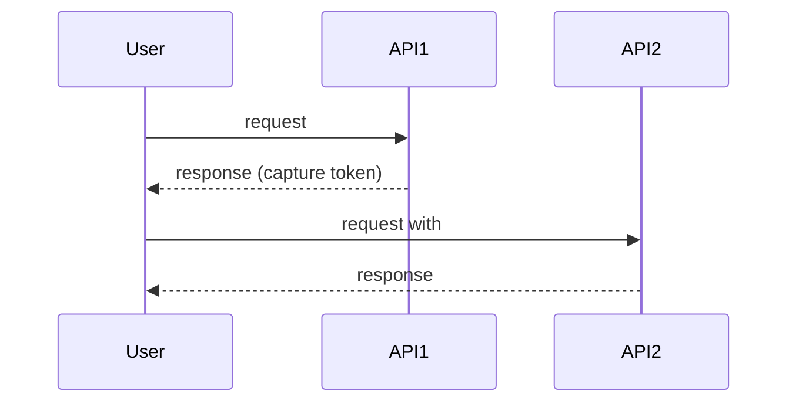

# Test Plan Template

Output all user-facing text in the language configured in
`flowforge.config.yaml` (default `zh_CN`). This file defines the required
structure; the test execution plan section is optional and light.

```markdown
# <产品/项目名> 测试计划 / <Product/Project> Test Plan

## 业务理解 / Business Understanding
<业务背景、测试范围、关键业务流程、用户角色、测试目标，2-3 段>
<2-3 paragraphs: background, scope, key flows, roles, objectives>

## 接口摘要 / Interface Summary

**本轮共 <N> 个接口，其中 <M> 个需要登录，按 <K> 个业务域分组。**
**<N> interfaces in total, <M> require login, grouped into <K> domains.**

### <业务域 1 / Domain 1>
| 接口路径 / URL | 方法 / Method | 描述 / Description | 需登录 / Login | 认证方式 / Auth | 请求参数摘要 / Request summary | 响应摘要 / Response summary | 不确定项 / Uncertainties |
|---|---|---|---|---|---|---|---|
| <path> | <GET/POST/...> | <what it does> | 是/否 | <Bearer/JWT/None> | <name: type (required?)> | <key fields> | <none or open questions> |

### <业务域 2 / Domain 2>
...

## 单接口用例测试点 / Single API Test Points

### <业务域 1 / Domain 1>
- <接口路径 + 方法>：正常/异常/边界/业务异常测试点
  - 中间件依赖：<例如：需 Redis 预置缓存 / e.g. Redis cache pre-seeded>
  - Middleware dependency: <...>

### <业务域 2 / Domain 2>
...

## 业务链路用例 / Business Flow Scenarios

### <场景名 / Scenario name>
- 涉及接口 / Involved APIs: <path+method list>
- 步骤与数据传递 / Steps and data passing:
  1. <Step 1: API + purpose + data to capture>
  2. <Step 2: API + purpose + #{variable} references>
- 中间件前置/后置 / Middleware pre/post:
  - <e.g. order-fixture creates a completed order before Step 2>



## 测试计划 / Test Execution Plan (optional, light constraints)
- 环境 / Environment: <envName>
- 执行范围 / Scope: <single | biz | all>
- 优先级 / Priority: <P0/P1...>
```

Guidelines:

- The Interface Summary must appear between Business Understanding and
  Single API Test Points. Use the `api_summary` vocabulary
  (`api_path`, `method`, `description`, `need_token`, `auth_type`,
  `request_summary`, `response_summary`, `uncertainties`) so the plan stays
  consistent with interface analysis.
- Every business flow must span at least 2 interfaces and include exactly
  one Mermaid sequence diagram.
- Annotate middleware dependencies on each test point and flow step so the
  generated cases can declare the right `preprocessors`/`postprocessors`.
- Keep the test execution plan section brief and optional; do not
  over-constrain it.
