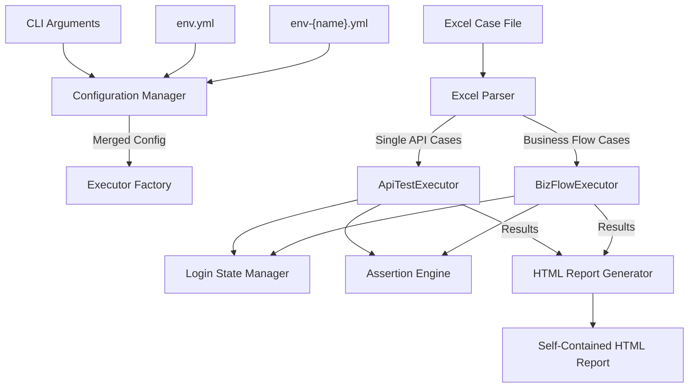
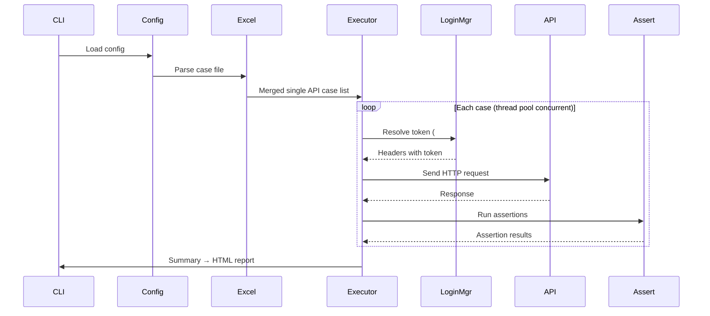
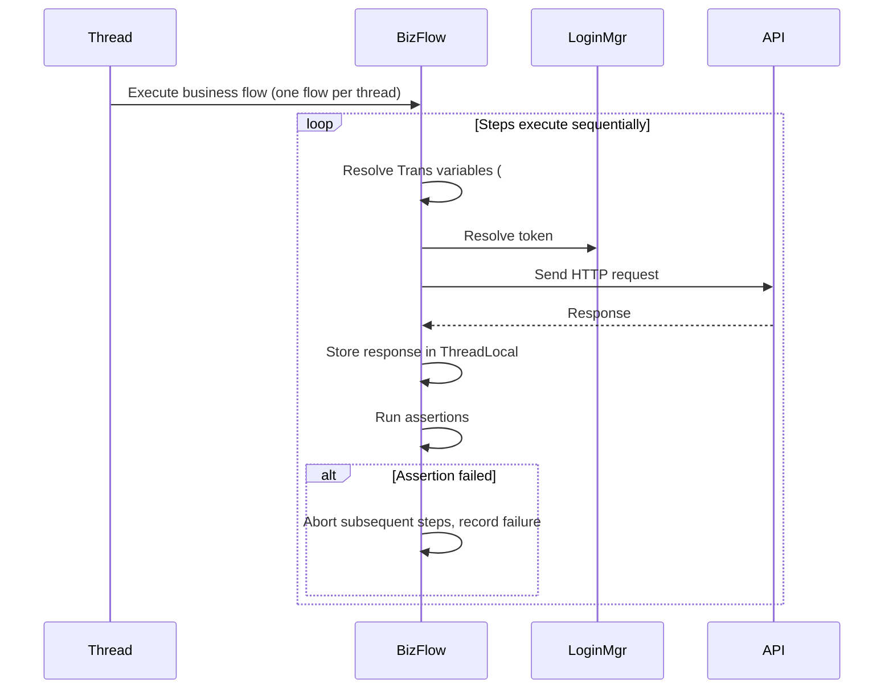

# Flow Forge — API Automation Test Executor

**English** | [中文](README.md)

A Python 3-based HTTP API automation test executor supporting Excel-driven case management, multi-threaded concurrent execution, parameter chaining across steps, automatic login state management, and self-contained HTML report output.

## System Architecture



## Directory Structure

```
python/
├── main.py                      # CLI entry point, workflow orchestration
├── requirements.txt             # Dependencies: requests, openpyxl, pyyaml
├── env.yml                      # Base configuration (can be committed)
├── env-local.yml                # Environment-specific config (with credentials, DO NOT commit)
│
├── config/
│   ├── __init__.py
│   └── config_manager.py        # Config loading, merging, CLI override
│
├── core/
│   ├── __init__.py
│   ├── deep_merge.py            # Recursive dict deep merge
│   ├── path_resolver.py         # Dot/bracket JSON path resolver
│   └── script_type.py           # Script type enum & executor registry
│
├── excel_reader/
│   ├── __init__.py
│   └── excel_parser.py          # Multi-sheet Excel parsing, validation, merging
│
├── executor/
│   ├── __init__.py
│   ├── base.py                  # BaseExecutor abstract base (thread pool + thread safety)
│   ├── api_test.py              # ApiTestExecutor: single API testing
│   ├── biz_flow.py              # BizFlowExecutor: multi-step business flow testing
│   └── factory.py               # Executor factory with dynamic import
│
├── auth/
│   ├── __init__.py
│   └── login_manager.py         # Thread-safe login state manager (token cache + fine-grained locks)
│
├── assertion/
│   ├── __init__.py
│   └── engine.py                # Field-level JSON path assertion engine
│
└── reporter/
    ├── __init__.py
    ├── html_writer.py           # Self-contained HTML report generator
    └── md_writer.py             # Markdown report generator (fallback)
```

## Installation

```bash
cd python
pip install -r requirements.txt
```

### Dependencies

| Dependency | Purpose |
|------------|---------|
| `requests` | HTTP request sending |
| `openpyxl` | Excel case file reading |
| `pyyaml` | YAML configuration parsing |

## Quick Start

### 1. Configure Environment

Edit `env.yml` to set base parameters:

```yaml
scriptType: APITest
envName: local
caseFilePath: ./test_cases.xlsx
maxThread: 5
reportName: APIReport
```

Edit `env-{envName}.yml` to configure target applications and login info (see [Configuration](#configuration)).

### 2. Prepare Excel Case File

Write test cases according to the [Excel Case Format](#excel-case-format).

### 3. Run Tests

```bash
# Run with default config (single API cases only)
python main.py

# Specify environment and thread count, run all cases
python main.py --envName prod --maxThread 10 --apiMode all

# Full parameter example
python main.py --config /path/to/env.yml --scriptType APITest --envName local \
               --caseFilePath ./test_cases.xlsx --maxThread 5 --reportName MyReport \
               --apiMode all
```

## Configuration

### Precedence

```
CLI arguments > env-{envName}.yml > env.yml > built-in defaults
```

### env.yml — Base Configuration (can be committed)

| Setting | Type | Default | Description |
|---------|------|---------|-------------|
| `scriptType` | str | `APITest` | Script type (currently only `APITest`) |
| `envName` | str | Required | Environment name; loads `env-{envName}.yml` |
| `caseFilePath` | str | Required | Excel case file path (relative to main.py) |
| `maxThread` | int | `5` | Thread pool size; controls concurrency |
| `reportName` | str | `APIReport` | HTML report title |
| `apiMode` | str | `single` | Execution mode: `single` / `biz` / `all` |

### env-{envName}.yml — Environment Config (DO NOT commit, contains credentials)

Top-level dict keys correspond to "application names" matching the `AppName` column in the Excel cases.

```yaml
<AppName>:
  baseURL: http://localhost:8080        # Application base URL
  loginPath: /api/user/login            # Login endpoint path
  loginBody: userAccount,password       # Login request body field list (comma-separated)
  headTokenName: Authorization          # Header field name for the token
  resTokenPath: $.data.token            # JSON path to token in login response
  <userParamName>:                      # User config (referenced in Excel via #{})
    userAccount: admin                  # Value for loginBody fields
    password: "123456"
```

Multiple applications can be defined, each with multiple users:

```yaml
someApp:
  baseURL: http://localhost:8080
  loginPath: /api/login
  loginBody: userAccount,password
  headTokenName: Authorization
  resTokenPath: $.data.token
  adminUser:
    userAccount: user1
    password: "12345678"
  leaderUser:
    userAccount: user2
    password: "12345678"

managerURL:
  baseURL: http://localhost:8081
  loginPath: /api/manager/login
  loginBody: username,password
  headTokenName: Authorization
  resTokenPath: $.data.token
  someUser:
    username: usera1
    password: 11111*
  ...
```

### CLI Arguments

| Argument | Type | Description |
|----------|------|-------------|
| `--config` | str | Path to env.yml (default: env.yml next to main.py) |
| `--scriptType` | str | Script type, overrides env.yml |
| `--envName` | str | Environment name, overrides env.yml |
| `--caseFilePath` | str | Excel case file path, overrides env.yml |
| `--maxThread` | int | Max thread count, overrides env.yml |
| `--reportName` | str | Report name, overrides env.yml |
| `--apiMode` | str | Execution mode (`single`/`biz`/`all`), overrides env.yml |

### apiMode Values

| Value | Behavior |
|-------|----------|
| `single` | Execute only Sheet 2 (single API cases) |
| `biz` | Execute only Sheet 3+ (business flow cases) |
| `all` | Execute both single API and business flow cases |

## Excel Case Format

The Excel file contains multiple sheets structured as follows:

### Sheet 1 — API Definitions

Required columns: `TestID`, `APIName`, `AppName`, `Method`, `URL`, `StatusCode`

| Column | Type | Description |
|--------|------|-------------|
| `TestID` | str | Unique identifier; referenced by `RelevanceID` in other sheets |
| `APIName` | str | API name/description |
| `AppName` | str | Application name, matching the app key in `env-{envName}.yml` |
| `Method` | str | HTTP method: `GET`/`POST`/`PUT`/`DELETE`/`PATCH` |
| `URL` | str | API path (relative to app's `baseURL`), e.g., `/api/user/login` |
| `StatusCode` | int | Expected HTTP status code |
| `RequestHead` | JSON | Request headers, JSON string or object |
| `RequestBody` | JSON | Request body, JSON string or object |
| `AssertDict` | JSON | Assertion dictionary; key = response JSON path, value = expected value |
| `Remark` | str | Remarks |
| `Tag` | str | Tag (e.g., P0/P1/P2) |

### Sheet 2 — Single Cases

Required columns: `TestID`, `RelevanceID`

| Column | Type | Description |
|--------|------|-------------|
| `TestID` | str | Unique test case identifier |
| `RelevanceID` | str | References a `TestID` in Sheet 1; inherits base configuration |
| Other columns | — | Same as Sheet 1; non-empty values override Sheet 1's corresponding fields |

### Sheet 3+ — Business Flow

Each sheet represents a business scenario; the sheet name is the scenario name. Required columns: `StepID`, `RelevanceID`

| Column | Type | Description |
|--------|------|-------------|
| `StepID` | str | Step identifier (must be unique within the same sheet), e.g., `Step01` |
| `RelevanceID` | str | References a `TestID` in Sheet 1 |
| `Trans` | str | Inter-step data passing definition (see syntax below) |
| Other columns | — | Same as Sheet 1/Sheet 2 |

### Deep Merge Rules

Each row in Sheet 2/Sheet 3+ is linked to a Sheet 1 interface definition via `RelevanceID`. Merge rules:

- **Simple fields** (`APIName`, `AppName`, `Method`, `URL`, `StatusCode`): case row value takes priority; if empty, inherit from interface definition
- **JSON fields** (`RequestHead`, `RequestBody`): deep merge — interface definition as base, case row overrides
- **AssertDict**: use case row value if present; otherwise use interface definition

### Trans Field Syntax

`Trans` passes data between steps in a business flow:

```
variableName=sourceStepID.responseJSONPath, variableName2=sourceStepID2.responseJSONPath
```

Example:
```
username=Step01.data.username, orderId=Step02.data.orderId
```

Reference passed values in `RequestHead` or `RequestBody` using `#{variableName}`:

```json
{
  "Authorization": "#{<userParamName>}",
  "orderId": "#{orderId}"
}
```

Escape: use `\#{...}` for a literal `#{...}` — it will not be substituted.

**Trans Validation Rules:**
- No Chinese characters allowed
- Must be in `key=value` format
- Square brackets `[]` must appear in matching pairs
- `StepID` must be unique within the same sheet

### JSON Field Notes

JSON fields in Excel support the following formats:
- Standard JSON strings (double-quoted)
- Single-quoted JSON (auto-converted to double quotes)
- Chinese quotation marks `""`/`''` (auto-converted to standard double quotes)
- Direct JSON objects (already parsed to dict by openpyxl)

## Core Modules

### Configuration Manager (`config/config_manager.py`)

Singleton global configuration management:

1. Load `env.yml` for base configuration
2. Load `env-{envName}.yml`, separating top-level and application config
3. Apply CLI argument overrides
4. Provide `get()`, `get_all()`, `get_app()` interfaces

### Excel Parser (`excel_reader/excel_parser.py`)

- Reads Sheet 1 interface definitions as "templates"
- Reads Sheet 2 (single API) and Sheet 3+ (business flows) according to `apiMode`
- Merges case rows with interface definitions via `RelevanceID`
- Validates `Trans` fields and deduplicates `StepID` for business flows
- Returns `parse_error` on parsing exceptions without blocking other cases

### Executors

#### BaseExecutor (`executor/base.py`)

Abstract base class providing:
- `ThreadPoolExecutor` thread pool with concurrency controlled by `maxThread`
- Thread-safe result collection (`threading.Lock`)
- Unified exception handling and error result construction
- Subclasses implement `execute_single()` method

#### ApiTestExecutor (`executor/api_test.py`)

Single API test executor:
1. Extracts `app_name`, `method`, `url`, `headers`, `body` from the case
2. Looks up the app's `baseURL` by `AppName`, constructs full URL
3. Calls `LoginManager` to resolve `#{userParamName}` placeholders to actual tokens
4. Sends HTTP request (GET/DELETE params in query string, POST/PUT/PATCH as JSON body, 30-second timeout)
5. Runs the assertion engine to verify the response
6. Auto-appends `status_code` assertion

#### BizFlowExecutor (`executor/biz_flow.py`)

Business flow test executor:
- Each business flow (one sheet) runs in its own thread
- Steps within a flow execute **sequentially**; any step failure aborts subsequent steps
- Uses `threading.local()` to store per-thread step response data
- `_parse_trans()` parses `key=StepID.path` mappings
- `_resolve_vars()` substitutes `#{key}` with actual response values from previous steps
- Generates an "execution chain" string (success with `→`, failure marked with `×`)

### Login State Manager (`auth/login_manager.py`)

Thread-safe token management:

```
Detect #{userParamName} → Check cache → Cache hit: return token
                                      → Cache miss → Check failure blacklist → Blacklisted: skip
                                                                               → Not blacklisted: acquire user lock
                                                                                 → POST login endpoint
                                                                                 → Success: cache token, return
                                                                                 → Failure: add to blacklist, return error
```

Key design choices:
- **Fine-grained locks**: locking at `appName:userParamName` granularity; different users can log in concurrently
- **Failure blacklist**: MD5 hash of failed login credentials to avoid repeated invalid requests
- **Token cache**: each user logs in only once; subsequent calls reuse the cached token

### Assertion Engine (`assertion/engine.py`)

- Performs field-level assertions on HTTP responses
- `assert_dict` keys are JSON paths (supports dot + bracket notation: `data.items[0].name`, also `$.` prefix)
- `status_code` field is special-cased, asserting against `response.status_code`
- Missing path renders as `<not found>`
- Comparison: `str(actual) == str(expected)`

### HTML Report Generator (`reporter/html_writer.py`)

Generates self-contained HTML reports (no external CSS/JS dependencies):

- **Summary section**: environment name, test time, total case count
- **Single API Cases section**: collapsible list, sorted with failures first. Each case card includes:
  - Request/response details (JSON formatted)
  - Assertion results table (field, expected, actual, pass/fail)
- **Business Flow Cases section**: one card per flow, showing the execution chain and per-step details
- Pass/fail indicated with green/red coloring
- Reports output to `python/report/` directory; filename format: `{ExcelFileName}_{timestamp}.html`

## Execution Flow

### Single API Test Flow



### Business Flow Test Flow



## Exit Codes

| Code | Meaning |
|------|---------|
| `0` | All cases passed |
| `1` | Some or all cases failed |
| `2` | Configuration or file parsing error (no cases executed) |
