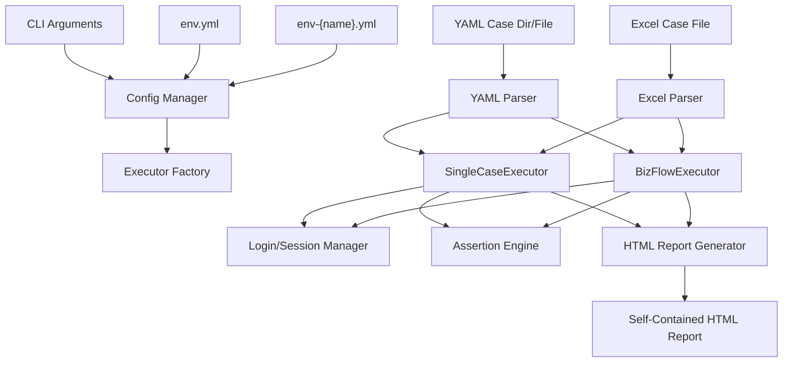

# Flow Forge — API Test Automation Executor

[中文](README.md) | **English**

A Python 3-based HTTP API test automation executor: YAML/Excel-driven case management, multi-threaded concurrent execution, cross-request parameter passing, automatic login/session management, and self-contained HTML reports, plus Excel ↔ YAML conversion and pytest code generation.

## What It Can Do

- **Two case types**: single-API test cases + multi-step business-flow test cases (data such as tokens can be passed between steps via `inherit`).
- **Multi-threaded execution**: a thread pool runs cases concurrently (controlled by `maxThread`); this is not load testing.
- **Two-level assertions**: simple equality assertions (`assert_dict`) + advanced multi-operator assertion rules (`assert_rules`: numeric comparison, regex, list aggregation, etc.).
- **Automatic login/session**: manages tokens per application/user, with fine-grained locks + cache + failure blacklist. Provides `get_current_user()` / `get_user()` / `get_app_user()` utilities so plugins can directly access the logged-in user's configuration.
- **Extensible processors**: pre-/post-processor extension points (HMAC signing, timestamps, path parameters, SQL cleanup, etc.). `BaseExternalPlugin` provides a shared base class for DB/Redis/MQ/Kafka/Pulsar/RocketMQ plugins.
- **Self-contained reports**: HTML reports embed all styles and scripts, so they open directly in a browser.
- **Format conversion**: `excel2yaml` / `yaml2excel` / `yaml2pytest` / `excel2pytest`.
- **CI/CD friendly**: pure CLI, reports results via exit codes, and integrates directly with Jenkins.



## Quick Start

```bash
cd python
pip install -r requirements.txt

# 1) Configure the environment: edit env-local.yml with the target app's baseURL / login info / user credentials
#    (env.yml is the base configuration; env-{envName}.yml is the environment-specific configuration)
#    (Tip: quote long integer IDs as strings, e.g., id: "1000000000000000001", to ensure correct display in Studio)

# 2) Run YAML cases (recommended; the agent's default output format)
python main.py --yamlDir ../agent/output --envName local --apiMode all

# 3) View the report: generated at python/report/{fileName}_{timestamp}.html
```

## H2 Database Integration

When using H2 database processors such as `return-order-db`, the H2 JDBC jar is not distributed with the repo. Run the bootstrap CLI first (it downloads to `~/.flow-forge/h2/` by default):

```bash
python tools/h2/init_h2.py
```

Then start the foli-mall backend (it starts an H2 TCP Server on port 9092 on boot) before running flow-forge cases. See [Processors, Assertions & Report](./docs/processors-and-report.en.md).

Besides `return-order-db`, four test-data fixture plugins — `order-fixture`, `cart-fixture`, `return-fixture`, and `balance-fixture` — are bundled to set up prerequisite data (orders/cart items/returns/balance in a specific state) in one step. See the Database Processors section of the document above for usage.

## Common Commands

```bash
# YAML directory mode: run all YAML cases under a directory
python main.py --yamlDir ../agent/output --envName local --apiMode all

# YAML files mode: run the specified files
python main.py --yamlFiles ./case1.yaml,./case2.yaml --envName local

# Excel mode: specify environment and thread count, run all cases
python main.py --envName prod --maxThread 10 --apiMode all

# Format conversion
python converter_main.py excel2yaml --input cases.xlsx --output ./output/
python converter_main.py yaml2excel --single-cases ./cases/single_cases/ --output cases.xlsx
python converter_main.py yaml2pytest --single-cases ./cases/single_cases/ --output ./tests/generated/
python converter_main.py excel2pytest --input cases.xlsx --output ./tests/generated/
```

`apiMode` values: `single` (single-API only) / `biz` (business-flow only) / `all` (everything).

## Running Tests

```bash
python -m pytest tests/ -v
```

## Documentation Index

| Document | Contents |
|------|------|
| [Configuration & CLI Reference](./docs/configuration.en.md) | Installing dependencies, `env.yml` / `env-{name}.yml`, CLI arguments, apiMode, exit codes |
| [Case Format](./docs/case-format.en.md) | YAML single-API/business-flow formats, Excel three-sheet format, `inherit` syntax |
| [Case Format Conversion](./docs/converters.en.md) | excel2yaml / yaml2excel / yaml2pytest / excel2pytest |
| [Processors, Assertion Engine & Reports](./docs/processors-and-report.en.md) | Pre-/post-processors, assertion engine, login/session, HTML reports, core modules |
