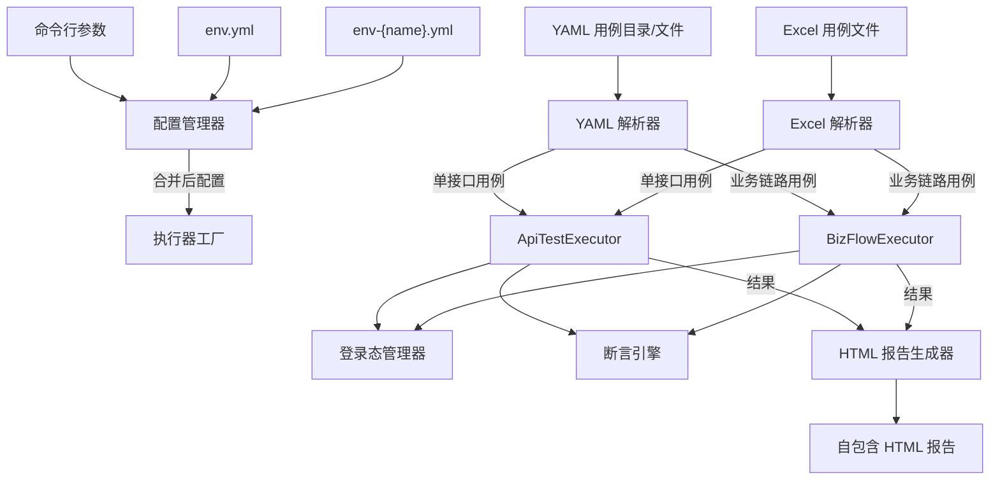
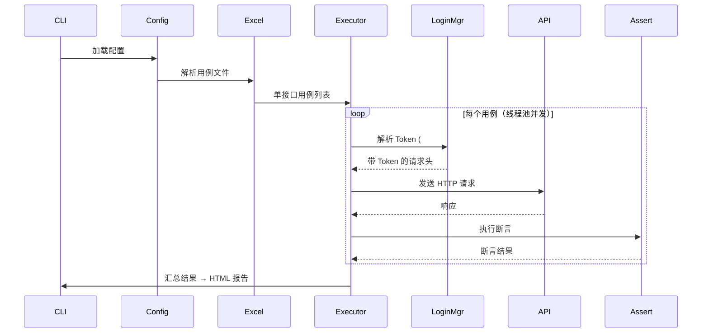
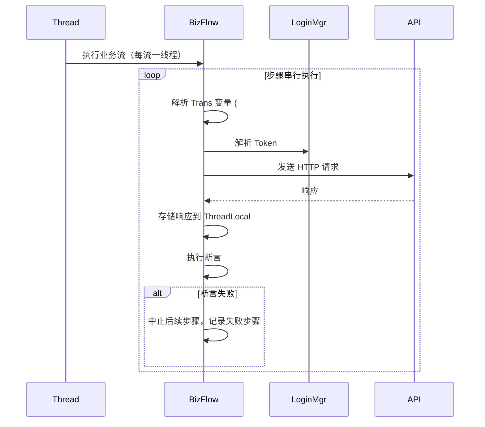

# Flow Forge — 接口自动化测试执行器

**中文** | [English](README.en.md)

基于 Python 3 的 HTTP 接口自动化测试执行器，支持 YAML/Excel 驱动的用例管理、多线程并发执行、参数传递链路测试、自动登录态管理和自包含 HTML 报告输出。

## 系统架构



## 目录结构

```
python/
├── main.py                      # CLI 入口，流程编排
├── requirements.txt             # 依赖：requests, openpyxl, pyyaml
├── env.yml                      # 基础配置（可提交到仓库）
├── env-local.yml                # 环境特定配置（含登录凭据，不可提交）
│
├── config/
│   ├── __init__.py
│   └── config_manager.py        # 配置加载、合并、CLI 覆盖
│
├── core/
│   ├── __init__.py
│   ├── path_resolver.py         # 点号/括号 JSON 路径解析器
│   ├── script_type.py           # 脚本类型枚举与执行器注册表
│   └── var_resolver.py          # #{varName} 占位符通用解析工具
│
├── excel_reader/
│   ├── __init__.py
│   └── excel_parser.py          # 多 Sheet Excel 解析、校验
│
├── yaml_reader/
│   ├── __init__.py
│   └── yaml_parser.py           # YAML 用例文件/目录解析
│
├── executor/
│   ├── __init__.py
│   ├── base.py                  # BaseExecutor 抽象基类（线程池 + 线程安全）
│   ├── api_test.py              # ApiTestExecutor：单接口测试
│   ├── biz_flow.py              # BizFlowExecutor：多步骤业务链路测试
│   └── factory.py               # 执行器工厂，动态导入
│
├── auth/
│   ├── __init__.py
│   └── login_manager.py         # 线程安全登录态管理器（Token 缓存 + 细粒度锁）
│
├── assertion/
│   ├── __init__.py
│   ├── engine.py                # 简单等值断言引擎（assert_dict）
│   └── rules_engine.py          # 高级断言规则引擎（assert_rules）
│
└── reporter/
    ├── __init__.py
    ├── html_writer.py           # 自包含 HTML 报告生成器
    └── md_writer.py             # Markdown 报告生成器（备用）
```

## 安装指南

```bash
cd python
pip install -r requirements.txt
```

### 依赖说明

| 依赖 | 用途 |
|------|------|
| `requests` | HTTP 请求发送 |
| `openpyxl` | Excel 用例文件读取 |
| `pyyaml` | YAML 配置文件解析 |

## 快速开始

### 1. 配置环境

编辑 `env.yml` 设置基础参数：

```yaml
scriptType: APITest
envName: local
caseFilePath: ./test_cases.xlsx
maxThread: 5
reportName: APIReport
```

编辑 `env-{envName}.yml` 配置被测应用和登录信息（参见[配置说明](#配置说明)）。

### 2. 准备用例文件

**方式一：使用 YAML 用例**（推荐，智能体默认输出格式）

智能体生成的 YAML 用例存放在 `output/` 目录下，结构如下：

```
output/
├── single_cases/        # 单接口用例（每个用例一个 .yaml）
└── biz_flows/           # 业务链路用例（每个链路一个 .yaml）
```

也可手动编写 YAML 用例，格式见 [YAML 用例格式](#yaml-用例格式)。

**方式二：使用 Excel 用例**

按照 [Excel 用例格式](#excel-用例格式) 编写测试用例。

### 3. 运行测试

```bash
# YAML 目录模式（推荐）：执行指定目录下所有 YAML 用例
python main.py --yamlDir ../agent/output --envName local --apiMode all

# YAML 文件模式：执行指定的多个 YAML 文件
python main.py --yamlFiles ./case1.yaml,./case2.yaml --envName local

# Excel 模式（兼容）：使用默认配置运行（仅执行单接口用例）
python main.py

# Excel 模式：指定环境和线程数，执行所有用例
python main.py --envName prod --maxThread 10 --apiMode all

# Excel 模式：完整参数示例
python main.py --config /path/to/env.yml --scriptType APITest --envName local \
               --caseFilePath ./test_cases.xlsx --maxThread 5 --reportName MyReport \
               --apiMode all
```

## 配置说明

### 配置优先级

```
CLI 参数 > env-{envName}.yml > env.yml > 内置默认值
```

### env.yml — 基础配置（可提交）

| 配置项 | 类型 | 默认值 | 说明 |
|--------|------|--------|------|
| `scriptType` | str | `APITest` | 脚本类型（目前仅 `APITest`） |
| `envName` | str | 必填 | 环境名称，对应加载 `env-{envName}.yml` |
| `caseFilePath` | str | 必填 | Excel 用例文件路径（相对路径相对于 main.py） |
| `maxThread` | int | `5` | 线程池大小，控制并发数 |
| `reportName` | str | `APIReport` | HTML 报告标题 |
| `apiMode` | str | `single` | 执行模式：`single` / `biz` / `all` |

### env-{envName}.yml — 环境配置（不可提交，含凭据）

顶层 dict key 即为"应用名"，与 Excel 用例中 `AppName` 列的值对应。

```yaml
<AppName>:
  baseURL: http://localhost:8080        # 应用基础 URL
  loginPath: /api/user/login            # 登录接口路径
  loginBody: userAccount,password   # 登录请求体字段列表（逗号分隔）
  headTokenName: Authorization          # Token 在请求头中的字段名
  resTokenPath: $.data.token            # 登录响应中 Token 的 JSON 路径
  <userParamName>:                      # 用户配置（名称在 Excel 中通过 #{} 引用）
    userAccount: admin                  # loginBody 中字段的值
    password: "123456"
```

配置文件中可以定义多个应用，每个应用可以有多个用户：

```yaml
someApp:
  baseURL: http://localhost:8080
  loginPath: /api/login
  loginBody: userAccount,password
  headTokenName: Authorization
  resTokenPath: $.data.token
  adminUser:
    userAccount: user1
    password: "12345678"
  leaderUser:
    userAccount: user2
    password: "12345678"

managerURL:
  baseURL: http://localhost:8081
  loginPath: /api/manager/login
  loginBody: username,password
  headTokenName: Authorization
  resTokenPath: $.data.token
  someUser:
    username: usera1
    password: 11111*
  ……
```

### CLI 参数

| 参数 | 类型 | 说明 |
|------|------|------|
| `--config` | str | env.yml 路径（默认：main.py 同级目录下的 env.yml） |
| `--scriptType` | str | 脚本类型，覆盖 env.yml |
| `--envName` | str | 环境名称，覆盖 env.yml |
| `--caseFilePath` | str | Excel 用例文件路径，覆盖 env.yml |
| `--maxThread` | int | 最大线程数，覆盖 env.yml |
| `--reportName` | str | 报告名称，覆盖 env.yml |
| `--apiMode` | str | 执行模式（`single`/`biz`/`all`），覆盖 env.yml |
| `--yamlDir` | str | YAML 用例目录路径，递归扫描目录下所有 `.yaml`/`.yml` 文件 |
| `--yamlFiles` | str | 逗号分隔的 YAML 用例文件路径列表 |

### apiMode 说明

| 值 | 行为 |
|----|------|
| `single` | 仅执行单接口用例（YAML: `case_type=single`；Excel: Sheet 2） |
| `biz` | 仅执行业务链路用例（YAML: `case_type=biz`；Excel: Sheet 3+） |
| `all` | 同时执行单接口和业务链路用例 |

## YAML 用例格式

每个用例是一个独立的 `.yaml` 文件，通过 `case_type` 字段区分类型。YAML 用例是智能体的默认输出格式，也是执行器的推荐输入格式。

### 单接口用例（case_type: single）

```yaml
case_type: single
test_id: TC_LOGIN_001
api_name: 用户登录
app_name: someApp
method: POST
url: /api/user/login
request_head:
  Content-Type: application/json
request_body:
  username: admin
  password: "123456"
status_code: 200
assert_dict:
  $.code: 0
  $.msg: success
assert_rules:
  - "$.data.token is_not_null"
tag: P0
remark: 正常登录验证
```

### 业务链路用例（case_type: biz）

```yaml
case_type: biz
sheet_name: 用户注册并登录流程
steps:
  - step_id: Step01
    api_name: 发送验证码
    app_name: someApp
    method: POST
    url: /api/sms/send
    request_body:
      phone: "13800138000"
    status_code: 200
    assert_dict:
      $.code: 0
    trans: "smsCode=Step01.data.code"
  - step_id: Step02
    api_name: 用户注册
    app_name: someApp
    method: POST
    url: /api/user/register
    request_body:
      phone: "13800138000"
      code: "#{smsCode}"
      password: "123456"
    status_code: 200
    assert_dict:
      $.code: 0
```

### YAML 字段说明

| 字段 | 类型 | 说明 |
|------|------|------|
| `case_type` | str | 用例类型：`single`（单接口）或 `biz`（业务链路） |
| `test_id` | str | 唯一测试用例标识（单接口用例必填） |
| `api_name` | str | 接口名称/描述 |
| `app_name` | str | 应用名，对应 `env-{envName}.yml` 中的 app key |
| `method` | str | HTTP 方法：`GET`/`POST`/`PUT`/`DELETE`/`PATCH` |
| `url` | str | 接口路径（相对于 app 的 `baseURL`），如 `/api/user/login` |
| `status_code` | int | 预期 HTTP 状态码 |
| `request_head` | dict | 请求头，key-value 对象 |
| `request_body` | dict | 请求体，key-value 对象 |
| `assert_dict` | dict | 简单断言字典，key 为响应 JSON 路径，value 为预期值 |
| `assert_rules` | list[str] | 高级断言规则列表（可选），每条规则为字符串表达式 |
| `tag` | str | 标签（如 P0/P1/P2） |
| `remark` | str | 备注 |
| `sheet_name` | str | 业务场景名（业务链路用例必填） |
| `steps` | list | 业务链路步骤列表（业务链路用例必填） |
| `step_id` | str | 步骤标识（同一业务链路内不可重复），如 `Step01` |
| `trans` | str | 步骤间数据传递定义，语法同 [Trans 字段语法](#trans-字段语法) |

## Excel 用例格式

Excel 文件包含多张 Sheet，结构如下：

### Sheet 1 — API Definitions（接口定义）

必填列：`TestID`, `APIName`, `AppName`, `Method`, `URL`, `StatusCode`

| 列名 | 类型 | 说明 |
|------|------|------|
| `TestID` | str | 唯一标识，被其他 Sheet 的 `RelevanceID` 引用 |
| `APIName` | str | 接口名称/描述 |
| `AppName` | str | 应用名，对应 `env-{envName}.yml` 中的 app key |
| `Method` | str | HTTP 方法：`GET`/`POST`/`PUT`/`DELETE`/`PATCH` |
| `URL` | str | 接口路径（相对于 app 的 `baseURL`），如 `/api/user/login` |
| `StatusCode` | int | 预期 HTTP 状态码 |
| `RequestHead` | JSON | 请求头，JSON 字符串或 JSON 对象 |
| `RequestBody` | JSON | 请求体，JSON 字符串或 JSON 对象 |
| `AssertDict` | JSON | 断言字典，key 为响应 JSON 路径，value 为预期值 |
| `Remark` | str | 备注 |
| `Tag` | str | 标签（如 P0/P1/P2） |

### Sheet 2 — Single Cases（单接口用例）

必填列：`TestID`, `RelevanceID`

| 列名 | 类型 | 说明 |
|------|------|------|
| `TestID` | str | 唯一测试用例标识 |
| `RelevanceID` | str | 关联到 Sheet 1 的 `TestID`，用于接口参考（执行器不强制校验，主要用于用例生成智能体的索引和查询） |
| 其他列 | — | 同 Sheet 1，用例行的值直接使用，不与 Sheet 1 合并 |

### Sheet 3+ — Business Flow（业务链路用例）

每个 Sheet 代表一个业务场景，Sheet 名即为场景名。必填列：`StepID`, `RelevanceID`

| 列名 | 类型 | 说明 |
|------|------|------|
| `StepID` | str | 步骤标识（同一 Sheet 内不可重复），如 `Step01` |
| `RelevanceID` | str | 关联到 Sheet 1 的 `TestID`（执行器不强制校验，主要用于用例生成智能体的索引和查询） |
| `Trans` | str | 步骤间数据传递定义，格式见下文 |
| 其他列 | — | 同 Sheet 1/Sheet 2 |

### API Definitions 说明

Sheet 1（API Definitions）中定义的接口信息作为 Agent 的参考文档，执行器不读取此页。测试用例行的值**直接使用**，不会与 Sheet 1 的定义进行合并或自动填充。`RelevanceID` 字段用于关联参考，主要用于用例生成智能体的索引和查询。

### Trans 字段语法

`Trans` 用于在业务链路的步骤之间传递数据：

```
变量名=来源StepID.响应JSON路径, 变量名2=来源StepID2.响应JSON路径
```

示例：
```
username=Step01.data.username, orderId=Step02.data.orderId
```

在 `RequestHead`、`RequestBody` 或 `URL` 路径中使用 `#{变量名}` 引用传递的值：

```json
{
  "Authorization": "Bearer #{<userParamName>}",
  "orderId": "#{orderId}"
}
```

URL 路径参数示例：`/api/users/#{userId}/orders/#{orderId}`，其中的 `#{userId}` 和 `#{orderId}` 会从当前步骤的 `RequestBody` 中取值并替换。

**通过 Trans 传递登录 Token 的完整示例：**

```yaml
case_type: biz
sheet_name: 用户注册登录并下单流程
steps:
  - step_id: Step_Register
    api_name: 用户注册
    app_name: someApp
    method: POST
    url: /api/user/register
    request_body:
      phone: "13800138000"
      password: "123456"
    status_code: 200
    # 此步骤没有 trans —— 响应自动存储，供后续步骤引用

  - step_id: Step_Login
    api_name: 用户登录
    app_name: someApp
    method: POST
    url: /api/user/login
    request_body:
      phone: "13800138000"
      password: "123456"
    status_code: 200
    trans: "authToken=Step_Login.data.token, userId=Step_Login.data.id"
    # 将登录响应的 token 和 id 通过 Trans 传递给后续步骤

  - step_id: Step_CreateOrder
    api_name: 创建订单
    app_name: someApp
    method: POST
    url: /api/order/create
    request_head:
      Content-Type: application/json
      Authorization: "Bearer #{authToken}"   # 从 Trans 获取，不走 LoginManager
    request_body:
      userId: "#{userId}"                     # 从 Trans 获取
      productId: "PROD_001"
      quantity: 1
    status_code: 200
```

在此示例中，Step_CreateOrder 的请求头 `Authorization: "Bearer #{authToken}"` 会从 Step_Login 的响应中取 token，而非从 LoginManager 的预配置凭据中获取。这是因为 Trans 中声明了 `authToken`，执行器识别为 Trans 已提供，跳过 LoginManager。

转义：使用 `\#{...}` 表示字面量 `#{...}`，不会被替换。

**Trans 校验规则：**
- 不允许包含中文字符
- 必须是 `key=value` 格式
- 方括号 `[]` 必须成对出现
- 同一 Sheet 内 `StepID` 不可重复

### JSON 字段说明

Excel 中的 JSON 字段支持以下格式：
- 标准 JSON 字符串（双引号）
- 单引号 JSON（自动转换为双引号）
- 中文引号 `""`/`''`（自动转换为标准双引号）
- 直接 JSON 对象（openpyxl 读取时已解析为 dict）

## 核心模块详解

### 配置管理器 (`config/config_manager.py`)

单例模式的全局配置管理：

1. 加载 `env.yml` 获取基础配置
2. 加载 `env-{envName}.yml`，区分顶层配置和应用配置
3. 应用 CLI 参数覆盖
4. 提供 `get()`, `get_all()`, `get_app()` 接口

### Excel 解析器 (`excel_reader/excel_parser.py`)

- 按 `apiMode` 读取 Sheet 2（单接口）和 Sheet 3+（业务链路）
- 对业务链路执行 `Trans` 字段校验和 `StepID` 去重检查
- 解析异常时返回 `parse_error`，不阻塞其他用例

### YAML 解析器 (`yaml_reader/yaml_parser.py`)

- 提供两个解析入口：`parse_directory()`（递归扫描目录）和 `parse_files()`（逗号分隔文件列表）
- 通过 `case_type` 字段区分单接口用例和业务链路用例
- 当 `case_type` 缺失时，自动推断：含 `steps` 字段 → 业务链路，含 `test_id` 字段 → 单接口
- 按 `apiMode` 过滤返回（`single` 仅返回单接口，`biz` 仅返回业务链路，`all` 返回全部）
- 返回与 `ExcelParser.parse()` 相同的数据结构，无缝接入执行流程

### 执行器

#### BaseExecutor (`executor/base.py`)

抽象基类，提供：
- `ThreadPoolExecutor` 线程池，并发数由 `maxThread` 控制
- 线程安全的结果收集（`threading.Lock`）
- 统一的异常捕获和错误结果构建
- 子类实现 `execute_single()` 方法

#### ApiTestExecutor (`executor/api_test.py`)

单接口测试执行器：
0. **URL 校验**：检查 URL 是否包含 `<URL not exist>` 标记（Agent 生成阶段注入），若是则立即失败并返回错误信息
1. 从用例中提取 `app_name`, `method`, `url`, `headers`, `body`
2. 通过 `AppName` 查找对应 app 的 `baseURL`，拼接完整 URL
3. **路径参数解析**：解析 URL 中的 `#{varName}` 占位符，从 `request_body` 取值替换（如 `/api/users/#{userId}` → `/api/users/1118822`）
4. 调用 `LoginManager` 解析 `#{userParamName}` 占位符为实际 Token（支持嵌入式占位符，如 `"Bearer #{user}"`）
5. 发送 HTTP 请求（GET/DELETE 参数放 query string，POST/PUT/PATCH 放 JSON body，超时 30 秒）
6. 运行断言引擎检查响应
7. 自动补充 `status_code` 断言

#### BizFlowExecutor (`executor/biz_flow.py`)

业务链路测试执行器：
- 每个业务流（一个 Sheet）在独立线程中执行
- 流内步骤**串行执行**，任一步骤失败则中止后续步骤
- 每个步骤执行前先校验 URL 是否包含 `<URL not exist>` 标记，存在时立即失败
- 先解析 URL 路径中的 `#{}`（从 `request_body` 取值），再通过 `_resolve_vars()` 解析 Trans 依赖的 `#{}`（URL、headers、body 均会解析）
- 请求头中的 `#{}` 采用 **Trans 优先、LoginManager 回退** 策略：若 Trans 中已声明该变量，则从前往步骤响应中取值，跳过 LoginManager；仅当 Trans 未声明时，才调用 LoginManager 进行登录态注入
- 使用 `threading.local()` 存储每线程的步骤响应数据
- `_parse_trans()` 解析 `key=StepID.path` 映射
- `_resolve_vars()` 将 `#{key}` 替换为前序步骤的实际响应值（支持 URL、请求头、请求体中的占位符）
- 最终生成"执行链路"字符串（成功用 `→`，失败用 `×` 标记）

### 登录态管理器 (`auth/login_manager.py`)

线程安全的 Token 管理：

```
检测 #{userParamName} → 查缓存 → 缓存命中返回 Token
                              → 缓存未命中 → 查失败黑名单 → 在黑名单则跳过
                                                     → 不在黑名单 → 获取用户锁
                                                       → POST 登录接口
                                                       → 成功：缓存 Token，返回
                                                       → 失败：加黑名单，返回错误
```

支持嵌入式占位符：`"#{normalUser}"` 和 `"Bearer #{normalUser}"` 均可正确解析。使用通用 `#{}` 解析器（`core/var_resolver.py`）逐占位符替换，一个 header 值中可包含多个占位符。

关键设计：
- **细粒度锁**：按 `appName:userParamName` 粒度锁定，不同用户可并发登录
- **失败黑名单**：MD5 哈希记录登录失败的用户，避免重复无效请求
- **Token 缓存**：同一用户只需登录一次，后续复用

### 断言引擎 (`assertion/engine.py` + `rules_engine.py`)

**简单断言（`assert_dict`，`engine.py`）：**
- 对 HTTP 响应执行字段级等值断言
- `assert_dict` 的 key 为 JSON 路径（支持点号 + 括号：`data.items[0].name`，也支持 `$.` 前缀）
- `status_code` 字段特殊处理，针对 `response.status_code` 断言
- 路径不存在时返回 `<not found>`

**高级断言（`assert_rules`，`rules_engine.py`）：**

每条规则是一个字符串表达式，格式为 `<左表达式> <运算符> [<右表达式>]`。

| 运算符 | 说明 | 示例 |
|--------|------|------|
| `==` / `!=` | 等于 / 不等于 | `$.data.id == 1001` |
| `>` / `>=` / `<` / `<=` | 数值比较 | `$.data.total > 0` |
| `=~` | 正则匹配 | `$.data.time =~ ^\\d{4}-\\d{2}-\\d{2}$` |
| `in` | 值在列表中 | `$.data.status in ["PAID", "PENDING"]` |
| `contains` | 集合包含元素 | `$.data.tags contains "vip"` |
| `not_contains` | 集合不包含元素 | `$.data.tags not_contains "blocked"` |
| `is_null` | 值为 null | `$.data.optional is_null` |
| `is_not_null` | 值不为 null | `$.data.order_id is_not_null` |
| `typeof` | 类型检查 | `$.data.count typeof int` |

支持函数：

| 函数 | 说明 | 示例 |
|------|------|------|
| `.length()` | 数组长度 | `$.data.list.length() == 3` |
| `SUM(path)` | 数组元素求和 | `SUM($.data.list[*].price)` |
| `SUM_PRODUCT(p1, p2)` | 两字段乘积求和 | `SUM_PRODUCT($.data.list[*].price, $.data.list[*].count)` |

路径中 `[*]` 表示遍历数组的每个元素，用于 `SUM` 和 `SUM_PRODUCT` 函数。

### HTML 报告生成器 (`reporter/html_writer.py`)

生成自包含的 HTML 报告（无需外部 CSS/JS 依赖）：

- **摘要区**：环境名、测试时间、总用例数
- **单接口用例区**：可折叠列表，按失败优先排序，每个用例卡片包含：
  - 请求/响应详情（JSON 格式化显示）
  - 断言结果表格（字段、预期值、实际值、通过/失败）
- **业务链路用例区**：每个流一张卡片，展示执行链路和每步骤详情
- 通过/失败分别用绿色/红色标识
- 报告输出到 `python/report/` 目录，文件名格式：`{Excel文件名}_{时间戳}.html`

## 执行流程图

### 单接口测试流程



### 业务链路测试流程



## 退出码

| 退出码 | 含义 |
|--------|------|
| `0` | 所有用例通过 |
| `1` | 部分或全部用例失败 |
| `2` | 配置错误或文件解析错误（未执行任何用例） |
