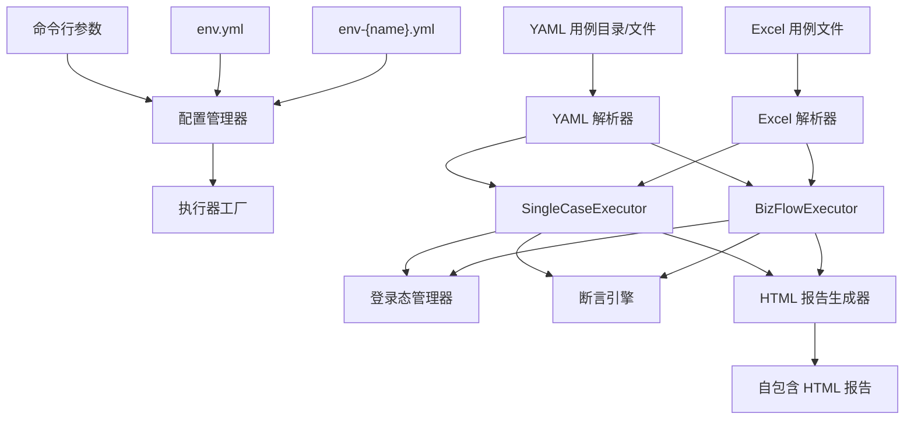

# Flow Forge — 接口自动化测试执行器

**中文** | [English](README.en.md)

基于 Python 3 的 HTTP 接口自动化测试执行器：YAML/Excel 驱动的用例管理、多线程并发执行、跨接口参数传递、自动登录态管理、自包含 HTML 报告，并提供 Excel ↔ YAML 互转与 pytest 代码生成。

## 能做什么

- **两类用例**：单接口用例 + 多步骤业务链路用例（步骤间可通过 `inherit` 传递 token 等数据）。
- **多线程执行**：线程池并发执行用例（`maxThread` 控制），非压力测试。
- **两级断言**：简单等值断言（`assert_dict`）+ 高级多运算符断言规则（`assert_rules`：数值比较、正则、列表聚合等）。
- **自动登录态**：按应用/用户管理 Token，细粒度锁 + 缓存 + 失败黑名单。提供 `get_current_user()` / `get_user()` / `get_app_user()` 工具方法，插件可直接获取登录用户配置。
- **可扩展处理器**：前置/后置处理器扩展点（HMAC 签名、时间戳、路径参数、SQL 清理等）。`BaseExternalPlugin` 为 DB/Redis/MQ/Kafka/Pulsar/RocketMQ 插件提供共享基类。
- **自包含报告**：HTML 报告内嵌所有样式脚本，浏览器直接打开。
- **格式转换**：`excel2yaml` / `yaml2excel` / `yaml2pytest` / `excel2pytest`。
- **CI/CD 友好**：纯 CLI，通过退出码反馈结果，可直接集成 Jenkins。



## 快速开始

```bash
cd python
pip install -r requirements.txt

# 1) 配置环境：编辑 env-local.yml，填入被测应用的 baseURL / 登录信息 / 用户凭据
#    （env.yml 为基础配置，env-{envName}.yml 为环境特定配置）
#    （注意：长整数 ID 建议加引号写成字符串，如 id: "1000000000000000001"，确保在 Studio 中正确读取）

# 2) 运行 YAML 用例（推荐，智能体默认输出格式）
python main.py --yamlDir ../agent/output --envName local --apiMode all

# 3) 查看报告：生成在 python/report/{文件名}_{时间戳}.html
```

## H2 数据库联调

使用 `return-order-db` 等 H2 数据库插件时，H2 JDBC jar 不随仓库分发，需要先运行初始化脚本下载（默认下载到 `~/.flow-forge/h2/`）：

```bash
python tools/h2/init_h2.py
```

然后启动 foli-mall 后端（其应用启动时会自动开启 H2 TCP Server，默认端口 9092），再运行 flow-forge 用例。详见 [处理器、断言引擎与报告](./docs/processors-and-report.md)。

除 `return-order-db` 外，还内置了 `order-fixture` / `cart-fixture` / `return-fixture` / `balance-fixture` 四个前置数据夹具插件，可一步为用例补齐"指定状态的订单/购物车/退货/余额"等前置数据，用法详见上述文档的数据库处理器章节。

## 常用命令

```bash
# YAML 目录模式：执行目录下所有 YAML 用例
python main.py --yamlDir ../agent/output --envName local --apiMode all

# YAML 文件模式：执行指定的多个文件
python main.py --yamlFiles ./case1.yaml,./case2.yaml --envName local

# Excel 模式：指定环境、线程数，执行全部用例
python main.py --envName prod --maxThread 10 --apiMode all

# 格式转换
python converter_main.py excel2yaml --input cases.xlsx --output ./output/
python converter_main.py yaml2excel --single-cases ./cases/single_cases/ --output cases.xlsx
python converter_main.py yaml2pytest --single-cases ./cases/single_cases/ --output ./tests/generated/
python converter_main.py excel2pytest --input cases.xlsx --output ./tests/generated/
```

`yaml2pytest` / `excel2pytest` 会整包复制 `python/processors/`（含全部内置处理器）及其框架依赖（`auth/`、`resolvers/`）到生成目录，后续新增处理器无需再改转换器；中间件处理器运行时需目标环境安装对应第三方库，详见[用例格式转换](./docs/converters.md)。

`apiMode` 取值：`single`（仅单接口）/ `biz`（仅业务链路）/ `all`（全部）。

## 运行测试

```bash
python -m pytest tests/ -v
```

## 文档索引

| 文档 | 内容 |
|------|------|
| [配置与命令行参考](./docs/configuration.md) | 安装依赖、`env.yml` / `env-{name}.yml`、CLI 参数、apiMode、退出码 |
| [用例格式](./docs/case-format.md) | YAML 单接口/业务链路格式、Excel 三 Sheet 格式、`inherit` 语法 |
| [用例格式转换](./docs/converters.md) | excel2yaml / yaml2excel / yaml2pytest / excel2pytest |
| [处理器、断言引擎与报告](./docs/processors-and-report.md) | 前置/后置处理器、断言引擎、登录态、HTML 报告、核心模块 |
