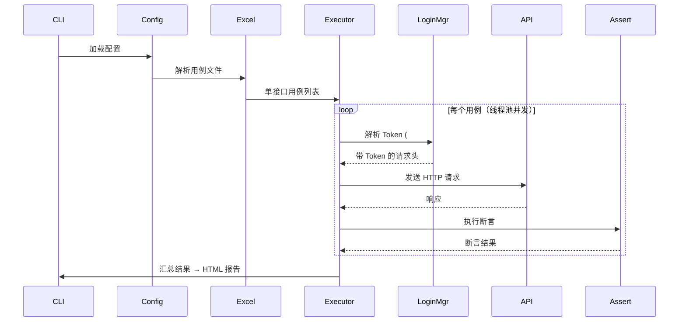
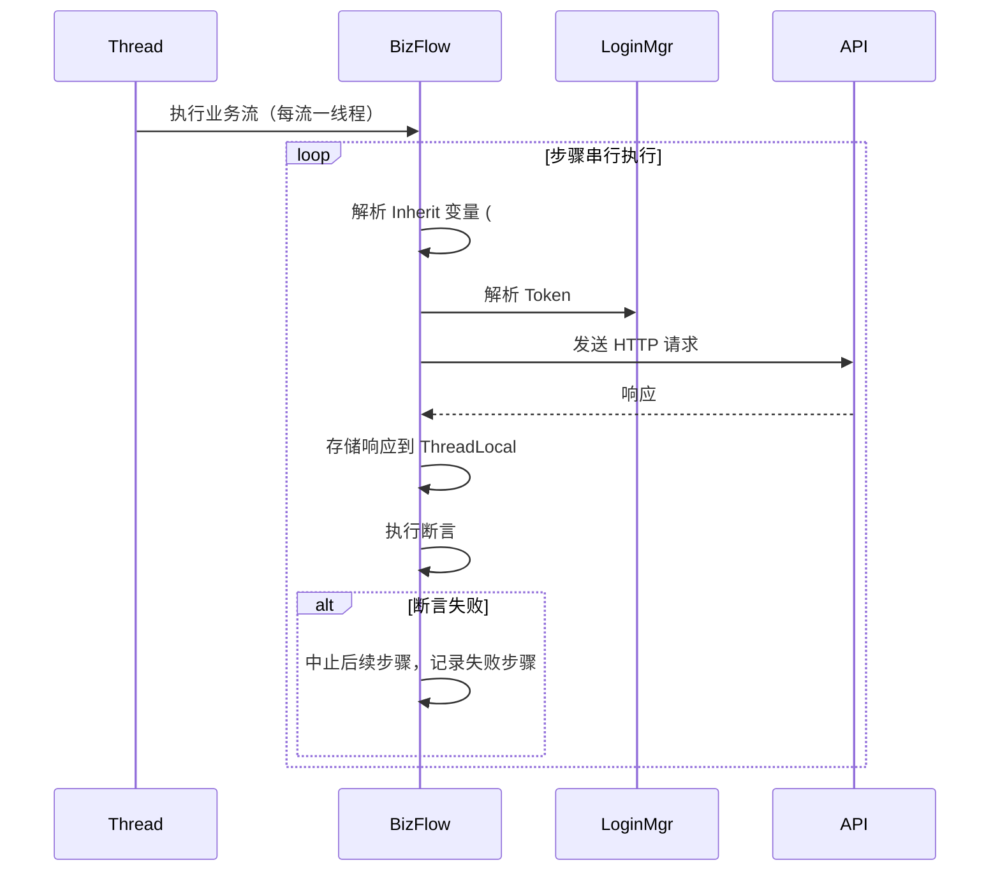

# 处理器、断言引擎与报告

[← 返回 python/README](../README.md)

本文档覆盖执行器的内部机制：断言引擎、前置/后置处理器、登录态管理、HTML 报告，以及核心模块与执行流程。

---

## 断言引擎

### 简单断言（assert_dict）

- 对 HTTP 响应执行字段级等值断言。
- key 为 JSON 路径（支持点号 + 括号：`data.items[0].name`，也支持 `$.` 前缀）。
- `status_code` 字段特殊处理，针对 `response.status_code` 断言。
- 路径不存在时返回 `<not found>`。

### 高级断言（assert_rules）

每条规则是一个字符串表达式，格式为 `<左表达式> <运算符> [<右表达式>]`。

| 运算符 | 说明 | 示例 |
|--------|------|------|
| `==` / `!=` | 等于 / 不等于 | `$.data.id == 1001` |
| `>` / `>=` / `<` / `<=` | 数值比较 | `$.data.total > 0` |
| `=~` | 正则匹配 | `$.data.time =~ ^\d{4}-\d{2}-\d{2}$` |
| `in` | 值在列表中 | `$.data.status in ["PAID", "PENDING"]` |
| `contains` | 集合包含元素 | `$.data.tags contains "vip"` |
| `not_contains` | 集合不包含元素 | `$.data.tags not_contains "blocked"` |
| `is_null` | 值为 null | `$.data.optional is_null` |
| `is_not_null` | 值不为 null | `$.data.order_id is_not_null` |
| `typeof` | 类型检查 | `$.data.count typeof int` |

支持函数：

| 函数 | 说明 | 示例 |
|------|------|------|
| `.length()` | 数组长度 | `$.data.list.length() == 3` |
| `SUM(path)` | 数组元素求和 | `SUM($.data.list[*].price)` |
| `SUM_PRODUCT(p1, p2)` | 两字段乘积求和 | `SUM_PRODUCT($.data.list[*].price, $.data.list[*].count)` |

路径中 `[*]` 表示遍历数组的每个元素，用于 `SUM` 和 `SUM_PRODUCT`。

---

## 前置处理器 / 后置处理器

在执行器发送 HTTP 请求前后，预留两个扩展点：

- **PreProcessor（前置处理器）** — 请求发送前执行，可修改请求头/体，适用于 HMAC 签名、参数加密、动态 Token 注入等。
- **PostProcessor（后置处理器）** — 断言执行后执行，可检查响应数据、执行外部清理（SQL、Redis）等。

处理器在用例中通过 `preprocessors` / `postprocessors` 字段声明，按列表顺序依次执行：

```yaml
preprocessors:
  - name: hmac-sign
    config:
      algorithm: sha256
      secret_env: SIGN_SECRET
```

Excel 中对应列值为 JSON 数组字符串：`[{"name": "hmac-sign", "config": {"algorithm": "sha256", "secret_env": "SIGN_SECRET"}}]`

### 敏感数据配置

密钥、数据库连接等敏感信息在 `env.yml` 的 `processor_configs` 段配置，执行时自动传递到处理器的 `global_config` 参数，无需在用例中明文书写：

```yaml
# env.yml
processor_configs:
  hmac-sign:
    secret_env: SIGN_SECRET
    algorithm: sha256
```

### 内置处理器

| 处理器 | 类型 | 说明 |
|--------|------|------|
| `hmac-sign` | Pre | HMAC-SHA256 请求签名，向请求头添加 `X-Signature` |
| `timestamp` | Pre | 注入 `X-Timestamp`（ISO 8601 UTC）和 `X-Request-Id`（UUIDv4） |
| `print-demo` | Pre | 调试用，INFO 级别打印请求摘要 |
| `path-param-restore` | Pre | 将 URL 路径参数替换时清除的字段恢复到请求体中 |
| `hmac-verify` | Post | HMAC-SHA256 响应签名校验，与 `hmac-sign` 配对 |
| `response-time` | Post | 记录响应状态码和内容长度，超过阈值时 WARNING |
| `print-demo-post` | Post | 调试用，INFO 级别打印响应摘要 |

### URL 路径参数解析

URL 支持两种路径参数占位符：

- **`#{varName}`** — 从请求体取 `varName` 字段值替换，替换后默认从 body 移除该字段
- **`{varName}`** — 同上，适用于 RESTful 风格路径（如 `/api/stores/{id}`）

```yaml
# PUT /api/stores/{id}
request_body:
  id: 12345
  name: 测试门店
# → 请求 URL: PUT /api/stores/12345
# → 请求体: {"name": "测试门店"}（id 已移除并替换到 URL）
```

被移除的字段会记录在 `global_config["_cleared_path_params"]` 中，可通过 `path-param-restore` 前置处理器恢复到请求体，满足后端同时需要路径参数和 body 字段的场景：

```yaml
preprocessors:
  - name: path-param-restore
    config:
      fields: all            # "all"（恢复全部）或 ["id"] 指定字段名
```

### 自定义处理器

1. 继承 `PreProcessor` 或 `PostProcessor` 基类（`processors/base.py`）
2. 设置类属性 `name`（对应用例中引用的名称）
3. 实现 `process()` 方法
4. 将 `.py` 文件放入 `processors/` 目录

```python
from processors.base import PreProcessor

class MyPreProcessor(PreProcessor):
    name = "my-processor"

    def process(self, headers, body, case_config, global_config):
        # 修改 headers / body
        return headers, body
```

### 执行流程

```
请求前: Token 解析 → PreProcessors（按顺序） → 发送请求
请求后: 断言执行 → PostProcessors（按顺序） → 报告生成
```

处理器抛出的 `ProcessorError` 会终止用例执行（PreProcessor 失败不发送请求），错误信息同步显示在报告中；PostProcessor 失败记录错误并继续报告。

---

## 登录态管理器

线程安全的 Token 管理（`auth/login_manager.py`）：

```
检测 #{userParamName} → 查缓存 → 命中返回 Token
                              → 未命中 → 查失败黑名单 → 在黑名单则跳过
                                                     → 不在黑名单 → 获取用户锁
                                                       → POST 登录接口
                                                       → 成功：缓存 Token，返回
                                                       → 失败：加黑名单，返回错误
```

支持嵌入式占位符（`"#{normalUser}"` 和 `"Bearer #{normalUser}"` 均可），使用通用 `#{}` 解析器逐占位符替换。关键设计：

- **细粒度锁**：按 `appName:userParamName` 粒度锁定，不同用户可并发登录
- **失败黑名单**：MD5 哈希记录登录失败用户，避免重复无效请求
- **Token 缓存**：同一用户只需登录一次，后续复用

---

## HTML 报告

生成自包含的 HTML 报告（`reporter/html_writer.py`，无需外部 CSS/JS）：

- **摘要区**：环境名、测试时间、总用例数
- **单接口用例区**：可折叠列表，失败优先排序，每个用例卡片含请求/响应详情（JSON 格式化）、断言结果表（字段/预期/实际/通过失败）、处理器结果
- **业务链路用例区**：每流一张卡片，展示执行链路（成功 `→`、失败 `×`）和每步骤详情
- 通过/失败分别用绿色/红色标识
- 报告输出到 `python/report/` 目录，文件名格式 `{Excel文件名}_{时间戳}.html`

---

## 核心模块

```text
python/
├── main.py                 # CLI 入口，流程编排（执行器）
├── converter_main.py       # CLI 入口，格式转换
├── config/config_manager.py # 配置加载、合并、CLI 覆盖（单例）
├── excel_reader/           # 多 Sheet Excel 解析、校验
├── yaml_reader/            # YAML 用例文件/目录解析
├── resolvers/              # JSON 路径解析 + #{}/{} 占位符解析
├── executor/               # BaseExecutor（线程池）+ Single/Biz 执行器 + 工厂
├── auth/                   # 线程安全登录态管理器
├── assertion/              # 简单断言引擎 + 高级断言规则引擎
├── processors/             # 前置/后置处理器（基类 + 加载器 + 内置）
├── converter/              # Excel ↔ YAML 转换 + pytest 生成
├── reporter/               # 自包含 HTML 报告生成器
└── i18n/                   # 国际化（zh_CN / en_US）
```

- **配置管理器**：加载 `env.yml` → 合并 `env-{envName}.yml`（区分顶层配置与应用配置）→ 应用 CLI 覆盖 → 提供 `get()` / `get_all()` / `get_app()`。
- **Excel 解析器**：按 `apiMode` 读取单接口/业务链路 Sheet，对业务链路执行 `Inherit` 校验和 `StepID` 去重，解析异常返回 `parse_error` 不阻塞其他用例。
- **YAML 解析器**：`parse_directory()`（递归扫描）与 `parse_files()`（逗号分隔列表）；通过 `case_type` 区分类型，缺失时按结构自动推断（含 `steps`→业务链路，含 `test_id`→单接口）；按 `apiMode` 过滤，返回与 Excel 解析器一致的数据结构。
- **执行器**：`BaseExecutor` 提供 `ThreadPoolExecutor` 线程池（并发数由 `maxThread` 控制）和线程安全结果收集；`SingleCaseExecutor` 并发执行单接口用例；`BizFlowExecutor` 每个业务流一线程、流内步骤串行、任一步失败即中止后续，用 `threading.local()` 存每线程步骤响应，请求头 `#{}` 采用「Inherit 优先、LoginManager 回退」策略。

---

## 执行流程图

### 单接口测试流程



### 业务链路测试流程



---

## 输入校验与错误处理

- **YAML 必填字段校验**：单接口用例需 `test_id`/`method`/`url`；业务链路用例需 `sheet_name` 和非空 `steps`。缺失时警告并跳过，不计入总数。
- **空业务链路拒绝**：`steps` 为空列表返回失败结果，而非「通过」。
- **URL 空值安全**：`url` 为 `None` 时正常报错，不崩溃。
- **URL 标记校验**：URL 含 `<URL not exist>` 标记（Agent 生成阶段注入）时立即判失败，不发起请求。
- **Excel 列校验**：单接口 sheet 需 `TestID` 列，业务链路 sheet 需 `StepID` 列，缺失抛 `ValueError` 并以退出码 2 终止。

退出码见 [配置与命令行参考](./configuration.md#退出码)。
