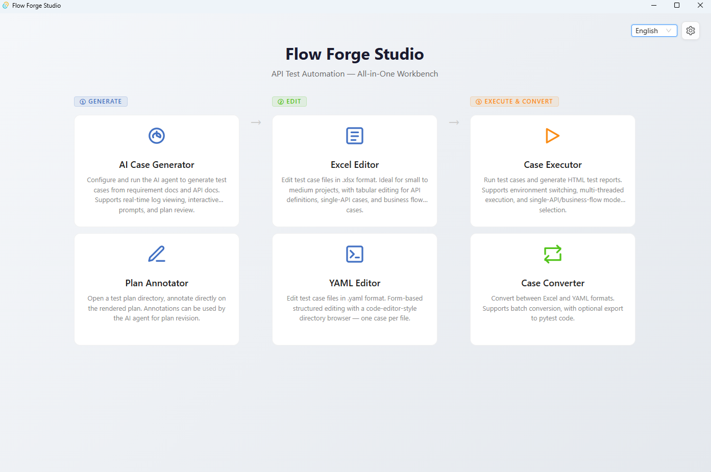

# Flow Forge Studio

[中文](README.md) | **English**

A desktop test-case workbench built with Vue 3 + Ant Design Vue + Tauri 2: AI case generation, visual Excel/YAML editing, plan annotation, case execution, and format conversion — the complete workflow from generation to report in one place.

## What It Can Do

- **AI Case Generator**: Configure requirement docs and API docs in Studio, launch the AI agent to auto-generate test cases, view real-time logs, and interact with LLM prompts and plan reviews.
- **Excel editor**: table-based editing of interface definitions / single-API test cases / business flows, with a built-in JSON tree editor, an advanced assertion rule editor, and real-time validation.
- **YAML editor**: form-based editing plus a split-view raw YAML panel on the right, with file-tree browsing, multiple tabs, and automatic syncing.
- **Markdown plan annotator**: select text on the rendered test plan to add structured annotations that are saved automatically for the agent to read and revise the plan; historical annotations can be reviewed.
- **Case Executor**: run test cases and generate HTML reports, with multi-environment switching and multi-threaded execution.
- **Case Converter**: convert Excel ↔ YAML bidirectionally + export to pytest code, with batch conversion support.
- **Find and replace**: by cell in Excel and by raw text in YAML, with match-case / whole-word / regex options, including cross-file global search.
- **Full executor compatibility**: the Excel/YAML formats it reads and writes are identical to those of the [python/](../python/README.en.md) executor.

## UI Preview



The home page offers six feature entries grouped by workflow: generation (AI Case Generator / Plan Annotator), editing (Excel / YAML Editor), and execution & conversion (Case Executor / Case Converter). More UI screenshots are in the [Feature Guide](./docs/features.en.md). **For first-time use, please configure the Python environment and the paths to the agent/ and python/ directories in the Settings `⚙` at the top right.** 

## Quick Start

```bash
cd studio
npm install

# Tauri desktop app dev mode (launches the desktop window automatically)
npm run dev
```

> Flow Forge Studio targets **desktop mode** — launch it with `npm run dev`.

## Platform Compatibility

**Flow Forge Studio is Windows-only.** Studio's process management relies on the Windows Job Object mechanism (`KILL_ON_JOB_CLOSE`) to ensure that child processes (agent / executor / converter) are forcibly terminated by the OS when a task is cancelled or the application exits. This is a Windows kernel feature with no equivalent on other platforms.

- **Windows**: ✅ The only supported platform. All features — automatic child process termination (Job Object), real-time log output, full process tree cleanup — are fully functional.
- **Linux / macOS**: ❌ Not supported. Studio cannot be compiled as a Linux/macOS executable and should not be run on these platforms.

> **Non-Windows users should use the [CLI](../python/README.en.md) directly to execute agent / executor / converter tasks.** The CLI tools are cross-platform and work on Windows, Linux, and macOS.

## Known Issues

- **The "Open Test Report" button is temporarily hidden**: Tauri WebView2 blocks `window.open` with `file://` URLs, so the HTML report cannot be opened directly in the browser. Use "Show in Folder" and open the report manually for now; the next version will open it via a Rust `open_in_browser` command in the system default browser.

## Common Commands

```bash
npm run dev        # Tauri desktop app dev mode
npm run build      # Tauri desktop app build (output in src-tauri/target/release/)
```

## Recommended Workflow

1. **Launch AI in Studio to generate Excel cases**: Go to "AI Case Generator", configure requirement and API doc paths, launch the agent to auto-generate Excel cases. Review the test plan in the plan annotator before generating.
2. **Batch edit in Studio**: Open the generated Excel to bulk-adjust tags, fill in parameters, and modify assertions.
3. **Convert to YAML and diff**: Use the "Case Converter" to convert Excel to YAML, then commit each file to Git.
4. **Run the executor**: Use the "Case Executor" to run the YAML directory (or Excel directly) and get an HTML report.

> Excel is ideal for batch editing; YAML is ideal for diffing (one file per case makes every change obvious during code review). After debugging Skills and plugins, use `--auto` mode in CLI for batch generation.

## Documentation Index

| Document | Contents |
|------|------|
| [Feature Guide](./docs/features.en.md) | AI case generator, Excel/YAML editors, plan annotator, case executor, case converter, find and replace, keyboard shortcuts |
| [Architecture & Development](./docs/architecture.en.md) | Component tree, data flow, project structure, development commands, extension development, executor compatibility |
| [Validation Rules & Assertion Reference](./docs/validation.en.md) | Excel/YAML validation rules, processor field validation, AssertRules operators and functions |
