# Architecture & Development

[← Back to studio/README](../README.en.md)

Flow Forge Studio's component architecture, data flow, project structure, development commands, and extension development guide.

---

## Component Tree

```mermaid
graph TD
    App[App.vue] --> Home[HomePage - Six Feature Entries]
    App --> AgentLayout[Agent Layout - Borderless]
    App --> ExecutorLayout[Executor Layout - Borderless]
    App --> ConverterLayout[Converter Layout - Borderless]
    App --> AnnotatorLayout[Annotator Layout - Borderless]
    App --> EditorLayout[Editor Layout - Header + Sidebar + Content + StatusBar]

    AgentLayout --> Agent[AgentView AI Case Generator /agent]
    ExecutorLayout --> Executor[ExecutorView Case Executor /executor]
    ConverterLayout --> Converter[ConverterView Case Converter /converter]
    AnnotatorLayout --> Annotator[PlanAnnotatorView Plan Annotator /plan-annotator]

    EditorLayout --> Excel[Excel Editor /excel]
    EditorLayout --> YAML[YAML Editor /yaml]

    Agent --> TaskSidebar[TaskSidebar - Task Sidebar]
    Agent --> AgentSettings[AgentSettings - Settings Panel]
    Agent --> RunningView[RunningView - Run Logs]
    Agent --> PlanReviewDrawer[PlanReviewDrawer - Plan Review Drawer]

    Executor --> ExecutorForm[ExecutorForm - Run Config]
    Executor --> ExecutorSidebar[ExecutorSidebar - Session Sidebar]

    Converter --> ConverterForm[ConverterForm - Convert Config]

    Excel --> ApiDefEditor[ApiDefEditor - API Definition Editor]
    Excel --> SingleCaseEditor[SingleCaseEditor - Single-API Case Editor]
    Excel --> BizFlowEditor[BizFlowEditor - Business Flow Editor]
    Excel --> AssertRulesEditor[AssertRulesEditor - Advanced Assertion Editor]
    Excel --> EditorToolbar[EditorToolbar - Run/Convert Quick Buttons]

    YAML --> FileTree[YamlFileTree - File Tree Sidebar]
    YAML --> TabBar[YamlTabBar - File Tab Bar]
    YAML --> SingleForm[SingleCaseForm - Single-API Form]
    YAML --> InterfaceForm[InterfaceForm - Interface Definition Form]
    YAML --> BizForm[BizFlowForm - Business Flow Form]
    YAML --> RawView[YamlRawView - Raw YAML View]
    YAML --> StepEditor[StepEditor - Step Sub-form]
    YAML --> EditorToolbar

    Annotator --> AnnotatorViewer[MarkdownPreview - Markdown Preview]
    Annotator --> CommentList[AnnotationSidebar - Annotation Sidebar]
    Annotator --> CommentBubble[AnnotationDialog - Annotation Edit Dialog]
    Annotator --> HistoryViewer[HistoryAnnotationViewer - History Annotation Viewer]
```



## Data Flow

```mermaid
graph TD
    subgraph Excel Editor
        OPEN_E[Open Excel File] --> READ_E[xlsx Library Read]
        READ_E --> STORE_E[workbook store]
        STORE_E --> EDITORS[ApiDefEditor / SingleCaseEditor / BizFlowEditor]
        EDITORS --> STORE_E
        STORE_E --> WRITE_E[ExcelJS Write Back]
        WRITE_E --> SAVE_E[Save to Local / Download]
    end

    subgraph YAML Editor
        OPEN_Y[Open YAML Dir/File] --> READ_Y[Tauri API File Read]
        READ_Y --> PARSE_Y[js-yaml Parse]
        PARSE_Y --> STORE_Y[yaml-store]
        STORE_Y --> FORMS[SingleCaseForm / BizFlowForm]
        FORMS --> STORE_Y
        STORE_Y --> STRINGIFY[js-yaml Serialize]
        STRINGIFY --> WRITE_Y[Tauri API Write to Original Path]
    end

    subgraph Agent / Executor / Converter Subprocess
        GUI[Studio GUI] --> JSON[JSON Protocol]
        JSON --> BRIDGE[bridge.ts Subprocess Manager]
        BRIDGE --> PROC[Python Subprocess]
        PROC --> BRIDGE
        BRIDGE --> JSON
        JSON --> GUI
    end
```



---

## Project Structure

```text
studio/
├── package.json
├── vite.config.ts
├── tsconfig.json
├── tauri.conf.json
├── index.html
├── src-tauri/                  # Tauri Rust backend
│   ├── src/main.rs
│   ├── src/lib.rs              # Plugin registration + custom commands
│   └── capabilities/default.json # Permission configuration
└── src/
    ├── main.ts                 # Renderer process entry
    ├── App.vue                 # Root component, conditional layout
    ├── router/index.ts         # Seven routes: /, /excel, /yaml, /plan-annotator, /agent, /executor, /converter
    ├── stores/
    │   ├── workbook.ts         # Excel workbook data (core store)
    │   ├── yaml-store.ts       # YAML editor data store
    │   ├── editor.ts           # Editor UI state
    │   ├── settings.ts         # Settings (language)
    │   ├── agent.ts            # Agent task state
    │   ├── executor.ts         # Executor session state
    │   └── converter.ts        # Converter session state
    ├── i18n/                   # vue-i18n (zh-CN / en-US)
    ├── types/                  # TS type definitions (excel / yaml / editor / agent / executor / converter)
    ├── utils/
    │   ├── excel-reader.ts     # Excel read + parse (SheetJS)
    │   ├── excel-writer.ts     # Excel write (ExcelJS)
    │   ├── yaml-parser.ts      # YAML parse/serialize (js-yaml)
    │   ├── assert-rules-validator.ts # AssertRules format validation
    │   ├── validators.ts       # General validation utilities
    │   ├── desktop-bridge.ts   # Tauri API bridge + browser fallback
    │   ├── json-helper.ts      # JSON parse/serialize helpers
    │   ├── agent-bridge.ts     # Agent subprocess JSON protocol communication
    │   ├── executor-bridge.ts  # Executor subprocess communication
    │   └── converter-bridge.ts # Converter subprocess communication
    ├── components/
    │   ├── layout/             # AppHeader / AppSidebar / StatusBar
    │   ├── editor/             # Editors for the three sheets + AssertRules editor + toolbar
    │   ├── yaml-editor/        # YAML file tree / tab bar / forms / raw view
    │   ├── json-editor/        # JSON tree editor components
    │   ├── search/             # Find bar + search results panel
    │   ├── annotator/          # Markdown preview / annotation panel / dialog / history viewer
    │   ├── agent/              # AgentSettings / TaskSidebar / RunningView / PlanReviewDrawer etc.
    │   ├── executor/           # ExecutorForm / ExecutorSidebar
    │   └── converter/          # ConverterForm
    ├── views/
    │   ├── HomePage.vue        # Home page (six feature entries)
    │   ├── EditorView.vue      # Excel editor view
    │   ├── YamlEditorView.vue  # YAML editor view
    │   ├── PlanAnnotatorView.vue # Plan annotator view
    │   ├── AgentView.vue       # AI case generator view
    │   ├── ExecutorView.vue    # Case executor view
    │   └── ConverterView.vue   # Case converter view
    └── assets/styles/global.css
```

---

## Tech Stack

| Layer | Technology |
|------|------|
| Frontend Framework | Vue 3 (Composition API + `<script setup>`) |
| UI Library | Ant Design Vue 4.x |
| Build Tool | Vite 8.x |
| Desktop Framework | Tauri 2.x |
| State Management | Pinia |
| Internationalization | vue-i18n 9.x |
| Excel I/O | SheetJS (xlsx) + ExcelJS |
| YAML Parsing | js-yaml 4.x |
| Language | TypeScript |

---

## Development Commands

```bash
# Tauri desktop app dev mode
npm run dev

# Tauri desktop app build
npm run build
```

- Tauri build artifacts are output to `src-tauri/target/release/`
- Flow Forge Studio targets desktop mode — run and build it in desktop mode.

## Extension Development

- **Add a new JSON type**: add the new type to `JsonType` in `types/excel.ts`, then add the corresponding input control in `ValueInput.vue`.
- **Add a new validation rule**: add the validation function in `utils/validators.ts`, then call it in the corresponding store.
- **Add a new locale**: add a new locale JSON file under `i18n/`, then register it in `i18n/index.ts`.

## Compatibility with the Python Executor

The formats the editor reads and writes are fully compatible with the [python/](../../python/README.en.md) executor:

- **Excel**: the sheet order is interface definitions → single-API cases → business flows, column names are identical, and JSON fields use compact JSON serialization.
- **YAML**: one `.yaml` file per case, the `case_type` field distinguishes the type (`single`/`biz`), and field names use snake_case, fully compatible with the executor's YAML parser.
