# 架构与开发

[← 返回 studio/README](../README.md)

Flow Forge Studio 的组件架构、数据流、项目结构、开发命令与扩展开发指南。

---

## 组件树


## 数据流

```mermaid
graph TD
    subgraph Excel 编辑器
        OPEN_E[打开 Excel 文件] --> READ_E[xlsx 库读取]
        READ_E --> STORE_E[workbook store]
        STORE_E --> EDITORS[ApiDefEditor / SingleCaseEditor / BizFlowEditor]
        EDITORS --> STORE_E
        STORE_E --> WRITE_E[ExcelJS 写回]
        WRITE_E --> SAVE_E[保存到本地 / 下载]
    end

    subgraph YAML 编辑器
        OPEN_Y[打开 YAML 目录/文件] --> READ_Y[Tauri API 文件读取]
        READ_Y --> PARSE_Y[js-yaml 解析]
        PARSE_Y --> STORE_Y[yaml-store]
        STORE_Y --> FORMS[SingleCaseForm / BizFlowForm]
        FORMS --> STORE_Y
        STORE_Y --> STRINGIFY[js-yaml 序列化]
        STRINGIFY --> WRITE_Y[Tauri API 写回原路径]
    end

    subgraph Agent / Executor / Converter 子进程
        GUI[Studio GUI] --> JSON[JSON 协议]
        JSON --> BRIDGE[bridge.ts 子进程管理]
        BRIDGE --> PROC[Python 子进程]
        PROC --> BRIDGE
        BRIDGE --> JSON
        JSON --> GUI
    end
```



---

## 项目结构

```text
studio/
├── package.json
├── vite.config.ts
├── tsconfig.json
├── tauri.conf.json
├── index.html
├── src-tauri/                  # Tauri Rust 后端
│   ├── src/main.rs
│   ├── src/lib.rs              # 插件注册 + 自定义 command
│   └── capabilities/default.json # 权限配置
└── src/
    ├── main.ts                 # 渲染进程入口
    ├── App.vue                 # 根组件，条件布局
    ├── router/index.ts         # 七路由：/、/excel、/yaml、/plan-annotator、/agent、/executor、/converter
    ├── stores/
    │   ├── workbook.ts         # Excel 工作簿数据（核心 store）
    │   ├── yaml-store.ts       # YAML 编辑器数据 store
    │   ├── editor.ts           # 编辑器 UI 状态
    │   ├── settings.ts         # 设置（语言）
    │   ├── agent.ts            # Agent 任务状态
    │   ├── executor.ts         # 执行器会话状态
    │   └── converter.ts        # 转换器会话状态
    ├── i18n/                   # vue-i18n（zh-CN / en-US）
    ├── types/                  # TS 类型定义（excel / yaml / editor / agent / executor / converter）
    ├── utils/
    │   ├── excel-reader.ts     # Excel 读取 + 解析（SheetJS）
    │   ├── excel-writer.ts     # Excel 写入（ExcelJS）
    │   ├── yaml-parser.ts      # YAML 解析/序列化（js-yaml）
    │   ├── assert-rules-validator.ts # AssertRules 格式校验
    │   ├── validators.ts       # 通用校验工具
    │   ├── desktop-bridge.ts   # Tauri API 桥接 + 浏览器降级
    │   ├── json-helper.ts      # JSON 解析/序列化辅助
    │   ├── agent-bridge.ts     # Agent 子进程 JSON 协议通信
    │   ├── executor-bridge.ts  # 执行器子进程通信
    │   └── converter-bridge.ts # 转换器子进程通信
    ├── components/
    │   ├── layout/             # AppHeader / AppSidebar / StatusBar
    │   ├── editor/             # 三个 Sheet 的编辑器 + AssertRules 编辑器 + 工具栏
    │   ├── yaml-editor/        # YAML 文件树 / 标签栏 / 表单 / 原始视图
    │   ├── json-editor/        # JSON 树编辑器组件
    │   ├── search/             # 查找栏 + 搜索结果面板
    │   ├── annotator/          # Markdown 预览 / 批注面板 / 弹窗 / 历史查看器
    │   ├── agent/              # AgentSettings / TaskSidebar / RunningView / PlanReviewDrawer 等
    │   ├── executor/           # ExecutorForm / ExecutorSidebar
    │   └── converter/          # ConverterForm
    ├── views/
    │   ├── HomePage.vue        # 首页（六个功能入口）
    │   ├── EditorView.vue      # Excel 编辑器视图
    │   ├── YamlEditorView.vue  # YAML 编辑器视图
    │   ├── PlanAnnotatorView.vue # 计划批注器视图
    │   ├── AgentView.vue       # AI 用例生成器视图
    │   ├── ExecutorView.vue    # 用例执行器视图
    │   └── ConverterView.vue   # 用例转换器视图
    └── assets/styles/global.css
```

---

## 技术栈

| 层面 | 技术 |
|------|------|
| 前端框架 | Vue 3 (Composition API + `<script setup>`) |
| UI 组件库 | Ant Design Vue 4.x |
| 构建工具 | Vite 8.x |
| 桌面框架 | Tauri 2.x |
| 状态管理 | Pinia |
| 国际化 | vue-i18n 9.x |
| Excel 读写 | SheetJS (xlsx) + ExcelJS |
| YAML 解析 | js-yaml 4.x |
| 语言 | TypeScript |

---

## 开发命令

```bash
# Tauri 桌面应用开发模式
npm run dev

# Tauri 桌面应用打包
npm run build
```

- Tauri 打包产物输出到 `src-tauri/target/release/`
- Flow Forge Studio 面向桌面模式使用，请通过桌面模式运行与打包。

## 扩展开发

- **新增 JSON 类型**：在 `types/excel.ts` 的 `JsonType` 中添加新类型，在 `ValueInput.vue` 中添加对应输入控件。
- **新增校验规则**：在 `utils/validators.ts` 中添加校验函数，在对应 store 中调用。
- **新增国际化语言**：在 `i18n/` 下添加新语言包 JSON，在 `i18n/index.ts` 中注册。

## 与 Python 执行器的兼容性

编辑器读写格式与 [python/](../../python/README.md) 执行器完全兼容：

- **Excel**：Sheet 顺序为接口定义 → 单接口用例 → 业务链路，列名完全一致，JSON 字段使用紧凑 JSON 序列化。
- **YAML**：每用例一个 `.yaml` 文件，`case_type` 字段区分类型（`single`/`biz`），字段名使用 snake_case，与执行器的 YAML 解析器完全兼容。
