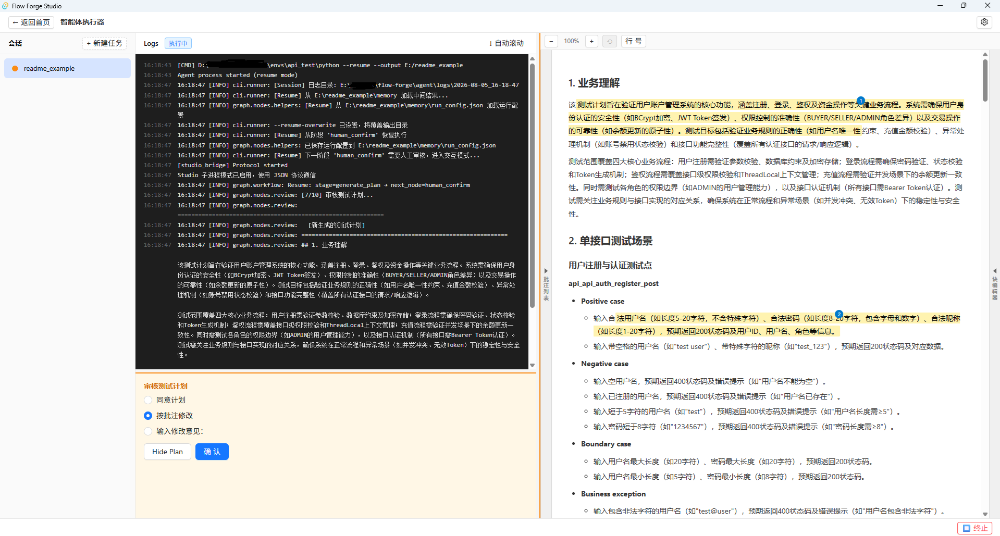
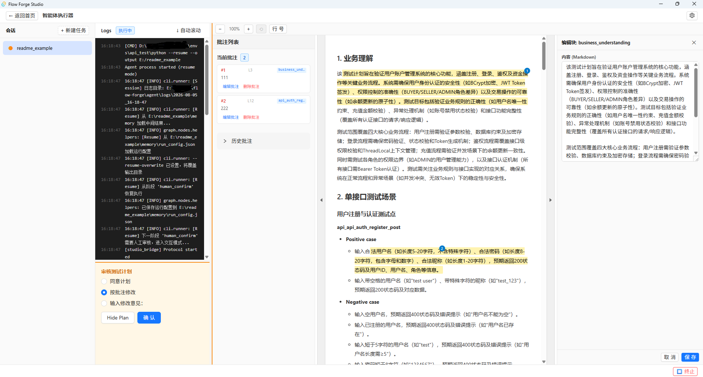
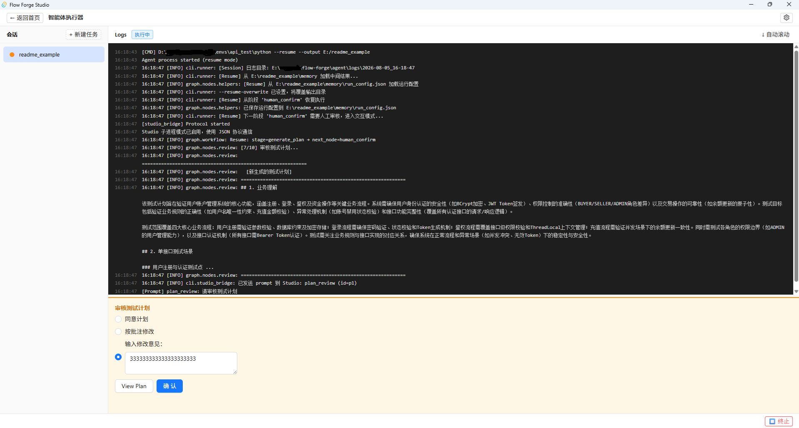
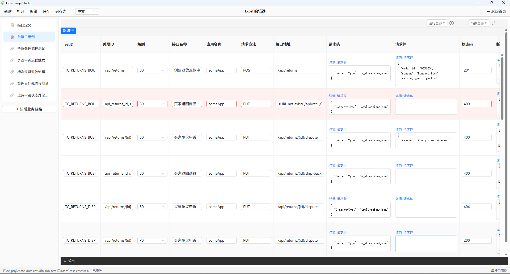
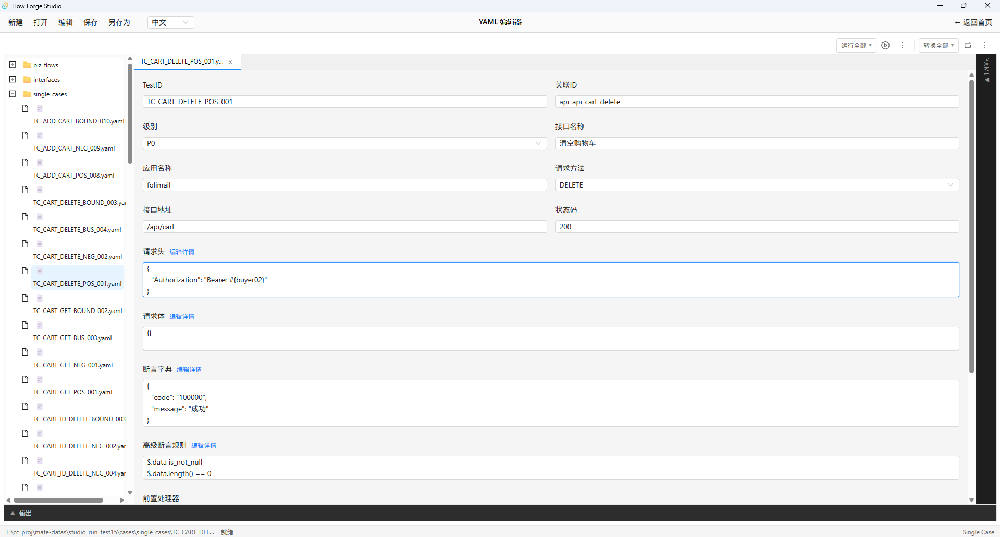
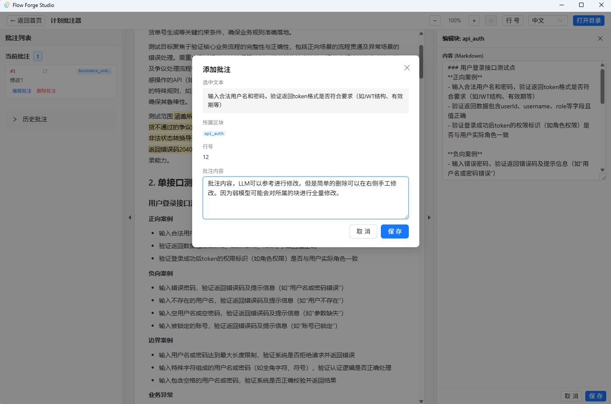

# Feature Guide

[← Back to studio/README](../README.en.md)

Flow Forge Studio offers six feature entries grouped into three workflow stages (Generate → Edit → Execute & Convert): AI Case Generator, Plan Annotator, Excel Editor, YAML Editor, Case Executor, and Case Converter. This document details the features of each workspace, along with find and replace and keyboard shortcuts.

---

## General Features

- Home page with six feature entries grouped by workflow stage: Generate (AI Case Generator / Plan Annotator), Edit (Excel / YAML Editor), Execute & Convert (Case Executor / Case Converter)
- Tauri desktop app that saves local files back to their original path
- Bilingual Chinese/English interface, switchable at any time
- Save (Ctrl+S) and Save As (Ctrl+Alt+S)
- **Find and replace** (Ctrl+F / Ctrl+H): searches by table cell in Excel and by raw text in YAML, with match-case, whole-word, and regex options
- **"Edit" menu**: the toolbar's "Edit" dropdown provides "Find", "Replace", "Find in Files", and "Replace in Files", along with "Zoom In", "Zoom Out", and "Reset Zoom"
- **Font zoom**: Ctrl+= to zoom in / Ctrl+- to zoom out / Ctrl+0 to reset / Ctrl+MouseWheel to zoom, with the zoom level persisted
- **Global search**: "Find in Files" searches across all sheets (Excel) or all YAML files in the project directory, with results grouped by source; "Replace in Files" supports both one-by-one review replacement and replace all

---

## AI Case Generator

Configure and launch the AI agent directly in Studio — no CLI flags to memorize.

### New Task

Click the "AI Case Generator" card on the home page, then fill in the task configuration:
- Requirement doc paths (supports multiple files)
- API doc paths (supports multiple files)
- Output directory
- Parse mode (raw / rule / llm)
- Case type (single / biz / both)
- Output format (YAML / Excel / both)
- Optional: enable auto mode to skip human review

### Running & Logs

- After clicking "Launch", the Agent runs as a subprocess, outputting logs to the right-side log panel in real time
- Logs are color-coded by stage (document parsing, API analysis, plan generation, etc.)
- Support pause, resume, and terminate
- Configurations are saved automatically after completion for easy reuse

### Interactive Prompts & Plan Review

- When the Agent encounters critical uncertainties (e.g., unknown auth type), a prompt pops up in Studio
- After the test plan is generated, a plan review drawer opens automatically, allowing you to approve the plan or provide text feedback directly on the rendered plan
- All interaction uses a JSON protocol over the Agent subprocess

> **Note**: these three screenshots show the "resume from the plan-review node" interaction. The plan data shown comes from an earlier run generated with Qwen3-8B-Q4_K_M and resumed from the review node. 

### Settings Panel

- Configure LLM (API Key, Model, Base URL)
- Adjust batch sizes and retry limits for each stage
- Toggle plugins and Skills

---

## Case Executor

Run test cases and view HTML reports in Studio.

### Session Management

- Use the top dropdown to select an existing execution session or create a new one
- Each session independently saves its configuration (environment, input path, thread count, etc.)

### Run Configuration

- **Input type**: YAML directory / Excel file
- **Environment**: select from the `env-{name}.yml` list

> **Large integer precision:** JavaScript Number can only safely represent integers in the range -9,007,199,254,740,991 ~ 9,007,199,254,740,991 (about 9×10¹⁵). If you need to configure integers exceeding this range in `env-*.yml` (e.g., 64-bit user IDs), use YAML string syntax (quoted): `id: "1000000000000000001"`. The Python executor and converter have no such limitation and correctly handle arbitrarily large integers.

- **Case mode**: single-API / business-flow / all
- **Thread count**: control concurrent execution

### Execution & Report

- Click "Run" to launch the executor subprocess with real-time execution logs
- After completion, an HTML report is auto-generated; the "Open Test Report" button is temporarily hidden (see Known Issues in the README) — use "Show in Folder" and open the HTML manually
- Reports embed styles and scripts inline — no web server required

---

## Case Converter

Convert between case formats in Studio, with batch support.

### Session Management

- Use the top dropdown to select an existing conversion session or create a new one
- Each session independently saves its configuration

### Conversion Directions

- **Excel → YAML**: read .xlsx, output YAML files by sheet type (output is a directory)
- **YAML → Excel**: read YAML directories, merge into .xlsx (output is an Excel file path)
- **YAML → pytest**: generate pytest test code (output is a directory; requires third-party libraries already installed, e.g., the api_test environment)
- **Excel → pytest**: generate pytest code directly from Excel (output is a directory)

### Batch Conversion

- Select multiple input directories/files for batch processing
- Real-time progress shown in the execution log

---

## Quick Editor Toolbar Actions

In the Excel / YAML Editor, the top-right toolbar provides quick-action buttons:

- **▶ Run**: execute the current file directly without switching to the Executor view — ideal for single-file debugging
- **⟳ Convert**: convert the current file (Excel ↔ YAML) directly without switching to the Converter view

---

## Excel Editor

### Opening and Saving

- Open: the toolbar "Open" button or Ctrl+O, then select a `.xlsx` file (in desktop mode the local file is read directly and its path recorded)
- Save (Ctrl+S): writes back to the original file path
- Save As (Ctrl+Alt+S): opens a save dialog to choose a new path

### Editing Features

- API definition sheet editing (table form, with add/delete row support)
- Single-API test case editing (RelevanceID cross-reference validation)
- Business-flow test case editing (StepID duplicate check, Inherit field format validation)
- Per-column editing methods: plain text entered directly; Method chosen from a dropdown; RequestHead / RequestBody / AssertDict open the JSON editor on click; AssertRules shows a read-only preview plus an "Edit Details" structured modal; PreProcessors / PostProcessors are JSON array columns
- Real-time validation (RelevanceID existence, StepID uniqueness, Inherit format), with failing cells highlighted in red

### Visual JSON Editor

Turns JSON fields such as RequestHead, RequestBody, and AssertDict into an interactive tree editor:

- Paste a JSON string to parse it automatically
- Each field shows three editable columns: key / type / value
- Supports 6 types: string, number, boolean, date, list, dictionary
- Supports recursive editing of nested Dict/List structures

### Advanced Assertion Editor (AssertRules)

- Rule-by-rule editing with real-time format validation
- Each rule is edited across three separate columns: path, operator, expected value
- Supports "batch paste": paste multiple rule lines at once and they are split and parsed automatically
- For the full operator and function reference, see [Validation Rules & Assertion Reference](./validation.en.md#assertrules-operators-and-functions)

---

## YAML Editor

### Opening Cases

- **Open Directory**: header "Open" → "Open Directory", select a directory containing `.yaml` files, and a file tree (VS Code style) appears on the left
- **Open File**: header "Open" → "Open File", select a single `.yaml` file directly
- **File tabs**: open multiple files at once, switch between them via tabs, and click × to close

### Form Editing

The form type switches automatically based on the `case_type` field:

- `single`: single-API case form (test_id, relevance_id, api_name, method, url, etc.)
- `biz`: business-flow form (sheet_name + step list, drag-to-reorder)
- `interfaces`: interface definition form (no relevance_id or tag)

Simple fields are laid out in a two-column grid; JSON fields (RequestHead/RequestBody/AssertDict), AssertRules, PreProcessors/PostProcessors, and Remark each occupy a full row. JSON and AssertRules can be edited directly in the text box (auto-saved on blur), or you can click "Edit Details" to open a structured editor. The Excel editor's JSON editor and AssertRules editor are reused here.

### YAML Preview Panel

The right-side panel can be toggled between:

- Collapsed: shows only the toggle button
- Edit mode (default): edit the YAML text directly, and half a second after you type the form is parsed and updated automatically — ideal for large batch copy-paste
- Preview mode: shows the YAML serialized in real time from the current form (read-only)

### Right-Click File Operations

Right-click a file or folder in the file tree: rename, cut, copy, paste, delete to recycle bin, open in file explorer.

Save and Save As work the same as in the Excel editor (Ctrl+S / Ctrl+Alt+S).

---

## Markdown Plan Annotator

Used to add structured annotations to an AI-generated test plan (`plan.md`) for the agent to read and revise the plan during the review step (by entering `r`).

### Opening and Adding Annotations

1. On the home page, click the "Markdown Plan Annotator" card, use "Open Directory" to select a directory containing Markdown plans, and pick a file from the file tree on the left
2. In the rendered Markdown preview, select the text you want to annotate
3. Right-click and choose "Add Annotation", then enter your review comment
4. Annotation record format: line number, selected text, review comment
5. Annotated text is shown with a yellow highlight and a light-blue numbered badge at the bottom-right corner

### Managing Annotations

- **Click an annotation highlight**: a details popover appears showing the annotation content and line number, which you can edit or delete directly
- The left-side annotation list shows all annotations for the current file, with edit, delete, and scroll-to-location support
- After an annotation is deleted, its highlight and badge are removed at the same time

### Auto-Save and Historical Annotations

- All annotations are saved automatically to `plan_comments.json` in the plan directory — no manual saving required
- Switch to "Historical Annotations" mode to view all previously saved annotation records (read-only), making it easy to trace review history

### Integration with the AI Agent

Annotation data is used by the [AI test case generation agent](../../agent/README.en.md). When `r` is selected during the CLI review step, the agent reads the annotations from `plan_comments.json` as contextual reference for revising the test plan.

---

## Processor Editing

The PreProcessors / PostProcessors columns support three editing methods:

- **Inline editing** — edit the JSON text directly in the cell
- **JSON tree editor** — click "Details" to open the tree editor
- **List editor** — a name + key=value configuration list interface, with add/remove/edit, reordering, and JSON paste support

For validation rules, see [Validation Rules & Assertion Reference](./validation.en.md#processor-field-validation).

---

## Keyboard Shortcuts

| Shortcut | Action |
|--------|------|
| Ctrl+O | Open file |
| Ctrl+S | Save |
| Ctrl+Alt+S | Save As |
| Ctrl+N | New blank workbook |
| Ctrl+F | Find |
| Ctrl+H | Replace |
| Ctrl+= | Zoom in |
| Ctrl+- | Zoom out |
| Ctrl+0 | Reset zoom |
| Ctrl+MouseWheel | Zoom font |
| Esc | Close find bar |
